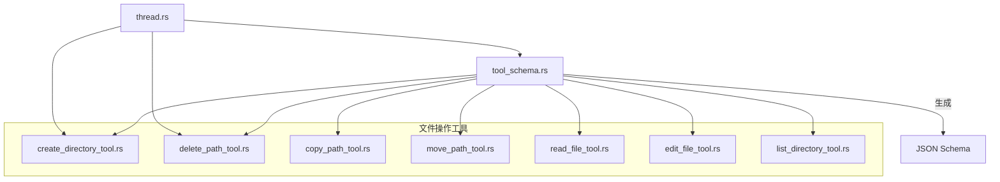
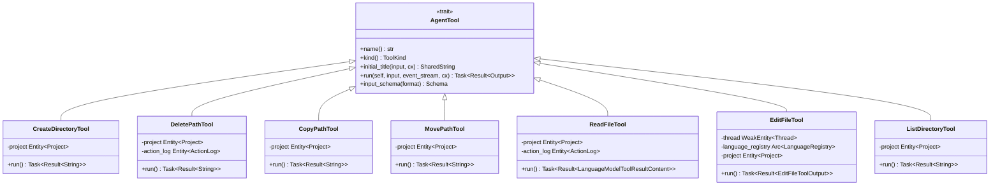
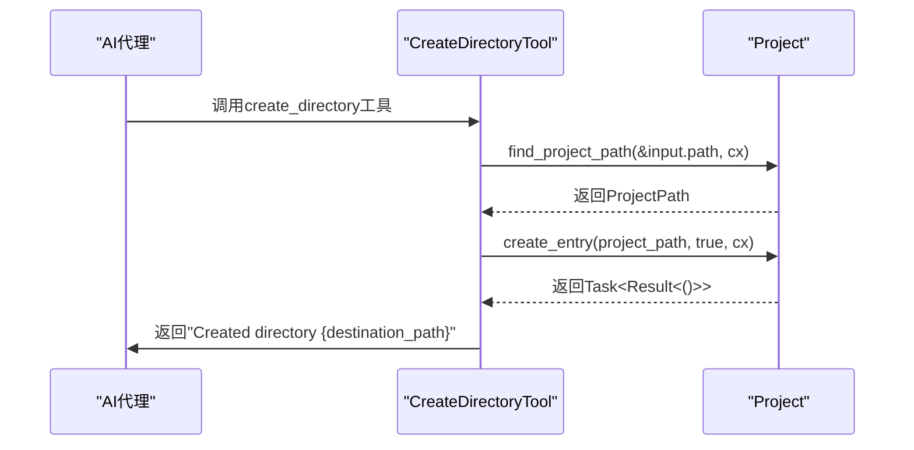
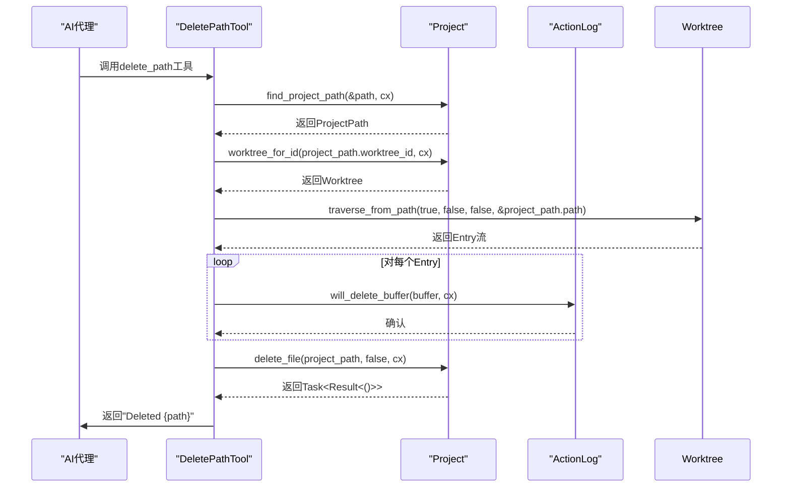
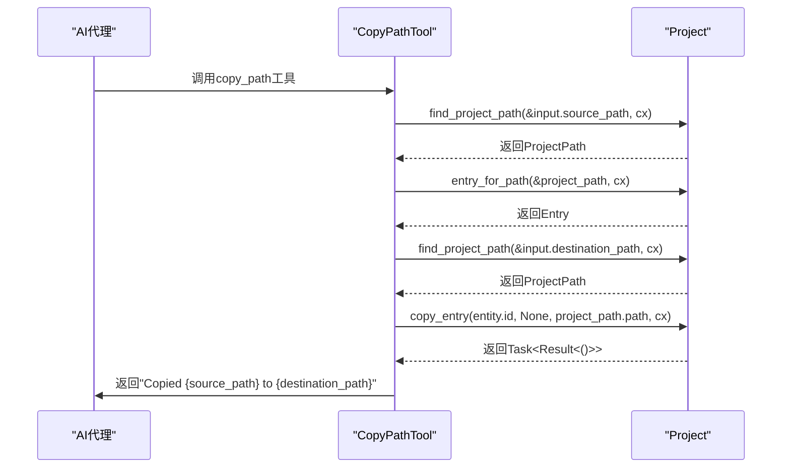
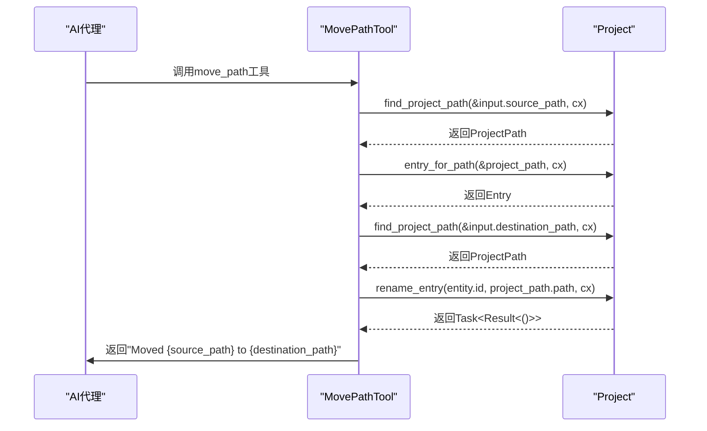
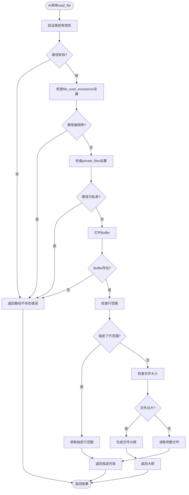
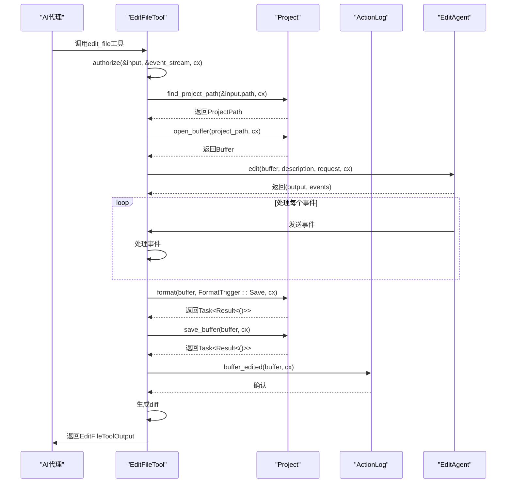
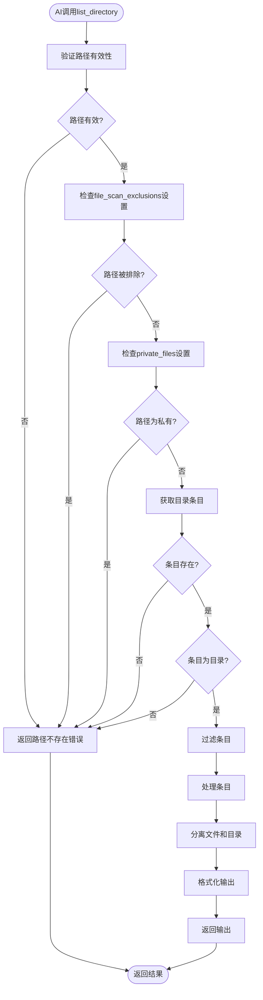
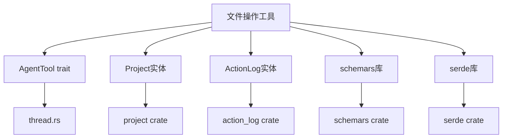

# 文件操作工具

<cite>
**本文档中引用的文件**  
- [create_directory_tool.rs](file://crates/agent2/src/tools/create_directory_tool.rs)
- [delete_path_tool.rs](file://crates/agent2/src/tools/delete_path_tool.rs)
- [copy_path_tool.rs](file://crates/agent2/src/tools/copy_path_tool.rs)
- [move_path_tool.rs](file://crates/agent2/src/tools/move_path_tool.rs)
- [read_file_tool.rs](file://crates/agent2/src/tools/read_file_tool.rs)
- [edit_file_tool.rs](file://crates/agent2/src/tools/edit_file_tool.rs)
- [list_directory_tool.rs](file://crates/agent2/src/tools/list_directory_tool.rs)
- [tool_schema.rs](file://crates/agent2/src/tool_schema.rs)
- [thread.rs](file://crates/agent2/src/thread.rs)
</cite>

## 目录
1. [简介](#简介)
2. [项目结构](#项目结构)
3. [核心组件](#核心组件)
4. [架构概述](#架构概述)
5. [详细组件分析](#详细组件分析)
6. [依赖分析](#依赖分析)
7. [性能考虑](#性能考虑)
8. [故障排除指南](#故障排除指南)
9. [结论](#结论)
10. [附录](#附录)（如有必要）

## 简介
本文档详细描述了rcoder项目中用于文件系统操作的工具集，包括创建、删除、移动、复制、读取、编辑和列出目录等操作。文档解释了每个工具的Rust实现机制，如何通过`Tool` trait集成到AI代理中，并通过`tool_schema`生成JSON Schema供AI理解。同时，文档描述了权限控制策略，防止路径遍历等安全风险，提供了实际调用示例，展示了从AI提示到文件系统变更的完整执行链路，并说明了错误处理模式，如文件已存在、权限不足等情况的返回结构。

## 项目结构
rcoder项目的文件操作工具主要位于`crates/agent2/src/tools`目录下，每个工具对应一个独立的Rust模块文件。这些工具通过`AgentTool` trait统一集成到AI代理系统中，并通过`tool_schema`模块生成JSON Schema供AI理解。

**图示来源**
- [create_directory_tool.rs](file://crates/agent2/src/tools/create_directory_tool.rs)
- [delete_path_tool.rs](file://crates/agent2/src/tools/delete_path_tool.rs)
- [copy_path_tool.rs](file://crates/agent2/src/tools/copy_path_tool.rs)
- [move_path_tool.rs](file://crates/agent2/src/tools/move_path_tool.rs)
- [read_file_tool.rs](file://crates/agent2/src/tools/read_file_tool.rs)
- [edit_file_tool.rs](file://crates/agent2/src/tools/edit_file_tool.rs)
- [list_directory_tool.rs](file://crates/agent2/src/tools/list_directory_tool.rs)
- [tool_schema.rs](file://crates/agent2/src/tool_schema.rs)
- [thread.rs](file://crates/agent2/src/thread.rs)

**本节来源**
- [create_directory_tool.rs](file://crates/agent2/src/tools/create_directory_tool.rs)
- [delete_path_tool.rs](file://crates/agent2/src/tools/delete_path_tool.rs)
- [copy_path_tool.rs](file://crates/agent2/src/tools/copy_path_tool.rs)
- [move_path_tool.rs](file://crates/agent2/src/tools/move_path_tool.rs)
- [read_file_tool.rs](file://crates/agent2/src/tools/read_file_tool.rs)
- [edit_file_tool.rs](file://crates/agent2/src/tools/edit_file_tool.rs)
- [list_directory_tool.rs](file://crates/agent2/src/tools/list_directory_tool.rs)

## 核心组件
文件操作工具集的核心组件包括创建目录、删除路径、复制路径、移动路径、读取文件、编辑文件和列出目录等工具。每个工具都实现了`AgentTool` trait，通过`name`、`kind`、`initial_title`和`run`等方法定义了工具的行为。工具的输入参数通过`JsonSchema`派生宏生成JSON Schema，供AI理解。

**本节来源**
- [create_directory_tool.rs](file://crates/agent2/src/tools/create_directory_tool.rs)
- [delete_path_tool.rs](file://crates/agent2/src/tools/delete_path_tool.rs)
- [copy_path_tool.rs](file://crates/agent2/src/tools/copy_path_tool.rs)
- [move_path_tool.rs](file://crates/agent2/src/tools/move_path_tool.rs)
- [read_file_tool.rs](file://crates/agent2/src/tools/read_file_tool.rs)
- [edit_file_tool.rs](file://crates/agent2/src/tools/edit_file_tool.rs)
- [list_directory_tool.rs](file://crates/agent2/src/tools/list_directory_tool.rs)

## 架构概述
文件操作工具集的架构基于`AgentTool` trait，通过`tool_schema`模块生成JSON Schema供AI理解。每个工具的输入参数都实现了`JsonSchema` trait，通过`schemars`库生成JSON Schema。工具的执行通过`run`方法异步执行，并通过`event_stream`返回执行结果。

**图示来源**
- [create_directory_tool.rs](file://crates/agent2/src/tools/create_directory_tool.rs)
- [delete_path_tool.rs](file://crates/agent2/src/tools/delete_path_tool.rs)
- [copy_path_tool.rs](file://crates/agent2/src/tools/copy_path_tool.rs)
- [move_path_tool.rs](file://crates/agent2/src/tools/move_path_tool.rs)
- [read_file_tool.rs](file://crates/agent2/src/tools/read_file_tool.rs)
- [edit_file_tool.rs](file://crates/agent2/src/tools/edit_file_tool.rs)
- [list_directory_tool.rs](file://crates/agent2/src/tools/list_directory_tool.rs)

## 详细组件分析
### 创建目录工具分析
`CreateDirectoryTool`用于在项目中指定路径创建新目录。该工具会创建目录及其所有必要的父目录（类似于`mkdir -p`）。工具的输入参数`CreateDirectoryToolInput`包含一个`path`字段，表示新目录的路径。

**图示来源**
- [create_directory_tool.rs](file://crates/agent2/src/tools/create_directory_tool.rs)

**本节来源**
- [create_directory_tool.rs](file://crates/agent2/src/tools/create_directory_tool.rs)

### 删除路径工具分析
`DeletePathTool`用于删除项目中指定路径的文件或目录（包括目录内容，递归删除），并返回删除确认。工具的输入参数`DeletePathToolInput`包含一个`path`字段，表示要删除的文件或目录的路径。

**图示来源**
- [delete_path_tool.rs](file://crates/agent2/src/tools/delete_path_tool.rs)

**本节来源**
- [delete_path_tool.rs](file://crates/agent2/src/tools/delete_path_tool.rs)

### 复制路径工具分析
`CopyPathTool`用于复制项目中的文件或目录，并返回复制成功的确认。如果指定了目录，则其内容将递归复制（类似于`cp -r`）。工具的输入参数`CopyPathToolInput`包含`source_path`和`destination_path`两个字段，分别表示源路径和目标路径。

**图示来源**
- [copy_path_tool.rs](file://crates/agent2/src/tools/copy_path_tool.rs)

**本节来源**
- [copy_path_tool.rs](file://crates/agent2/src/tools/copy_path_tool.rs)

### 移动路径工具分析
`MovePathTool`用于移动或重命名项目中的文件或目录，并返回移动成功的确认。如果源路径和目标路径的目录相同但文件名不同，则执行重命名操作；否则执行移动操作。工具的输入参数`MovePathToolInput`包含`source_path`和`destination_path`两个字段，分别表示源路径和目标路径。

**图示来源**
- [move_path_tool.rs](file://crates/agent2/src/tools/move_path_tool.rs)

**本节来源**
- [move_path_tool.rs](file://crates/agent2/src/tools/move_path_tool.rs)

### 读取文件工具分析
`ReadFileTool`用于读取项目中指定文件的内容。工具的输入参数`ReadFileToolInput`包含`path`字段，表示要读取的文件的相对路径，以及可选的`start_line`和`end_line`字段，用于指定读取的行范围。

**图示来源**
- [read_file_tool.rs](file://crates/agent2/src/tools/read_file_tool.rs)

**本节来源**
- [read_file_tool.rs](file://crates/agent2/src/tools/read_file_tool.rs)

### 编辑文件工具分析
`EditFileTool`用于创建新文件或编辑现有文件。工具的输入参数`EditFileToolInput`包含`display_description`、`path`和`mode`三个字段，分别表示编辑的描述、文件路径和操作模式（编辑、创建或覆盖）。

**图示来源**
- [edit_file_tool.rs](file://crates/agent2/src/tools/edit_file_tool.rs)

**本节来源**
- [edit_file_tool.rs](file://crates/agent2/src/tools/edit_file_tool.rs)

### 列出目录工具分析
`ListDirectoryTool`用于列出指定路径中的文件和目录。工具的输入参数`ListDirectoryToolInput`包含一个`path`字段，表示要列出的目录的路径。

**图示来源**
- [list_directory_tool.rs](file://crates/agent2/src/tools/list_directory_tool.rs)

**本节来源**
- [list_directory_tool.rs](file://crates/agent2/src/tools/list_directory_tool.rs)

## 依赖分析
文件操作工具集依赖于`AgentTool` trait、`Project`实体、`ActionLog`实体、`schemars`库和`serde`库。`AgentTool` trait定义了工具的基本行为，`Project`实体提供了文件系统操作的接口，`ActionLog`实体用于记录操作日志，`schemars`库用于生成JSON Schema，`serde`库用于序列化和反序列化。

**图示来源**
- [thread.rs](file://crates/agent2/src/thread.rs)
- [create_directory_tool.rs](file://crates/agent2/src/tools/create_directory_tool.rs)
- [delete_path_tool.rs](file://crates/agent2/src/tools/delete_path_tool.rs)
- [copy_path_tool.rs](file://crates/agent2/src/tools/copy_path_tool.rs)
- [move_path_tool.rs](file://crates/agent2/src/tools/move_path_tool.rs)
- [read_file_tool.rs](file://crates/agent2/src/tools/read_file_tool.rs)
- [edit_file_tool.rs](file://crates/agent2/src/tools/edit_file_tool.rs)
- [list_directory_tool.rs](file://crates/agent2/src/tools/list_directory_tool.rs)

**本节来源**
- [thread.rs](file://crates/agent2/src/thread.rs)
- [create_directory_tool.rs](file://crates/agent2/src/tools/create_directory_tool.rs)
- [delete_path_tool.rs](file://crates/agent2/src/tools/delete_path_tool.rs)
- [copy_path_tool.rs](file://crates/agent2/src/tools/copy_path_tool.rs)
- [move_path_tool.rs](file://crates/agent2/src/tools/move_path_tool.rs)
- [read_file_tool.rs](file://crates/agent2/src/tools/read_file_tool.rs)
- [edit_file_tool.rs](file://crates/agent2/src/tools/edit_file_tool.rs)
- [list_directory_tool.rs](file://crates/agent2/src/tools/list_directory_tool.rs)

## 性能考虑
文件操作工具集在设计时考虑了性能因素。例如，`ReadFileTool`在读取大文件时会生成文件大纲而不是读取完整文件内容，以减少内存占用和网络传输开销。`ListDirectoryTool`在列出目录时会过滤掉被排除或私有的文件和目录，以减少不必要的I/O操作。`EditFileTool`在编辑文件后会自动格式化文件，以保持代码风格一致。

## 故障排除指南
### 路径不存在错误
当调用文件操作工具时，如果指定的路径不存在，工具会返回相应的错误信息。例如，`ReadFileTool`会返回"Path {} not found in project"错误，`DeletePathTool`会返回"Couldn't delete {path} because that path isn't in this project."错误。

**本节来源**
- [read_file_tool.rs](file://crates/agent2/src/tools/read_file_tool.rs#L100-L110)
- [delete_path_tool.rs](file://crates/agent2/src/tools/delete_path_tool.rs#L70-L80)

### 权限不足错误
当调用文件操作工具时，如果指定的路径被`file_scan_exclusions`或`private_files`设置排除或标记为私有，工具会返回相应的错误信息。例如，`ReadFileTool`会返回"Cannot read file because its path matches the global `file_scan_exclusions` setting: {}"错误。

**本节来源**
- [read_file_tool.rs](file://crates/agent2/src/tools/read_file_tool.rs#L120-L140)
- [list_directory_tool.rs](file://crates/agent2/src/tools/list_directory_tool.rs#L150-L170)

### 文件已存在错误
当调用`CreateDirectoryTool`或`EditFileTool`创建文件或目录时，如果目标路径已存在，工具会返回相应的错误信息。例如，`CreateDirectoryTool`会返回"Path to create was outside the project"错误。

**本节来源**
- [create_directory_tool.rs](file://crates/agent2/src/tools/create_directory_tool.rs#L80-L90)
- [edit_file_tool.rs](file://crates/agent2/src/tools/edit_file_tool.rs#L400-L410)

## 结论
rcoder项目中的文件操作工具集提供了一套完整的文件系统操作功能，通过`AgentTool` trait统一集成到AI代理系统中。每个工具都实现了相应的功能，并通过`tool_schema`模块生成JSON Schema供AI理解。工具集还实现了权限控制策略，防止路径遍历等安全风险，并提供了详细的错误处理模式。

## 附录
### 工具名称与功能对照表
| 工具名称 | 功能描述 |
| --- | --- |
| create_directory | 创建新目录 |
| delete_path | 删除文件或目录 |
| copy_path | 复制文件或目录 |
| move_path | 移动或重命名文件或目录 |
| read_file | 读取文件内容 |
| edit_file | 编辑文件内容 |
| list_directory | 列出目录内容 |

### 错误代码与含义对照表
| 错误代码 | 含义 |
| --- | --- |
| Path not found | 路径不存在 |
| Cannot read file | 无法读取文件（被排除或私有） |
| Cannot list directory | 无法列出目录（被排除或私有） |
| Cannot create file | 无法创建文件（已存在或父目录不存在） |
| Cannot edit file | 无法编辑文件（路径不存在或为目录） |