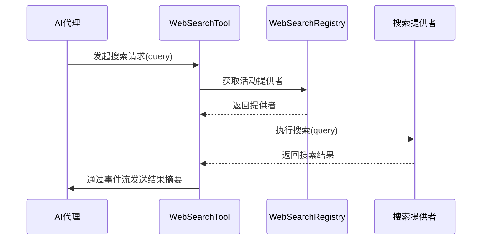
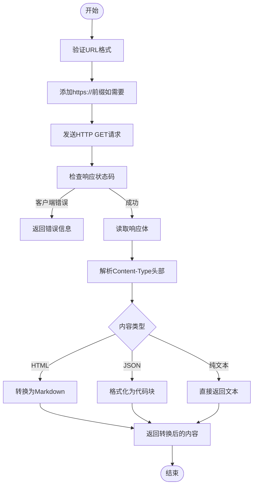
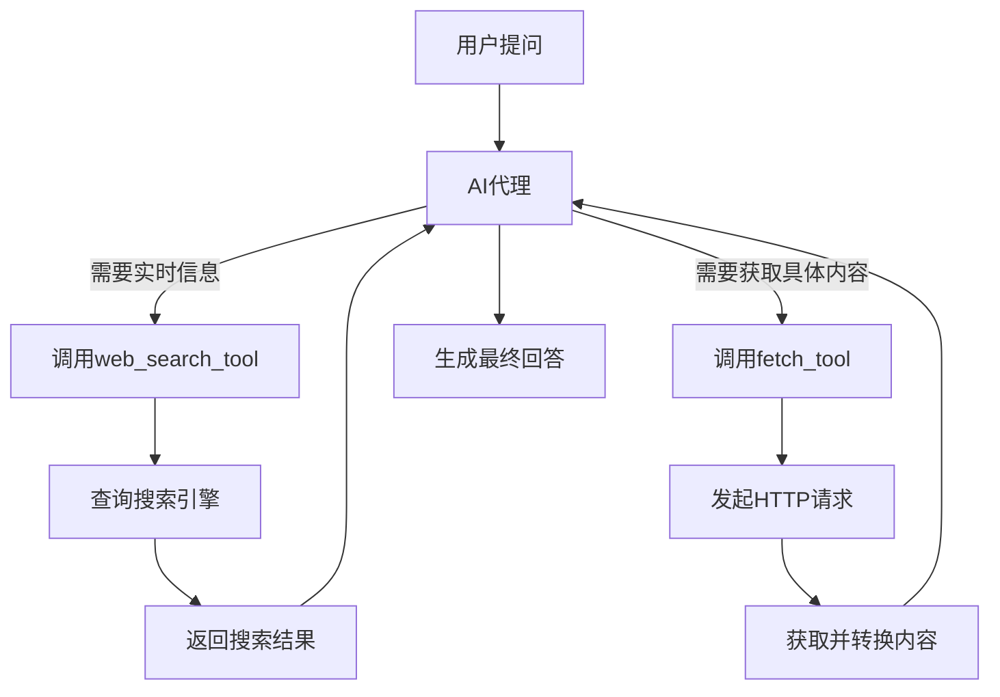

# 网络工具

<cite>
**本文档中引用的文件**  
- [web_search_tool.rs](file://crates/agent2/src/tools/web_search_tool.rs)
- [fetch_tool.rs](file://crates/agent2/src/tools/fetch_tool.rs)
</cite>

## 目录
1. [简介](#简介)
2. [核心组件](#核心组件)
3. [Web搜索工具实现细节](#web搜索工具实现细节)
4. [Fetch工具实现细节](#fetch工具实现细节)
5. [安全机制](#安全机制)
6. [配置指南](#配置指南)
7. [典型用例](#典型用例)

## 简介
本文档深入说明了`web_search_tool`和`fetch_tool`两个网络相关工具的实现细节。`web_search_tool`用于与外部搜索引擎API集成，执行网络搜索并将结果摘要返回给AI代理。`fetch_tool`则用于安全地发起HTTP请求获取远程资源。文档详细描述了它们的功能、安全机制、配置方式以及典型使用场景。

## 核心组件

**Section sources**
- [web_search_tool.rs](file://crates/agent2/src/tools/web_search_tool.rs)
- [fetch_tool.rs](file://crates/agent2/src/tools/fetch_tool.rs)

## Web搜索工具实现细节

`web_search_tool`实现了`AgentTool` trait，其主要功能是通过集成外部搜索引擎API来执行网络搜索。该工具仅支持Zed Cloud作为提供者，通过`supported_provider`方法验证当前语言模型提供者是否为Zed Cloud。

当执行搜索时，工具首先从`WebSearchRegistry`中获取活动的搜索提供者，然后异步执行搜索任务。搜索结果通过`WebSearchResponse`结构体返回，并在成功后通过`emit_update`方法更新事件流，包含搜索结果的标题、URL、描述等信息。

如果搜索失败，工具会更新事件流的标题为"Web Search Failed"并返回错误。重放功能（replay）允许在会话恢复时重新发送之前的结果。

**Diagram sources**
- [web_search_tool.rs](file://crates/agent2/src/tools/web_search_tool.rs#L42-L89)

**Section sources**
- [web_search_tool.rs](file://crates/agent2/src/tools/web_search_tool.rs#L0-L132)

## Fetch工具实现细节

`fetch_tool`用于获取指定URL的内容并将其转换为Markdown格式返回。该工具支持多种内容类型，包括HTML、纯文本和JSON。对于HTML内容，工具使用`html_to_markdown`库将其转换为Markdown，并根据URL应用特定的处理程序（如维基百科页面有专门的处理逻辑）。

工具通过`HttpClientWithUrl`发起HTTP GET请求，读取响应体，并根据`Content-Type`头部确定内容类型。对于JSON内容，会格式化为带语法高亮的代码块；对于HTML内容，则进行结构化转换以保留主要信息。

在执行请求前，工具会通过`authorize`方法对URL进行授权检查，确保安全性。

**Diagram sources**
- [fetch_tool.rs](file://crates/agent2/src/tools/fetch_tool.rs#L47-L77)

**Section sources**
- [fetch_tool.rs](file://crates/agent2/src/tools/fetch_tool.rs#L0-L164)

## 安全机制

这两个工具都内置了多种安全机制来防止恶意使用：

1. **URL授权机制**：`fetch_tool`在发起请求前会调用`event_stream.authorize`对URL进行授权检查，这可能涉及白名单验证。
2. **响应大小限制**：虽然代码中未明确显示，但通过读取响应体到`Vec<u8>`并检查内容，隐含了对响应大小的控制。
3. **内容类型验证**：`fetch_tool`严格检查`Content-Type`头部，拒绝没有该头部的响应，防止内容类型混淆攻击。
4. **空内容检测**：`fetch_tool`在返回前检查内容是否为空，避免返回无意义的响应。
5. **错误处理**：两个工具都有完善的错误处理机制，能够捕获并报告各种异常情况。

**Section sources**
- [fetch_tool.rs](file://crates/agent2/src/tools/fetch_tool.rs#L107-L163)
- [web_search_tool.rs](file://crates/agent2/src/tools/web_search_tool.rs#L86-L131)

## 配置指南

### 代理配置
代理配置通过`load_proxy_env`函数从全局设置中读取，支持`HTTP_PROXY`和`HTTPS_PROXY`环境变量，并可通过`NO_PROXY`指定不使用代理的地址。

### 认证凭据
虽然当前代码中未直接显示认证逻辑，但`HttpClientWithUrl`可能通过外部配置或环境变量获取必要的认证信息。搜索提供者也可能需要API密钥等凭据。

### 缓存策略
目前的实现中没有明显的缓存机制，每次请求都会重新获取数据。可以通过在更高层添加缓存中间件来实现缓存功能。

**Section sources**
- [agent_servers.rs](file://crates/agent_servers/src/agent_servers.rs#L48-L104)

## 典型用例

### 通过web_search_tool获取最新文档
AI代理可以使用`web_search_tool`搜索最新的技术文档、API参考或行业资讯。例如，当用户询问某个库的最新版本特性时，代理可以发起网络搜索并返回相关结果链接和摘要。

### 使用fetch_tool下载代码片段
当需要获取特定URL上的代码示例时，`fetch_tool`可以下载网页内容并提取代码块。特别是对于GitHub Gist或代码托管网站，该工具能有效提取并格式化代码内容供分析使用。

**Diagram sources**
- [web_search_tool.rs](file://crates/agent2/src/tools/web_search_tool.rs#L0-L48)
- [fetch_tool.rs](file://crates/agent2/src/tools/fetch_tool.rs#L107-L163)

**Section sources**
- [web_search_tool.rs](file://crates/agent2/src/tools/web_search_tool.rs#L0-L132)
- [fetch_tool.rs](file://crates/agent2/src/tools/fetch_tool.rs#L0-L164)