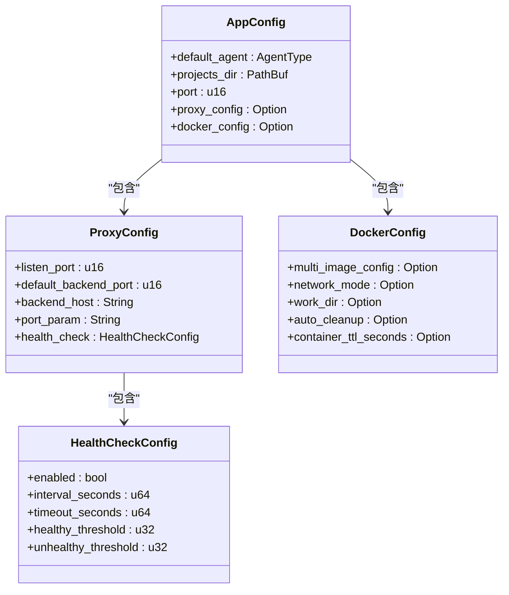
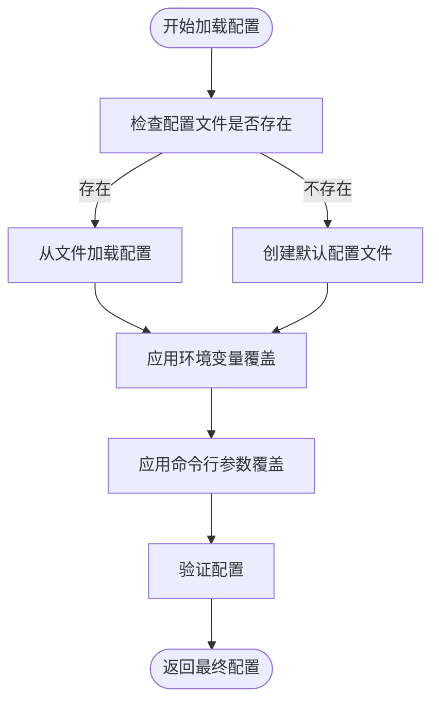
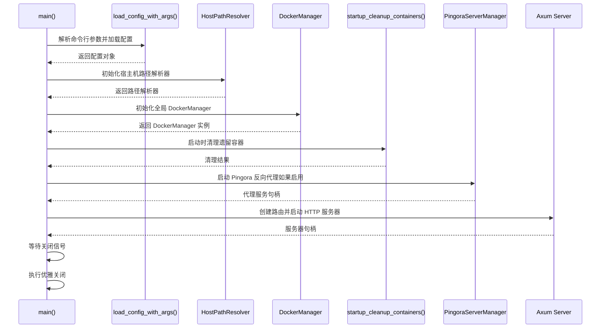
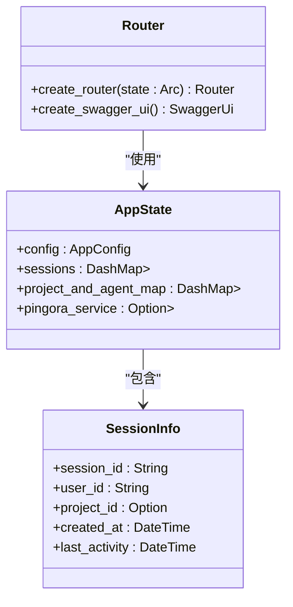
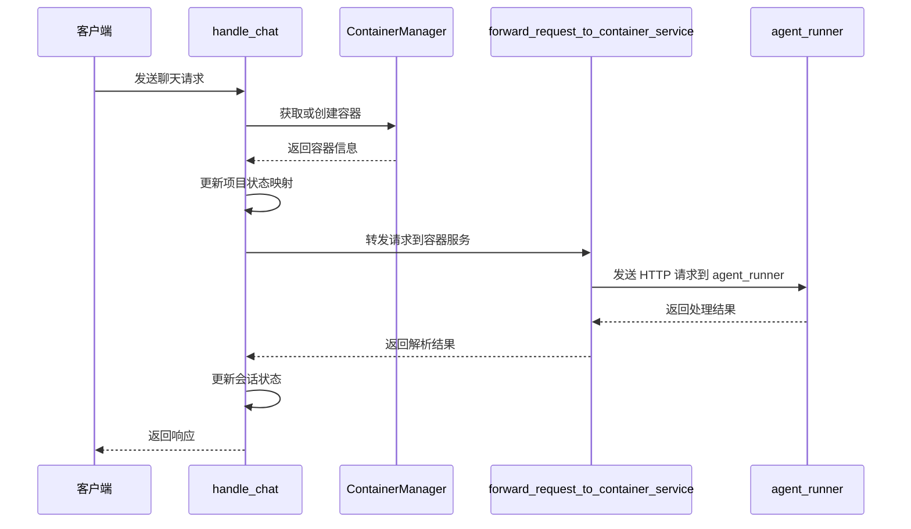
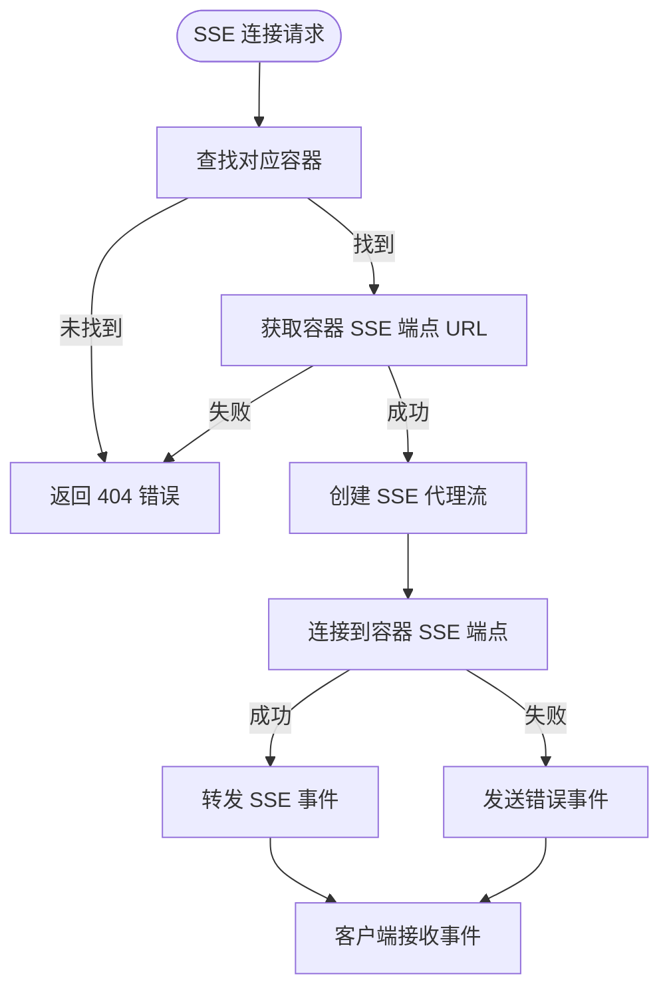
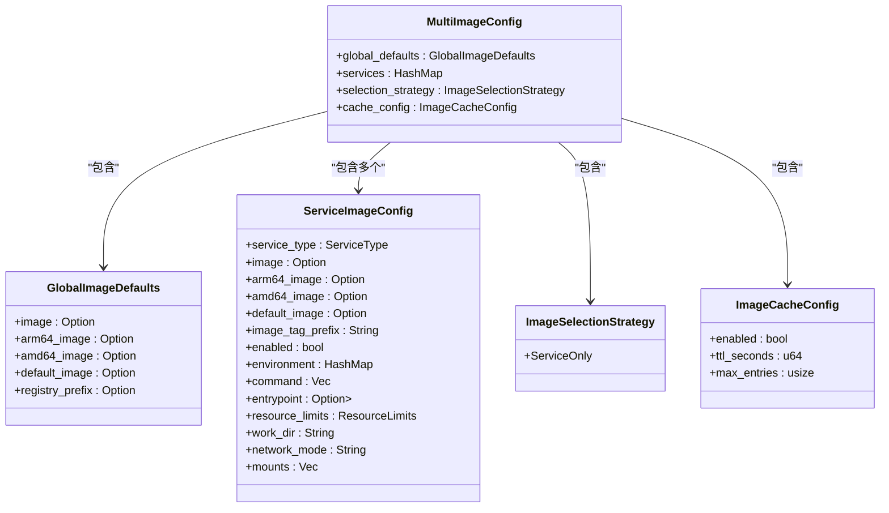
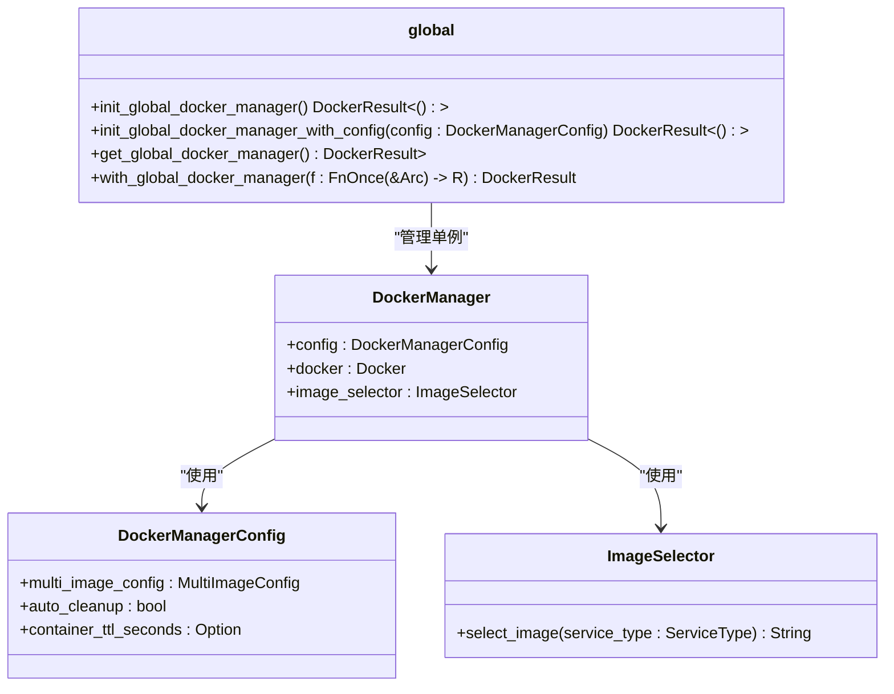
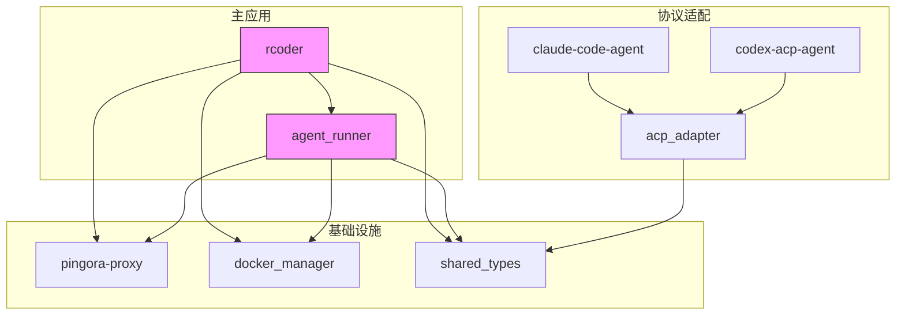

# 开发指南

<cite>
**本文档引用的文件**
- [Cargo.toml](file://Cargo.toml)
- [README.md](file://README.md)
- [config.yml](file://config.yml)
- [main.rs](file://crates/rcoder/src/main.rs)
- [agent_runner/src/main.rs](file://crates/agent_runner/src/main.rs)
- [config.rs](file://crates/rcoder/src/config.rs)
- [agent_runner/src/config.rs](file://crates/agent_runner/src/config.rs)
- [router.rs](file://crates/rcoder/src/router.rs)
- [agent_runner/src/router.rs](file://crates/agent_runner/src/router.rs)
- [chat_handler.rs](file://crates/rcoder/src/handler/chat_handler.rs)
- [agent_session_notification.rs](file://crates/rcoder/src/handler/agent_session_notification.rs)
- [mod.rs](file://crates/rcoder/src/proxy_agent/mod.rs)
- [shared_types/src/lib.rs](file://crates/shared_types/src/lib.rs)
- [shared_types/src/multi_image_config.rs](file://crates/shared_types/src/multi_image_config.rs)
- [docker_manager/src/lib.rs](file://crates/docker_manager/src/lib.rs)
</cite>

## 目录
1. [简介](#简介)
2. [项目结构](#项目结构)
3. [核心组件](#核心组件)
4. [架构概述](#架构概述)
5. [详细组件分析](#详细组件分析)
6. [依赖分析](#依赖分析)
7. [性能考虑](#性能考虑)
8. [故障排除指南](#故障排除指南)
9. [结论](#结论)

## 简介
RCoder 是一个基于 Rust 构建的现代化 AI 驱动开发平台，通过 ACP (Agent Client Protocol) 协议实现与多种 AI 代理的统一交互。平台提供简洁的 HTTP API 接口，让开发者能够轻松集成和管理 AI 辅助开发功能。

**Section sources**
- [README.md](file://README.md#L1-L652)

## 项目结构
项目采用 Rust workspace 结构，包含多个 crates，每个 crate 负责特定功能：

```
.
├── crates/
│   ├── acp_adapter/           # ACP 协议适配器
│   ├── agent_runner/          # 代理运行器核心
│   ├── claude-code-agent/     # Claude Code 代理实现
│   ├── codex-acp-agent/       # Codex ACP 代理实现
│   ├── docker_manager/        # Docker 管理器
│   ├── pingora-proxy/         # Pingora 反向代理封装
│   ├── rcoder/                # 主应用（Axum 路由、业务、配置）
│   └── shared_types/          # 共享类型定义
├── docker/                    # Docker 相关脚本和配置
├── specs/                     # 设计文档
├── .dockerignore
├── .gitignore
├── CLAUDE.md
├── Cargo.lock
├── Cargo.toml                 # Workspace 配置
├── Makefile
├── README.md
├── config.yml                 # 默认配置文件
├── http_test.rest
├── install.md
└── test_auto_arch_detection.sh
```

**Section sources**
- [README.md](file://README.md#L269-L377)

## 核心组件
系统由多个核心组件构成，包括主应用、代理运行器、Docker 管理器、Pingora 反向代理和共享类型。

**Section sources**
- [Cargo.toml](file://Cargo.toml#L1-L205)
- [README.md](file://README.md#L380-L382)

## 架构概述
系统采用微服务架构，主要组件包括主服务、代理运行器和反向代理。

```mermaid
graph TB
A[Client] --> B[Axum HTTP Server]
A --> C[Pingora Proxy]
B --> D[API Routes]
B --> E[Agent Worker (LocalSet)]
C --> F[Backends: 127.0.0.1:{port}]
```

**Diagram sources**
- [README.md](file://README.md#L18-L25)

## 详细组件分析

### 配置系统分析
配置系统支持多层优先级配置，从高到低为：命令行参数 > 环境变量 > 配置文件 > 默认配置。

#### 配置结构


**Diagram sources**
- [crates/rcoder/src/config.rs](file://crates/rcoder/src/config.rs#L38-L96)
- [crates/agent_runner/src/config.rs](file://crates/agent_runner/src/config.rs#L39-L73)

#### 配置加载流程


**Diagram sources**
- [crates/rcoder/src/config.rs](file://crates/rcoder/src/config.rs#L254-L331)
- [crates/agent_runner/src/config.rs](file://crates/agent_runner/src/config.rs#L111-L191)

### 主应用分析
主应用负责处理 HTTP 请求、管理会话状态和协调其他组件。

#### 主应用启动流程


**Diagram sources**
- [crates/rcoder/src/main.rs](file://crates/rcoder/src/main.rs#L32-L451)

### 路由系统分析
路由系统使用 Axum 框架，提供 REST API 和 SSE 流接口。

#### 路由结构


**Diagram sources**
- [crates/rcoder/src/router.rs](file://crates/rcoder/src/router.rs#L26-L36)
- [crates/agent_runner/src/router.rs](file://crates/agent_runner/src/router.rs#L26-L38)

#### API 路由流程
```mermaid
flowchart TD
Start([HTTP 请求]) --> MatchRoute["匹配路由"]
MatchRoute --> |/health| HealthCheck["健康检查处理器"]
MatchRoute --> |/chat| ChatHandler["聊天处理器"]
MatchRoute --> |/agent/progress/{session_id}| SSEHandler["SSE 通知处理器"]
MatchRoute --> |/agent/session/cancel| CancelHandler["会话取消处理器"]
MatchRoute --> |/agent/stop| StopHandler["代理停止处理器"]
MatchRoute --> |/agent/status/{project_id}| StatusHandler["状态查询处理器"]
MatchRoute --> |/proxy/*| ProxyHandler["代理处理器"]
HealthCheck --> Response["返回健康状态"]
ChatHandler --> Response
SSEHandler --> Response
CancelHandler --> Response
StopHandler --> Response
StatusHandler --> Response
ProxyHandler --> Response
```

**Diagram sources**
- [crates/rcoder/src/router.rs](file://crates/rcoder/src/router.rs#L53-L83)
- [crates/agent_runner/src/router.rs](file://crates/agent_runner/src/router.rs#L41-L69)

### 聊天处理器分析
聊天处理器负责处理用户聊天请求，转发到容器化代理服务。

#### 聊天请求处理流程


**Diagram sources**
- [crates/rcoder/src/handler/chat_handler.rs](file://crates/rcoder/src/handler/chat_handler.rs#L108-L321)

### SSE 通知处理器分析
SSE 通知处理器负责建立服务器发送事件连接，实时推送代理执行进度。

#### SSE 代理流程


**Diagram sources**
- [crates/rcoder/src/handler/agent_session_notification.rs](file://crates/rcoder/src/handler/agent_session_notification.rs#L97-L153)

### Docker 管理器分析
Docker 管理器负责容器的创建、启动、停止和删除操作。

#### 多镜像配置结构


**Diagram sources**
- [crates/shared_types/src/multi_image_config.rs](file://crates/shared_types/src/multi_image_config.rs#L17-L26)

#### 全局 DockerManager 结构


**Diagram sources**
- [crates/docker_manager/src/lib.rs](file://crates/docker_manager/src/lib.rs#L144-L210)

## 依赖分析
项目依赖关系复杂，主要依赖包括：



**Diagram sources**
- [Cargo.toml](file://Cargo.toml#L1-L205)

## 性能考虑
系统在设计时考虑了多项性能优化：

1. **异步架构**：使用 Tokio 异步运行时，支持高并发处理
2. **状态管理**：使用 DashMap 实现高效的并发状态管理
3. **连接复用**：使用 reqwest 客户端复用 HTTP 连接
4. **日志优化**：使用 tracing 和 JSON 格式日志，便于后续分析
5. **资源清理**：定期清理闲置容器，释放系统资源

**Section sources**
- [crates/rcoder/src/main.rs](file://crates/rcoder/src/main.rs#L160-L164)
- [crates/rcoder/src/config.rs](file://crates/rcoder/src/config.rs#L158-L164)

## 故障排除指南
常见问题及解决方案：

### 容器自检测失败
当容器自检测失败时，检查以下配置：
- Docker socket 路径是否正确
- Docker socket 是否已挂载到容器
- 容器是否有权限访问 Docker API
- 项目工作目录是否正确挂载

### 端口被占用
使用 `--port` 参数指定其他端口：
```bash
cargo run --bin rcoder -- --port 8087
```

### AI 代理连接失败
检查 API 密钥和网络连接，确保相关服务已正确配置。

### 配置文件错误
检查 YAML 格式和字段名称，确保配置文件语法正确。

**Section sources**
- [README.md](file://README.md#L620-L626)

## 结论
RCoder 是一个功能强大的 AI 驱动开发平台，通过模块化设计和现代化技术栈实现了高效的 AI 代理集成。系统具有良好的可扩展性和维护性，适合进一步开发和定制。