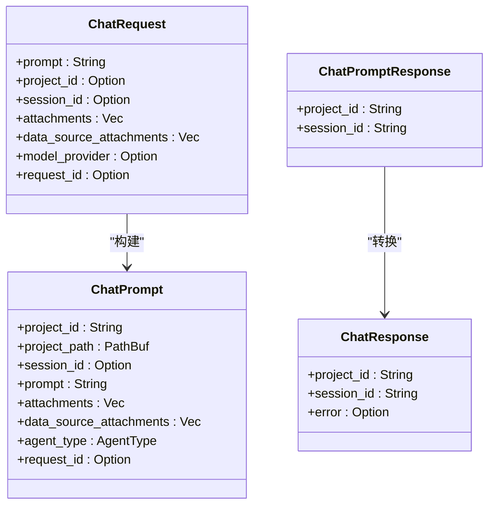
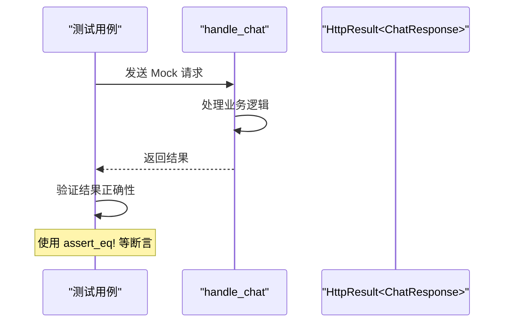
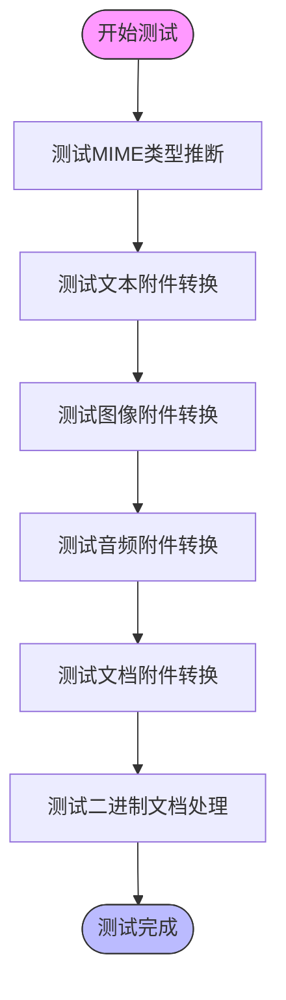
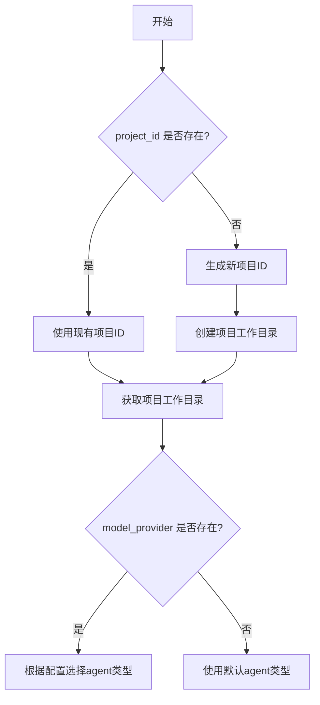

# 单元测试

<cite>
**本文档中引用的文件**  
- [chat_handler.rs](file://crates/rcoder/src/handler/chat_handler.rs)
- [content_builder.rs](file://crates/rcoder/src/utils/content_builder.rs)
- [chat_prompt.rs](file://crates/rcoder/src/model/chat_prompt.rs)
- [agent_session_notify.rs](file://crates/rcoder/src/model/agent_session_notify.rs)
- [app_error.rs](file://crates/rcoder/src/model/app_error.rs)
- [http_result.rs](file://crates/rcoder/src/model/http_result.rs)
</cite>

## 目录
1. [简介](#简介)
2. [项目结构与测试模块概述](#项目结构与测试模块概述)
3. [核心组件分析](#核心组件分析)
4. [处理函数的可测试性设计](#处理函数的可测试性设计)
5. [Mock请求构造与响应验证](#mock请求构造与响应验证)
6. [工具模块的边界条件测试](#工具模块的边界条件测试)
7. [断言最佳实践](#断言最佳实践)
8. [提升测试覆盖率策略](#提升测试覆盖率策略)
9. [结论](#结论)

## 简介
本文档深入讲解项目中单元测试的实现方式，重点围绕 `handler`、`utils` 和 `model` 模块展开。通过分析代码结构，说明如何通过隔离逻辑层与外部依赖（如数据库、网络）来编写可测试的纯函数和业务逻辑。结合 `chat_handler.rs` 中的处理函数，展示如何构造 Mock 请求并验证响应生成逻辑。介绍 Rust 中使用 `assert_eq!`、`assert_contains` 等断言进行结果验证的最佳实践。强调对 `content_builder.rs` 等工具模块的边界条件测试，确保输入输出的正确性与安全性。最后提供提升测试覆盖率的具体策略。

## 项目结构与测试模块概述
项目采用模块化设计，主要测试集中在 `handler`、`utils` 和 `model` 三个模块：
- `handler` 模块负责 HTTP 请求处理
- `utils` 模块包含通用工具函数
- `model` 模块定义数据结构和业务模型

每个模块都包含独立的测试用例，通过 `mod tests` 块组织测试代码。

**Section sources**
- [chat_handler.rs](file://crates/rcoder/src/handler/chat_handler.rs)
- [content_builder.rs](file://crates/rcoder/src/utils/content_builder.rs)
- [agent_session_notify.rs](file://crates/rcoder/src/model/agent_session_notify.rs)

## 核心组件分析
### 聊天请求处理组件
`ChatRequest` 结构体定义了用户请求的数据格式，包含 prompt、项目 ID、会话 ID、附件列表等字段。该结构体实现了 `Deserialize` 和 `Serialize` 特性，便于 JSON 序列化和反序列化。



**Diagram sources**
- [chat_handler.rs](file://crates/rcoder/src/handler/chat_handler.rs#L14-L63)
- [chat_prompt.rs](file://crates/rcoder/src/model/chat_prompt.rs#L5-L38)

### 错误处理组件
`AppError` 枚举类型定义了系统可能遇到的各种错误情况，包括序列化错误、任意错误和消息发送错误。`HttpResult<T>` 结构体封装了 API 响应结果，包含成功状态、数据和错误信息。

```mermaid
classDiagram
class AppError {
+SerdeJsonError(serde_json : : Error)
+AnyhowError(anyhow : : Error)
+SendLocalSetAgentRequestError(SendError<LocalSetAgentRequest>)
}
class HttpResult<T> {
+code : String
+message : String
+data : Option<T>
+tid : Option<String>
+success : bool
}
AppError --> HttpResult : "封装"
```

**Diagram sources**
- [app_error.rs](file://crates/rcoder/src/model/app_error.rs#L5-L17)
- [http_result.rs](file://crates/rcoder/src/model/http_result.rs#L23-L32)

## 处理函数的可测试性设计
`handle_chat` 函数是核心处理逻辑，其设计体现了良好的可测试性原则：

1. **依赖注入**：通过 `State(state)` 参数接收应用状态，便于在测试中替换为 Mock 对象
2. **纯逻辑分离**：将业务逻辑与外部 I/O 操作分离
3. **异步友好**：使用 `async/await` 语法，便于异步测试

函数通过 `#[instrument(skip(state))]` 宏添加了追踪日志，有助于调试和测试验证。

**Section sources**
- [chat_handler.rs](file://crates/rcoder/src/handler/chat_handler.rs#L97-L230)

## Mock请求构造与响应验证
### 构造Mock请求
通过 `ChatRequest` 结构体可以轻松构造各种测试场景的请求：

```rust
let request = ChatRequest {
    prompt: "测试提示".to_string(),
    project_id: Some("test_project".to_string()),
    session_id: Some("test_session".to_string()),
    attachments: vec![],
    data_source_attachments: vec![],
    model_provider: None,
    request_id: None,
};
```

### 验证响应生成逻辑
测试用例通过断言验证响应的正确性：



**Diagram sources**
- [chat_handler.rs](file://crates/rcoder/src/handler/chat_handler.rs#L97-L230)

## 工具模块的边界条件测试
### ContentBuilder模块测试
`content_builder.rs` 模块提供了附件到 ACP ContentBlock 的转换功能，其测试覆盖了各种边界条件：



**Diagram sources**
- [content_builder.rs](file://crates/rcoder/src/utils/content_builder.rs#L18-L339)

### 边界条件覆盖
测试用例特别关注以下边界条件：
- 未知文件扩展名的 MIME 类型推断
- 文本读取失败时的二进制处理
- Base64 解码失败的异常处理
- URL 资源的正确处理

**Section sources**
- [content_builder.rs](file://crates/rcoder/src/utils/content_builder.rs#L298-L339)

## 断言最佳实践
### 基本断言使用
项目中广泛使用 Rust 标准的断言宏：

```rust
assert_eq!(actual, expected);
assert!(condition);
assert!(result.is_ok());
```

### 结构化数据验证
对于复杂数据结构，使用深度比较：

```rust
assert_eq!(
    ContentBuilder::infer_mime_type_from_extension("test.txt"),
    "text/plain"
);
```

### 错误处理验证
测试错误路径时，验证错误类型和消息：

```rust
match result {
    Ok(_) => panic!("Expected error but got success"),
    Err(e) => {
        assert!(e.to_string().contains("expected error message"));
    }
}
```

**Section sources**
- [content_builder.rs](file://crates/rcoder/src/utils/content_builder.rs#L343-L370)
- [agent_session_notify.rs](file://crates/rcoder/src/model/agent_session_notify.rs#L206-L377)

## 提升测试覆盖率策略
### 分支路径覆盖
确保测试覆盖所有代码分支：



**Diagram sources**
- [chat_handler.rs](file://crates/rcoder/src/handler/chat_handler.rs#L97-L230)

### 错误处理场景测试
全面测试各种错误情况：
- 无效的文件路径
- 网络请求失败
- 序列化/反序列化错误
- 消息通道发送失败

### 边界值测试
针对数值和字符串边界进行测试：
- 空字符串
- 最大长度字符串
- 特殊字符
- 零值和最大值

**Section sources**
- [chat_handler.rs](file://crates/rcoder/src/handler/chat_handler.rs)
- [content_builder.rs](file://crates/rcoder/src/utils/content_builder.rs)

## 结论
本项目通过合理的模块划分和依赖管理，实现了高度可测试的代码结构。`handler` 模块通过依赖注入支持 Mock 测试，`utils` 模块的纯函数设计便于单元测试，`model` 模块的数据结构清晰且易于验证。测试用例覆盖了正常流程、错误处理和边界条件，使用 Rust 的断言机制确保了代码的正确性。通过持续提升测试覆盖率，可以有效保证系统的稳定性和可靠性。