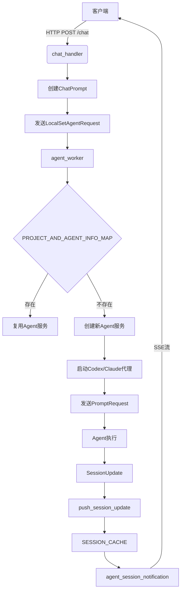
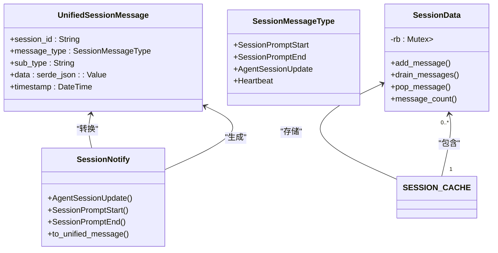
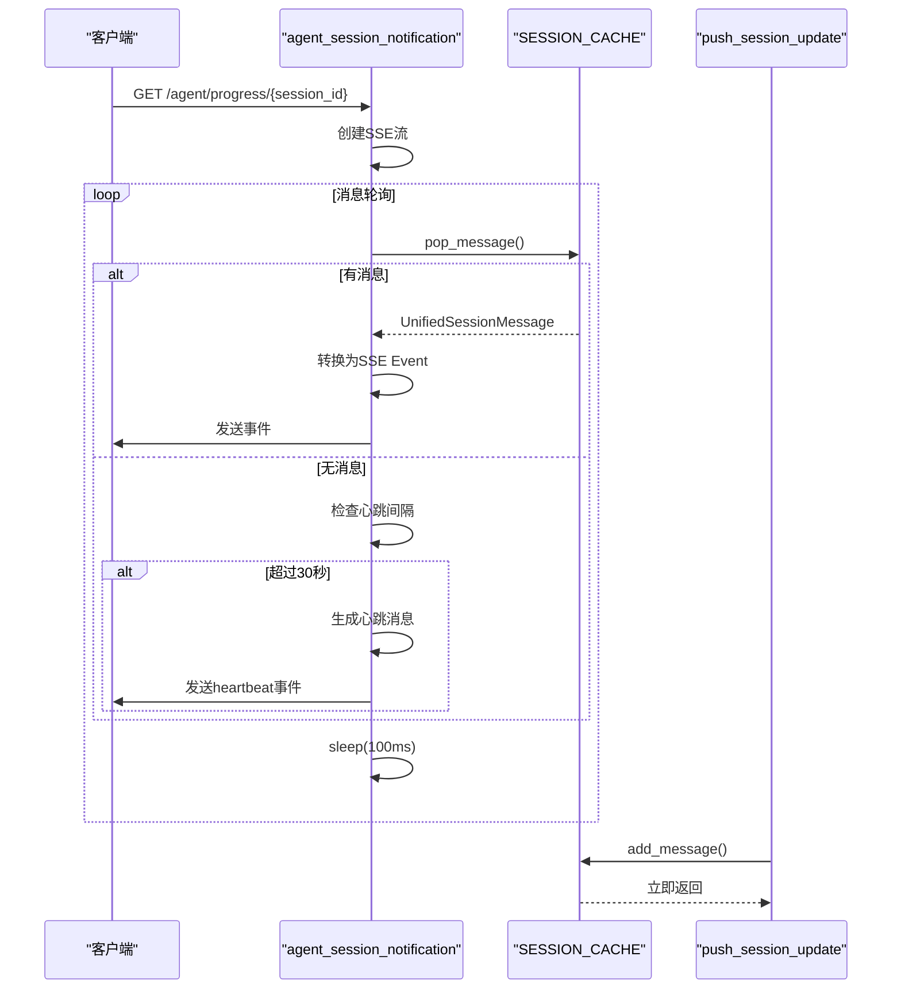
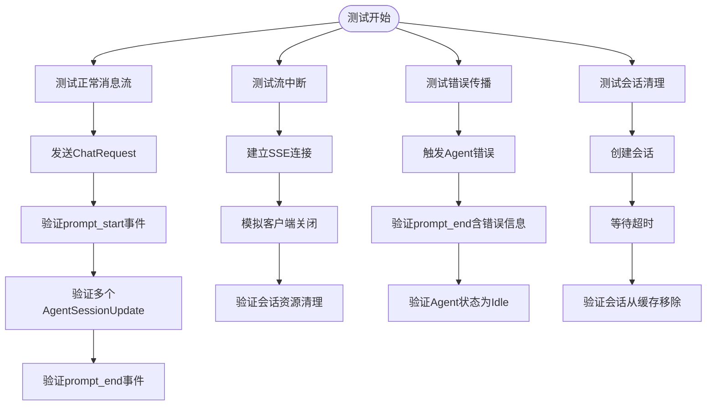
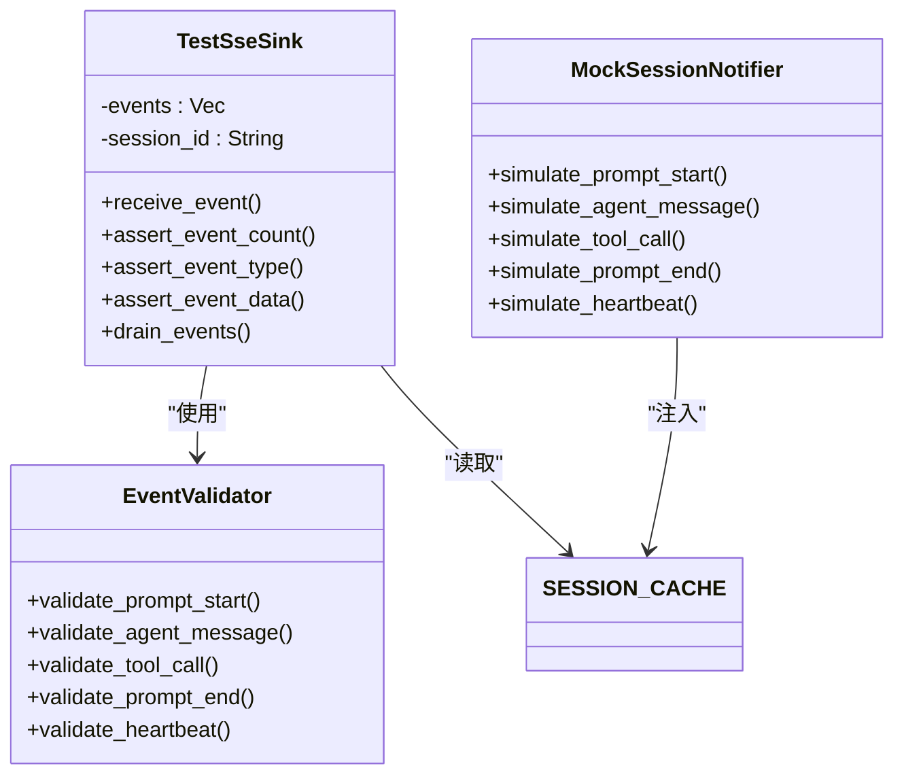
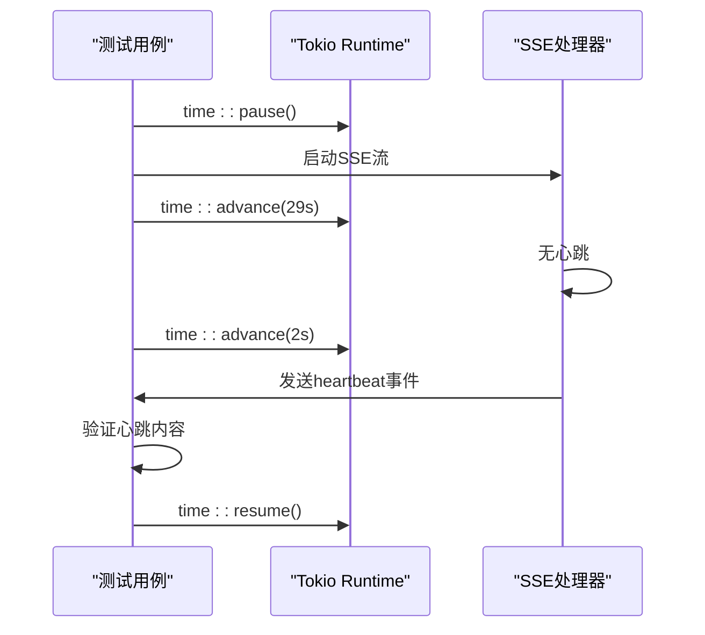
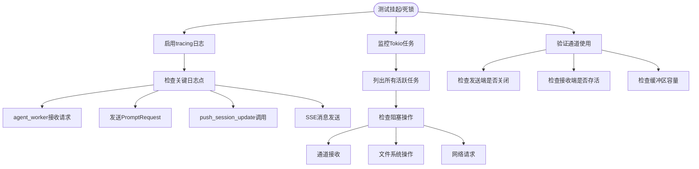

# 异步与流式通信测试

<cite>
**本文档引用的文件**
- [chat_handler.rs](file://crates/rcoder/src/handler/chat_handler.rs)
- [agent_session_notification.rs](file://crates/rcoder/src/handler/agent_session_notification.rs)
- [session_cache.rs](file://crates/rcoder/src/service/session_cache.rs)
- [chat_prompt.rs](file://crates/rcoder/src/model/chat_prompt.rs)
- [acp_agent.rs](file://crates/rcoder/src/proxy_agent/acp_agent.rs)
- [channel_utils.rs](file://crates/rcoder/src/proxy_agent/channel_utils.rs)
- [agent_model.rs](file://crates/rcoder/src/model/agent_model.rs)
- [agent_session_notify.rs](file://crates/rcoder/src/model/agent_session_notify.rs)
</cite>

## 目录
1. [引言](#引言)
2. [项目结构与核心流程](#项目结构与核心流程)
3. [SSE流式响应机制分析](#sse流式响应机制分析)
4. [异步事件推送与测试挑战](#异步事件推送与测试挑战)
5. [SSE测试用例设计](#sse测试用例设计)
6. [断言工具与事件流验证](#断言工具与事件流验证)
7. [时间驱动测试的Mock策略](#时间驱动测试的mock策略)
8. [会话清理与错误传播测试](#会话清理与错误传播测试)
9. [调试异步测试挂起与死锁](#调试异步测试挂起与死锁)
10. [总结](#总结)

## 引言
本文档重点解决SSE（Server-Sent Events）流式响应在异步环境下的测试挑战。结合`chat_handler.rs`中SSE事件流的生成逻辑，展示如何使用Tokio运行时模拟异步数据推送，并验证客户端能否正确接收多段消息。说明如何构造测试用例验证流中断、错误传播与会话清理机制。介绍使用TestResponse或自定义Sink/Stream断言工具来捕获和比对事件流内容。强调时间驱动测试中delay、timeout和interval的Mock策略，避免因时序问题导致测试不稳定。提供调试异步测试挂起或死锁的实用技巧。

## 项目结构与核心流程
本项目采用模块化Rust架构，核心功能围绕AI代理的聊天会话管理展开。通过Axum框架提供HTTP接口，利用Tokio异步运行时处理并发请求。系统通过SSE协议实现服务器到客户端的实时消息推送，支持多类型会话状态更新。



**图示来源**
- [chat_handler.rs](file://crates/rcoder/src/handler/chat_handler.rs#L1-L231)
- [acp_agent.rs](file://crates/rcoder/src/proxy_agent/acp_agent.rs#L1-L297)
- [session_cache.rs](file://crates/rcoder/src/service/session_cache.rs#L1-L96)
- [agent_session_notification.rs](file://crates/rcoder/src/handler/agent_session_notification.rs#L1-L438)

## SSE流式响应机制分析
系统通过`agent_session_notification.rs`实现SSE连接，实时推送会话状态更新。该处理器建立基于`SessionCache`的事件流，将`UnifiedSessionMessage`转换为SSE事件。



**图示来源**
- [agent_session_notify.rs](file://crates/rcoder/src/model/agent_session_notify.rs#L1-L377)
- [session_cache.rs](file://crates/rcoder/src/service/session_cache.rs#L1-L96)

## 异步事件推送与测试挑战
SSE流式通信在异步环境下面临多重测试挑战。系统通过`push_session_update`函数将各类会话通知写入全局缓存，由SSE处理器按需推送。测试需验证异步事件能否正确生成、缓存和推送。



**图示来源**
- [agent_session_notification.rs](file://crates/rcoder/src/handler/agent_session_notification.rs#L1-L438)
- [session_cache.rs](file://crates/rcoder/src/service/session_cache.rs#L1-L96)

## SSE测试用例设计
为验证SSE流的正确性，需设计多种测试场景。包括正常消息流、流中断、错误传播和会话清理等。测试应覆盖`SessionPromptStart`、`AgentSessionUpdate`和`SessionPromptEnd`等关键事件。



**图示来源**
- [chat_handler.rs](file://crates/rcoder/src/handler/chat_handler.rs#L1-L231)
- [agent_session_notification.rs](file://crates/rcoder/src/handler/agent_session_notification.rs#L1-L438)
- [session_cache.rs](file://crates/rcoder/src/service/session_cache.rs#L1-L96)

## 断言工具与事件流验证
系统提供`push_session_update`作为事件注入点，测试中可使用自定义Sink或Stream断言工具捕获和比对事件流内容。通过监听`SESSION_CACHE`验证事件顺序和内容。



**图示来源**
- [session_cache.rs](file://crates/rcoder/src/service/session_cache.rs#L1-L96)
- [agent_session_notify.rs](file://crates/rcoder/src/model/agent_session_notify.rs#L1-L377)

## 时间驱动测试的Mock策略
SSE实现包含30秒心跳机制，测试中需Mock时间以避免等待。使用Tokio的`time::pause`和`time::advance`控制虚拟时钟，验证心跳消息的定时发送。



**图示来源**
- [agent_session_notification.rs](file://crates/rcoder/src/handler/agent_session_notification.rs#L1-L438)

## 会话清理与错误传播测试
系统需正确处理会话生命周期，包括正常结束、错误终止和超时清理。测试应验证`PROJECT_AND_AGENT_INFO_MAP`和`SESSION_CACHE`的状态一致性。

```mermaid
stateDiagram-v2
[*] --> Idle
Idle --> Active : "收到ChatRequest"
Active --> Idle : "Agent状态恢复"
Active --> Error : "发送Prompt失败"
Error --> Idle : "恢复Agent状态"
Idle --> Cleanup : "会话超时"
Cleanup --> [*] : "从缓存移除"
note right of Active
AgentStatus : : Active
last_activity更新
end
note right of Idle
AgentStatus : : Idle
等待新请求
end
note right of Error
SessionPromptEnd含错误信息
状态恢复为Idle
end
```

**图示来源**
- [acp_agent.rs](file://crates/rcoder/src/proxy_agent/acp_agent.rs#L1-L297)
- [channel_utils.rs](file://crates/rcoder/src/proxy_agent/channel_utils.rs#L1-L153)
- [agent_model.rs](file://crates/rcoder/src/model/agent_model.rs#L1-L314)

## 调试异步测试挂起与死锁
异步测试常见问题包括任务挂起和死锁。启用tracing日志和任务监控可定位问题。重点关注`LocalSet`中的非Send任务和通道死锁。



**图示来源**
- [acp_agent.rs](file://crates/rcoder/src/proxy_agent/acp_agent.rs#L1-L297)
- [channel_utils.rs](file://crates/rcoder/src/proxy_agent/channel_utils.rs#L1-L153)
- [agent_session_notification.rs](file://crates/rcoder/src/handler/agent_session_notification.rs#L1-L438)

## 总结
本文档系统分析了SSE流式响应在异步环境下的测试挑战。通过理解`chat_handler.rs`的事件生成逻辑，展示了如何使用Tokio运行时模拟异步数据推送。介绍了构造测试用例验证流中断、错误传播与会话清理的完整方案。强调了使用TestResponse或自定义Sink/Stream断言工具的重要性，以及时间驱动测试中delay、timeout和interval的Mock策略。最后提供了调试异步测试挂起或死锁的实用技巧，包括启用tracing日志与任务监控，为复杂异步系统的测试提供了全面指导。