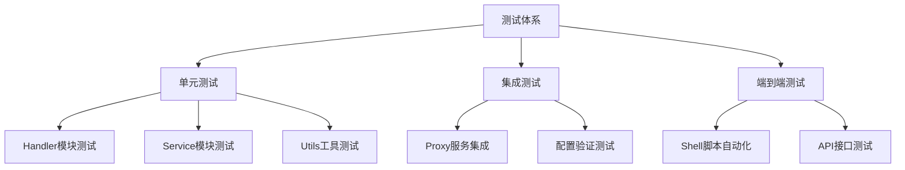
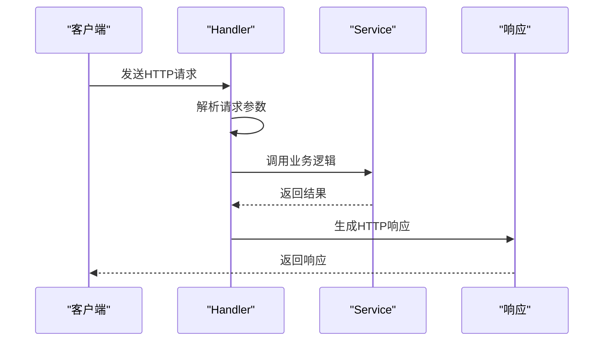
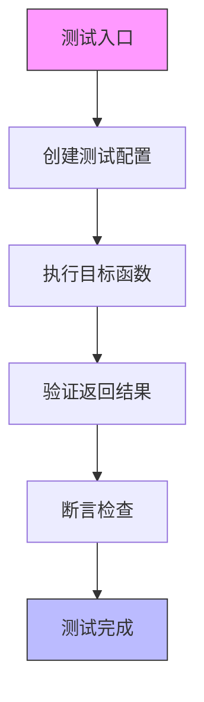
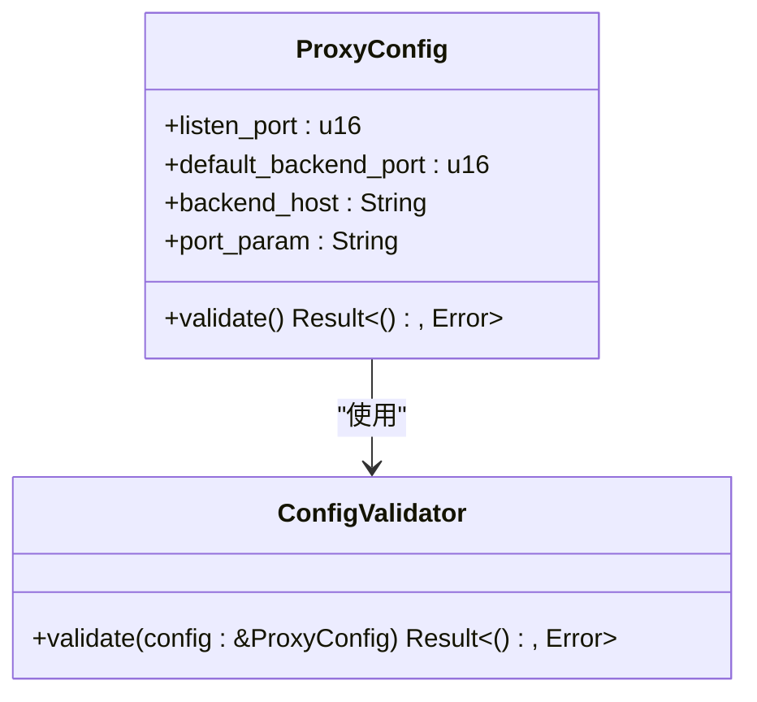
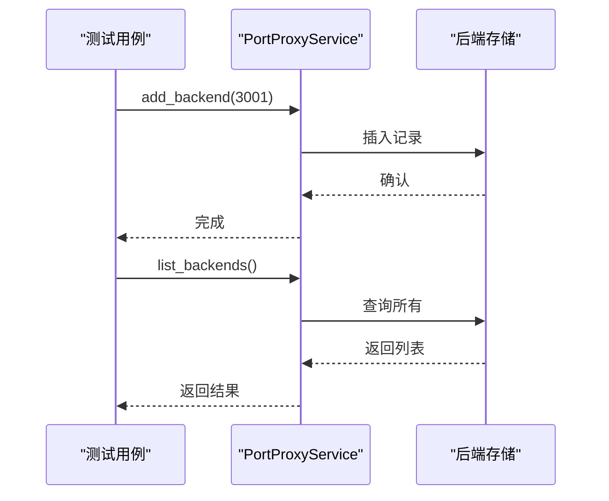
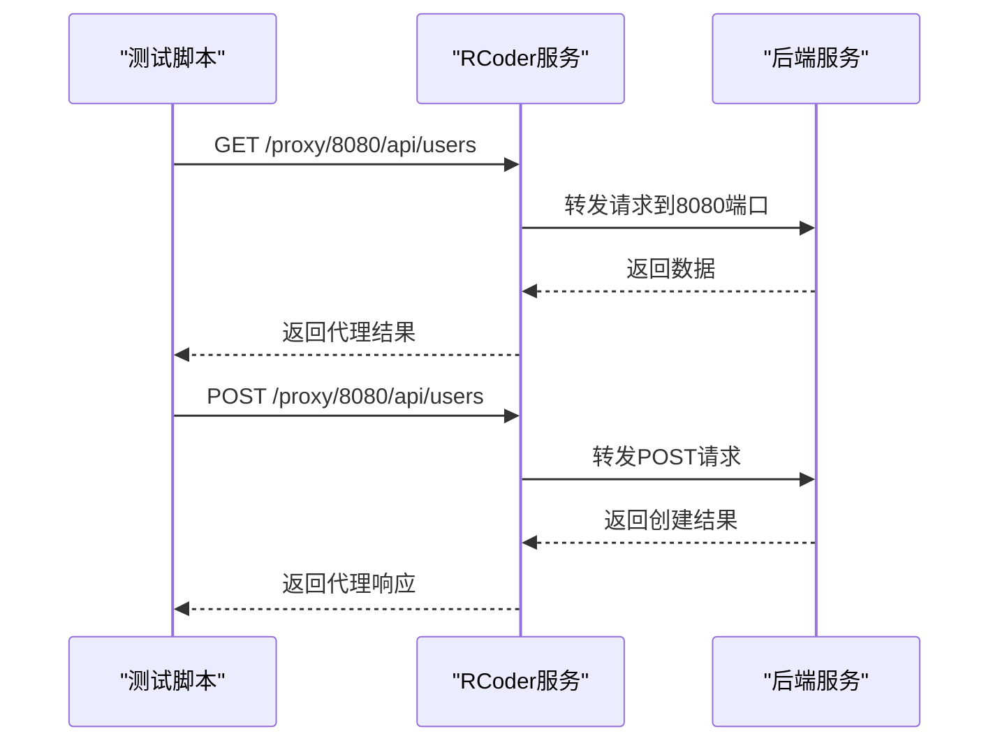
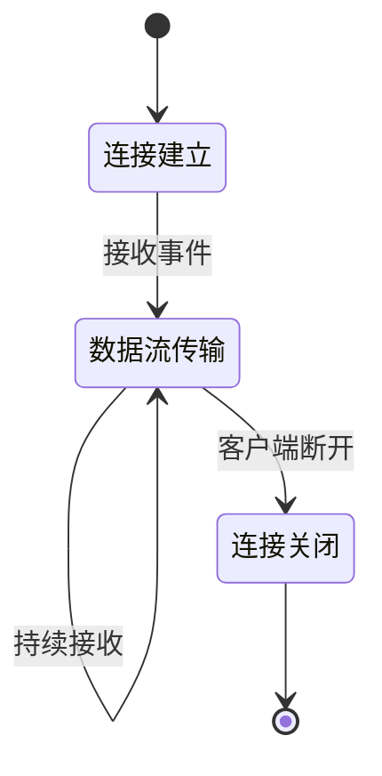

# 测试策略与实践

<cite>
**本文档引用的文件**   
- [health_handler.rs](file://crates/rcoder/src/handler/health_handler.rs)
- [agent_stop_handler.rs](file://crates/rcoder/src/handler/agent_stop_handler.rs)
- [http_result.rs](file://crates/rcoder/src/model/http_result.rs)
- [mcp_config.rs](file://crates/rcoder/src/utils/mcp_config.rs)
- [tests.rs](file://crates/pingora-proxy/src/tests.rs)
- [service.rs](file://crates/pingora-proxy/src/service.rs)
- [test_proxy.sh](file://test_proxy.sh)
- [test_proxy_api.sh](file://test_proxy_api.sh)
- [test_query_params.sh](file://test_query_params.sh)
</cite>

## 目录
1. [引言](#引言)
2. [项目测试体系结构](#项目测试体系结构)
3. [核心组件测试分析](#核心组件测试分析)
4. [集成测试实现机制](#集成测试实现机制)
5. [端到端测试实践](#端到端测试实践)
6. [测试运行与覆盖率](#测试运行与覆盖率)
7. [异步流式响应测试](#异步流式响应测试)
8. [结论](#结论)

## 引言
本文档全面介绍项目的测试体系设计，涵盖单元测试、集成测试和端到端测试的组织方式。重点说明如何为handler、service、utils等模块编写可测试代码，利用Mock对象隔离外部依赖。展示基于Axum的HTTP handler测试模式，使用TestRequest/TestResponse进行请求模拟。解释pingora-proxy中的集成测试实现机制。指导如何运行不同类型的测试（cargo test, shell脚本调用API测试），并确保关键路径的测试覆盖率。强调SSE流式响应的测试挑战及解决方案，确保异步通信逻辑的可靠性验证。

## 项目测试体系结构
项目采用分层测试策略，包含单元测试、集成测试和端到端测试三个层次。测试代码分布在各个crates的src目录下，通过#[cfg(test)]模块组织单元测试，同时在项目根目录提供shell脚本实现端到端测试。

**图示来源**
- [tests.rs](file://crates/pingora-proxy/src/tests.rs#L1-L50)
- [mcp_config.rs](file://crates/rcoder/src/utils/mcp_config.rs#L1-L50)

## 核心组件测试分析
项目中的核心组件包括handler、service和utils模块，这些模块都实现了完善的单元测试，确保各功能单元的正确性。

### Handler模块测试
Handler模块负责处理HTTP请求，通过Axum框架实现REST API接口。测试主要验证请求参数解析、业务逻辑调用和响应生成。

**图示来源**
- [health_handler.rs](file://crates/rcoder/src/handler/health_handler.rs#L1-L35)
- [agent_stop_handler.rs](file://crates/rcoder/src/handler/agent_stop_handler.rs#L1-L50)

**本节来源**
- [health_handler.rs](file://crates/rcoder/src/handler/health_handler.rs#L1-L35)
- [agent_stop_handler.rs](file://crates/rcoder/src/handler/agent_stop_handler.rs#L1-L265)

### Utils工具模块测试
Utils模块包含各种辅助功能，通过单元测试验证其正确性。特别是配置处理相关的工具函数，确保系统配置的可靠解析。

**图示来源**
- [mcp_config.rs](file://crates/rcoder/src/utils/mcp_config.rs#L1-L195)

**本节来源**
- [mcp_config.rs](file://crates/rcoder/src/utils/mcp_config.rs#L1-L195)

## 集成测试实现机制
pingora-proxy模块实现了完整的集成测试，验证代理服务的核心功能，包括配置验证、后端管理、端口提取和URI构建等。

### 配置验证测试
测试配置对象的有效性验证逻辑，确保系统在启动前能够检测到无效配置。

**图示来源**
- [tests.rs](file://crates/pingora-proxy/src/tests.rs#L50-L100)

### 服务后端管理测试
验证后端服务的增删改查操作，确保代理能够正确管理目标后端。

**图示来源**
- [tests.rs](file://crates/pingora-proxy/src/tests.rs#L101-L150)
- [service.rs](file://crates/pingora-proxy/src/service.rs#L1-L50)

**本节来源**
- [tests.rs](file://crates/pingora-proxy/src/tests.rs#L1-L398)
- [service.rs](file://crates/pingora-proxy/src/service.rs#L1-L722)

## 端到端测试实践
项目提供shell脚本实现端到端测试，模拟真实环境下的系统行为，验证整个请求处理流程。

### 测试脚本执行流程
端到端测试脚本按照预定义流程启动服务、执行测试用例并清理环境。

**图示来源**
- [test_proxy.sh](file://test_proxy.sh#L1-L90)

### API接口测试模式
通过curl命令测试各种API接口，覆盖不同的请求方法和参数组合。

**图示来源**
- [test_proxy_api.sh](file://test_proxy_api.sh#L1-L51)
- [test_query_params.sh](file://test_query_params.sh#L1-L29)

**本节来源**
- [test_proxy.sh](file://test_proxy.sh#L1-L90)
- [test_proxy_api.sh](file://test_proxy_api.sh#L1-L51)
- [test_query_params.sh](file://test_query_params.sh#L1-L29)

## 测试运行与覆盖率
项目提供多种测试运行方式，确保不同场景下的测试需求都能得到满足。

### 测试运行方式
通过不同的命令执行不同类型的测试，形成完整的测试验证体系。

| 测试类型 | 执行命令 | 说明 |
|---------|--------|------|
| 单元测试 | cargo test | 运行所有单元测试 |
| 集成测试 | cargo test -- --ignored | 运行被忽略的集成测试 |
| 端到端测试 | ./test_proxy.sh | 执行shell脚本测试 |
| 特定测试 | cargo test test_name | 运行指定测试用例 |

**本节来源**
- [tests.rs](file://crates/pingora-proxy/src/tests.rs#L300-L350)

## 异步流式响应测试
对于SSE（Server-Sent Events）等流式响应场景，项目采用特殊的测试策略确保异步通信的可靠性。

### 流式响应测试挑战
SSE流式响应具有持续连接、分块传输的特点，测试时需要特殊处理。

**本节来源**
- [agent_stop_handler.rs](file://crates/rcoder/src/handler/agent_stop_handler.rs#L1-L265)

## 结论
项目建立了完善的测试体系，涵盖单元测试、集成测试和端到端测试三个层次。通过Axum框架的测试工具验证handler逻辑，利用#[cfg(test)]模块组织单元测试，使用shell脚本实现端到端验证。特别针对代理服务的核心功能实现了全面的集成测试，确保系统在各种场景下的可靠性。建议进一步完善SSE流式响应的测试覆盖，增加性能测试用例，持续提升测试质量和系统稳定性。