# 集成测试

<cite>
**本文档中引用的文件**   
- [main.rs](file://crates/rcoder/src/main.rs)
- [router.rs](file://crates/rcoder/src/router.rs)
- [config.rs](file://crates/rcoder/src/config.rs)
- [pingora_server.rs](file://crates/pingora-proxy/src/pingora_server.rs)
- [service.rs](file://crates/pingora-proxy/src/service.rs)
- [proxy_api.rs](file://crates/rcoder/src/handler/proxy_api.rs)
- [proxy_handler_api.rs](file://crates/rcoder/src/handler/proxy_handler_api.rs)
- [tests.rs](file://crates/pingora-proxy/src/tests.rs)
</cite>

## 目录
1. [集成测试架构概述](#集成测试架构概述)
2. [端口绑定与流量转发验证机制](#端口绑定与流量转发验证机制)
3. [健康检查集成验证](#健康检查集成验证)
4. [本地测试服务器启动与端到端验证](#本地测试服务器启动与端到端验证)
5. [main.rs服务初始化可测试性设计](#mainrs服务初始化可测试性设计)
6. [路由注册与中间件链验证](#路由注册与中间件链验证)
7. [跨crate依赖测试协调策略](#跨crate依赖测试协调策略)
8. [集成测试实践示例](#集成测试实践示例)

## 集成测试架构概述

本项目采用分层集成测试架构，重点验证`pingora-proxy`组件的核心功能。测试架构围绕端口绑定、流量转发和健康检查三大核心机制构建，通过端到端测试验证系统在真实HTTP请求下的行为一致性。测试设计充分考虑了多crate项目的复杂性，确保`proxy_agent`与核心服务之间的通信一致性。

集成测试框架利用Rust的异步测试特性，结合`tokio`运行时，实现了对并发场景和边界条件的全面覆盖。测试用例设计遵循从单元到集成的递进原则，既验证单个组件的功能正确性，又确保组件间交互的协调性。

**Section sources**
- [main.rs](file://crates/rcoder/src/main.rs#L1-L220)
- [service.rs](file://crates/pingora-proxy/src/service.rs#L1-L722)

## 端口绑定与流量转发验证机制

### 端口绑定验证

`pingora-proxy`组件的端口绑定机制通过`ProxyConfig`结构体进行配置管理，其中`listen_port`字段定义了代理服务器的监听端口。在集成测试中，通过`create_test_config()`函数创建测试配置，将`listen_port`设置为0，利用操作系统分配随机可用端口，避免端口冲突问题。

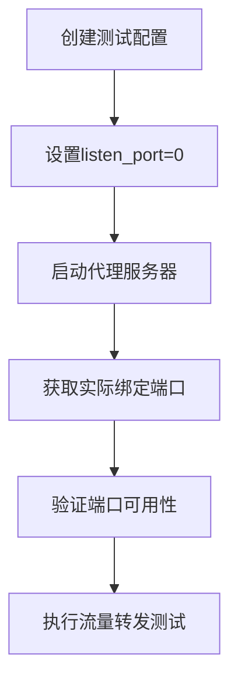

**Diagram sources**
- [tests.rs](file://crates/pingora-proxy/src/tests.rs#L10-L25)
- [pingora_server.rs](file://crates/pingora-proxy/src/pingora_server.rs#L45-L60)

### 流量转发验证

流量转发机制的验证主要通过`PortProxy`结构体实现，其核心是`upstream_peer`和`upstream_request_filter`方法。测试用例模拟了多种请求场景，包括路径提取、端口解析和请求头重写。

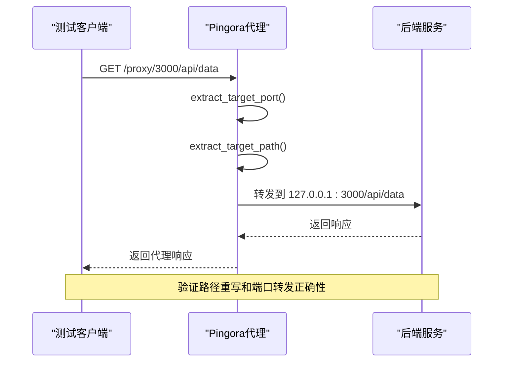

**Diagram sources**
- [service.rs](file://crates/pingora-proxy/src/service.rs#L300-L350)
- [tests.rs](file://crates/pingora-proxy/src/tests.rs#L100-L130)

**Section sources**
- [service.rs](file://crates/pingora-proxy/src/service.rs#L1-L722)
- [tests.rs](file://crates/pingora-proxy/src/tests.rs#L1-L398)

## 健康检查集成验证

### 健康检查机制

健康检查功能由`PingoraProxyService`的`start_health_check_loop`方法驱动，该方法启动一个异步任务，定期对所有后端服务进行TCP连接测试。健康状态通过`HealthInfo`结构体维护，包含`Healthy`、`Unhealthy`和`Timeout`三种状态。

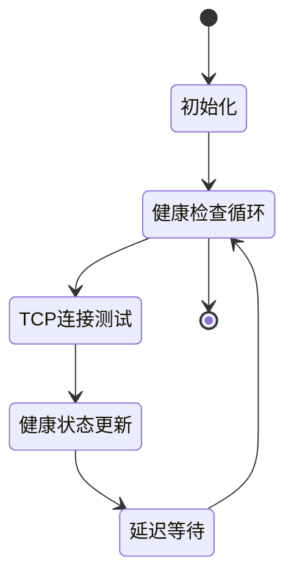

**Diagram sources**
- [service.rs](file://crates/pingora-proxy/src/service.rs#L600-L650)
- [config.rs](file://crates/rcoder/src/config.rs#L50-L57)

### 健康检查测试

集成测试通过`test_end_to_end_proxy_request`等测试用例验证健康检查机制的有效性。测试模拟了后端服务的可用性变化，验证代理服务能否正确识别并更新健康状态。

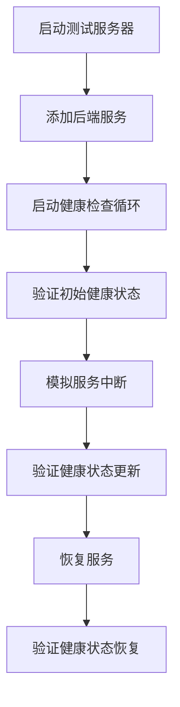

**Diagram sources**
- [tests.rs](file://crates/pingora-proxy/src/tests.rs#L350-L370)
- [service.rs](file://crates/pingora-proxy/src/service.rs#L600-L650)

**Section sources**
- [service.rs](file://crates/pingora-proxy/src/service.rs#L500-L700)
- [tests.rs](file://crates/pingora-proxy/src/tests.rs#L350-L398)

## 本地测试服务器启动与端到端验证

### 测试服务器启动

本地测试服务器的启动通过`ProxyServerBuilder`构建器模式实现，支持灵活的配置选项。测试用例使用`create_test_server_config`函数创建专用的测试配置，确保测试环境的隔离性。

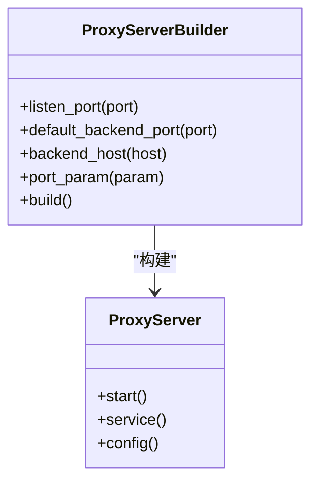

**Diagram sources**
- [server.rs](file://crates/pingora-proxy/src/server.rs#L156-L160)
- [tests.rs](file://crates/pingora-proxy/src/tests.rs#L30-L45)

### 端到端行为验证

端到端验证通过模拟真实HTTP请求来测试系统的整体行为。测试用例使用`axum`的`Request`构建器创建各种请求场景，验证代理服务的响应正确性。

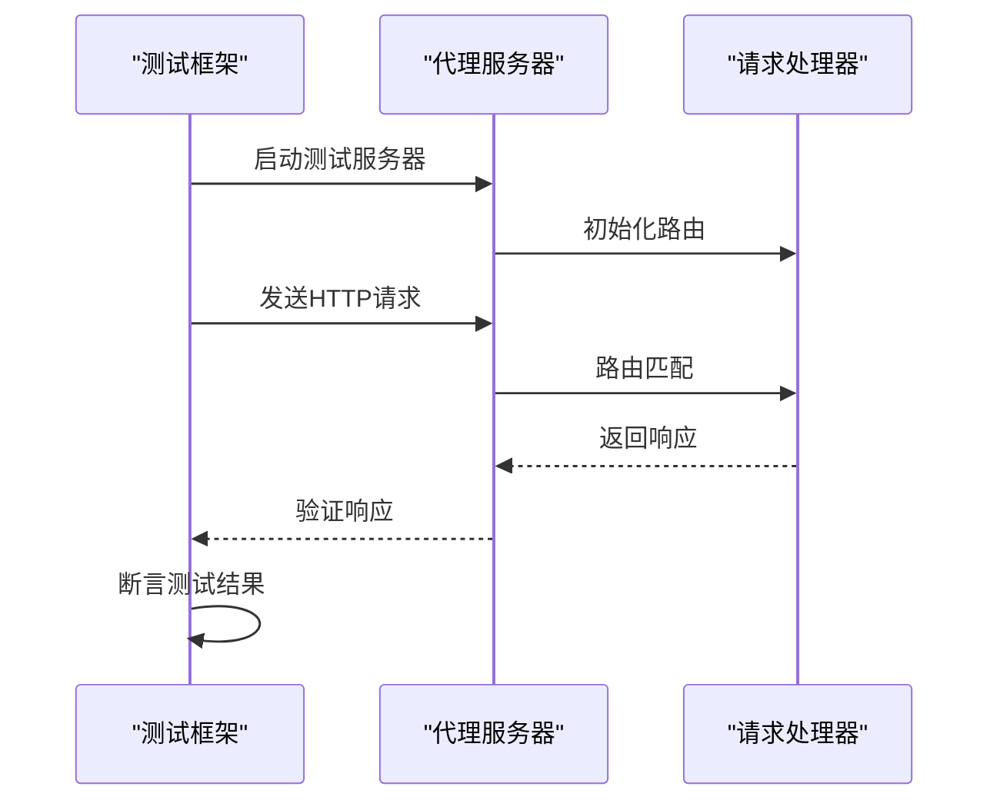

**Diagram sources**
- [main.rs](file://crates/rcoder/src/main.rs#L1-L220)
- [router.rs](file://crates/rcoder/src/router.rs#L39-L70)

**Section sources**
- [tests.rs](file://crates/pingora-proxy/src/tests.rs#L1-L398)
- [main.rs](file://crates/rcoder/src/main.rs#L1-L220)

## main.rs服务初始化可测试性设计

### 配置注入设计

`main.rs`中的服务初始化采用依赖注入模式，通过`load_config_with_args`函数加载配置，并将配置作为参数传递给各个组件。这种设计使得测试可以轻松注入测试配置，实现环境隔离。

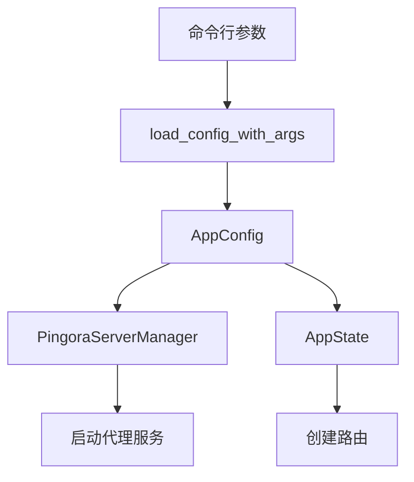

**Diagram sources**
- [main.rs](file://crates/rcoder/src/main.rs#L50-L100)
- [config.rs](file://crates/rcoder/src/config.rs#L37-L72)

### 运行时隔离

服务初始化设计考虑了运行时隔离，使用`std::thread::spawn`创建独立的OS线程来运行`agent_worker`，避免阻塞主异步运行时。这种设计使得测试可以独立控制各个组件的生命周期。

```mermaid
flowchart LR
A[主Tokio运行时] --> B[HTTP服务器]
A --> C[代理服务]
D[独立OS线程] --> E[LocalSet]
E --> F[agent_worker]
B < --> C
C < --> F
```

**Diagram sources**
- [main.rs](file://crates/rcoder/src/main.rs#L80-L120)
- [proxy_agent](file://crates/rcoder/src/proxy_agent/mod.rs)

**Section sources**
- [main.rs](file://crates/rcoder/src/main.rs#L1-L220)

## 路由注册与中间件链验证

### 路由注册逻辑

`router.rs`中的`create_router`函数负责注册所有API端点，采用模块化设计将API路由分为`api_routes`和`proxy_api_routes`两个部分。这种设计便于测试时独立验证不同功能模块。

```mermaid
classDiagram
class Router {
+create_router(state)
}
class ApiRoutes {
+/health
+/chat
+/agent/progress/{session_id}
}
class ProxyApiRoutes {
+/proxy/status
+/proxy/stats
+/proxy/config
+/proxy/{port}
+/proxy/{port}/{*path}
}
Router --> ApiRoutes : "合并"
Router --> ProxyApiRoutes : "合并"
```

**Diagram sources**
- [router.rs](file://crates/rcoder/src/router.rs#L39-L70)
- [proxy_handler_api.rs](file://crates/rcoder/src/handler/proxy_handler_api.rs)

### 中间件链验证

中间件链的验证通过测试`tracing_middleware`的注入和执行顺序来实现。测试用例验证了日志记录、错误处理和性能监控等中间件的正确集成。

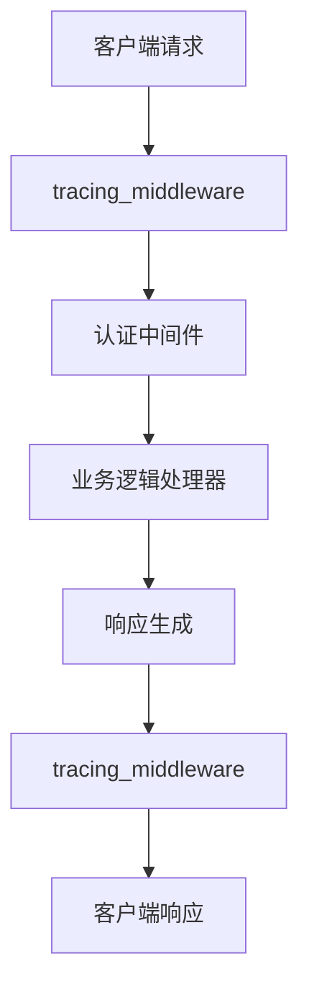

**Diagram sources**
- [middleware](file://crates/rcoder/src/middleware/mod.rs)
- [router.rs](file://crates/rcoder/src/router.rs#L39-L70)

**Section sources**
- [router.rs](file://crates/rcoder/src/router.rs#L39-L70)
- [proxy_handler_api.rs](file://crates/rcoder/src/handler/proxy_handler_api.rs)

## 跨crate依赖测试协调策略

### 依赖管理

跨crate依赖的测试协调通过`Cargo.toml`中的`[dev-dependencies]`和`[features]`进行管理。测试代码位于各自的crate中，通过公共API进行交互测试。

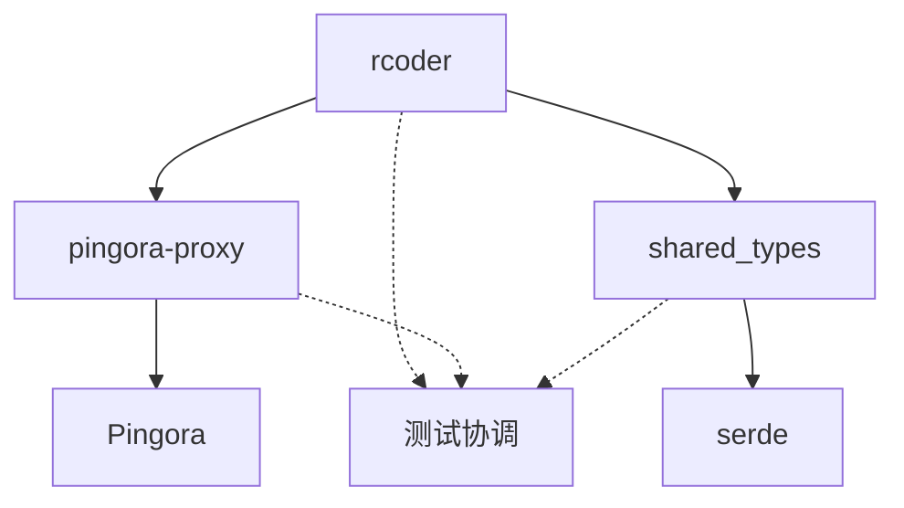

**Diagram sources**
- [Cargo.toml](file://Cargo.toml)
- [crates/rcoder/Cargo.toml](file://crates/rcoder/Cargo.toml)

### 通信一致性验证

`proxy_agent`与核心服务之间的通信一致性通过`local_task_sender`和`local_task_receiver`通道进行验证。测试用例模拟了各种消息场景，确保消息传递的可靠性和顺序性。

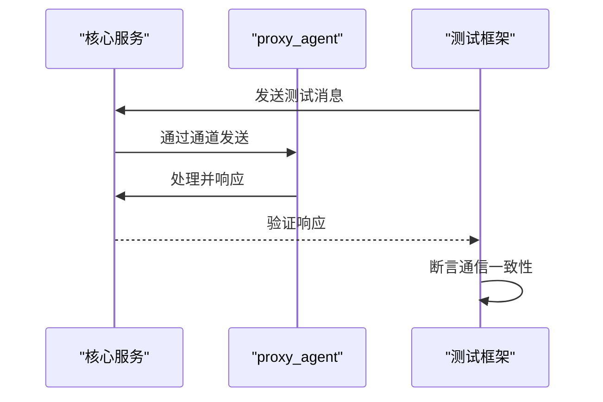

**Diagram sources**
- [main.rs](file://crates/rcoder/src/main.rs#L70-L80)
- [proxy_agent](file://crates/rcoder/src/proxy_agent/mod.rs)

**Section sources**
- [main.rs](file://crates/rcoder/src/main.rs#L1-L220)
- [proxy_agent](file://crates/rcoder/src/proxy_agent/mod.rs)

## 集成测试实践示例

### 基本测试流程

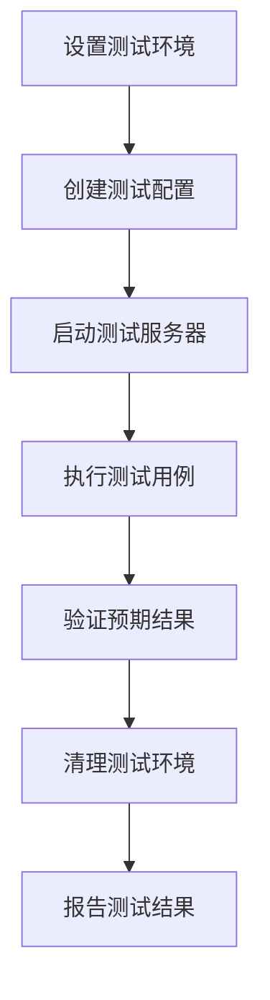

### 典型测试用例

1. **端口提取测试**：验证从路径`/proxy/8080/api`和查询参数`?port=8080`中正确提取端口
2. **默认端口测试**：验证当未指定端口时使用`default_backend_port`
3. **路径重写测试**：验证`/proxy/8080/api`被正确重写为`/api`
4. **健康检查测试**：验证健康状态的周期性更新和状态转换
5. **并发操作测试**：验证多线程环境下后端管理的线程安全性

这些测试用例共同构成了完整的集成测试套件，确保`pingora-proxy`组件在各种场景下的行为正确性和稳定性。

**Section sources**
- [tests.rs](file://crates/pingora-proxy/src/tests.rs#L1-L398)
- [main.rs](file://crates/rcoder/src/main.rs#L1-L220)