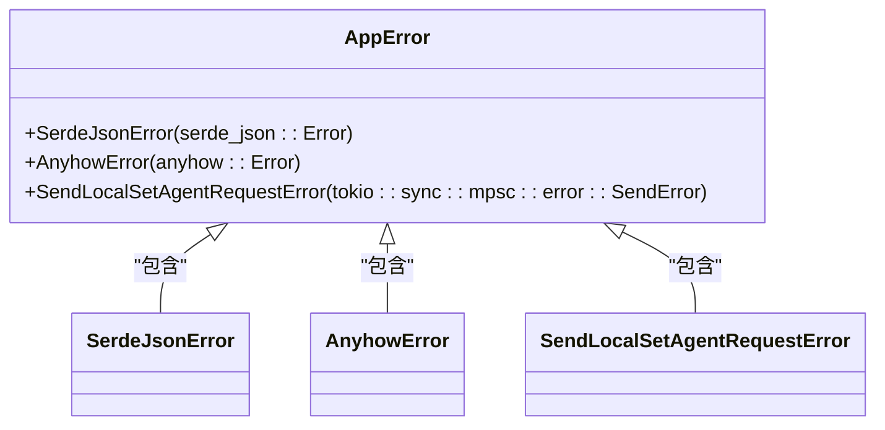
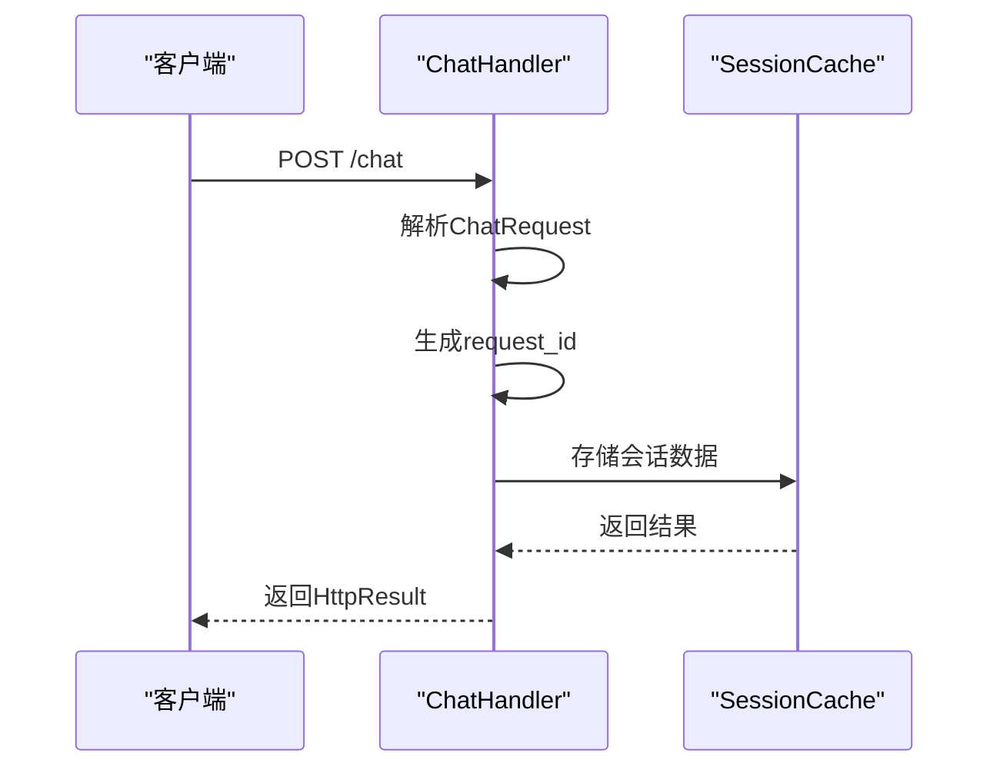
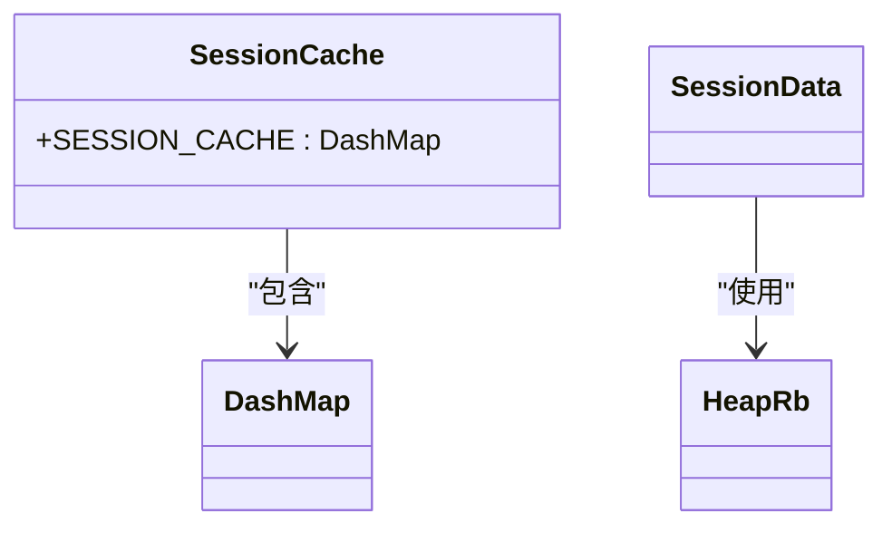

# 命名约定

<cite>
**本文档引用的文件**   
- [chat_handler.rs](file://crates/rcoder/src/handler/chat_handler.rs)
- [app_error.rs](file://crates/rcoder/src/model/app_error.rs)
- [session_cache.rs](file://crates/rcoder/src/service/session_cache.rs)
- [agent_session_notification.rs](file://crates/rcoder/src/handler/agent_session_notification.rs)
- [mod.rs](file://crates/rcoder/src/handler/mod.rs)
- [mod.rs](file://crates/rcoder/src/model/mod.rs)
</cite>

## 目录
1. [引言](#引言)
2. [模块命名规范](#模块命名规范)
3. [类型定义命名规范](#类型定义命名规范)
4. [函数与变量命名规范](#函数与变量命名规范)
5. [常量命名规范](#常量命名规范)
6. [公共API命名要求](#公共api命名要求)
7. [命名清晰性与可维护性](#命名清晰性与可维护性)
8. [常见反例分析](#常见反例分析)

## 引言
本项目严格遵循Rust社区的命名规范，确保代码的一致性和可读性。命名约定是代码质量的重要组成部分，直接影响代码的可维护性和团队协作效率。本文档详细说明项目中采用的命名规则，包括模块、结构体、枚举、函数、变量和常量的命名实践，并通过实际代码示例进行说明。

## 模块命名规范

Rust项目中的模块命名采用snake_case（蛇形命名法），即全部小写字母，单词间用下划线分隔。这种命名方式清晰地表达了模块的职责和功能范围。

项目中的处理器模块采用功能描述性命名，如`chat_handler`表示聊天处理器，`agent_session_notification`表示代理会话通知处理器。这些模块名准确地反映了其处理的业务逻辑。

模块的组织结构也体现了功能划分的清晰性，所有处理器模块位于`handler`目录下，通过`mod.rs`文件进行模块声明和导出。

**Section sources**
- [mod.rs](file://crates/rcoder/src/handler/mod.rs#L1-L17)

## 类型定义命名规范

Rust中的类型定义，包括结构体（struct）、枚举（enum）和trait，均采用PascalCase（帕斯卡命名法），即每个单词首字母大写，无分隔符。这种命名方式使类型定义在代码中易于识别。

项目中的`AppError`枚举是一个典型示例，它定义了应用程序可能遇到的各种错误类型。该枚举实现了`Error` trait，并通过`thiserror`库提供了友好的错误消息格式化功能。

**Diagram sources**
- [app_error.rs](file://crates/rcoder/src/model/app_error.rs#L5-L17)

**Section sources**
- [app_error.rs](file://crates/rcoder/src/model/app_error.rs#L1-L25)
- [mod.rs](file://crates/rcoder/src/model/mod.rs#L1-L18)

## 函数与变量命名规范

函数和变量命名严格遵循snake_case规范，即全部小写字母，单词间用下划线分隔。这种命名方式提高了代码的可读性，使函数和变量的用途一目了然。

在`chat_handler.rs`文件中，`handle_chat`函数是一个典型的HTTP请求处理器，其名称清晰地表达了其功能——处理聊天请求。类似的，`agent_session_notification`函数用于处理代理会话通知。

变量命名同样遵循这一原则，如`request_id`、`project_id`、`session_id`等，这些名称直观地表达了变量的含义和用途。

**Diagram sources**
- [chat_handler.rs](file://crates/rcoder/src/handler/chat_handler.rs#L1-L232)
- [session_cache.rs](file://crates/rcoder/src/service/session_cache.rs#L1-L97)

**Section sources**
- [chat_handler.rs](file://crates/rcoder/src/handler/chat_handler.rs#L1-L232)
- [agent_session_notification.rs](file://crates/rcoder/src/handler/agent_session_notification.rs#L1-L439)

## 常量命名规范

常量命名采用全大写蛇形命名法（SCREAMING_SNAKE_CASE），即全部大写字母，单词间用下划线分隔。这种命名方式使常量在代码中非常醒目，易于识别。

在`session_cache.rs`文件中，`SESSION_CACHE`是一个全局静态变量，使用`LazyLock`进行延迟初始化。虽然严格来说这是一个静态变量而非常量，但其命名遵循了常量的命名规范，表明其在整个程序生命周期中保持不变。

**Diagram sources**
- [session_cache.rs](file://crates/rcoder/src/service/session_cache.rs#L11-L12)

**Section sources**
- [session_cache.rs](file://crates/rcoder/src/service/session_cache.rs#L1-L97)

## 公共API命名要求

所有公共API必须使用清晰、自解释的名称，避免使用缩写或含义模糊的术语。API名称应该能够准确描述其功能，使调用者无需查阅文档即可理解其用途。

项目中的HTTP API端点命名体现了这一原则：
- `/chat`端点用于处理聊天请求
- `/agent/progress/{session_id}`端点用于建立代理会话进度通知连接

这些端点名称直观地表达了其功能，便于前端开发者理解和集成。

API响应结构也采用了清晰的命名，如`ChatResponse`、`HttpResult`等，这些名称准确地描述了数据结构的用途。

## 命名清晰性与可维护性

命名的清晰性对代码的可维护性有着重要影响。良好的命名可以显著降低代码的理解成本，使新加入项目的开发者能够快速上手。

在本项目中，命名的清晰性体现在多个层面：
1. **功能描述性**：如`agent_session_notification`准确描述了该模块的功能
2. **一致性**：所有类似功能的模块和函数采用相似的命名模式
3. **可读性**：避免过长或过短的名称，保持适当的长度和清晰度

这种命名实践不仅提高了代码的可读性，还增强了代码的自文档化特性，减少了对额外文档的依赖。

## 常见反例分析

尽管项目整体遵循了良好的命名规范，但仍需警惕一些常见的命名反例：

1. **过度缩写**：如使用`req`代替`request`，`sess`代替`session`，这会降低代码的可读性
2. **含义模糊**：如使用`data`、`info`、`temp`等过于通用的名称，无法准确表达变量的用途
3. **不一致命名**：在同一项目中混合使用不同的命名风格，如有时使用`userId`，有时使用`user_id`
4. **误导性命名**：名称与实际功能不符，如名为`validate`的函数实际上执行了数据转换操作

项目中避免了这些反例，所有命名都力求准确、清晰和一致。