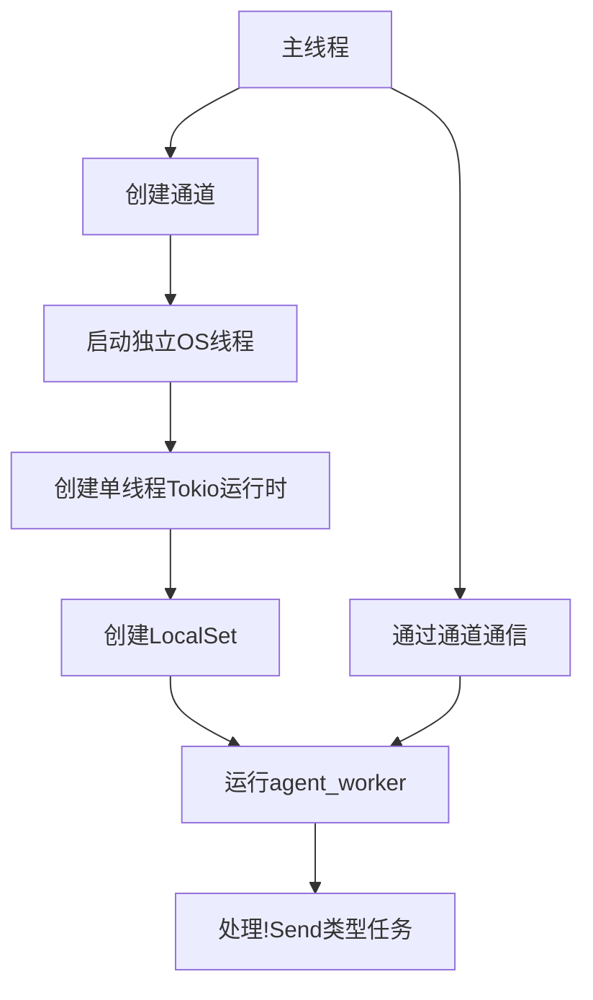

# 异步编程规范

<cite>
**本文档引用的文件**
- [main.rs](file://crates/rcoder/src/main.rs)
- [chat_handler.rs](file://crates/rcoder/src/handler/chat_handler.rs)
- [agent_session_notification.rs](file://crates/rcoder/src/handler/agent_session_notification.rs)
- [acp_agent.rs](file://crates/rcoder/src/proxy_agent/acp_agent.rs)
- [agent_service.rs](file://crates/rcoder/src/proxy_agent/agent_service.rs)
</cite>

## 目录
1. [引言](#引言)
2. [异步函数与Await使用规范](#异步函数与await使用规范)
3. [Send边界与非Send类型处理](#send边界与非send类型处理)
4. [Tokio运行时配置与LocalSet使用](#tokio运行时配置与localset使用)
5. [SSE流式响应异步处理](#sse流式响应异步处理)
6. [I/O操作异步化要求](#io操作异步化要求)
7. [结论](#结论)

## 引言
本文档旨在制定异步代码编写标准，明确.async fn的使用场景与.await的正确位置。重点强调Send边界在Tokio多线程运行时下的重要性，避免非Send类型跨.await点传递。结合main.rs中Tokio运行时初始化配置，说明LocalSet用于!Send任务的执行模式。在chat_handler.rs中展示SSE流式响应的异步处理范式，要求所有I/O操作必须异步化，禁止阻塞调用。

## 异步函数与await使用规范
在本项目中，所有可能涉及I/O操作或需要等待其他异步任务完成的函数都应声明为async fn。async fn返回一个实现了Future trait的类型，该类型可以在运行时被轮询执行。使用.await操作符来等待异步任务的完成，但需要注意.await只能在async函数或async块中使用。

在chat_handler.rs中，handle_chat函数被声明为async fn，因为它需要等待agent_worker任务的完成。该函数通过.local_task_sender.send()发送请求后，使用.chat_prompt_rx.await等待响应。这种模式确保了在等待响应期间，当前线程可以处理其他任务，提高了系统的并发性能。

**异步函数使用原则：**
- 当函数需要执行I/O操作时，应声明为async fn
- 当函数需要等待其他异步任务的结果时，应使用.await
- 避免在同步代码中调用异步函数，除非使用适当的运行时
- 确保所有.await调用都在适当的异步上下文中

**Section sources**
- [chat_handler.rs](file://crates/rcoder/src/handler/chat_handler.rs#L97-L230)

## Send边界与非Send类型处理
Send边界是Rust异步编程中的一个重要概念。一个类型如果实现了Send trait，意味着它可以安全地在线程间转移所有权。在Tokio多线程运行时中，任务可能会在不同的线程间迁移，因此所有跨.await点的变量都必须是Send的。

在本项目中，某些类型如AgentSideConnection和ClientSideConnection没有实现Send trait，因为它们包含与特定线程相关的资源。这些!Send类型不能直接在多线程运行时中使用，否则会导致编译错误或运行时问题。

为了处理!Send类型，项目采用了LocalSet来运行这些任务。LocalSet确保任务始终在同一个线程上执行，避免了跨线程迁移的问题。这种方法允许我们安全地使用那些不能跨线程共享的类型，同时仍然能够利用异步编程的优势。

**处理!Send类型的策略：**
- 识别哪些类型是!Send的
- 使用LocalSet来运行包含!Send类型的异步任务
- 在独立的OS线程中启动单线程Tokio运行时
- 通过通道与其他任务进行通信

**Section sources**
- [acp_agent.rs](file://crates/rcoder/src/proxy_agent/acp_agent.rs#L157-L255)
- [agent_service.rs](file://crates/rcoder/src/proxy_agent/agent_service.rs#L0-L71)

## Tokio运行时配置与LocalSet使用
在main.rs中，项目通过独立的OS线程启动了一个单线程Tokio运行时，并结合LocalSet来运行agent_worker任务。这种配置专门用于处理!Send类型的任务，确保它们始终在同一个线程上执行。

具体实现方式如下：
1. 创建一个无界通道(local_task_sender, local_task_receiver)，用于在主线程和agent worker线程之间传递消息
2. 在独立的OS线程中启动单线程Tokio运行时
3. 在该运行时中创建LocalSet
4. 使用LocalSet.run_until运行agent_worker任务

这种设计模式有几个优点：
- 允许使用!Send类型，如AgentSideConnection
- 避免了跨线程同步的开销
- 提供了更好的控制和隔离性
- 可以根据需要启动多个这样的专用运行时

通过这种方式，项目能够安全地处理那些不能跨线程共享的资源，同时保持整体系统的异步性和高并发性能。

**Diagram sources**
- [main.rs](file://crates/rcoder/src/main.rs#L45-L76)

**Section sources**
- [main.rs](file://crates/rcoder/src/main.rs#L45-L76)

## SSE流式响应异步处理
在agent_session_notification.rs中，项目展示了SSE（Server-Sent Events）流式响应的异步处理范式。SSE允许服务器向客户端推送实时更新，非常适合用于AI代理执行进度的通知。

handle_chat函数通过以下步骤实现SSE流式响应：
1. 建立SSE连接后，创建一个无限循环的stream
2. 在循环中定期检查SESSION_CACHE中是否有新消息
3. 如果有新消息，将其转换为SSE事件并发送给客户端
4. 如果一段时间内没有消息，发送心跳事件以保持连接活跃
5. 使用async/await模式处理异步操作，确保不会阻塞主线程

这种模式的关键优势在于它能够实时推送AI代理的执行进度，包括思考过程、工具调用、计划更新等。前端可以通过监听不同的事件类型来更新UI，提供更流畅的用户体验。

**SSE处理要点：**
- 使用stream::unfold创建无限流
- 定期检查消息队列
- 发送心跳消息保持连接
- 根据消息类型动态设置事件名称
- 使用async/await处理异步操作

**Section sources**
- [agent_session_notification.rs](file://crates/rcoder/src/handler/agent_session_notification.rs#L404-L437)

## I/O操作异步化要求
本项目严格要求所有I/O操作必须异步化，禁止使用阻塞调用。这包括文件系统操作、网络请求、数据库访问等。异步I/O操作通过Tokio提供的异步API实现，如tokio::fs、tokio::net等。

在acp_agent.rs中，我们可以看到多个异步I/O操作的例子：
- 使用tokio::fs::create_dir_all()异步创建目录
- 使用tokio::fs::read_to_string()异步读取文件内容
- 通过mpsc通道异步发送和接收消息

这些异步操作确保了系统在等待I/O完成时不会阻塞线程，从而提高了整体的并发性能和响应性。此外，异步I/O还允许更好地处理错误和超时情况，提供了更灵活的错误恢复机制。

**I/O异步化最佳实践：**
- 始终使用Tokio提供的异步API
- 避免在异步上下文中调用阻塞函数
- 使用适当的错误处理机制
- 考虑超时和重试策略
- 监控异步操作的性能

**Section sources**
- [acp_agent.rs](file://crates/rcoder/src/proxy_agent/acp_agent.rs#L157-L255)

## 结论
本文档详细阐述了项目中的异步编程规范，涵盖了.async fn的使用场景、.await的正确位置、Send边界的重要性以及!Send类型的处理方法。通过在独立线程中使用LocalSet，项目成功地处理了不能跨线程共享的类型，同时保持了系统的异步性和高并发性能。

SSE流式响应的实现展示了如何有效地向客户端推送实时更新，而严格的I/O操作异步化要求确保了系统的响应性和可扩展性。这些规范和实践共同构成了项目异步编程的基础，为开发高效、可靠的AI代理系统提供了坚实的技术支持。