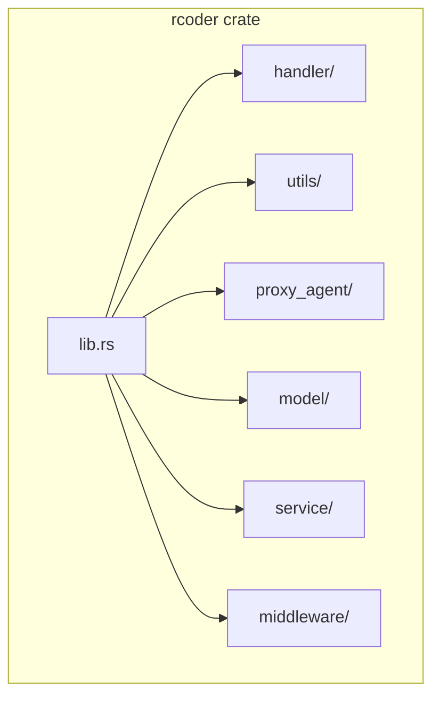
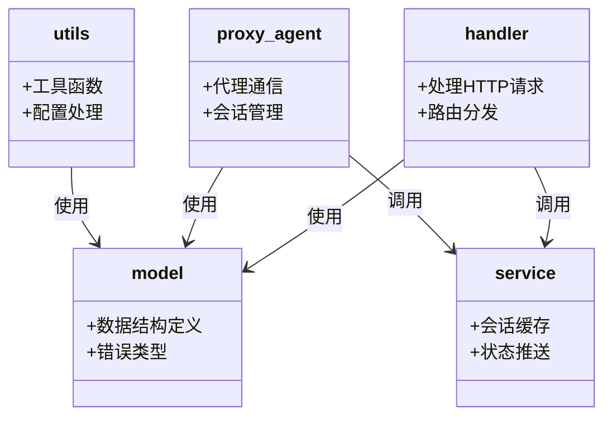
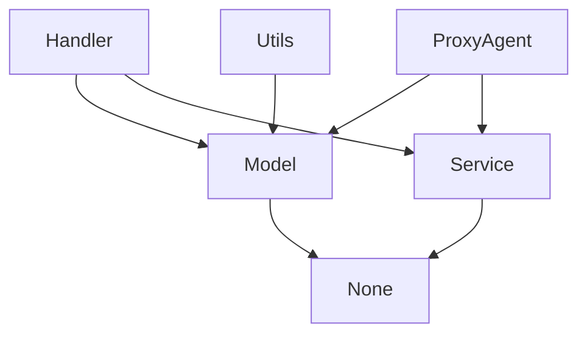

# 模块组织原则

<cite>
**本文档引用的文件**   
- [handler/mod.rs](file://crates/rcoder/src/handler/mod.rs)
- [utils/mod.rs](file://crates/rcoder/src/utils/mod.rs)
- [proxy_agent/mod.rs](file://crates/rcoder/src/proxy_agent/mod.rs)
- [lib.rs](file://crates/rcoder/src/lib.rs)
- [model/mod.rs](file://crates/rcoder/src/model/mod.rs)
- [middleware/mod.rs](file://crates/rcoder/src/middleware/mod.rs)
- [service/mod.rs](file://crates/rcoder/src/service/mod.rs)
</cite>

## 目录

1. [项目结构](#项目结构)
2. [模块化设计原则](#模块化设计原则)
3. [mod.rs 的模块聚合机制](#modrs-的模块聚合机制)
4. [模块边界划分与职责单一性](#模块边界划分与职责单一性)
5. [可见性控制：pub 与私有模块](#可见性控制pub-与私有模块)
6. [模块层级结构与最佳实践](#模块层级结构与最佳实践)
7. [避免循环依赖的设计策略](#避免循环依赖的设计策略)

## 项目结构

本项目采用 Cargo 多包（multi-crate）结构，核心业务逻辑位于 `crates/rcoder` 子目录中。该模块通过 `src` 目录下的多个子模块实现功能解耦，主要包括 `handler`、`utils`、`proxy_agent`、`model`、`service` 等。每个子模块通过 `mod.rs` 文件进行内部组织和对外暴露接口。



**图示来源**
- [lib.rs](file://crates/rcoder/src/lib.rs#L4-L10)

**本节来源**
- [lib.rs](file://crates/rcoder/src/lib.rs#L1-L17)
- 项目结构信息

## 模块化设计原则

项目的模块化设计遵循职责单一性原则，将不同功能划分为独立的模块，确保每个模块只负责特定领域的逻辑处理。例如，`handler` 模块专注于 HTTP 请求的处理，`utils` 模块封装通用工具函数，`proxy_agent` 模块管理代理服务的生命周期和通信逻辑。这种设计提高了代码的可维护性、可测试性和可复用性。

**本节来源**
- [handler/mod.rs](file://crates/rcoder/src/handler/mod.rs#L1-L16)
- [utils/mod.rs](file://crates/rcoder/src/utils/mod.rs#L1-L10)
- [proxy_agent/mod.rs](file://crates/rcoder/src/proxy_agent/mod.rs#L1-L217)

## mod.rs 的模块聚合机制

在 Rust 中，`mod.rs` 文件作为模块的入口点，负责组织和聚合子模块。以 `handler/mod.rs` 为例，该文件通过 `mod` 关键字声明了多个处理器模块（如 `chat_handler`、`health_handler`），并通过 `pub use` 将其公共接口重新导出，使得外部模块可以直接访问这些处理器而无需了解其内部文件结构。

```rust
// 示例：handler/mod.rs 中的模块聚合
mod chat_handler;
mod health_handler;
pub use chat_handler::*;
pub use health_handler::*;
```

这种方式实现了模块接口的统一暴露，简化了外部调用路径。

**本节来源**
- [handler/mod.rs](file://crates/rcoder/src/handler/mod.rs#L1-L16)
- [utils/mod.rs](file://crates/rcoder/src/utils/mod.rs#L1-L10)
- [proxy_agent/mod.rs](file://crates/rcoder/src/proxy_agent/mod.rs#L1-L217)

## 模块边界划分与职责单一性

各模块的边界划分清晰，遵循单一职责原则：

- `handler`：处理 HTTP 请求与响应，不涉及业务逻辑细节。
- `utils`：提供跨模块使用的工具函数，如配置解析、内容构建等。
- `proxy_agent`：封装与 ACP 协议相关的代理通信逻辑，包括会话管理、权限请求、文件读写等。
- `model`：定义数据结构和错误类型，供其他模块共享使用。
- `service`：提供共享服务，如会话缓存管理。

这种划分确保了模块间的低耦合，便于独立开发和测试。



**图示来源**
- [handler/mod.rs](file://crates/rcoder/src/handler/mod.rs#L1-L16)
- [utils/mod.rs](file://crates/rcoder/src/utils/mod.rs#L1-L10)
- [proxy_agent/mod.rs](file://crates/rcoder/src/proxy_agent/mod.rs#L1-L217)
- [model/mod.rs](file://crates/rcoder/src/model/mod.rs#L1-L18)
- [service/mod.rs](file://crates/rcoder/src/service/mod.rs#L1-L3)

**本节来源**
- [model/mod.rs](file://crates/rcoder/src/model/mod.rs#L1-L18)
- [service/mod.rs](file://crates/rcoder/src/service/mod.rs#L1-L3)

## 可见性控制：pub 与私有模块

模块的可见性通过 `pub` 关键字进行精确控制。私有模块（如 `channel_utils`、`content_builder`）仅在内部使用，不对外暴露；而公共模块（如 `proxy_api`、`agent_service`）则通过 `pub mod` 显式声明，并在 `pub use` 中导出，供外部调用。

例如，在 `proxy_agent/mod.rs` 中：
- `acp_agent`、`claude_code_agent` 为私有模块，仅在代理内部使用。
- `agent_service`、`agent_stop_handle` 为公共模块，可通过 `proxy_agent::agent_service` 被外部访问。

这种机制有效隐藏了实现细节，提供了稳定的公共接口。

**本节来源**
- [proxy_agent/mod.rs](file://crates/rcoder/src/proxy_agent/mod.rs#L1-L217)
- [utils/mod.rs](file://crates/rcoder/src/utils/mod.rs#L1-L10)

## 模块层级结构与最佳实践

项目采用分层模块结构，`lib.rs` 作为根模块，聚合所有子模块并通过 `pub use` 重新导出关键类型和函数，形成统一的公共 API。子模块内部通过 `mod.rs` 进行二次聚合，形成清晰的层级结构。

例如，`lib.rs` 中：
```rust
mod handler;
mod utils;
mod proxy_agent;

pub use model::*;
pub use proxy_agent::*;
pub use utils::*;
```

这种结构使得外部使用者可以通过 `rcoder::proxy_agent::agent_service` 等路径直接访问所需功能，无需关心具体文件位置。

**本节来源**
- [lib.rs](file://crates/rcoder/src/lib.rs#L4-L16)
- [handler/mod.rs](file://crates/rcoder/src/handler/mod.rs#L1-L16)
- [proxy_agent/mod.rs](file://crates/rcoder/src/proxy_agent/mod.rs#L1-L217)

## 避免循环依赖的设计策略

项目通过合理的模块划分和依赖方向控制，避免了循环依赖问题。所有依赖关系呈树状结构，从高层模块（如 `handler`）向底层模块（如 `model`、`service`）单向依赖。例如：

- `handler` 依赖 `model` 和 `service`
- `proxy_agent` 依赖 `model` 和 `service`
- `model` 和 `service` 不依赖任何业务模块

此外，通过在 `lib.rs` 中统一导出公共接口，减少了模块间直接相互引用的需求，进一步降低了耦合度。



**图示来源**
- [lib.rs](file://crates/rcoder/src/lib.rs#L4-L16)
- [model/mod.rs](file://crates/rcoder/src/model/mod.rs#L1-L18)
- [service/mod.rs](file://crates/rcoder/src/service/mod.rs#L1-L3)

**本节来源**
- [lib.rs](file://crates/rcoder/src/lib.rs#L1-L17)
- [model/mod.rs](file://crates/rcoder/src/model/mod.rs#L1-L18)
- [service/mod.rs](file://crates/rcoder/src/service/mod.rs#L1-L3)