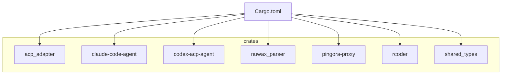
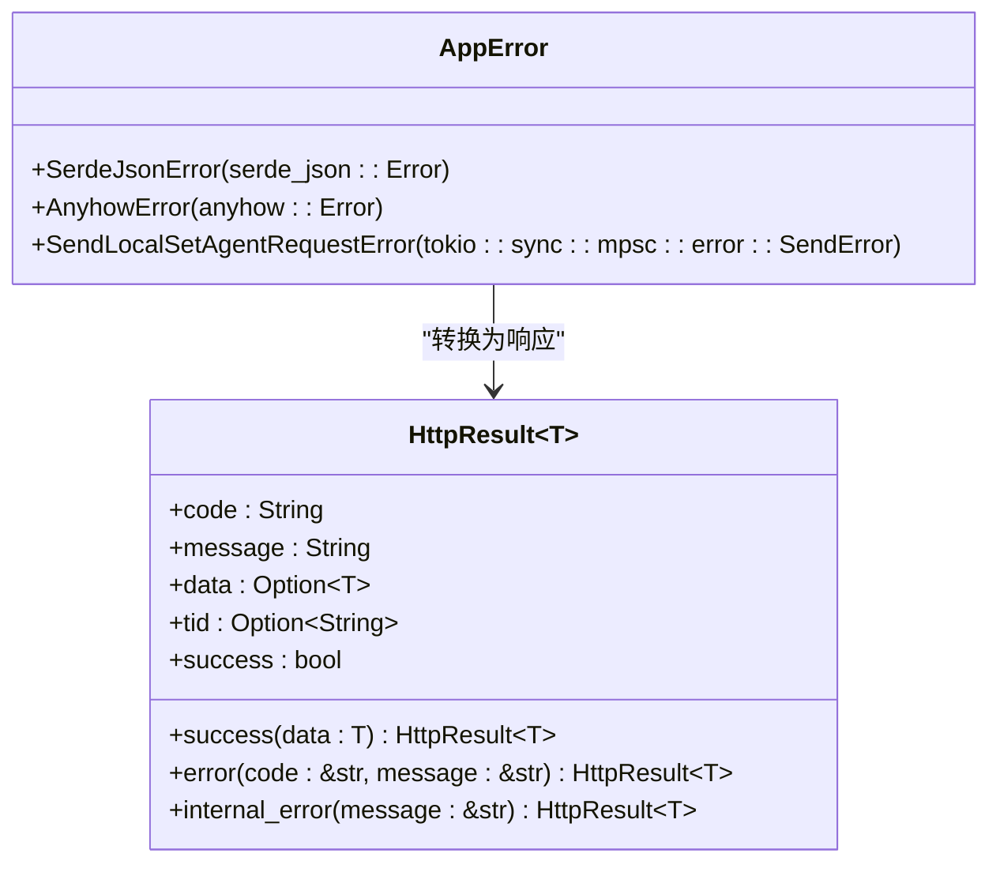
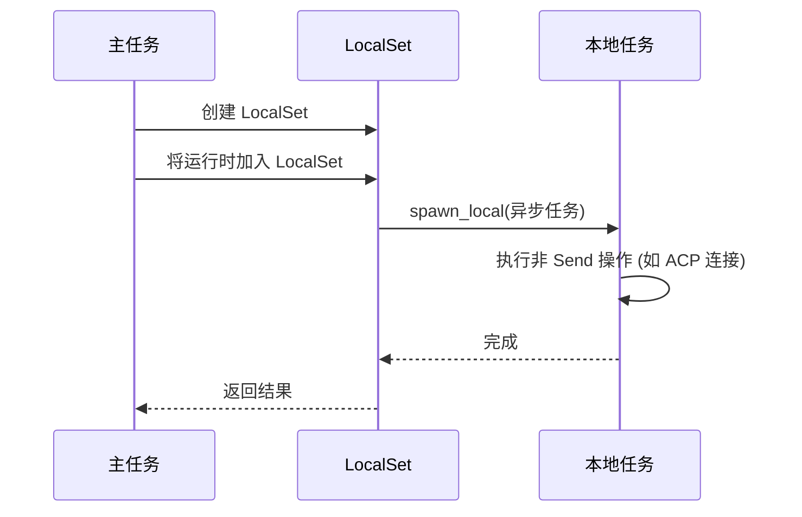
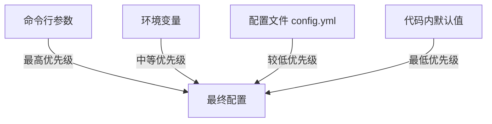
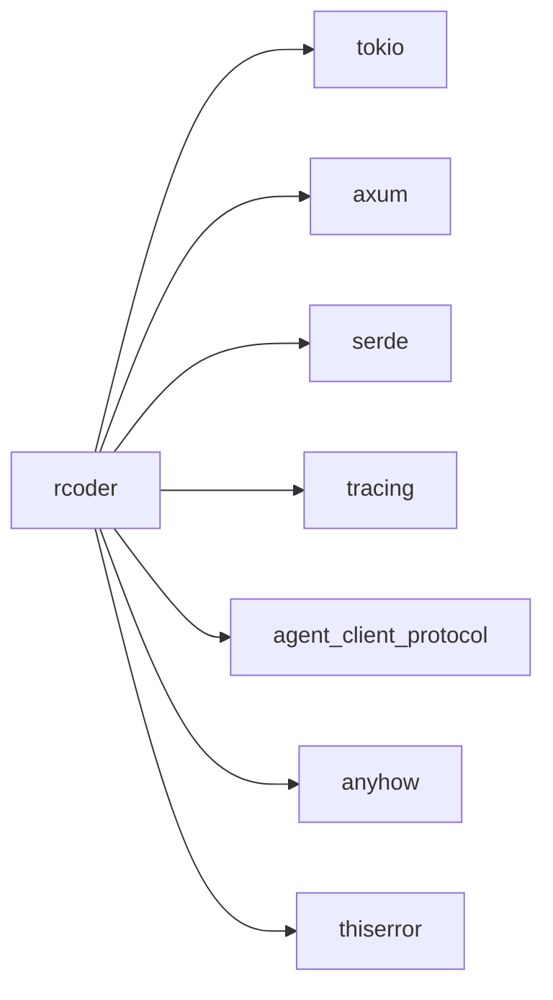

# 编码规范与代码风格

<cite>
**本文档引用的文件**
- [app_error.rs](file://crates/rcoder/src/model/app_error.rs)
- [http_result.rs](file://crates/rcoder/src/model/http_result.rs)
- [config.rs](file://crates/rcoder/src/config.rs)
- [lib.rs](file://crates/rcoder/src/lib.rs)
- [mcp_server.rs](file://crates/codex-acp-agent/src/fs/mcp_server.rs)
- [Cargo.toml](file://Cargo.toml)
- [CLAUDE.md](file://CLAUDE.md)
</cite>

## 目录
1. [介绍](#介绍)
2. [项目结构](#项目结构)
3. [核心组件](#核心组件)
4. [架构概述](#架构概述)
5. [详细组件分析](#详细组件分析)
6. [依赖分析](#依赖分析)
7. [性能考虑](#性能考虑)
8. [故障排除指南](#故障排除指南)
9. [结论](#结论)

## 介绍
本规范旨在为 RCoder 项目建立统一的 Rust 编码标准，确保代码库的风格一致性。文档涵盖命名约定、模块组织、可见性控制、错误处理模式、异步编程规范以及代码质量要求。通过遵循这些规范，团队成员可以编写出更易读、更易维护且更可靠的代码。

## 项目结构
RCoder 项目采用 Cargo workspace 结构，将功能划分为多个独立的 crate，以实现高内聚、低耦合的设计。这种模块化方法有助于代码的复用和独立测试。



**图示来源**
- [项目结构](file://README.md#L269-L377)

**本节来源**
- [项目结构](file://README.md#L269-L377)

## 核心组件
项目的核心组件包括主应用 `rcoder`、AI 代理适配器（如 `codex-acp-agent` 和 `claude-code-agent`）、共享类型库 `shared_types` 以及反向代理 `pingora-proxy`。`rcoder` crate 是整个系统的入口点，负责路由、会话管理和协调各个代理。

**本节来源**
- [CLAUDE.md](file://CLAUDE.md#L0-L66)
- [README.md](file://README.md#L269-L377)

## 架构概述
RCoder 采用异步、事件驱动的架构。主服务基于 Axum 框架，处理 HTTP API 请求和 SSE 实时进度流。Pingora 反向代理独立运行，负责高性能的端口转发。AI 代理通过 ACP 协议与主服务通信，所有代理连接都必须在 Tokio 的 `LocalSet` 中运行，因为 `AgentSideConnection` 和 `ClientSideConnection` 未实现 `Send` trait。

```mermaid
graph TB
A[客户端] --> B[Axum HTTP 服务器]
A --> C[Pingora 反向代理]
B --> D[API 路由]
B --> E[代理工作线程 (LocalSet)]
C --> F[后端服务: 127.0.0.1:{port}]
```

**图示来源**
- [README.md](file://README.md#L131-L139)

**本节来源**
- [README.md](file://README.md#L131-L139)
- [CLAUDE.md](file://CLAUDE.md#L0-L66)

## 详细组件分析

### 错误处理机制
项目使用 `thiserror` 和 `anyhow` 库来构建强大的错误处理系统。`AppError` 枚举定义了所有可能的错误类型，并利用 `#[from]` 属性实现了自动的错误转换。



**图示来源**
- [app_error.rs](file://crates/rcoder/src/model/app_error.rs#L5-L17)
- [http_result.rs](file://crates/rcoder/src/model/http_result.rs#L23-L32)

**本节来源**
- [app_error.rs](file://crates/rcoder/src/model/app_error.rs#L5-L17)
- [http_result.rs](file://crates/rcoder/src/model/http_result.rs#L23-L32)

### 异步编程与 Send 边界
由于 ACP 协议的连接类型不满足 `Send` trait，所有涉及这些连接的异步操作必须在 `LocalSet` 中执行，并使用 `spawn_local` 来启动任务。这是项目中一个关键的异步编程约束。



**图示来源**
- [CLAUDE.md](file://CLAUDE.md#L60-L66)
- [mcp_server.rs](file://crates/codex-acp-agent/src/fs/mcp_server.rs#L698-L734)

**本节来源**
- [CLAUDE.md](file://CLAUDE.md#L60-L66)
- [mcp_server.rs](file://crates/codex-acp-agent/src/fs/mcp_server.rs#L698-L734)

### 配置系统
项目实现了多层配置系统，优先级从高到低为：命令行参数 > 环境变量 > 配置文件 > 默认值。这为不同环境下的部署提供了极大的灵活性。



**图示来源**
- [README.md](file://README.md#L415-L438)
- [config.rs](file://crates/rcoder/src/config.rs)

**本节来源**
- [README.md](file://README.md#L415-L438)
- [config.rs](file://crates/rcoder/src/config.rs)

## 依赖分析
项目的依赖关系清晰地反映了其技术栈。核心依赖包括 `tokio`（异步运行时）、`axum`（Web 框架）、`serde`（序列化）、`tracing`（日志和追踪）以及 `agent_client_protocol`（ACP 协议）。



**图示来源**
- [Cargo.toml](file://Cargo.toml#L61-L122)

**本节来源**
- [Cargo.toml](file://Cargo.toml#L61-L122)

## 性能考虑
为了保证高性能，项目采用了异步架构和高效的库。Pingora 反向代理被设计为独立的、高性能的组件，以处理大量的网络请求，而不会阻塞主 Axum 服务。此外，使用 `dashmap` 和 `parking_lot` 等库可以确保在高并发场景下的数据访问效率。

## 故障排除指南
当遇到问题时，应首先检查日志输出（可通过设置 `RUST_LOG=debug` 获取详细信息）。常见的问题包括端口冲突、AI 代理连接失败和配置文件格式错误。对于异步任务中的 `Send` 错误，应检查是否在 `LocalSet` 外部使用了非 `Send` 的类型。

**本节来源**
- [README.md](file://README.md#L579-L608)

## 结论
遵循本编码规范对于维护 RCoder 项目的代码质量和可维护性至关重要。通过统一的命名、模块化的设计、健壮的错误处理和正确的异步编程实践，我们可以构建一个稳定、高效且易于扩展的 AI 驱动开发平台。