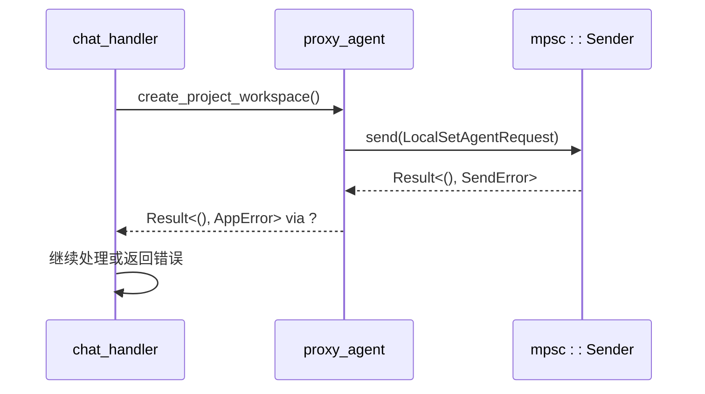
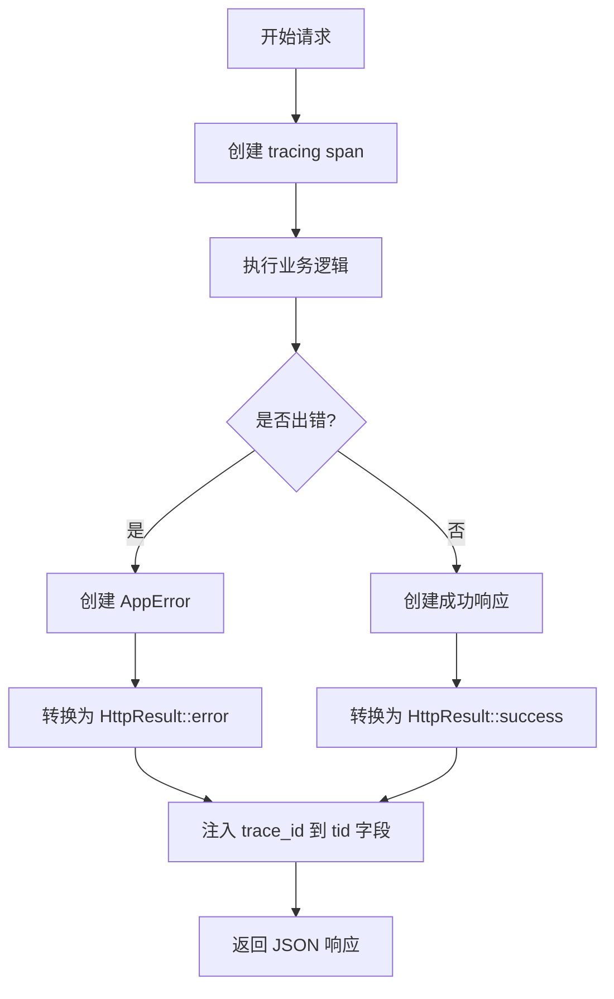

# 错误处理模式

<cite>
**本文档引用的文件**  
- [app_error.rs](file://crates/rcoder/src/model/app_error.rs)
- [http_result.rs](file://crates/rcoder/src/model/http_result.rs)
- [chat_handler.rs](file://crates/rcoder/src/handler/chat_handler.rs)
</cite>

## 目录
1. [引言](#引言)
2. [自定义错误类型 AppError 设计](#自定义错误类型-apperror-设计)
3. [标准返回类型 Result<T, AppError> 的使用规范](#标准返回类型-resultt-apperror-的使用规范)
4. [错误传播机制与 ? 操作符行为](#错误传播机制与--操作符行为)
5. [错误上下文信息的携带与 trace_id 集成](#错误上下文信息的携带与-trace_id-集成)
6. [从代理层到 HTTP 响应的错误转换流程](#从代理层到-http-响应的错误转换流程)
7. [禁止使用 unwrap() 和 expect() 的生产代码规范](#禁止使用-unwrap-和-expect-的生产代码规范)
8. [结论](#结论)

## 引言
本项目采用统一的错误处理机制，确保所有错误在系统中能够被一致地捕获、传播和响应。核心设计围绕 `AppError` 自定义错误类型展开，结合 `Result<T, AppError>` 作为标准返回类型，通过 `?` 操作符实现链式调用中的错误自动传播。所有错误必须携带上下文信息，并最终转换为结构化的 HTTP 响应，禁止在生产代码中使用 `unwrap()` 或 `expect()` 等可能导致 panic 的方法。

**Section sources**
- [app_error.rs](file://crates/rcoder/src/model/app_error.rs#L1-L24)
- [http_result.rs](file://crates/rcoder/src/model/http_result.rs#L1-L102)

## 自定义错误类型 AppError 设计
`AppError` 定义在 `model/app_error.rs` 中，是一个通过 `thiserror::Error` 宏派生的枚举类型，用于封装项目中可能出现的各种错误。它支持从多种底层错误类型自动转换，包括 `serde_json::Error`、`anyhow::Error` 以及通道发送错误 `SendError<LocalSetAgentRequest>`。这种设计实现了错误类型的统一抽象，使得不同模块的错误可以被集中处理。

```mermaid
classDiagram
class AppError {
+SerdeJsonError(serde_json : : Error)
+AnyhowError(anyhow : : Error)
+SendLocalSetAgentRequestError(SendError<LocalSetAgentRequest>)
}
AppError --> serde_json : : Error : "from"
AppError --> anyhow : : Error : "from"
AppError --> SendError : "from"
```

**Diagram sources**
- [app_error.rs](file://crates/rcoder/src/model/app_error.rs#L1-L24)

**Section sources**
- [app_error.rs](file://crates/rcoder/src/model/app_error.rs#L1-L24)

## 标准返回类型 Result<T, AppError> 的使用规范
项目中所有可能失败的异步操作均应返回 `Result<T, AppError>` 类型。该模式强制开发者显式处理错误情况，避免了错误被忽略的可能性。`T` 代表成功时返回的数据类型，而 `AppError` 则统一承载所有错误信息。此规范在 `chat_handler.rs` 的 `handle_chat` 函数中得到了充分体现，其返回类型明确为 `Result<HttpResult<ChatResponse>, AppError>`。

**Section sources**
- [chat_handler.rs](file://crates/rcoder/src/handler/chat_handler.rs#L1-L231)
- [app_error.rs](file://crates/rcoder/src/model/app_error.rs#L1-L24)

## 错误传播机制与 ? 操作符行为
`?` 操作符在链式调用中扮演着关键角色。当一个返回 `Result` 的函数调用后使用 `?`，若结果为 `Err`，则会立即提前返回该错误，并通过 `From` trait 自动转换为当前函数所期望的错误类型（即 `AppError`）。例如，在 `handle_chat` 函数中，`create_project_workspace(&new_project_id).await?` 会将底层的 `anyhow::Error` 自动转换为 `AppError::AnyhowError` 并向上层传播，简化了错误处理代码。



**Diagram sources**
- [chat_handler.rs](file://crates/rcoder/src/handler/chat_handler.rs#L1-L231)
- [app_error.rs](file://crates/rcoder/src/model/app_error.rs#L1-L24)

**Section sources**
- [chat_handler.rs](file://crates/rcoder/src/handler/chat_handler.rs#L1-L231)

## 错误上下文信息的携带与 trace_id 集成
所有错误响应都必须携带足够的上下文信息以便于调试和追踪。`HttpResult<T>` 结构体中包含 `tid` 字段，用于存储 OpenTelemetry 的 `trace_id`。该字段通过 `get_trace_id_from_context()` 函数从当前 tracing 上下文中自动获取。即使在错误情况下，系统也会确保 `trace_id` 被正确注入到响应中，实现了端到端的分布式追踪能力。



**Diagram sources**
- [http_result.rs](file://crates/rcoder/src/model/http_result.rs#L1-L102)

**Section sources**
- [http_result.rs](file://crates/rcoder/src/model/http_result.rs#L1-L102)

## 从代理层到 HTTP 响应的错误转换流程
当错误从代理层（如 `proxy_agent`）传播到 HTTP 处理器（如 `chat_handler`）时，`AppError` 会通过其实现的 `IntoResponse` 特质自动转换为 HTTP 响应。具体流程是：`AppError` 被转换为一个 `HttpResult::<()>::error("0001", &self.to_string())`，然后该 `HttpResult` 再通过自身的 `IntoResponse` 实现序列化为 JSON 格式的 HTTP 响应体，并设置状态码为 200（业务错误）或 500（序列化失败）。

**Section sources**
- [app_error.rs](file://crates/rcoder/src/model/app_error.rs#L1-L24)
- [http_result.rs](file://crates/rcoder/src/model/http_result.rs#L1-L102)

## 禁止使用 unwrap() 和 expect() 的生产代码规范
尽管在部分测试或适配器代码中仍存在 `unwrap()` 和 `expect()` 的使用（如 `acp_adapter` 中的 `Url::from_file_path` 调用），但项目规范明确禁止在生产代码中使用这些可能导致程序崩溃的方法。正确的做法是使用 `?` 操作符将错误传播给调用者，或使用模式匹配来优雅地处理 `Option` 和 `Result` 类型。这一规范确保了服务的健壮性和稳定性。

**Section sources**
- [app_error.rs](file://crates/rcoder/src/model/app_error.rs#L1-L24)
- [chat_handler.rs](file://crates/rcoder/src/handler/chat_handler.rs#L1-L231)

## 结论
本项目的错误处理机制通过 `AppError`、`Result<T, AppError>`、`?` 操作符和 `HttpResult` 的协同工作，构建了一个统一、健壮且可追踪的错误管理体系。它不仅保证了错误信息的完整传递，还通过集成 OpenTelemetry 提供了强大的调试支持。遵循此模式可以有效提升代码质量和系统可靠性。