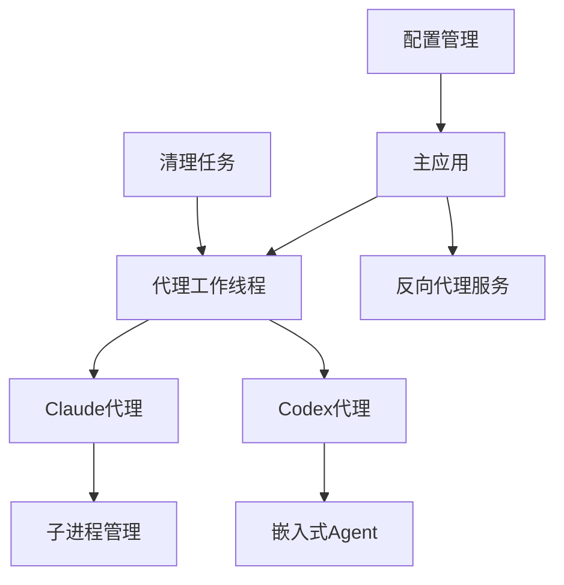
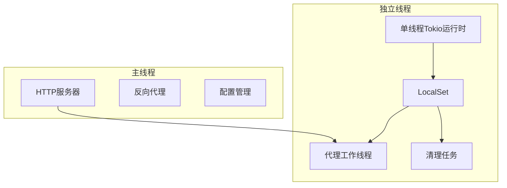
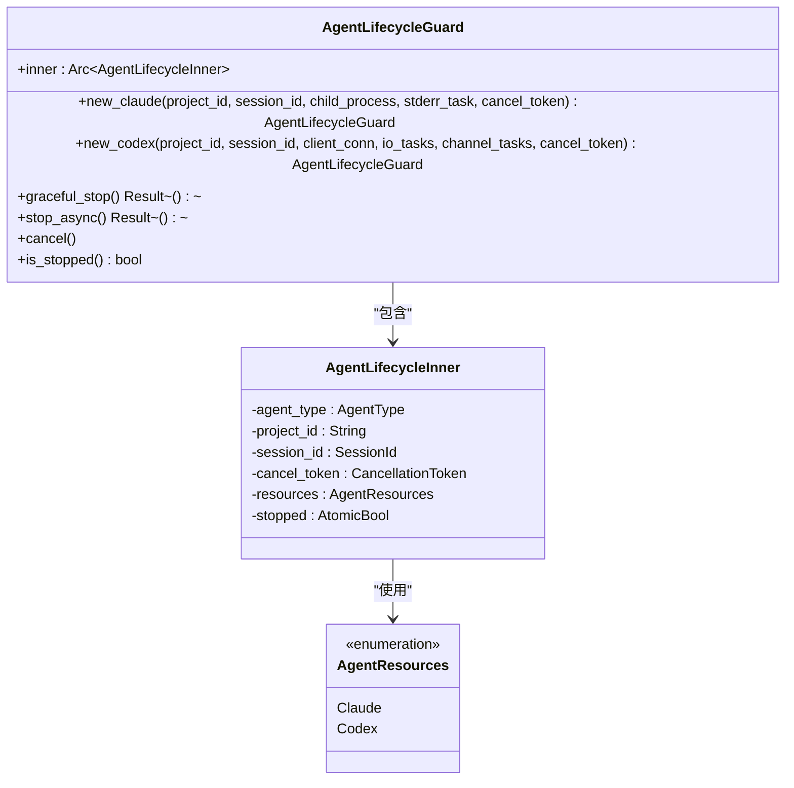
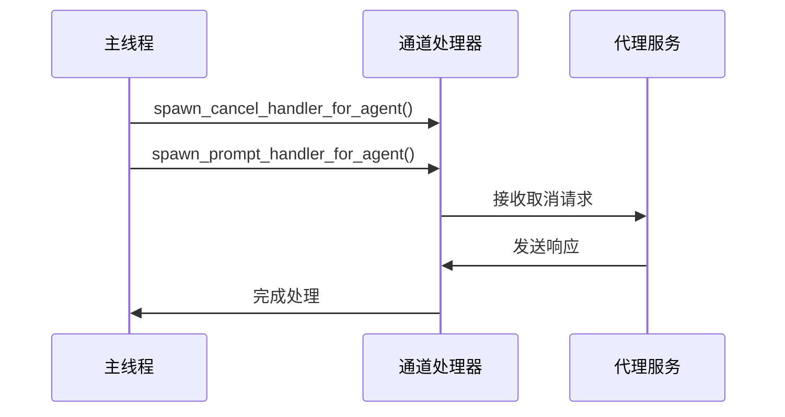
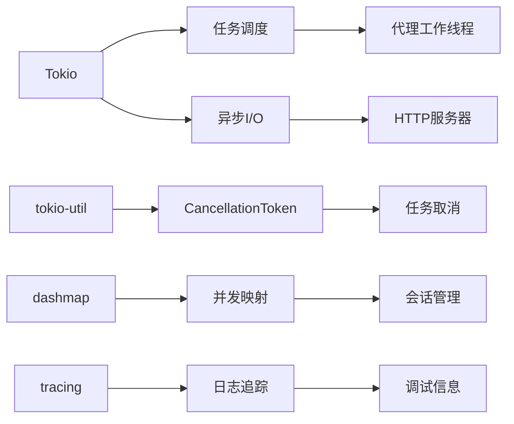

# 异步代码调试

<cite>
**本文档引用的文件**
- [main.rs](file://crates/rcoder/src/main.rs)
- [agent_stop_handle.rs](file://crates/rcoder/src/proxy_agent/agent_stop_handle.rs)
- [channel_utils.rs](file://crates/rcoder/src/proxy_agent/channel_utils.rs)
- [claude_code_agent.rs](file://crates/rcoder/src/proxy_agent/claude_code_agent.rs)
- [codex_agent.rs](file://crates/rcoder/src/proxy_agent/codex_agent.rs)
- [config.rs](file://crates/rcoder/src/config.rs)
</cite>

## 目录
1. [引言](#引言)
2. [项目结构](#项目结构)
3. [核心组件](#核心组件)
4. [架构概述](#架构概述)
5. [详细组件分析](#详细组件分析)
6. [依赖分析](#依赖分析)
7. [性能考虑](#性能考虑)
8. [故障排除指南](#故障排除指南)
9. [结论](#结论)

## 引言
本文档深入探讨在Tokio异步运行时环境下调试Rust应用的挑战与解决方案。重点介绍如何使用rust-analyzer在VS Code中设置断点并检查Future状态，以及如何通过tokio-console工具可视化任务调度和执行流。同时提供在LocalSet单线程运行时中调试!Send类型worker的特殊技巧，并结合代码实例展示如何诊断异步通道阻塞、超时处理和任务取消等问题。

## 项目结构
本项目采用多crate架构，核心功能分布在多个独立的crate中。主应用程序位于`crates/rcoder`目录下，通过Tokio异步运行时管理各种代理服务。系统使用`tokio::sync::mpsc`通道进行任务通信，并通过`CancellationToken`实现任务取消机制。

**图示来源**
- [main.rs](file://crates/rcoder/src/main.rs#L0-L220)

**本节来源**
- [main.rs](file://crates/rcoder/src/main.rs#L0-L220)

## 核心组件
系统的核心组件包括基于Tokio的异步运行时管理、代理服务生命周期控制、以及跨线程的任务通信机制。通过`LocalSet`在单线程运行时中管理非Send类型的资源，确保了对特定类型worker的安全调试能力。

**本节来源**
- [main.rs](file://crates/rcoder/src/main.rs#L167-L219)
- [config.rs](file://crates/rcoder/src/config.rs#L106-L144)

## 架构概述
系统采用分层架构设计，主应用通过独立的OS线程启动单线程Tokio运行时，专门用于处理非Send类型的代理worker。这种设计允许开发者在调试过程中准确观察Future的状态变化，同时避免跨线程数据竞争问题。

**图示来源**
- [main.rs](file://crates/rcoder/src/main.rs#L167-L219)

## 详细组件分析

### 代理生命周期管理分析
系统实现了基于RAII原则的代理生命周期管理，通过`AgentLifecycleGuard`结构体确保资源的自动清理。该机制在调试异步任务取消时尤为重要，可以清晰地观察到资源释放的完整过程。

**图示来源**
- [agent_stop_handle.rs](file://crates/rcoder/src/proxy_agent/agent_stop_handle.rs#L0-L263)

**本节来源**
- [agent_stop_handle.rs](file://crates/rcoder/src/proxy_agent/agent_stop_handle.rs#L0-L263)

### 通道处理工具分析
系统提供了通用的通道处理工具，用于复用channel消息处理逻辑。这些工具在调试异步通道阻塞问题时非常有用，可以帮助开发者理解消息流的完整生命周期。

**图示来源**
- [channel_utils.rs](file://crates/rcoder/src/proxy_agent/channel_utils.rs#L0-L153)

**本节来源**
- [channel_utils.rs](file://crates/rcoder/src/proxy_agent/channel_utils.rs#L0-L153)

## 依赖分析
系统依赖于多个关键的异步编程组件，包括Tokio运行时、tokio-util的CancellationToken、以及dashmap等并发数据结构。这些依赖共同构成了系统的异步调试基础。

**图示来源**
- [main.rs](file://crates/rcoder/src/main.rs#L0-L46)

**本节来源**
- [main.rs](file://crates/rcoder/src/main.rs#L0-L46)

## 性能考虑
在调试异步应用时，需要注意性能影响。系统通过将代理工作线程隔离在独立的OS线程中，减少了主线程的负担。同时，使用`spawn_local`确保非Send任务在正确的上下文中执行，避免了不必要的同步开销。

## 故障排除指南
当遇到异步调试问题时，建议按照以下步骤进行排查：
1. 检查CancellationToken是否正确传递和取消
2. 验证LocalSet中的任务是否正确执行
3. 确认通道发送和接收是否匹配
4. 检查资源清理是否在Drop时正确执行

**本节来源**
- [agent_stop_handle.rs](file://crates/rcoder/src/proxy_agent/agent_stop_handle.rs#L225-L262)
- [claude_code_agent.rs](file://crates/rcoder/src/proxy_agent/claude_code_agent.rs#L198-L225)

## 结论
本文档详细介绍了在Tokio异步运行时环境下调试Rust应用的方法。通过合理使用LocalSet、CancellationToken和rust-analyzer等工具，可以有效解决异步编程中的常见调试难题。建议开发者结合tokio-console等可视化工具，全面理解任务的调度和执行流程。