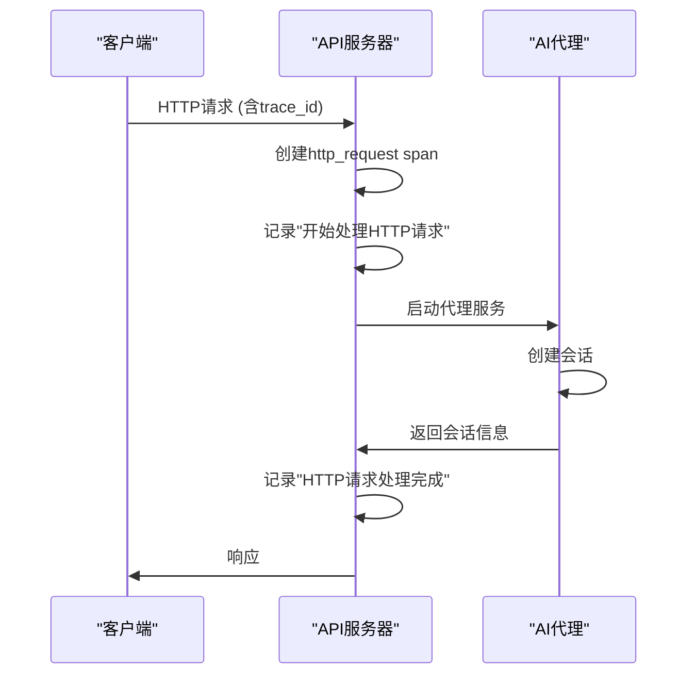
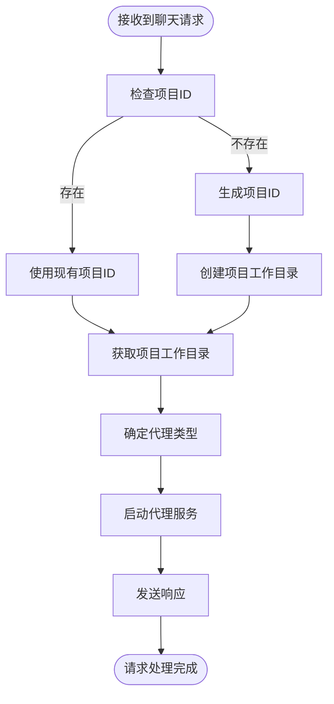
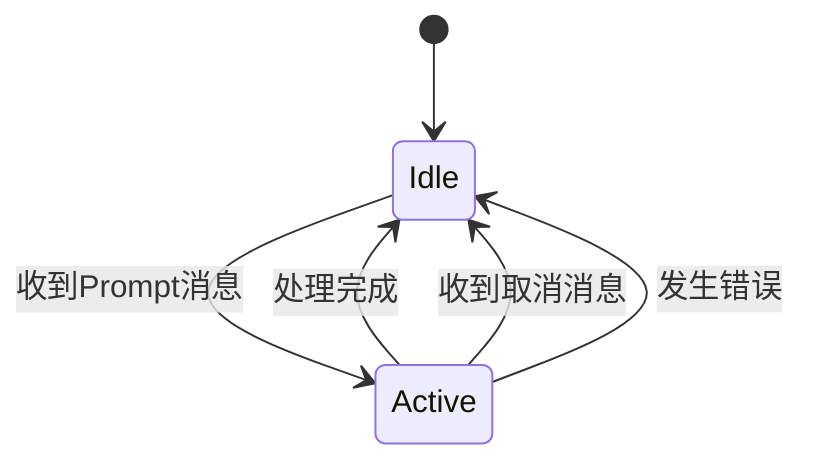

# 日志调试与跟踪

<cite>
**本文档中引用的文件**   
- [main.rs](file://crates/rcoder/src/main.rs)
- [tracing_middleware.rs](file://crates/rcoder/src/middleware/tracing_middleware.rs)
- [chat_handler.rs](file://crates/rcoder/src/handler/chat_handler.rs)
- [agent_service.rs](file://crates/rcoder/src/proxy_agent/agent_service.rs)
- [codex_agent.rs](file://crates/rcoder/src/proxy_agent/codex_agent.rs)
- [claude_code_agent.rs](file://crates/rcoder/src/proxy_agent/claude_code_agent.rs)
- [channel_utils.rs](file://crates/rcoder/src/proxy_agent/channel_utils.rs)
- [session_cache.rs](file://crates/rcoder/src/service/session_cache.rs)
- [agent_session_notify.rs](file://crates/rcoder/src/model/agent_session_notify.rs)
- [agent_model.rs](file://crates/rcoder/src/model/agent_model.rs)
- [agent_stop_handle.rs](file://crates/rcoder/src/proxy_agent/agent_stop_handle.rs)
</cite>

## 目录
1. [日志与跟踪配置](#日志与跟踪配置)  
2. [OpenTelemetry集成与分布式追踪](#opentelemetry集成与分布式追踪)  
3. [关键路径日志记录](#关键路径日志记录)  
4. [结构化日志添加方法](#结构化日志添加方法)  
5. [常见日志模式识别](#常见日志模式识别)  
6. [日志过滤与性能优化](#日志过滤与性能优化)  
7. [总结](#总结)

## 日志与跟踪配置

本项目通过 `tracing` 和 `RUST_LOG` 环境变量实现多级别日志输出控制。在 `main.rs` 中，系统初始化时会设置日志过滤器，支持按模块精细控制日志级别。默认配置为 `rcoder=debug,tower_http=debug,axum_tracing_opentelemetry=info`，允许开发者根据需要调整。

HTTP 请求的跟踪由 `tracing_middleware.rs` 中的 `tracing_middleware_handler` 函数处理。该中间件为每个请求生成唯一的 `trace_id`，并记录请求开始和完成的信息。`trace_id` 优先从请求头（如 `x-trace-id`、`traceparent`）中提取，若不存在则自动生成 UUID。日志信息包含请求方法、URI、状态码以及用户代理等元数据，便于后续分析。

**日志级别说明：**
- **info**：记录关键操作，如请求处理、服务启动
- **debug**：记录详细流程，如会话创建、配置加载
- **warn**：记录潜在问题，如配置缺失、非关键错误
- **error**：记录严重错误，如服务启动失败、连接中断

通过设置 `RUST_LOG` 环境变量，可以动态调整日志输出级别。例如，`RUST_LOG=rcoder=debug` 将启用调试级别日志，而 `RUST_LOG=rcoder=info` 则只显示信息级别及以上的日志。

**本节来源**  
- [main.rs](file://crates/rcoder/src/main.rs#L200-L220)  
- [tracing_middleware.rs](file://crates/rcoder/src/middleware/tracing_middleware.rs#L70-L129)

## OpenTelemetry集成与分布式追踪

系统通过 OpenTelemetry 实现分布式链路追踪。在 `main.rs` 的 `init_telemetry` 函数中，初始化了全局文本传播器（`TraceContextPropagator`），确保 `trace_id` 在服务间正确传播。日志系统与 OpenTelemetry 集成，每个日志条目都包含 `trace_id`，便于跨服务关联。

为了将追踪数据导出到 Jaeger 或 Zipkin，需要配置 OpenTelemetry 导出器。虽然当前代码未直接包含导出器配置，但通过标准 OpenTelemetry SDK 可以轻松添加。例如，使用 `opentelemetry-jaeger` 或 `opentelemetry-zipkin` crate，配置批量处理器将 span 数据发送到指定的后端服务。

追踪数据包含以下关键信息：
- **span 名称**：如 `http_request`、`http_request_processing`
- **属性**：包括 `method`、`uri`、`trace_id`、`user_agent` 等
- **时间戳**：请求开始和结束时间
- **事件**：如 "开始处理 HTTP 请求"、"HTTP 请求处理完成"

这种集成方式使得开发者能够可视化整个请求链路，从 API 入口到代理通信，再到会话状态变更，形成完整的调用链视图。



**图示来源**  
- [main.rs](file://crates/rcoder/src/main.rs#L200-L220)  
- [tracing_middleware.rs](file://crates/rcoder/src/middleware/tracing_middleware.rs#L70-L129)

## 关键路径日志记录

### 请求处理路径

请求处理的核心在 `chat_handler.rs` 的 `handle_chat` 函数。该函数处理聊天请求，生成项目ID，创建工作目录，并启动相应的AI代理服务。日志记录了从请求接收到响应返回的完整流程，包括项目ID生成、工作目录创建、代理服务启动等关键步骤。



**本节来源**  
- [chat_handler.rs](file://crates/rcoder/src/handler/chat_handler.rs#L150-L230)

### 代理通信路径

代理通信涉及 `codex_agent.rs` 和 `claude_code_agent.rs` 中的 `start_*_acp_agent_service` 函数。这些函数负责启动不同类型的AI代理服务。日志记录了配置加载、连接建立、会话创建等过程。例如，在 `codex_agent.rs` 中，日志显示 "Loaded codex config" 和 "启用 YOLO 模式"，帮助开发者确认配置是否正确加载。

对于 Claude 代理，系统通过子进程方式启动 `claude-code-acp` 命令，日志记录了子进程PID和工作目录，便于故障排查。同时，stderr 输出被单独捕获并以 `warn` 级别记录，确保代理的警告信息不会被忽略。

**本节来源**  
- [codex_agent.rs](file://crates/rcoder/src/proxy_agent/codex_agent.rs#L24-L246)  
- [claude_code_agent.rs](file://crates/rcoder/src/proxy_agent/claude_code_agent.rs#L21-L304)

### 会话状态变更路径

会话状态变更由 `channel_utils.rs` 中的 `spawn_prompt_handler_for_agent` 和 `spawn_cancel_handler_for_agent` 函数管理。当收到 Prompt 消息时，代理状态更新为 `Active`；处理完成后恢复为 `Idle`。取消请求时，状态同样恢复为 `Idle`。

状态变更通过 `PROJECT_AND_AGENT_INFO_MAP` 全局映射维护，并在 `agent_stop_handle.rs` 中的 `AgentLifecycleGuard` 实现RAII式资源管理。日志记录了状态变更的详细信息，如 "项目[{}]agent状态更新为Active" 和 "项目[{}]agent状态恢复为Idle"。



**图示来源**  
- [channel_utils.rs](file://crates/rcoder/src/proxy_agent/channel_utils.rs#L80-L150)  
- [agent_stop_handle.rs](file://crates/rcoder/src/proxy_agent/agent_stop_handle.rs#L1-L263)

## 结构化日志添加方法

在 `handler` 和 `proxy_agent` 模块中添加结构化日志的方法如下：

1. **导入 tracing 宏**：在文件顶部添加 `use tracing::{debug, error, info, warn};`
2. **使用合适的日志级别**：
   - `info!` 用于记录关键操作
   - `debug!` 用于记录详细流程
   - `warn!` 用于记录潜在问题
   - `error!` 用于记录错误
3. **包含上下文信息**：在日志消息中包含关键变量，如项目ID、会话ID等

例如，在 `chat_handler.rs` 中：
```rust
info!(
    "🚀 [DEBUG] handle_chat 开始处理请求: project_id={:?}, session_id={:?}, prompt={}",
    request.project_id, request.session_id, request.prompt
);
```

在 `codex_agent.rs` 中：
```rust
info!("Loaded codex config: {:?}", cfg);
info!("启用 YOLO 模式: 禁用沙箱，禁用批准请求");
```

这些日志不仅提供了文本描述，还包含了结构化的字段，便于日志分析系统解析和查询。

**本节来源**  
- [chat_handler.rs](file://crates/rcoder/src/handler/chat_handler.rs#L150-L230)  
- [codex_agent.rs](file://crates/rcoder/src/proxy_agent/codex_agent.rs#L24-L246)

## 常见日志模式识别

### 性能瓶颈识别

通过分析日志中的时间戳，可以识别性能瓶颈。例如，比较 "开始处理 HTTP 请求" 和 "HTTP 请求处理完成" 之间的时间差，可以评估请求处理的总耗时。如果某个代理服务的启动时间过长，可能在 "启动 ACP Agent 服务" 到 "服务启动完成" 之间存在延迟。

### 错误根源定位

常见错误模式包括：
- **代理启动失败**：日志中会出现 "启动ACP Agent服务失败" 及具体错误信息
- **通道发送失败**：如 "发送prompt请求失败"，可能表示代理已断开连接
- **配置加载失败**：如 "Failed to load config"，指示配置文件存在问题
- **子进程启动失败**：如 "无法启动 claude-code-acp 子进程"，可能缺少可执行文件或权限

通过 `trace_id` 关联相关日志条目，可以快速定位问题根源。例如，一个失败的聊天请求可以通过其 `trace_id` 找到对应的代理启动日志和错误信息。

**本节来源**  
- [chat_handler.rs](file://crates/rcoder/src/handler/chat_handler.rs#L150-L230)  
- [claude_code_agent.rs](file://crates/rcoder/src/proxy_agent/claude_code_agent.rs#L21-L304)  
- [channel_utils.rs](file://crates/rcoder/src/proxy_agent/channel_utils.rs#L80-L150)

## 日志过滤与性能优化

### 日志过滤

通过 `RUST_LOG` 环境变量实现日志过滤。支持以下模式：
- 按模块过滤：`rcoder=debug` 只显示 rcoder 模块的调试日志
- 按级别过滤：`info` 显示信息级别及以上的日志
- 多条件组合：`rcoder=debug,tower_http=info` 分别设置不同模块的级别

在生产环境中，建议使用 `info` 级别以减少日志量，而在开发和调试时使用 `debug` 级别获取详细信息。

### 采样与性能开销控制

系统通过以下方式控制日志性能开销：
1. **异步日志**：使用 `tracing` 的异步特性，避免阻塞主线程
2. **条件日志**：在性能敏感路径使用 `debug_enabled!()` 宏检查是否需要记录
3. **批量写入**：日志写入文件采用按天滚动的策略，减少I/O开销
4. **选择性记录**：只记录关键路径和错误信息，避免过度日志

在 `main.rs` 中，日志同时输出到控制台和文件，控制台使用简洁格式，文件使用JSON格式便于后续分析。这种设计平衡了实时观察和事后分析的需求。

**本节来源**  
- [main.rs](file://crates/rcoder/src/main.rs#L200-L220)  
- [tracing_middleware.rs](file://crates/rcoder/src/middleware/tracing_middleware.rs#L70-L129)

## 总结

本项目通过 `tracing` 和 `RUST_LOG` 环境变量实现了完善的日志调试与跟踪系统。HTTP 请求通过中间件获得唯一的 `trace_id`，便于跨请求追踪。OpenTelemetry 集成支持分布式追踪，可导出到 Jaeger 或 Zipkin 进行可视化分析。

在关键路径如请求处理、代理通信和会话状态变更中，系统记录了详细的结构化日志，包含时间戳、上下文信息和状态变更。开发者可以通过 `RUST_LOG` 环境变量灵活控制日志级别，平衡调试需求和性能开销。

通过识别常见日志模式，可以快速定位性能瓶颈和错误根源。建议在开发阶段使用 `debug` 级别日志，在生产环境使用 `info` 级别，并结合分布式追踪工具进行深入分析。