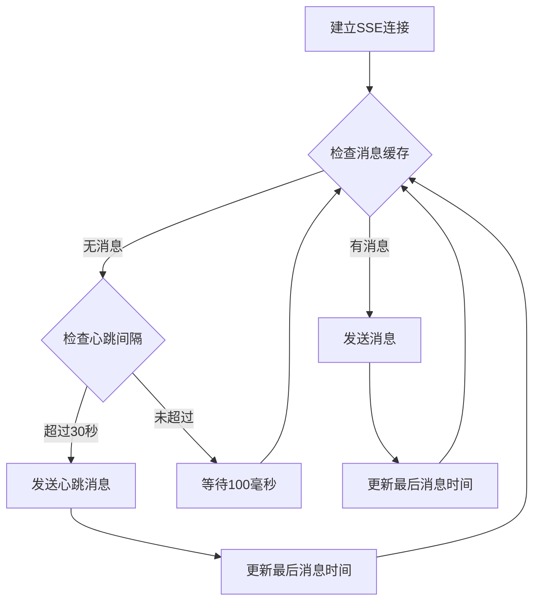
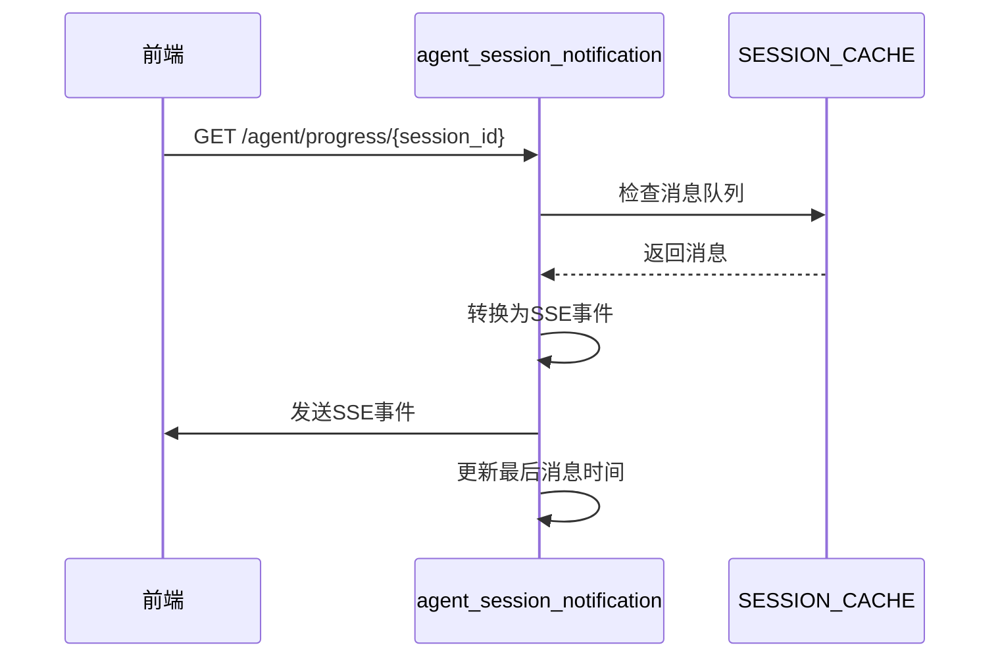
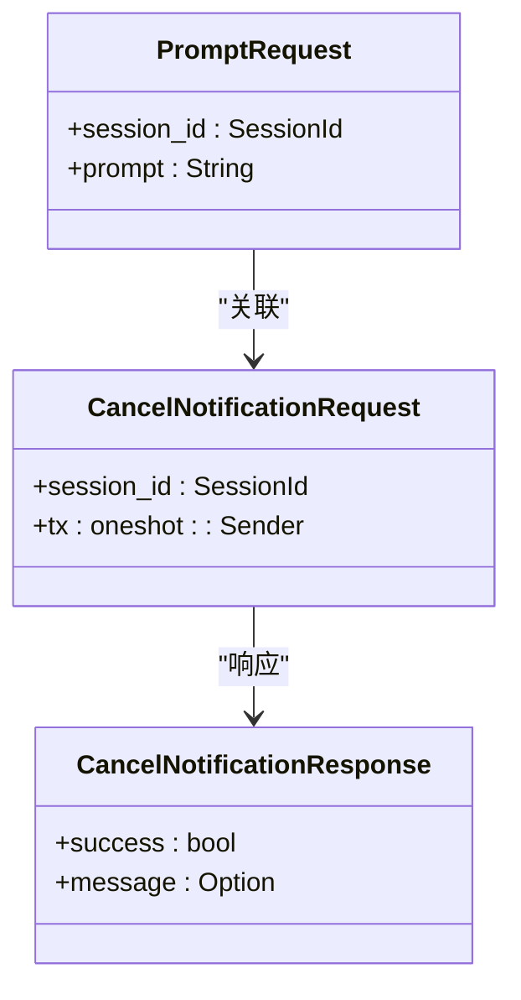
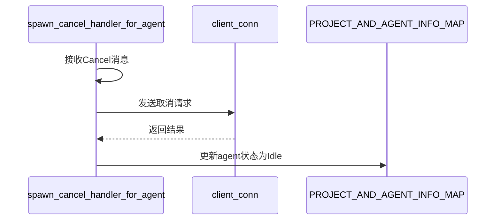
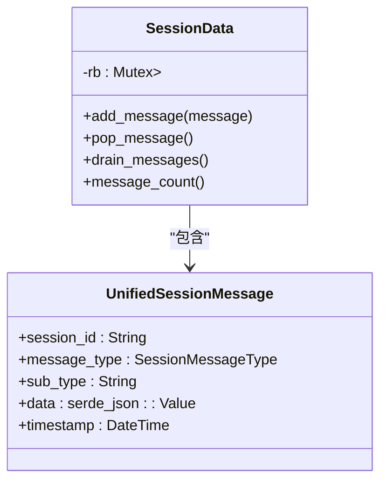
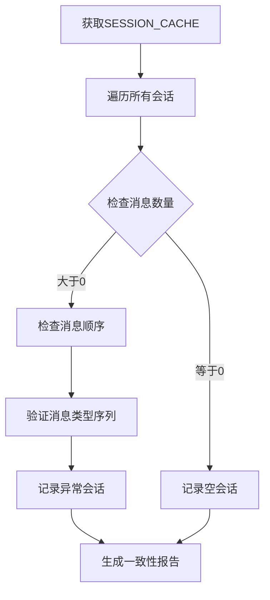
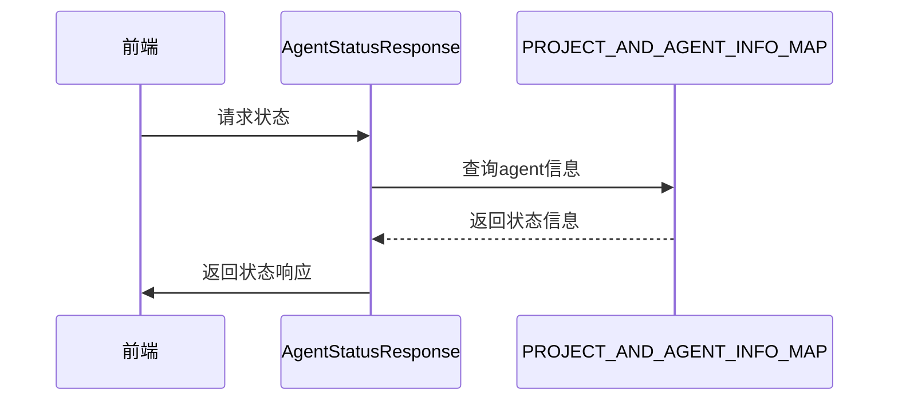
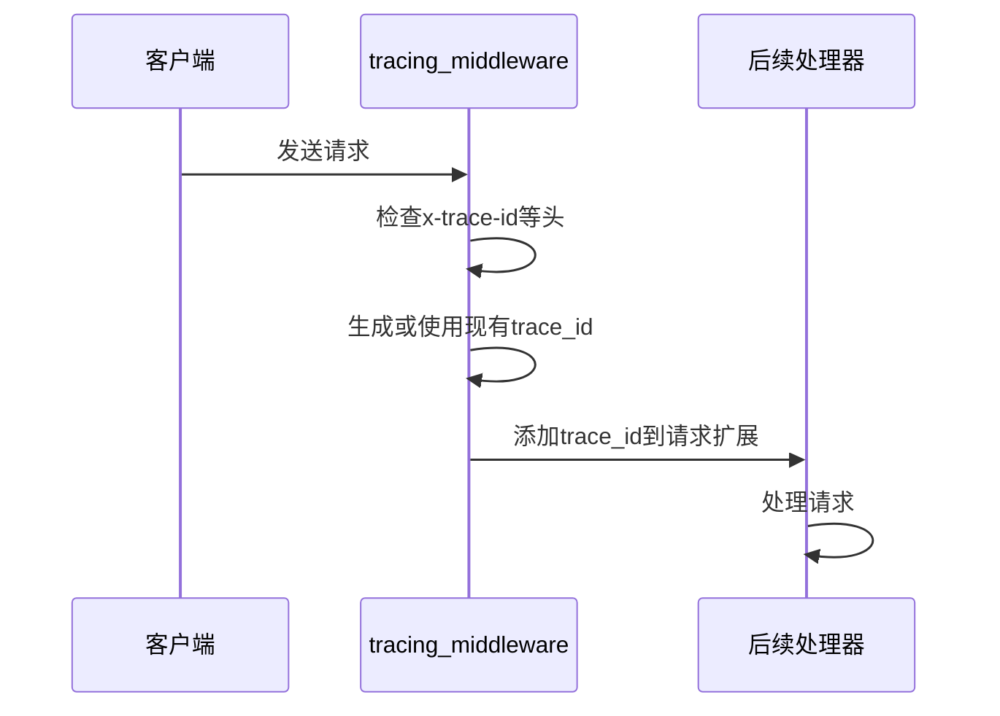
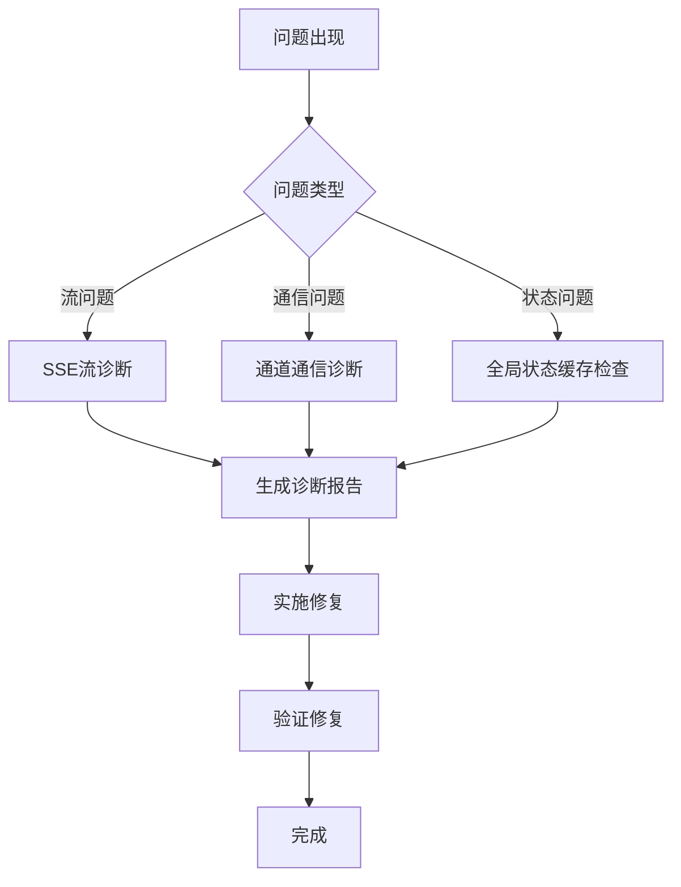

# 诊断工具与技巧

<cite>
**本文档引用的文件**
- [agent_session_notification.rs](file://crates/rcoder/src/handler/agent_session_notification.rs)
- [session_cache.rs](file://crates/rcoder/src/service/session_cache.rs)
- [channel_utils.rs](file://crates/rcoder/src/proxy_agent/channel_utils.rs)
- [tracing_middleware.rs](file://crates/rcoder/src/middleware/tracing_middleware.rs)
- [types.rs](file://crates/acp_adapter/src/types.rs)
</cite>

## 目录
1. [引言](#引言)
2. [SSE流调试方法](#sse流调试方法)
3. [通道通信诊断](#通道通信诊断)
4. [全局状态缓存检查](#全局状态缓存检查)
5. [可复用的调试辅助函数](#可复用的调试辅助函数)
6. [综合诊断策略](#综合诊断策略)

## 引言
本文档汇总了针对SSE流、通道通信和全局状态缓存等复杂场景的专用诊断方法。通过分析代码库中的实现细节，展示如何在各种复杂场景下进行有效的调试和诊断，帮助开发者快速构建自定义诊断能力。

## SSE流调试方法

### SSE连接建立与心跳机制
在SSE连接建立时，系统会记录连接信息并启动心跳机制。心跳消息每30秒发送一次，确保连接的活跃性。

**图示来源**
- [agent_session_notification.rs](file://crates/rcoder/src/handler/agent_session_notification.rs#L355-L437)

### 注入调试事件观察进度
通过在SSE响应流中注入调试事件，可以实时观察进度更新逻辑。系统支持多种消息类型，包括会话开始、结束、心跳和各种更新事件。

**图示来源**
- [agent_session_notification.rs](file://crates/rcoder/src/handler/agent_session_notification.rs#L404-L437)

**本节来源**
- [agent_session_notification.rs](file://crates/rcoder/src/handler/agent_session_notification.rs#L355-L437)

## 通道通信诊断

### mpsc通道的背压检测
通过分析通道的使用情况，可以检测背压或死锁情况。系统使用无界接收器来处理取消和提示请求，确保消息不会丢失。

**图示来源**
- [channel_utils.rs](file://crates/rcoder/src/proxy_agent/channel_utils.rs#L0-L153)

### 通道处理器的生命周期管理
通道处理器在接收到消息后会进行相应的处理，并在处理完成后更新agent状态。通过分析处理器的生命周期，可以诊断潜在的死锁问题。

**图示来源**
- [channel_utils.rs](file://crates/rcoder/src/proxy_agent/channel_utils.rs#L0-L153)

**本节来源**
- [channel_utils.rs](file://crates/rcoder/src/proxy_agent/channel_utils.rs#L0-L153)

## 全局状态缓存检查

### DashMap的迭代功能
通过DashMap的迭代功能，可以检查会话缓存的一致性。系统使用LazyLock初始化全局DashMap，按session_id分组缓存统一会话消息。

**图示来源**
- [session_cache.rs](file://crates/rcoder/src/service/session_cache.rs#L0-L96)

### 缓存一致性验证
通过遍历全局缓存，可以验证各个会话的状态一致性。系统提供了便捷函数来添加和查询缓存中的消息。

**图示来源**
- [session_cache.rs](file://crates/rcoder/src/service/session_cache.rs#L0-L96)

**本节来源**
- [session_cache.rs](file://crates/rcoder/src/service/session_cache.rs#L0-L96)

## 可复用的调试辅助函数

### 状态快照导出
提供状态快照导出功能，帮助开发者快速了解系统当前状态。通过调用相关函数，可以获取agent的状态信息。

**图示来源**
- [agent_model.rs](file://crates/rcoder/src/model/agent_model.rs#L286-L313)

### 请求上下文追踪ID注入
通过在请求头中注入追踪ID，可以实现请求的全链路追踪。系统支持从多种标准头中提取追踪ID。

**图示来源**
- [tracing_middleware.rs](file://crates/rcoder/src/middleware/tracing_middleware.rs#L0-L178)

**本节来源**
- [tracing_middleware.rs](file://crates/rcoder/src/middleware/tracing_middleware.rs#L0-L178)

## 综合诊断策略

### 多维度诊断方法整合
将SSE流、通道通信和全局状态缓存的诊断方法整合，形成完整的诊断策略。通过综合运用各种工具，可以快速定位和解决问题。

**本节来源**
- [agent_session_notification.rs](file://crates/rcoder/src/handler/agent_session_notification.rs#L355-L437)
- [channel_utils.rs](file://crates/rcoder/src/proxy_agent/channel_utils.rs#L0-L153)
- [session_cache.rs](file://crates/rcoder/src/service/session_cache.rs#L0-L96)