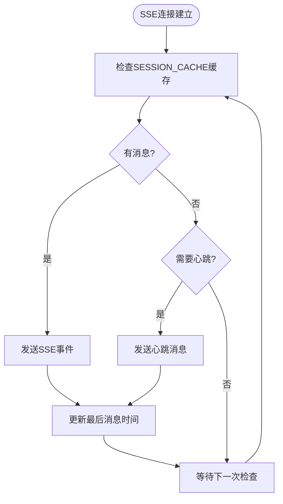

# 调试技巧与工具使用

<cite>
**本文档引用的文件**
- [main.rs](file://crates/rcoder/src/main.rs)
- [tracing_middleware.rs](file://crates/rcoder/src/middleware/tracing_middleware.rs)
- [session_cache.rs](file://crates/rcoder/src/service/session_cache.rs)
- [agent_service.rs](file://crates/rcoder/src/proxy_agent/agent_service.rs)
- [channel_utils.rs](file://crates/rcoder/src/proxy_agent/channel_utils.rs)
- [claude_code_agent.rs](file://crates/rcoder/src/proxy_agent/claude_code_agent.rs)
- [codex_agent.rs](file://crates/rcoder/src/proxy_agent/codex_agent.rs)
- [agent_stop_handle.rs](file://crates/rcoder/src/proxy_agent/agent_stop_handle.rs)
- [chat_handler.rs](file://crates/rcoder/src/handler/chat_handler.rs)
- [agent_session_notification.rs](file://crates/rcoder/src/handler/agent_session_notification.rs)
- [config.yml](file://config.yml)
</cite>

## 目录
1. [日志与追踪配置](#日志与追踪配置)
2. [异步运行时调试](#异步运行时调试)
3. [调试模式启用](#调试模式启用)
4. [复杂场景诊断](#复杂场景诊断)
5. [诊断技巧总结](#诊断技巧总结)

## 日志与追踪配置

本项目通过 `tracing` 和 `OpenTelemetry` 实现了完整的分布式追踪能力。在 `main.rs` 文件中，`init_telemetry` 函数初始化了遥测系统，配置了日志输出到文件和控制台，并设置了全局文本传播器用于 `trace context` 传播。日志文件按天滚动保存在 `logs` 目录中，采用 JSON 格式便于后续分析。

追踪中间件 `tracing_middleware_handler` 在每次 HTTP 请求处理时生成或提取 `trace_id`，并创建包含 `trace_id` 信息的请求 `span`。该中间件记录了请求开始和完成的信息，便于追踪请求的完整生命周期。

环境变量 `RUST_LOG` 用于控制日志级别，其默认值在 `init_telemetry` 函数中设置为 `"rcoder=debug,tower_http=debug,axum_tracing_opentelemetry=info"`。开发者可以通过设置 `RUST_LOG` 环境变量来调整日志输出的详细程度，例如设置为 `rcoder=trace` 以获取最详细的日志信息。

**Section sources**
- [main.rs](file://crates/rcoder/src/main.rs#L167-L219)
- [tracing_middleware.rs](file://crates/rcoder/src/middleware/tracing_middleware.rs#L70-L129)

## 异步运行时调试

本项目使用 `Tokio` 作为异步运行时，在 `main.rs` 中通过 `#[tokio::main]` 宏启动。对于异步代码的调试，推荐使用 `rust-analyzer` 或 `gdb/lldb` 进行调试会话。由于异步任务的执行是基于事件循环的，设置断点时需要注意断点可能在不同的任务上下文中被触发。

在 `agent_service.rs` 中，`AcpAgentService` trait 定义了启动和管理 ACP 代理服务的统一接口。`Claude` 和 `Codex` 两种代理服务的启动都涉及复杂的异步操作，包括通道的创建、子进程的启动和连接的建立。调试这些异步流程时，建议在关键的 `await` 点设置断点，以观察异步任务的执行顺序和状态变化。

**Section sources**
- [main.rs](file://crates/rcoder/src/main.rs#L0-L220)
- [agent_service.rs](file://crates/rcoder/src/proxy_agent/agent_service.rs#L12-L71)

## 调试模式启用

调试模式可以通过配置文件或命令行参数开启。在 `config.yml` 配置文件中，可以设置 `proxy_config` 相关参数来启用 Pingora 反向代理服务，并配置健康检查等调试相关的功能。此外，通过命令行参数可以覆盖配置文件中的设置，提供更灵活的调试配置。

在 `chat_handler.rs` 中，`handle_chat` 函数处理聊天请求时，会根据请求中的 `model_provider` 配置自动选择 `agent` 类型，并生成详细的日志信息。通过在 `RUST_LOG` 环境变量中设置适当的日志级别，可以输出详细的请求处理流程和代理交互日志，帮助开发者理解系统的运行状态。

**Section sources**
- [config.yml](file://config.yml)
- [chat_handler.rs](file://crates/rcoder/src/handler/chat_handler.rs#L0-L231)

## 复杂场景诊断

### SSE流诊断

SSE（Server-Sent Events）流用于实时推送 AI 代理执行进度和状态更新。在 `agent_session_notification.rs` 中，`agent_session_notification` 函数建立了 SSE 连接，通过 `SESSION_CACHE` 全局缓存获取并推送 `UnifiedSessionMessage` 消息。该函数实现了心跳机制，每 30 秒发送一次心跳消息以保持连接活跃。

诊断 SSE 流问题时，可以通过检查 `SESSION_CACHE` 缓存中的消息数量和类型来确认消息是否正确生成和推送。同时，可以查看日志中关于 SSE 连接建立、消息发送和心跳的记录，以定位连接中断或消息丢失的问题。

**Diagram sources**
- [agent_session_notification.rs](file://crates/rcoder/src/handler/agent_session_notification.rs#L0-L438)
- [session_cache.rs](file://crates/rcoder/src/service/session_cache.rs#L11-L12)

**Section sources**
- [agent_session_notification.rs](file://crates/rcoder/src/handler/agent_session_notification.rs#L0-L438)
- [session_cache.rs](file://crates/rcoder/src/service/session_cache.rs#L0-L96)

### 通道通信诊断

通道通信在本项目中广泛用于异步任务间的消息传递。在 `channel_utils.rs` 中，`spawn_cancel_handler_for_agent` 和 `spawn_prompt_handler_for_agent` 函数分别创建了处理取消通知和提示消息的独立任务。这些任务通过 `mpsc::UnboundedReceiver` 接收消息，并在处理完成后更新 `PROJECT_AND_AGENT_INFO_MAP` 中的 `agent` 状态。

诊断通道通信问题时，可以通过在消息处理的开始和结束处添加日志来观察消息的流动情况。同时，可以检查 `PROJECT_AND_AGENT_INFO_MAP` 中 `agent` 状态的变化，以确认消息处理逻辑是否按预期执行。

**Section sources**
- [channel_utils.rs](file://crates/rcoder/src/proxy_agent/channel_utils.rs#L0-L153)
- [agent_service.rs](file://crates/rcoder/src/proxy_agent/agent_service.rs#L29-L30)

### 状态缓存诊断

状态缓存用于存储和管理 `agent` 的会话信息。在 `session_cache.rs` 中，`SESSION_CACHE` 是一个全局的 `DashMap`，按 `session_id` 分组缓存 `UnifiedSessionMessage` 消息。`push_session_update` 函数负责将 `SessionNotify` 消息转换为 `UnifiedSessionMessage` 并添加到缓存中。

诊断状态缓存问题时，可以通过调用 `drain_messages` 或 `pop_message` 函数来检查缓存中的消息内容。同时，可以查看日志中关于消息添加和缓存数量的记录，以确认缓存操作是否正常。

**Section sources**
- [session_cache.rs](file://crates/rcoder/src/service/session_cache.rs#L0-L96)

## 诊断技巧总结

针对本项目的复杂场景，推荐以下诊断技巧：

1. **注入日志观察状态变化**：在关键的异步操作和状态更新点添加详细的日志记录，使用 `tracing::info!` 或 `tracing::debug!` 输出上下文信息。
2. **使用 `tokio-console` 监控任务调度**：`tokio-console` 是一个强大的工具，可以实时监控 `Tokio` 运行时中的任务调度情况，帮助识别性能瓶颈和死锁问题。
3. **结合 `trace_id` 进行链路追踪**：利用 `tracing_middleware` 生成的 `trace_id`，可以在日志中追踪单个请求的完整处理流程，从 HTTP 请求到 `agent` 执行的各个环节。
4. **模拟请求进行端到端测试**：使用 `test_proxy.sh`、`test_proxy_api.sh` 和 `test_query_params.sh` 脚本模拟各种请求场景，验证系统的整体行为和错误处理能力。

通过综合运用这些诊断技巧，开发者可以快速定位和解决本项目中的各种问题，确保系统的稳定性和可靠性。

**Section sources**
- [main.rs](file://crates/rcoder/src/main.rs#L167-L219)
- [tracing_middleware.rs](file://crates/rcoder/src/middleware/tracing_middleware.rs#L70-L129)
- [session_cache.rs](file://crates/rcoder/src/service/session_cache.rs#L0-L96)
- [agent_service.rs](file://crates/rcoder/src/proxy_agent/agent_service.rs#L12-L71)
- [channel_utils.rs](file://crates/rcoder/src/proxy_agent/channel_utils.rs#L0-L153)
- [agent_session_notification.rs](file://crates/rcoder/src/handler/agent_session_notification.rs#L0-L438)