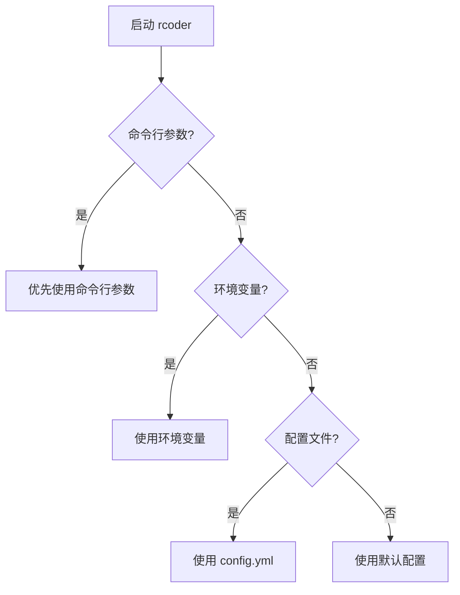
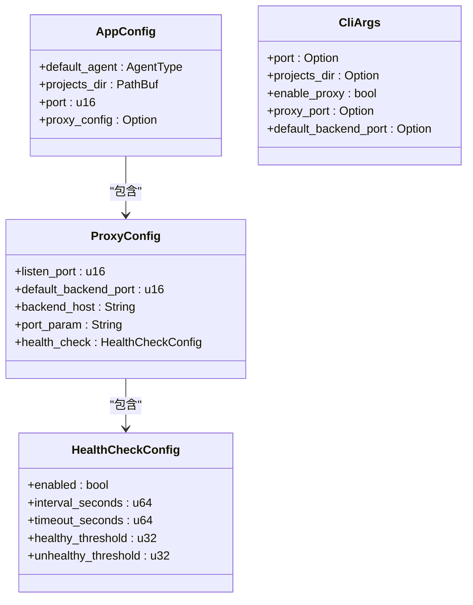

# 调试模式配置

<cite>
**Referenced Files in This Document**   
- [config.yml](file://config.yml)
- [main.rs](file://crates/rcoder/src/main.rs)
- [config.rs](file://crates/rcoder/src/config.rs)
</cite>

## 目录
1. [简介](#简介)
2. [调试模式启用方式](#调试模式启用方式)
3. [配置项详解](#配置项详解)
4. [日志级别与输出格式](#日志级别与输出格式)
5. [调试模式输出示例](#调试模式输出示例)
6. [生产环境调试日志安全指南](#生产环境调试日志安全指南)
7. [结论](#结论)

## 简介
本文档系统介绍了如何在 `rcoder` 系统中启用和配置调试模式。通过命令行参数、环境变量或 `config.yml` 配置文件，开发者可以激活详细的运行时输出，以监控系统行为、诊断问题并理解请求的生命周期。文档详细说明了各配置项的作用、优先级关系以及在生产环境中安全使用调试日志的最佳实践。

**Section sources**
- [main.rs](file://crates/rcoder/src/main.rs#L1-L220)
- [config.rs](file://crates/rcoder/src/config.rs#L1-L266)

## 调试模式启用方式
`rcoder` 系统支持通过三种方式启用调试模式，这些方式的优先级从高到低依次为：命令行参数、环境变量、配置文件。

### 命令行参数
在启动应用时，可以通过命令行参数直接覆盖配置。虽然 `CliArgs` 结构体中未显式包含 `debug` 或 `log_level` 参数，但其设计模式允许通过环境变量或配置文件来控制日志级别，而命令行参数主要用于覆盖端口、目录和代理设置等核心配置。



**Diagram sources**
- [config.rs](file://crates/rcoder/src/config.rs#L10-L35)
- [config.rs](file://crates/rcoder/src/config.rs#L106-L188)

### 环境变量
环境变量是控制调试模式的推荐方式，特别是对于日志级别的设置。系统通过 `tracing_subscriber::EnvFilter` 来读取环境变量，从而动态调整日志输出的详细程度。

### 配置文件
`config.yml` 文件提供了系统的默认配置。虽然该文件本身不直接包含日志级别设置，但它定义了服务端口、项目目录和代理配置等基础设置，是调试模式配置的起点。

```yaml
# rcoder 配置文件
# 该文件在首次启动时自动生成

# 默认使用的 AI 代理类型 (Codex/Claude/Proxy)
default_agent: Codex

# 项目工作目录
projects_dir: ./project_workspace

# 主服务端口
port: 3000

# Pingora 反向代理配置
proxy_config:
  # 代理服务监听端口 (用于接收外部请求)
  listen_port: 8080
  # 默认后端服务端口 (当请求未指定端口时使用)
  default_backend_port: 3000
  # 后端服务主机地址
  backend_host: "127.0.0.1"
  # URL 中端口参数的名称 (用于从路径中提取端口号)
  port_param: "port"
  # 健康检查配置
  health_check:
    enabled: true
    interval_seconds: 5
    timeout_seconds: 1
    healthy_threshold: 2
    unhealthy_threshold: 3
```

**Section sources**
- [config.yml](file://config.yml#L0-L29)
- [config.rs](file://crates/rcoder/src/config.rs#L37-L48)

## 配置项详解
`rcoder` 系统的配置项遵循明确的优先级规则，确保了配置的灵活性和可覆盖性。

### 优先级关系
配置项的优先级顺序为：**命令行参数 > 环境变量 > 配置文件 > 默认配置**。这一逻辑在 `load_config_with_args` 函数中实现，确保了最高优先级的配置能够覆盖低优先级的设置。

### 核心配置项
- **`port`**: 服务监听的端口号。
- **`projects_dir`**: 项目工作目录的路径。
- **`default_agent`**: 默认使用的 AI 代理类型。
- **`proxy_config`**: 反向代理的详细配置，包括监听端口、后端主机等。

### 调试相关配置
虽然 `config.yml` 文件中没有直接的 `log_level` 或 `debug_response` 项，但系统通过 `tracing` 库和 `EnvFilter` 实现了动态日志控制。`init_telemetry` 函数初始化了日志系统，并设置了默认的环境过滤器。



**Diagram sources**
- [config.rs](file://crates/rcoder/src/config.rs#L37-L48)
- [config.rs](file://crates/rcoder/src/config.rs#L50-L57)
- [config.rs](file://crates/rcoder/src/config.rs#L10-L35)

## 日志级别与输出格式
`rcoder` 使用 `tracing` 库进行日志记录，支持多种日志级别（如 `debug`, `info`, `warn`, `error`）。

### 日志初始化
`init_telemetry` 函数负责初始化日志系统。它创建 `logs` 目录，并设置按天滚动的文件追加器。日志同时输出到文件和控制台，文件日志采用 JSON 格式，便于后续分析。

### 环境过滤器
系统使用 `tracing_subscriber::EnvFilter` 来控制日志输出。默认的过滤器设置为 `"rcoder=debug,tower_http=debug,axum_tracing_opentelemetry=info"`，这意味着 `rcoder` 和 `tower_http` 模块的日志级别为 `debug`，而 `axum_tracing_opentelemetry` 模块的日志级别为 `info`。

### 输出格式
- **控制台日志**: 简洁格式，不包含目标和 ANSI 颜色。
- **文件日志**: JSON 格式，包含时间戳、日志级别、目标、线程 ID 和线程名称，便于机器解析。

**Section sources**
- [main.rs](file://crates/rcoder/src/main.rs#L175-L219)

## 调试模式输出示例
当调试模式启用时，系统会输出详细的运行时信息。以下是一个典型的启动日志示例：

```
[2023-10-01T12:00:00Z INFO  rcoder] Starting rcoder - AI-powered development platform
[2023-10-01T12:00:00Z INFO  rcoder] 成功从 config.yml 加载配置
[2023-10-01T12:00:00Z INFO  rcoder] 创建日志目录: "logs"
[2023-10-01T12:00:00Z INFO  rcoder] ✓ Tracing 初始化成功，支持 trace_id 生成和传播
[2023-10-01T12:00:00Z INFO  rcoder] ✓ 日志文件将按天滚动保存在 "logs" 目录
[2023-10-01T12:00:00Z INFO  rcoder] Projects directory: "./project_workspace"
[2023-10-01T12:00:00Z INFO  rcoder] Server starting on port 3000
```

这些日志清晰地展示了应用的启动流程，从配置加载到服务启动的每一个阶段。

## 生产环境调试日志安全指南
在生产环境中临时开启调试日志需要格外谨慎，以避免敏感信息泄露和性能下降。

### 安全措施
1. **最小化日志级别**: 仅在必要时将日志级别设置为 `debug`，并在问题解决后立即恢复为 `info` 或更高级别。
2. **避免记录敏感信息**: 确保日志中不包含 API 密钥、用户凭证或其他敏感数据。
3. **使用环境变量控制**: 通过设置 `RUST_LOG` 环境变量来动态调整日志级别，而无需重启服务。
4. **日志文件权限**: 确保日志文件的权限设置正确，只有授权用户才能访问。
5. **日志轮转和归档**: 启用日志轮转，并定期归档旧日志，以防止磁盘空间耗尽。

### 临时开启调试
要临时开启调试日志，可以在启动命令中设置环境变量：
```bash
RUST_LOG="rcoder=debug" ./rcoder --port 3000
```
这将仅对 `rcoder` 模块启用 `debug` 级别日志，而不会影响其他模块。

## 结论
`rcoder` 系统提供了灵活且强大的调试模式配置机制。通过理解命令行参数、环境变量和配置文件的优先级关系，开发者可以有效地监控和诊断系统行为。在生产环境中，应遵循安全指南，谨慎使用调试日志，以确保系统的稳定性和数据的安全性。