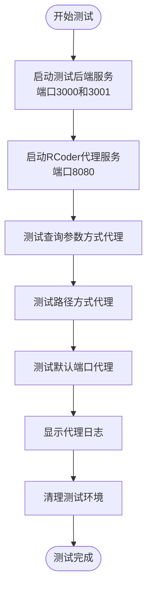
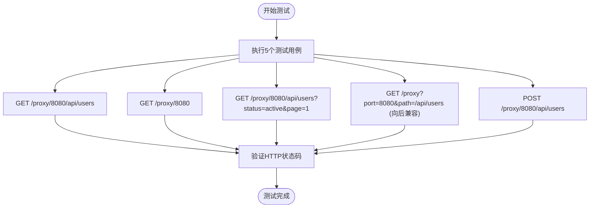
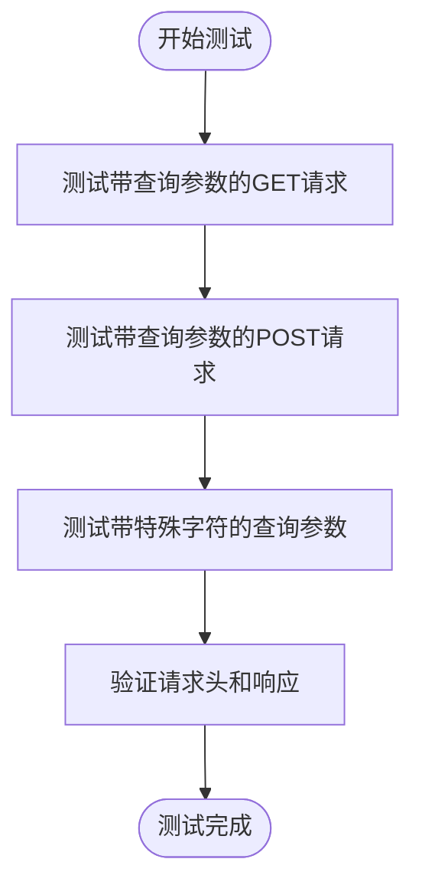
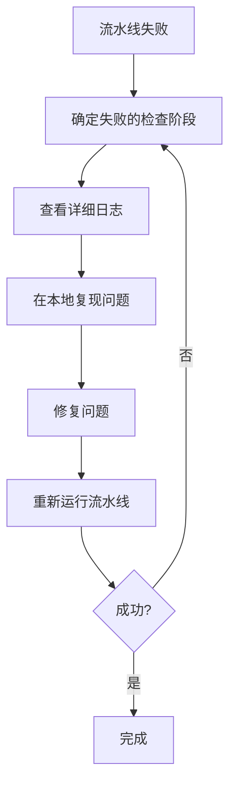

# CI/CD流水线验证

<cite>
**本文档引用的文件**   
- [Cargo.toml](file://Cargo.toml)
- [test_proxy.sh](file://test_proxy.sh)
- [test_proxy_api.sh](file://test_proxy_api.sh)
- [test_query_params.sh](file://test_query_params.sh)
- [README.md](file://README.md)
- [config.yml](file://config.yml)
</cite>

## 目录
1. [介绍](#介绍)
2. [CI/CD检查阶段](#cicd检查阶段)
3. [测试脚本详解](#测试脚本详解)
4. [流水线报告解读](#流水线报告解读)
5. [常见问题与解决方案](#常见问题与解决方案)
6. [最佳实践](#最佳实践)

## 介绍
本文档全面介绍RCoder项目的CI/CD流水线验证流程，涵盖代码质量检查、构建验证、测试执行和安全扫描等关键阶段。文档详细说明了各检查阶段的触发条件和通过标准，帮助贡献者理解如何在本地复现CI环境并确保代码质量。

**Section sources**
- [README.md](file://README.md#L439-L526)

## CI/CD检查阶段

### 代码格式化（rustfmt）
使用`cargo fmt`对Rust代码进行格式化检查，确保代码风格统一。

- **触发条件**：每次提交代码时
- **通过标准**：所有代码文件符合Rust官方格式规范
- **本地执行命令**：
```bash
cargo fmt --check
```

### 静态分析（clippy）
使用`cargo clippy`进行代码静态分析，发现潜在的bug、性能问题和代码异味。

- **触发条件**：每次提交代码时
- **通过标准**：无clippy警告或错误
- **本地执行命令**：
```bash
cargo clippy -- -D warnings
```

### 构建验证
验证项目能够成功构建，包括所有crates和依赖项。

- **触发条件**：每次提交代码时
- **通过标准**：`cargo build --workspace`成功完成
- **本地执行命令**：
```bash
cargo build --workspace
```

### 单元与集成测试
运行所有单元测试和集成测试，确保代码功能正确。

- **触发条件**：每次提交代码时
- **通过标准**：所有测试用例通过
- **本地执行命令**：
```bash
cargo test
```

### 安全漏洞扫描
检查依赖项是否存在已知的安全漏洞。

- **触发条件**：每次提交代码时
- **通过标准**：无高危安全漏洞
- **本地执行命令**：
```bash
cargo audit
```

**Section sources**
- [README.md](file://README.md#L439-L526)
- [Cargo.toml](file://Cargo.toml#L0-L173)

## 测试脚本详解

### test_proxy.sh 脚本
该脚本用于测试RCoder代理功能，包括查询参数方式和路径方式的代理。



**脚本功能**：
- 启动两个Python HTTP服务器作为后端服务
- 启动RCoder代理服务
- 测试多种代理方式（查询参数、路径、默认端口）
- 验证代理功能是否正常工作
- 清理测试环境

**运行方式**：
```bash
./test_proxy.sh
```

**Diagram sources**
- [test_proxy.sh](file://test_proxy.sh#L0-L89)

### test_proxy_api.sh 脚本
该脚本专门测试新的路径参数代理接口。



**脚本功能**：
- 测试路径参数方式的GET和POST请求
- 测试向后兼容的查询参数方式
- 验证各种请求场景下的代理功能

**运行方式**：
```bash
./test_proxy_api.sh
```

**Diagram sources**
- [test_proxy_api.sh](file://test_proxy_api.sh#L0-L50)

### test_query_params.sh 脚本
该脚本专注于测试查询参数的传递功能。



**脚本功能**：
- 测试GET请求中查询参数的传递
- 测试POST请求中查询参数的传递
- 测试包含特殊字符的查询参数

**运行方式**：
```bash
./test_query_params.sh
```

**Diagram sources**
- [test_query_params.sh](file://test_query_params.sh#L0-L28)

**Section sources**
- [test_proxy.sh](file://test_proxy.sh#L0-L89)
- [test_proxy_api.sh](file://test_proxy_api.sh#L0-L50)
- [test_query_params.sh](file://test_query_params.sh#L0-L28)

## 流水线报告解读

### 成功报告特征
- 所有检查阶段显示绿色通过状态
- 构建日志中无错误或警告信息
- 测试用例全部通过
- 安全扫描无高危漏洞

### 失败原因定位
当流水线失败时，按以下步骤定位问题：

1. **查看失败阶段**：确定是哪个检查阶段失败
2. **检查日志输出**：查看详细的错误日志
3. **复现问题**：在本地运行相应的检查命令



**常见失败场景**：
- **rustfmt失败**：代码格式不符合规范
- **clippy失败**：存在代码警告或潜在问题
- **构建失败**：代码编译错误或依赖问题
- **测试失败**：测试用例未通过
- **安全扫描失败**：依赖项存在安全漏洞

**Diagram sources**
- [README.md](file://README.md#L439-L526)

## 常见问题与解决方案

### 代码格式问题
**问题**：`cargo fmt --check`报告格式错误
**解决方案**：
```bash
# 自动格式化代码
cargo fmt
```

### Clippy警告
**问题**：`cargo clippy`报告警告
**解决方案**：
- 仔细阅读警告信息
- 根据建议修改代码
- 如果警告是误报，可以使用`#[allow(clippy::...)]`注解

### 构建失败
**问题**：`cargo build`失败
**解决方案**：
- 检查依赖项是否正确
- 确认代码语法正确
- 清理构建缓存后重试：
```bash
cargo clean
cargo build
```

### 测试失败
**问题**：`cargo test`失败
**解决方案**：
- 运行特定测试用例定位问题：
```bash
cargo test test_name
```
- 使用`-- --nocapture`参数查看测试输出：
```bash
cargo test -- --nocapture
```

### 代理测试失败
**问题**：`test_proxy.sh`测试失败
**解决方案**：
- 确保端口未被占用
- 检查RCoder二进制文件是否存在
- 确认Python HTTP服务器能够正常启动

**Section sources**
- [README.md](file://README.md#L439-L526)
- [test_proxy.sh](file://test_proxy.sh#L0-L89)

## 最佳实践

### 本地测试建议
在提交Pull Request前，建议在本地运行完整的测试套件：

```bash
# 运行所有检查
cargo fmt --check && \
cargo clippy -- -D warnings && \
cargo build --workspace && \
cargo test && \
cargo audit
```

### 提高审查效率
遵循以下建议可以显著提高代码审查效率：

1. **确保本地测试通过**：在提交前确保所有本地测试通过
2. **保持提交原子性**：每个提交只包含一个逻辑变更
3. **编写清晰的提交信息**：说明变更的目的和影响
4. **及时更新分支**：定期同步主分支的最新更改

### CI/CD优化
- **缓存依赖项**：减少构建时间
- **并行执行测试**：提高测试效率
- **分阶段执行**：先运行快速检查，再运行耗时测试

**Section sources**
- [README.md](file://README.md#L439-L526)
- [Cargo.toml](file://Cargo.toml#L0-L173)