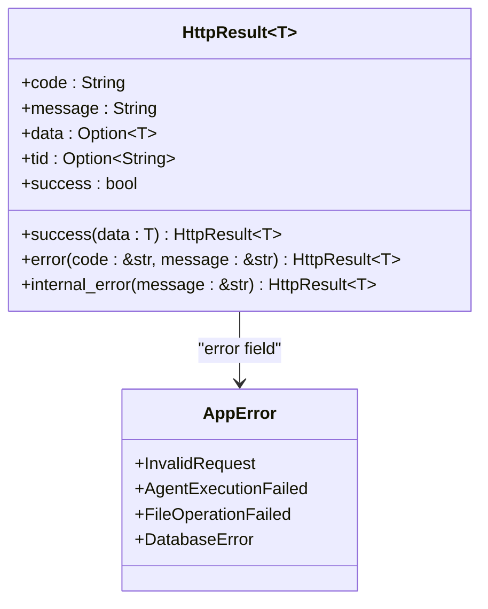
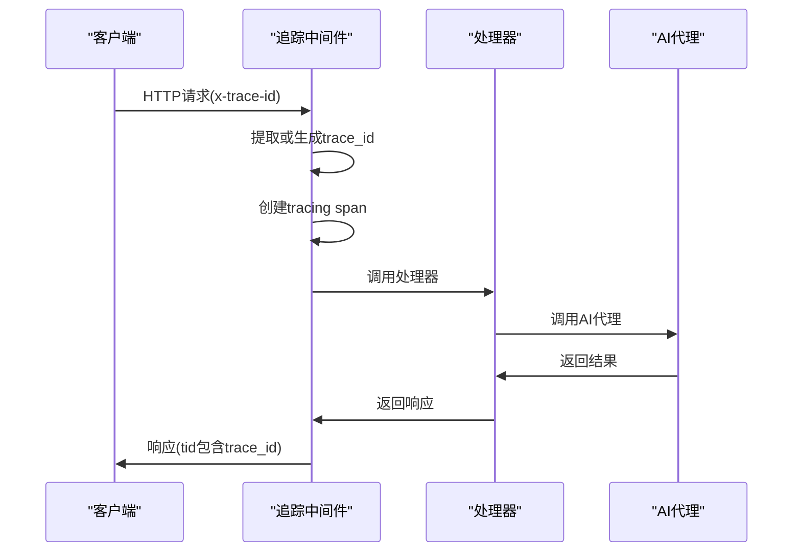
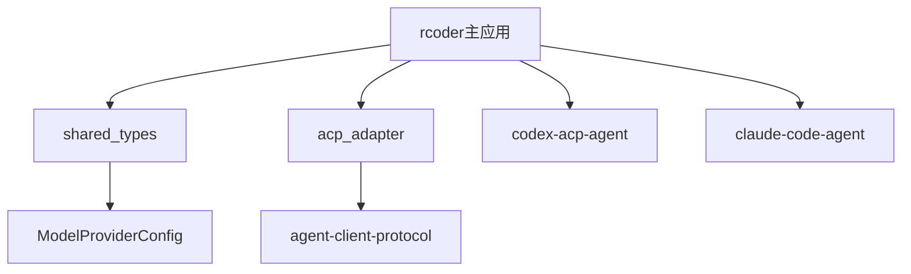

# 代码审查标准

<cite>
**本文档引用的文件**   
- [CLAUDE.md](file://CLAUDE.md)
- [main.rs](file://crates/rcoder/src/main.rs)
- [http_result.rs](file://crates/rcoder/src/model/http_result.rs)
- [tracing_middleware.rs](file://crates/rcoder/src/middleware/tracing_middleware.rs)
- [chat_handler.rs](file://crates/rcoder/src/handler/chat_handler.rs)
- [agent_service.rs](file://crates/rcoder/src/proxy_agent/agent_service.rs)
- [codex_agent.rs](file://crates/rcoder/src/proxy_agent/codex_agent.rs)
- [claude_code_agent.rs](file://crates/rcoder/src/proxy_agent/claude_code_agent.rs)
</cite>

## 目录

1. [架构一致性审查](#架构一致性审查)  
2. [性能影响评估](#性能影响评估)  
3. [错误处理完备性](#错误处理完备性)  
4. [日志与追踪集成](#日志与追踪集成)  
5. [API文档维护](#api文档维护)  
6. [跨crate依赖审查](#跨crate依赖审查)  
7. [可读性与代码风格](#可读性与代码风格)  
8. [测试覆盖验证](#测试覆盖验证)  
9. [审查文化指导](#审查文化指导)

## 架构一致性审查

检查代码是否符合模块化设计原则，确保各组件职责清晰、低耦合。

- 确认新功能是否正确放置在对应模块中（如处理器在 `handler`，代理逻辑在 `proxy_agent`）
- 验证是否遵循现有架构模式（如 MPMC 模型、LocalSet 使用）
- 检查是否合理使用 `DashMap` 替代 `Arc<RwLock<HashMap>>` 以提升并发性能
- 确保 `AgentSideConnection` 和 `ClientSideConnection` 在 `LocalSet` 中使用，因其未实现 `Send` trait

**Section sources**  
- [main.rs](file://crates/rcoder/src/main.rs#L1-L220)
- [codex_agent.rs](file://crates/rcoder/src/proxy_agent/codex_agent.rs#L1-L247)

## 性能影响评估

评估代码变更对系统性能的影响，重点关注异步处理效率和资源占用。

- 检查是否在非必要情况下阻塞异步运行时
- 验证长时间运行的任务是否正确使用 `spawn_local` 和 `LocalSet`
- 确认文件 I/O 操作是否使用 `tokio::fs` 而非同步操作
- 评估内存使用情况，避免不必要的数据复制
- 检查通道使用是否合理，避免过小的缓冲区导致性能瓶颈

**Section sources**  
- [main.rs](file://crates/rcoder/src/main.rs#L1-L220)
- [codex_agent.rs](file://crates/rcoder/src/proxy_agent/codex_agent.rs#L1-L247)

## 错误处理完备性

确保错误处理机制健全，使用适当的类型并覆盖边界情况。

- 验证是否统一使用 `HttpResult<T>` 作为 API 响应格式
- 检查是否正确传播错误（使用 `anyhow::Result`）
- 确认是否处理了所有可能的错误场景，包括网络超时、文件不存在等
- 验证 `HttpResult` 的 `success` 字段是否正确计算（基于 `code` 是否为 "0000"）
- 检查是否为自定义错误类型实现了适当的 `From` trait

**Diagram sources**  
- [http_result.rs](file://crates/rcoder/src/model/http_result.rs#L1-L102)

**Section sources**  
- [http_result.rs](file://crates/rcoder/src/model/http_result.rs#L1-L102)
- [chat_handler.rs](file://crates/rcoder/src/handler/chat_handler.rs#L1-L231)

## 日志与追踪集成

验证日志记录和分布式追踪的正确集成。

- 检查是否在关键路径上添加了适当的 `tracing` 日志
- 验证是否使用 `instrument` 宏为异步函数添加追踪上下文
- 确认 `tracing_middleware` 是否正确注入 `trace_id`
- 检查 `trace_id` 是否从请求头中正确提取（支持 `x-trace-id`, `x-request-id` 等）
- 验证 OpenTelemetry context 是否正确传播，确保 `tid` 字段填充

**Diagram sources**  
- [tracing_middleware.rs](file://crates/rcoder/src/middleware/tracing_middleware.rs#L1-L178)
- [http_result.rs](file://crates/rcoder/src/model/http_result.rs#L1-L102)

**Section sources**  
- [tracing_middleware.rs](file://crates/rcoder/src/middleware/tracing_middleware.rs#L1-L178)
- [http_result.rs](file://crates/rcoder/src/model/http_result.rs#L1-L102)

## API文档维护

确保 API 文档与代码实现保持同步。

- 验证 `utoipa` 注解是否准确描述请求/响应结构
- 检查是否为所有 API 端点添加了 `#[utoipa::path]` 宏
- 确认示例值（`example`）是否反映实际用例
- 验证参数描述（`description`）是否清晰准确
- 检查是否为所有枚举和复杂类型实现了 `ToSchema`

**Section sources**  
- [chat_handler.rs](file://crates/rcoder/src/handler/chat_handler.rs#L1-L231)

## 跨crate依赖审查

评估跨 crate 依赖的合理性，确保符合设计契约。

- 检查对 `shared_types` 的引用是否仅限于共享数据模型
- 验证 `acp_adapter` 的使用是否符合 ACP 协议规范
- 确认 `rcoder` 主 crate 是否正确封装底层实现细节
- 检查是否存在不合理的反向依赖
- 验证 `AgentType` 是否正确通过 `AcpAgentService` trait 分发请求

**Diagram sources**  
- [agent_service.rs](file://crates/rcoder/src/proxy_agent/agent_service.rs#L1-L71)
- [main.rs](file://crates/rcoder/src/main.rs#L1-L220)

**Section sources**  
- [agent_service.rs](file://crates/rcoder/src/proxy_agent/agent_service.rs#L1-L71)
- [claude_code_agent.rs](file://crates/rcoder/src/proxy_agent/claude_code_agent.rs)

## 可读性与代码风格

鼓励提出可读性改进建议，提升代码质量。

- 建议添加缺失的函数和模块级文档注释
- 推荐使用有意义的变量名而非缩写
- 建议将复杂函数拆分为更小的、单一职责的函数
- 验证是否遵循 Rust 社区约定（如使用 `clap::Parser` 进行 CLI 解析）
- 检查是否合理使用 `derive` 宏（如 `Debug`, `Clone`, `Serialize`）

**Section sources**  
- [main.rs](file://crates/rcoder/src/main.rs#L1-L220)
- [chat_handler.rs](file://crates/rcoder/src/handler/chat_handler.rs#L1-L231)

## 测试覆盖验证

确认新功能是否附带相应的测试用例。

- 验证是否为新增的处理器函数添加了单元测试
- 检查是否测试了错误路径和边界情况
- 确认是否为新的数据结构实现了适当的属性测试
- 验证集成测试是否覆盖了主要使用场景
- 检查是否为中间件添加了测试（如 `tracing_middleware` 的测试模块）

**Section sources**  
- [tracing_middleware.rs](file://crates/rcoder/src/middleware/tracing_middleware.rs#L1-L178)
- [chat_handler.rs](file://crates/rcoder/src/handler/chat_handler.rs#L1-L231)

## 审查文化指导

引用 CLAUDE.md 中的协作原则作为审查文化指导。

- 坚持代码必须真实执行 AI 调用，禁止使用模拟响应逻辑
- 严格执行内存安全要求，禁止编写 `unsafe` 代码
- 尊重 ACP 协议约束，确保 `AgentSideConnection` 在 `LocalSet` 中使用
- 鼓励建设性反馈，聚焦代码改进而非个人批评
- 提倡知识共享，解释建议背后的技术原理

**Section sources**  
- [CLAUDE.md](file://CLAUDE.md#L1-L153)