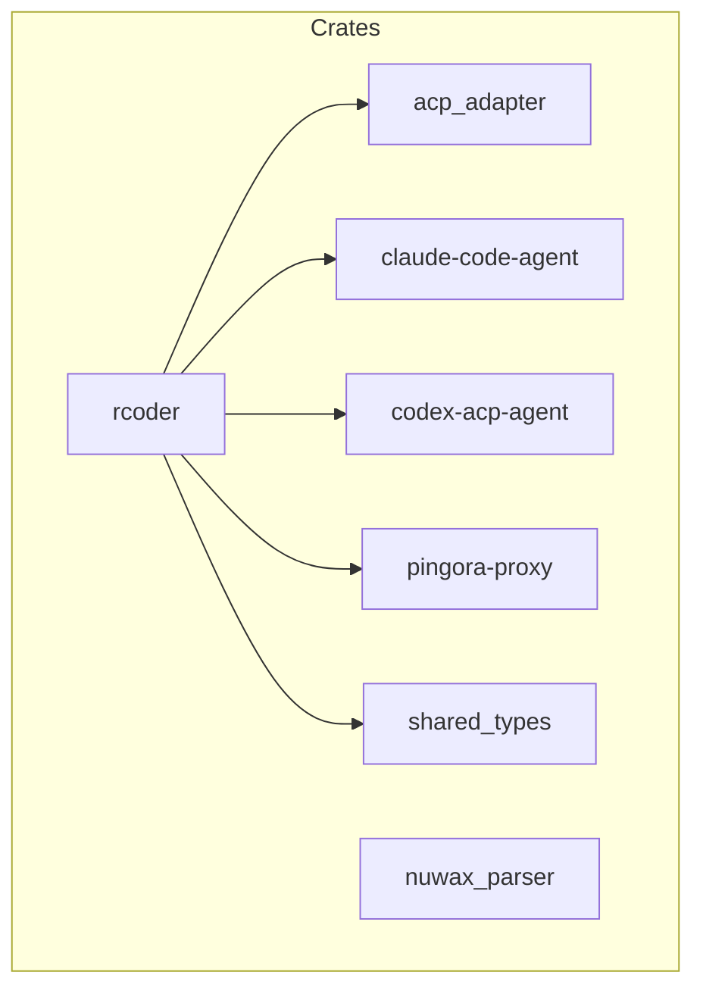
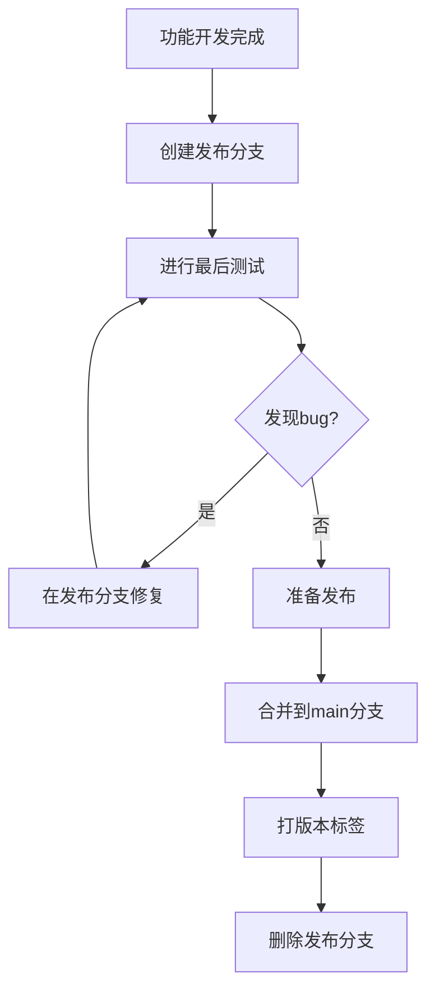
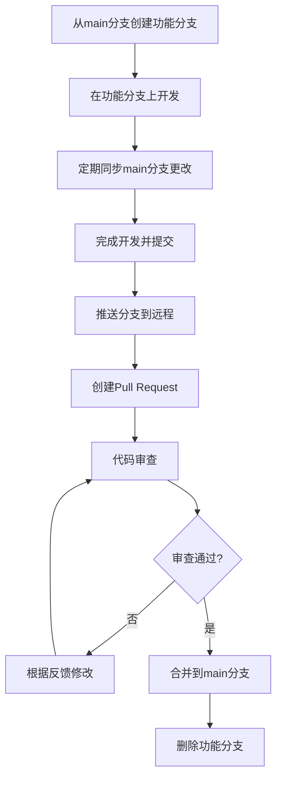

# 分支管理规范

<cite>
**本文档引用的文件**
- [README.md](file://README.md)
- [CLAUDE.md](file://CLAUDE.md)
- [config.yml](file://config.yml)
- [Cargo.toml](file://Cargo.toml)
</cite>

## 目录
1. [引言](#引言)
2. [项目结构概述](#项目结构概述)
3. [核心分支策略](#核心分支策略)
4. [主分支保护机制](#主分支保护机制)
5. [功能分支管理](#功能分支管理)
6. [发布分支流程](#发布分支流程)
7. [修复分支处理](#修复分支处理)
8. [Git工作流示例](#git工作流示例)
9. [多crate协同开发](#多crate协同开发)
10. [结论](#结论)

## 引言

RCoder 是一个基于 Rust 构建的 AI 驱动开发平台，采用 Cargo workspace 管理多个 crate。为确保代码质量和开发效率，项目实施严格的分支管理策略。本规范详细说明了项目的分支策略，包括主分支保护、功能分支创建规则、发布分支使用场景以及修复分支的紧急处理流程。

**Section sources**
- [README.md](file://README.md#L1-L50)
- [CLAUDE.md](file://CLAUDE.md#L1-L20)

## 项目结构概述

项目采用现代化的 Cargo workspace 结构，包含多个独立的 crate：

```
.
├── crates
│   ├── acp_adapter
│   ├── claude-code-agent
│   ├── codex-acp-agent
│   ├── nuwax_parser
│   ├── pingora-proxy
│   ├── rcoder
│   └── shared_types
├── Cargo.toml
├── config.yml
├── README.md
└── CLAUDE.md
```

这种多 crate 架构支持模块化开发，每个 crate 负责特定功能，如 `rcoder` 为主应用，`pingora-proxy` 为反向代理封装，`shared_types` 为共享类型定义。



**Diagram sources**
- [Cargo.toml](file://Cargo.toml#L1-L20)
- [README.md](file://README.md#L100-L150)

**Section sources**
- [Cargo.toml](file://Cargo.toml#L1-L20)
- [README.md](file://README.md#L100-L150)

## 核心分支策略

项目采用 Git 分支策略来管理代码开发和发布流程。分支命名遵循严格的约定，确保团队协作的清晰性和一致性。

### 分支类型

项目使用以下四种主要分支类型：

- **主分支 (main)**: 生产环境代码的稳定分支
- **功能分支 (feature/\*)**: 开发新功能的分支
- **发布分支 (release/\*)**: 准备发布的分支
- **修复分支 (hotfix/\*)**: 紧急修复生产问题的分支

### 命名约定

分支命名遵循以下规则：

- **功能分支**: `feature/功能描述` (如 `feature/user-authentication`)
- **发布分支**: `release/v版本号` (如 `release/v0.1.0`)
- **修复分支**: `hotfix/问题描述` (如 `hotfix/login-bug`)

**Section sources**
- [README.md](file://README.md#L600-L610)
- [CLAUDE.md](file://CLAUDE.md#L1-L10)

## 主分支保护机制

主分支是项目的核心稳定分支，直接对应生产环境的代码。为确保代码质量，实施严格的保护机制。

### 保护规则

1. **禁止直接推送**: 禁止任何开发者直接向 main 分支推送代码
2. **强制 Pull Request**: 所有变更必须通过 Pull Request (PR) 提交
3. **代码审查**: PR 必须经过至少一名其他开发者的审查
4. **CI/CD 验证**: PR 必须通过所有持续集成检查

### 保护配置

在 Git 仓库设置中，启用以下保护选项：

- Require pull request reviews before merging
- Require status checks to pass before merging
- Require linear history
- Include administrators

这些保护措施确保只有经过审查和验证的代码才能合并到主分支。

**Section sources**
- [README.md](file://README.md#L600-L610)
- [CLAUDE.md](file://CLAUDE.md#L1-L10)

## 功能分支管理

功能分支用于开发新功能或进行重大重构，是日常开发的主要工作分支。

### 创建规则

1. **从 main 分支创建**: 所有功能分支必须从最新的 main 分支创建
2. **命名规范**: 使用 `feature/` 前缀，后跟简短的功能描述
3. **单一职责**: 每个功能分支应专注于一个特定功能或改进

### 生命周期

功能分支的生命周期包括以下阶段：

1. **创建**: 从 main 分支创建新分支
2. **开发**: 在分支上进行功能开发
3. **同步**: 定期从 main 分支合并最新更改
4. **审查**: 提交 PR 进行代码审查
5. **合并**: 审查通过后合并到 main 分支
6. **删除**: 合并后删除功能分支

### 开发示例

```bash
# 从 main 分支创建功能分支
git checkout main
git pull origin main
git checkout -b feature/user-authentication

# 开发完成后提交更改
git add .
git commit -m "实现用户认证功能"

# 推送分支到远程仓库
git push origin feature/user-authentication
```

**Section sources**
- [README.md](file://README.md#L600-L610)
- [CLAUDE.md](file://CLAUDE.md#L1-L10)

## 发布分支流程

发布分支用于准备新版本的发布，是稳定性和质量保证的关键环节。

### 使用场景

发布分支在以下情况下创建：

1. **版本发布准备**: 当功能开发完成，准备发布新版本时
2. **版本冻结**: 需要冻结功能开发，专注于 bug 修复时
3. **多版本维护**: 需要同时维护多个版本时

### 创建和管理

1. **创建分支**: 从 main 分支创建 `release/vX.Y.Z` 分支
2. **版本号**: 遵循语义化版本控制 (SemVer) 规范
3. **仅修复**: 分支上只进行 bug 修复，不添加新功能

### 发布流程



**Diagram sources**
- [README.md](file://README.md#L500-L550)
- [config.yml](file://config.yml#L1-L10)

**Section sources**
- [README.md](file://README.md#L500-L550)
- [config.yml](file://config.yml#L1-L10)

## 修复分支处理

修复分支用于紧急修复生产环境中的严重问题，具有最高的优先级。

### 紧急处理流程

1. **问题确认**: 确认生产环境中的严重问题
2. **创建分支**: 从 main 分支创建 `hotfix/` 分支
3. **快速修复**: 实施最小必要的修复
4. **测试验证**: 进行充分的测试验证
5. **合并发布**: 快速合并并部署

### 处理示例

```bash
# 从 main 分支创建修复分支
git checkout main
git pull origin main
git checkout -b hotfix/login-bug

# 实施修复并提交
git add .
git commit -m "修复用户登录认证问题"

# 推送分支
git push origin hotfix/login-bug

# 创建 Pull Request 并请求紧急审查
```

修复完成后，分支应立即合并到 main 分支，并考虑是否需要合并到当前的发布分支。

**Section sources**
- [README.md](file://README.md#L600-L610)
- [CLAUDE.md](file://CLAUDE.md#L1-L10)

## Git工作流示例

本节提供完整的 Git 工作流示例，展示从创建分支到合并请求的完整操作路径。

### 完整工作流



**Diagram sources**
- [README.md](file://README.md#L600-L610)
- [CLAUDE.md](file://CLAUDE.md#L1-L10)

### 详细操作步骤

1. **准备工作**
```bash
# 确保本地 main 分支最新
git checkout main
git pull origin main
```

2. **创建功能分支**
```bash
# 创建命名规范的功能分支
git checkout -b feature/user-profile
```

3. **开发和提交**
```bash
# 进行功能开发
# ...

# 提交更改
git add .
git commit -m "实现用户个人资料功能"
```

4. **同步主分支**
```bash
# 定期同步 main 分支的更改
git checkout main
git pull origin main
git checkout feature/user-profile
git merge main
```

5. **推送和创建 PR**
```bash
# 推送分支到远程仓库
git push origin feature/user-profile

# 在 GitHub/GitLab 上创建 Pull Request
# 填写 PR 描述，指派审查者
```

6. **处理审查反馈**
```bash
# 根据审查意见进行修改
# ...

# 提交修改
git add .
git commit -m "根据审查意见修改"
git push origin feature/user-profile
```

7. **合并和清理**
```bash
# 审查通过后，合并 PR
# ...

# 删除已合并的分支
git branch -d feature/user-profile
git push origin --delete feature/user-profile
```

**Section sources**
- [README.md](file://README.md#L600-L610)
- [CLAUDE.md](file://CLAUDE.md#L1-L10)

## 多crate协同开发

在 workspace 环境下，多个 crate 的协同开发需要特别注意依赖管理和版本控制。

### 协同开发原则

1. **独立开发**: 每个 crate 应尽可能独立开发和测试
2. **接口定义**: 明确定义 crate 之间的接口和依赖关系
3. **版本同步**: 确保相关 crate 的版本同步更新

### 开发实践

1. **本地依赖测试**
```toml
# 在 Cargo.toml 中使用本地路径进行开发
[dependencies]
shared_types = { path = "../shared_types" }
```

2. **跨 crate 调试**
```bash
# 构建所有 crates
cargo build --workspace

# 运行特定 crate 的测试
cargo test -p rcoder
```

3. **版本发布协调**
- 当 shared_types crate 更新时，所有依赖它的 crate 都需要测试
- 使用 cargo tree 检查依赖关系
- 在发布前确保所有相关 crate 的兼容性

### 依赖管理

项目使用统一的 workspace 依赖管理，在根目录的 Cargo.toml 中定义共享依赖：

```toml
[workspace.dependencies]
tokio = { version = "1.0", features = ["full"] }
axum = { version = "0.8", features = ["http2", "query"] }
serde = { version = "1.0", features = ["derive"] }
```

这确保了所有 crate 使用相同版本的依赖库，避免版本冲突。

**Section sources**
- [Cargo.toml](file://Cargo.toml#L1-L50)
- [README.md](file://README.md#L100-L150)

## 结论

RCoder 项目的分支管理规范确保了代码质量和开发效率。通过严格的分支策略和保护机制，项目能够安全地进行功能开发、版本发布和紧急修复。在多 crate 的 workspace 环境下，开发者应遵循协同开发原则，确保各模块的兼容性和稳定性。

关键要点总结：
- 始终通过 Pull Request 合并代码，禁止直接推送
- 遵循分支命名约定，保持分支目的清晰
- 定期同步 main 分支的更改，减少合并冲突
- 在多 crate 环境下注意依赖管理和版本协调

遵循这些规范将有助于维护项目的长期健康和可维护性。