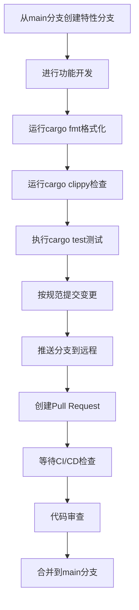
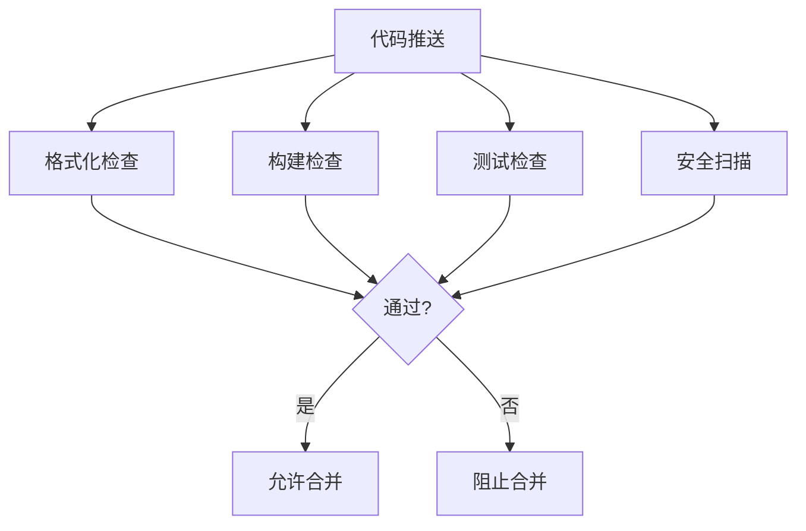

# 贡献流程与代码审查

<cite>
**本文档引用的文件**  
- [README.md](file://README.md)
- [CLAUDE.md](file://CLAUDE.md)
- [config.yml](file://config.yml)
- [crates/rcoder/src/router.rs](file://crates/rcoder/src/router.rs)
- [crates/nuwax_parser/src/model/source_code.rs](file://crates/nuwax_parser/src/model/source_code.rs)
- [crates/codex-acp-agent/src/commands/commands.rs](file://crates/codex-acp-agent/src/commands/commands.rs)
- [crates/rcoder/src/utils/mcp_config.rs](file://crates/rcoder/src/utils/mcp_config.rs)
- [crates/rcoder/src/utils/system_prompt.rs](file://crates/rcoder/src/utils/system_prompt.rs)
</cite>

## 目录

1. [简介](#简介)
2. [代码贡献流程](#代码贡献流程)
3. [提交信息规范](#提交信息规范)
4. [CI/CD流水线检查项](#cicd流水线检查项)
5. [代码审查重点](#代码审查重点)
6. [文档更新要求](#文档更新要求)
7. [PR模板建议](#pr模板建议)
8. [附录](#附录)

## 简介

RCoder 是一个基于 Rust 构建的 AI 驱动开发平台，采用模块化设计和多层配置系统。本项目遵循现代软件工程实践，强调代码质量、可维护性和自动化。本文档定义了清晰的代码贡献流程，从分支创建到 Pull Request 提交的完整路径，并说明了代码审查的重点领域和 CI/CD 流水线的检查标准。

**Section sources**
- [README.md](file://README.md#L0-L651)

## 代码贡献流程

贡献者应遵循以下标准化流程进行代码贡献：

1. **分支创建**：从 `main` 分支创建新的特性分支，命名格式为 `feature/功能描述` 或 `fix/问题描述`
2. **功能开发**：在本地分支上进行功能开发或问题修复
3. **代码质量检查**：运行 `cargo fmt` 进行代码格式化，使用 `cargo clippy` 进行代码检查
4. **测试验证**：执行 `cargo test` 确保所有测试通过
5. **提交变更**：按照 Conventional Commits 规范提交变更
6. **推送分支**：将本地分支推送到远程仓库
7. **创建PR**：在 GitHub 上创建 Pull Request，使用建议的 PR 模板

项目采用多层配置系统，优先级从高到低为：命令行参数 > 环境变量 > 配置文件 > 默认配置。贡献者在开发时应考虑这一配置优先级体系。



**Diagram sources**
- [README.md](file://README.md#L0-L651)
- [CLAUDE.md](file://CLAUDE.md#L0-L153)

**Section sources**
- [README.md](file://README.md#L0-L651)
- [CLAUDE.md](file://CLAUDE.md#L0-L153)

## 提交信息规范

所有提交必须遵循 [Conventional Commits](https://www.conventionalcommits.org/) 规范，以便自动生成 CHANGELOG。提交信息格式如下：

```
<类型>(<范围>): <描述>

<正文>

<脚注>
```

支持的提交类型包括：
- `feat`：新增功能
- `fix`：问题修复
- `docs`：文档更新
- `style`：代码格式调整（不影响逻辑）
- `refactor`：代码重构（既不修复bug也不新增功能）
- `perf`：性能优化
- `test`：测试相关变更
- `build`：构建系统或外部依赖变更
- `ci`：CI/CD 配置变更
- `chore`：其他杂项变更

范围可以是具体的模块或组件名称，如 `router`、`proxy`、`agent` 等。

**Section sources**
- [README.md](file://README.md#L0-L651)

## CI/CD流水线检查项

CI/CD 流水线执行以下检查项，所有检查必须通过才能合并 PR：

### 格式化检查
使用 `cargo fmt` 检查代码格式是否符合 Rust 社区标准。所有代码必须通过格式化检查，不允许有格式化差异。

### 构建检查
执行 `cargo build --workspace` 构建整个工作空间，确保所有 crate 能够成功编译。

### 测试检查
运行 `cargo test --workspace` 执行所有测试，包括单元测试和集成测试。测试覆盖率应保持稳定或提高，不允许降低。

### 安全扫描
使用 `cargo audit` 进行依赖安全扫描，确保没有已知的安全漏洞。同时使用 `cargo deny` 检查许可证合规性。

### 通过标准
所有 CI/CD 检查必须成功通过，任何失败的检查都会阻止 PR 合并。贡献者需要根据 CI/CD 输出修复问题并重新推送变更。



**Diagram sources**
- [README.md](file://README.md#L0-L651)
- [CLAUDE.md](file://CLAUDE.md#L0-L153)

**Section sources**
- [README.md](file://README.md#L0-L651)
- [CLAUDE.md](file://CLAUDE.md#L0-L153)

## 代码审查重点

代码审查应重点关注以下领域：

### 架构一致性
确保代码变更与项目整体架构保持一致。项目采用模块化设计，使用 Cargo workspace 管理多个 crate。新代码应遵循现有的模块划分和依赖关系。

### 性能影响
评估代码变更对性能的影响。项目使用 DashMap 替代 `Arc<RwLock<HashMap>>` 以获得更好的并发性能。避免引入性能瓶颈，特别是在高并发路径上。

### 错误处理完备性
检查错误处理是否完备。项目使用 `anyhow` 进行错误传播，使用 `HttpResult` 统一 API 响应格式。确保所有可能的错误情况都得到适当处理。

### 并发模型正确性
验证并发模型的正确性。项目使用 Tokio 异步运行时，ACP 操作必须在 `LocalSet` 中执行以支持 `spawn_local`，因为 `AgentSideConnection` 和 `ClientSideConnection` 未实现 Send trait。

### 类型安全
确保类型使用正确。项目广泛使用 Serde 进行序列化，使用 utoipa 生成 API 文档。检查数据结构的序列化属性和文档注解是否正确。

**Section sources**
- [CLAUDE.md](file://CLAUDE.md#L0-L153)
- [crates/rcoder/src/router.rs](file://crates/rcoder/src/router.rs#L24-L37)

## 文档更新要求

贡献者必须同步更新相关文档，包括：

### README 更新
如果变更影响用户可见的功能或配置选项，必须更新 `README.md` 文件。特别是新增配置项、API 端点或命令行参数时。

### API 注释
所有公共 API 必须有适当的文档注释。使用 Rustdoc 语法编写注释，确保生成的文档清晰准确。对于 API 变更，更新相应的 OpenAPI 注解。

### 变更影响评估
在 PR 描述中提供变更影响评估，包括：
- 影响的模块和组件
- 对现有功能的兼容性影响
- 性能预期变化
- 配置变更需求
- 升级注意事项

### 配置文件示例
如果引入新的配置选项，更新 `config.yml` 示例文件，并在注释中说明新选项的用途和默认值。

**Section sources**
- [README.md](file://README.md#L0-L651)
- [config.yml](file://config.yml#L0-L29)

## PR模板建议

建议使用以下 PR 模板，确保上下文充分传达：

```markdown
## PR 描述

简要描述本次变更的目的和主要内容。

## 变更动机

说明为什么需要这个变更，解决了什么问题或实现了什么功能。

## 实现细节

描述实现方案和技术选择。如果有多种实现方式，说明为什么选择当前方案。

## 影响评估

- **模块影响**：列出受影响的模块
- **兼容性**：是否向后兼容
- **性能**：预期性能影响
- **配置**：是否需要更新配置

## 测试验证

描述如何测试本次变更，包括：
- 单元测试覆盖情况
- 手动测试步骤
- 边界情况处理

## 相关问题

关联相关的问题或任务（如 #123）
```

**Section sources**
- [README.md](file://README.md#L0-L651)

## 附录

### 项目结构说明
项目采用 Cargo workspace 结构，主要 crate 包括：
- `rcoder`：主应用（Axum 路由、业务、配置、代理启动）
- `pingora-proxy`：Pingora 代理封装
- `claude-code-agent`：Claude 代理实现
- `codex-acp-agent`：Codex 代理实现
- `acp_adapter`：ACP 协议适配
- `shared_types`：共享类型定义

### 开发命令参考
```bash
# 构建项目
cargo build --workspace

# 运行测试
cargo test --workspace

# 格式化代码
cargo fmt

# 代码检查
cargo clippy

# 安全扫描
cargo audit
cargo deny check
```

**Section sources**
- [README.md](file://README.md#L0-L651)
- [CLAUDE.md](file://CLAUDE.md#L0-L153)