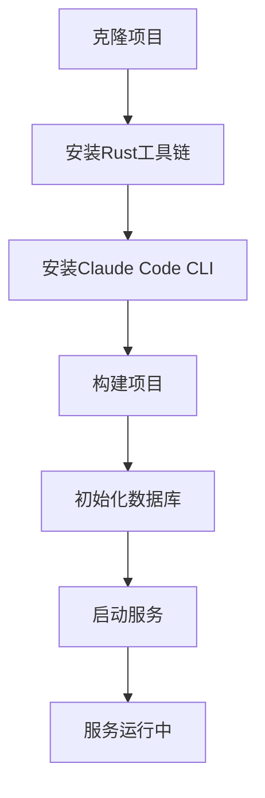
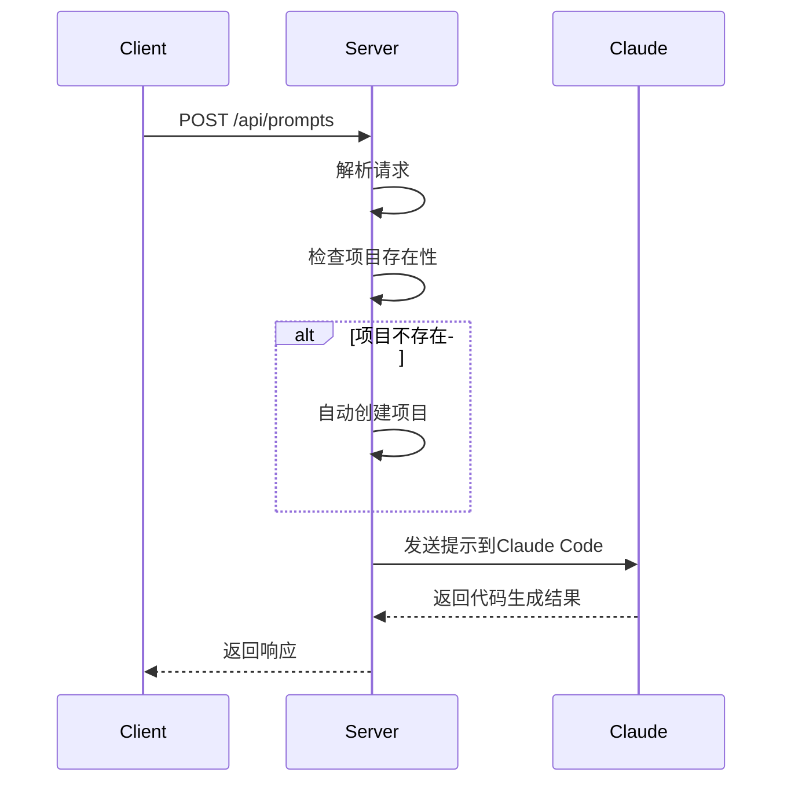

# 快速入门指南

<cite>
**本文档引用的文件**  
- [README.md](file://README.md)
- [main.rs](file://crates/rcoder/src/main.rs)
- [lib.rs](file://crates/http_server/src/lib.rs)
- [handlers.rs](file://crates/http_server/src/handlers.rs)
- [http_interface.rs](file://crates/http_server/src/http_interface.rs)
</cite>

## 目录
1. [简介](#简介)
2. [环境准备](#环境准备)
3. [项目构建与运行](#项目构建与运行)
4. [服务配置](#服务配置)
5. [端到端使用示例](#端到端使用示例)
6. [常见问题排查](#常见问题排查)
7. [总结](#总结)

## 简介

RCoder 是一个基于 ACP（Agent Client Protocol）的 AI 驱动开发平台，允许用户通过简单的 HTTP 请求创建、管理和开发软件项目。本指南将指导新手用户如何在本地环境中部署和运行 RCoder 服务，涵盖从环境搭建到实际使用的完整流程。

**Section sources**
- [README.md](file://README.md#L1-L288)

## 环境准备

### Rust 工具链安装

RCoder 使用 Rust 编程语言开发，需要安装 Rust 工具链。推荐使用 `rustup` 进行安装：

```bash
# 安装 rustup（如果尚未安装）
curl --proto '=https' --tlsv1.2 -sSf https://sh.rustup.rs | sh

# 确保安装了最新稳定版 Rust
rustup install stable

# 设置为默认工具链
rustup default stable
```

验证安装是否成功：

```bash
rustc --version
cargo --version
```

要求 Rust 版本不低于 1.70。

### Claude Code CLI 安装

RCoder 依赖 Anthropic 的 Claude Code CLI 进行 AI 代码生成：

```bash
# 使用 npm 安装 Claude Code CLI
npm install -g @anthropic-ai/claude-code

# 或按照官方文档进行安装
# 参考: https://docs.anthropic.com/claude/docs/getting-started
```

### SQLite 数据库

RCoder 使用 SQLite 作为默认数据库，大多数系统已预装 SQLite 3。可通过以下命令验证：

```bash
sqlite3 --version
```

如未安装，请根据操作系统选择相应安装方式：
- **Ubuntu/Debian**: `sudo apt-get install sqlite3`
- **macOS**: `brew install sqlite`
- **Windows**: 从官网下载预编译二进制文件

**Section sources**
- [README.md](file://README.md#L30-L50)

## 项目构建与运行

### 获取源码

```bash
# 克隆项目仓库
git clone <repository-url>
cd rcoder
```

### 依赖编译

使用 Cargo 构建项目：

```bash
# 构建发布版本
cargo build --release

# 或构建调试版本
cargo build
```

该命令会自动下载并编译所有依赖项，包括：
- Axum（HTTP 框架）
- Tokio（异步运行时）
- SQLx（数据库访问）
- Serde（序列化）
- Tracing（日志系统）

### 数据库初始化

RCoder 使用 SQLite 数据库存储项目和会话信息。数据库文件将自动创建：

```bash
# 默认数据库路径
./rcoder.db

# 项目文件存储目录
./projects/
```

首次运行时，系统会自动创建必要的目录结构和数据库文件。

### 启动服务

```bash
# 启动服务（发布模式）
cargo run --release

# 启动服务（调试模式）
cargo run
```

服务默认在 `http://localhost:3000` 启动。



**Diagram sources**
- [main.rs](file://crates/rcoder/src/main.rs#L1-L48)
- [lib.rs](file://crates/http_server/src/lib.rs#L1-L65)

**Section sources**
- [README.md](file://README.md#L52-L75)
- [main.rs](file://crates/rcoder/src/main.rs#L1-L48)

## 服务配置

### 环境变量配置

创建 `.env` 文件以自定义服务配置：

```env
# 服务器端口
PORT=3000

# 数据库连接字符串
DATABASE_URL=sqlite:///./rcoder.db

# Claude Code CLI 路径
CLAUDE_CODE_PATH=claude

# 日志级别
RUST_LOG=debug
```

支持的配置项说明：

| 配置项 | 默认值 | 说明 |
|--------|--------|------|
| PORT | 3000 | HTTP 服务监听端口 |
| DATABASE_URL | sqlite:///./rcoder.db | 数据库连接字符串 |
| CLAUDE_CODE_PATH | claude | Claude Code CLI 可执行文件路径 |
| RUST_LOG | info | 日志输出级别（debug、info、warn、error） |

### 配置加载机制

RCoder 通过标准环境变量机制加载配置，在 `main.rs` 中实现：

```rust
// 从环境变量获取端口
let port = std::env::var("PORT")
    .unwrap_or_else(|_| "3000".to_string())
    .parse()
    .unwrap_or(3000);
```

日志系统使用 `tracing_subscriber`，支持灵活的日志过滤和输出格式。

**Section sources**
- [README.md](file://README.md#L190-L210)
- [main.rs](file://crates/rcoder/src/main.rs#L1-L48)

## 端到端使用示例

### 创建新项目

使用 HTTP POST 请求创建新项目：

```bash
# 发送提示自动创建项目
curl -X POST http://localhost:3000/api/prompts \
  -H "Content-Type: application/json" \
  -d '{
    "prompt": "Create a Rust web API project with user management",
    "auto_create": true
  }'
```

### 调用 AI 代理生成代码

向现有项目发送开发指令：

```bash
# 获取项目列表以获取项目ID
curl http://localhost:3000/api/projects

# 向指定项目发送提示
curl -X POST http://localhost:3000/api/prompts \
  -H "Content-Type: application/json" \
  -d '{
    "project_id": "your-project-uuid",
    "prompt": "Add a new REST API endpoint for users"
  }'
```

### 检查项目状态

```bash
# 检查服务健康状态
curl http://localhost:3000/api/health

# 列出所有项目
curl http://localhost:3000/api/projects

# 获取特定项目信息
curl http://localhost:3000/api/projects/your-project-uuid
```



**Diagram sources**
- [handlers.rs](file://crates/http_server/src/handlers.rs#L1-L260)
- [http_interface.rs](file://crates/http_server/src/http_interface.rs#L1-L180)

**Section sources**
- [handlers.rs](file://crates/http_server/src/handlers.rs#L1-L260)
- [http_interface.rs](file://crates/http_server/src/http_interface.rs#L1-L180)

## 常见问题排查

### 端口占用

当 3000 端口被占用时，会出现绑定失败错误：

```bash
# 检查端口占用情况
lsof -i :3000
# 或
netstat -an | grep 3000

# 解决方案：更换端口
PORT=3001 cargo run --release
```

### 依赖缺失

构建时可能出现依赖下载失败：

```bash
# 清理并重新构建
cargo clean
cargo build --release

# 检查网络连接和 Cargo 配置
cat ~/.cargo/config
```

### 权限错误

数据库写入或目录创建时可能出现权限问题：

```bash
# 确保当前用户有写权限
ls -la .
chmod 755 .

# 检查项目目录权限
mkdir -p projects
chmod 755 projects
```

### Claude Code 连接失败

确保 Claude Code CLI 正确安装并可执行：

```bash
# 测试 Claude Code 是否可用
claude --version

# 检查路径配置
which claude
```

### 日志调试

启用详细日志以排查问题：

```bash
# 设置调试日志级别
RUST_LOG=debug cargo run

# 或仅显示特定模块日志
RUST_LOG=rcoder=debug,tower_http=debug cargo run
```

日志将输出到控制台，包含请求处理、数据库操作和 AI 交互的详细信息。

**Section sources**
- [README.md](file://README.md#L30-L50)
- [main.rs](file://crates/rcoder/src/main.rs#L1-L48)
- [lib.rs](file://crates/http_server/src/lib.rs#L1-L65)

## 总结

本指南详细介绍了 RCoder 服务的本地部署和运行流程，从环境准备、项目构建到实际使用和问题排查。通过遵循这些步骤，新手用户可以快速搭建 AI 驱动的开发环境，并开始使用 HTTP API 进行智能代码生成和项目管理。

关键要点：
- 确保 Rust 1.70+ 工具链正确安装
- 安装并配置 Claude Code CLI
- 使用 `cargo build --release` 构建项目
- 通过环境变量自定义服务配置
- 使用提供的 HTTP API 示例进行端到端测试
- 参考排查指南解决常见启动问题

现在您已准备好使用 RCoder 进行 AI 辅助开发！