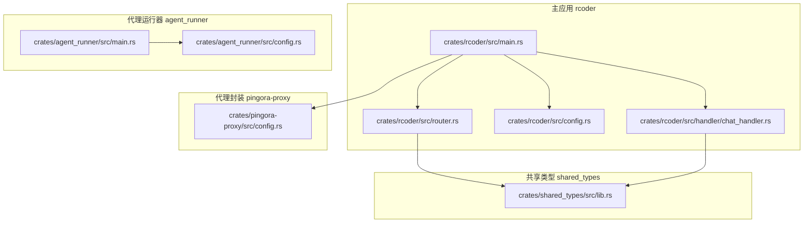
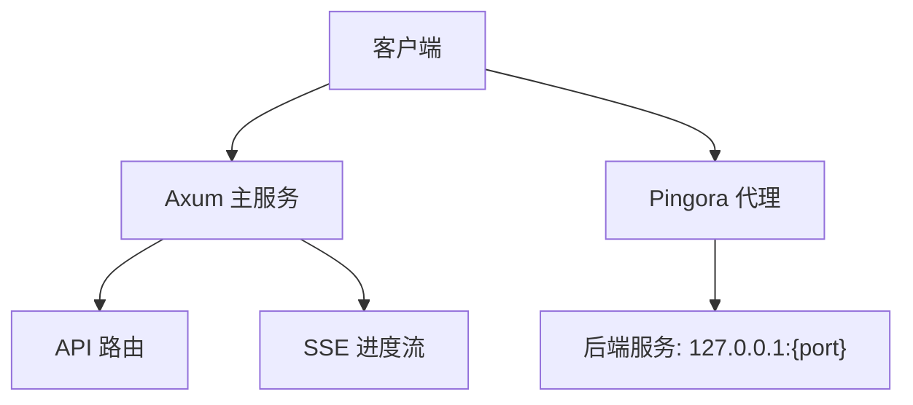
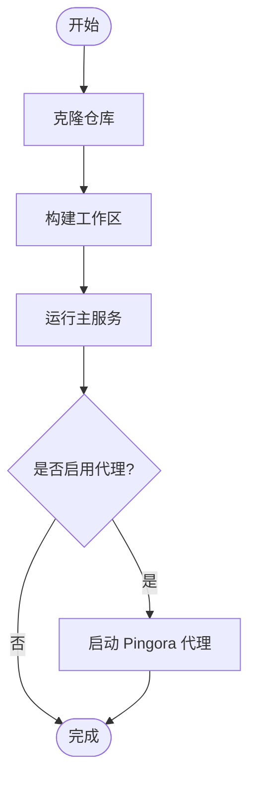
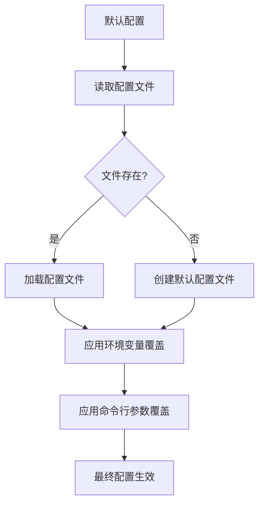
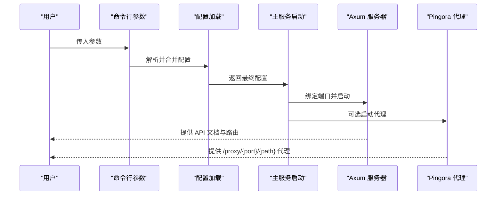
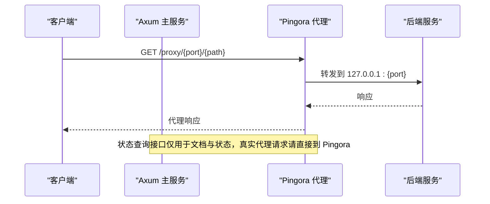
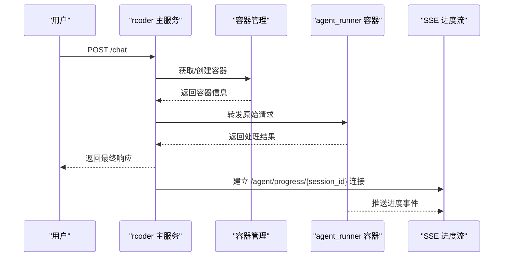
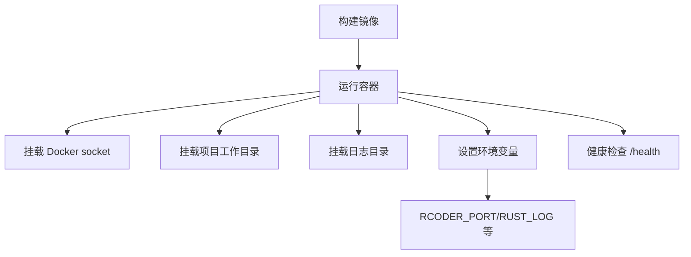
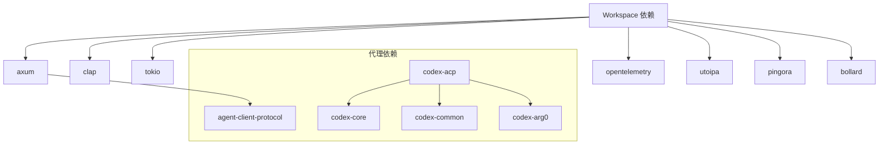

# 快速开始

<cite>
**本文引用的文件**
- [README.md](file://README.md)
- [install.md](file://install.md)
- [Cargo.toml](file://Cargo.toml)
- [config.yml](file://config.yml)
- [crates/rcoder/src/main.rs](file://crates/rcoder/src/main.rs)
- [crates/agent_runner/src/main.rs](file://crates/agent_runner/src/main.rs)
- [crates/rcoder/src/config.rs](file://crates/rcoder/src/config.rs)
- [crates/agent_runner/src/config.rs](file://crates/agent_runner/src/config.rs)
- [crates/pingora-proxy/src/config.rs](file://crates/pingora-proxy/src/config.rs)
- [crates/rcoder/src/router.rs](file://crates/rcoder/src/router.rs)
- [crates/rcoder/src/handler/chat_handler.rs](file://crates/rcoder/src/handler/chat_handler.rs)
- [docker/Dockerfile](file://docker/Dockerfile)
- [docker/docker-compose.yml](file://docker/docker-compose.yml)
</cite>

## 目录
1. [简介](#简介)
2. [项目结构](#项目结构)
3. [核心组件](#核心组件)
4. [架构总览](#架构总览)
5. [详细组件分析](#详细组件分析)
6. [依赖关系分析](#依赖关系分析)
7. [性能与可用性](#性能与可用性)
8. [故障排查指南](#故障排查指南)
9. [结论](#结论)
10. [附录](#附录)

## 简介
RCoder 是一个基于 Rust 构建的现代化 AI 驱动开发平台，通过 ACP（Agent Client Protocol）协议实现与多种 AI 代理的统一交互。平台提供简洁的 HTTP API 接口，支持聊天、SSE 实时进度流、代理服务与容器化工作流，适用于本地开发与生产部署。

- 核心能力：反向代理（Cloudflare Pingora）、HTTP API（Axum）、多代理支持（Codex、Claude Code）、异步架构（Tokio）、可观测性（Tracing + OpenTelemetry）、Swagger UI 文档。
- 快速开始：克隆仓库、构建、运行主服务、可选启用 Pingora 反向代理、使用 curl 或 Swagger UI 调用 API。

**章节来源**
- file://README.md#L1-L60

## 项目结构
RCoder 采用多 crate Workspace 组织，核心模块包括：
- 主应用（rcoder）：Axum 路由、业务处理、配置加载、代理启动
- 代理运行器（agent_runner）：独立运行 AI 代理工作流，支持本地任务通道与 Pingora 代理
- Pingora 代理封装（pingora-proxy）：代理配置、服务管理
- 共享类型（shared_types）：模型、错误、协议类型
- Claude Code 代理（claude-code-agent）
- Codex ACP 代理（codex-acp-agent）
- Docker 管理（docker_manager）

**图表来源**
- [crates/rcoder/src/main.rs](file://crates/rcoder/src/main.rs#L1-L120)
- [crates/rcoder/src/router.rs](file://crates/rcoder/src/router.rs#L52-L84)
- [crates/rcoder/src/config.rs](file://crates/rcoder/src/config.rs#L1-L120)
- [crates/rcoder/src/handler/chat_handler.rs](file://crates/rcoder/src/handler/chat_handler.rs#L1-L120)
- [crates/agent_runner/src/main.rs](file://crates/agent_runner/src/main.rs#L1-L120)
- [crates/agent_runner/src/config.rs](file://crates/agent_runner/src/config.rs#L1-L120)
- [crates/pingora-proxy/src/config.rs](file://crates/pingora-proxy/src/config.rs#L1-L60)
- [crates/shared_types/src/lib.rs](file://crates/shared_types/src/lib.rs#L1-L50)

**章节来源**
- file://README.md#L269-L383

## 核心组件
- 命令行参数与配置优先级：命令行 > 环境变量 > 配置文件 > 默认配置
- 主服务（rcoder）：启动 Axum HTTP 服务器、加载配置、可选启动 Pingora 代理、注册路由、SSE 进度流、健康检查
- 代理运行器（agent_runner）：独立运行 AI 代理工作流，支持本地任务通道、Pingora 代理
- Pingora 代理：高性能反向代理，路径前缀 /proxy/{port}/{path} 转发到指定后端
- Docker 管理：自动检测宿主机路径、容器清理、镜像多配置与资源限制

**章节来源**
- file://crates/rcoder/src/config.rs#L1-L120
- file://crates/agent_runner/src/config.rs#L1-L120
- file://crates/pingora-proxy/src/config.rs#L1-L60
- file://crates/rcoder/src/main.rs#L1-L120

## 架构总览
RCoder 采用双服务架构：
- Axum 主服务：提供业务 API、SSE 进度流、代理状态文档路由
- Pingora 代理：独立监听端口，按路径前缀转发到任意后端端口

**图表来源**
- [README.md](file://README.md#L16-L31)
- [crates/rcoder/src/main.rs](file://crates/rcoder/src/main.rs#L160-L210)
- [crates/rcoder/src/router.rs](file://crates/rcoder/src/router.rs#L52-L84)

**章节来源**
- file://README.md#L16-L31

## 详细组件分析

### 环境要求与安装
- 环境要求：Rust 1.75+（2024 Edition），可选 Claude Code CLI、OpenAI Codex
- 安装步骤：克隆仓库、构建工作区、运行主服务、可选启用 Pingora 代理
- 命令行参数：端口、项目目录、启用代理、代理端口、默认后端端口

**图表来源**
- [README.md](file://README.md#L44-L105)
- [crates/rcoder/src/main.rs](file://crates/rcoder/src/main.rs#L210-L272)

**章节来源**
- file://README.md#L44-L105

### 配置系统与优先级
- 配置优先级：命令行参数 > 环境变量 > 配置文件 > 默认配置
- 配置文件：首次启动自动生成默认配置文件；支持默认代理类型、项目目录、主服务端口、Pingora 代理配置、Docker 多镜像配置
- 环境变量：RCODER_PORT、DATABASE_URL、CLAUDE_CODE_PATH、RUST_LOG 等

**图表来源**
- [crates/rcoder/src/config.rs](file://crates/rcoder/src/config.rs#L253-L332)
- [crates/agent_runner/src/config.rs](file://crates/agent_runner/src/config.rs#L110-L192)
- [config.yml](file://config.yml#L1-L60)

**章节来源**
- file://crates/rcoder/src/config.rs#L253-L332
- file://crates/agent_runner/src/config.rs#L110-L192
- file://README.md#L384-L450

### 命令行参数与运行方式
- rcoder 主服务常用参数：
  - --port/-p：设置主服务端口
  - --projects-dir/-d：设置项目工作目录
  - --enable-proxy：启用 Pingora 反向代理
  - --proxy-port：设置代理监听端口
  - --default-backend-port：未指定端口时的默认后端端口
- agent_runner 服务参数与 rcoder 类似，支持独立运行

**图表来源**
- [crates/rcoder/src/config.rs](file://crates/rcoder/src/config.rs#L11-L36)
- [crates/rcoder/src/main.rs](file://crates/rcoder/src/main.rs#L210-L272)
- [crates/agent_runner/src/config.rs](file://crates/agent_runner/src/config.rs#L11-L36)
- [crates/agent_runner/src/main.rs](file://crates/agent_runner/src/main.rs#L80-L178)

**章节来源**
- file://README.md#L88-L105
- file://crates/rcoder/src/config.rs#L11-L36
- file://crates/agent_runner/src/config.rs#L11-L36

### API 与代理使用
- 核心端点：
  - GET /health：健康检查
  - POST /chat：发送聊天消息给 AI 代理
  - GET /agent/progress/{session_id}：SSE 实时进度流
  - POST /agent/session/cancel：取消会话任务
  - POST /agent/stop：停止当前 Agent
  - GET /agent/status/{project_id}：查询 Agent 状态
  - GET /api/docs：Swagger UI API 文档
- Pingora 代理：
  - 路由规则：/proxy/{port}/{path}
  - 状态查询：/proxy/status、/proxy/config、/proxy/stats
  - 真实代理请求需直接发送到 Pingora 监听端口

**图表来源**
- [README.md](file://README.md#L209-L242)
- [crates/rcoder/src/router.rs](file://crates/rcoder/src/router.rs#L52-L84)

**章节来源**
- file://README.md#L209-L242
- file://crates/rcoder/src/router.rs#L52-L84

### 聊天与容器化工作流
- /chat 接口：将请求转发到容器内的 agent_runner 服务，由后者处理会话、项目隔离与 AI 代理
- 容器管理：根据 project_id 动态创建或复用容器，支持 ServiceType::RCoder
- SSE 进度流：统一通过 /agent/progress/{session_id} 推送执行进度

**图表来源**
- [crates/rcoder/src/handler/chat_handler.rs](file://crates/rcoder/src/handler/chat_handler.rs#L108-L170)
- [crates/rcoder/src/router.rs](file://crates/rcoder/src/router.rs#L52-L84)

**章节来源**
- file://crates/rcoder/src/handler/chat_handler.rs#L108-L170
- file://crates/rcoder/src/router.rs#L52-L84

### Docker 与部署
- Dockerfile：多阶段构建，包含调试工具与健康检查
- docker-compose：挂载 Docker socket、项目工作目录、日志目录与启动脚本，设置环境变量与健康检查
- 建议：生产环境使用 systemd 管理服务，或结合 Nginx 反向代理

**图表来源**
- [docker/Dockerfile](file://docker/Dockerfile#L1-L120)
- [docker/docker-compose.yml](file://docker/docker-compose.yml#L1-L37)

**章节来源**
- file://docker/Dockerfile#L1-L120
- file://docker/docker-compose.yml#L1-L37
- file://README.md#L490-L584

## 依赖关系分析
- 工作区依赖：clap、tokio、axum、tower、sqlx、serde、tracing、opentelemetry、utoipa、pingora、bollard 等
- 代理相关：agent-client-protocol、codex-acp（可选）、codex-core、codex-common、codex-arg0
- 代理运行器：与 rcoder 共享配置与类型，独立运行

**图表来源**
- [Cargo.toml](file://Cargo.toml#L35-L205)

**章节来源**
- file://Cargo.toml#L35-L205

## 性能与可用性
- 异步运行时：Tokio 全功能特性，支持高并发
- 观测性：Tracing + OpenTelemetry，日志按天滚动，支持 trace_id 传播
- 代理性能：Pingora 基于 Rust 异步 I/O 的高性能代理，支持健康检查与动态后端发现
- 容器管理：自动清理遗留容器、资源限制与 TTL 控制，提升稳定性

[本节为通用性能讨论，无需特定文件引用]

## 故障排查指南
- 端口冲突：使用 --port 指定不同端口
- 代理连接失败：检查 API 密钥与网络连通性
- 配置文件错误：检查 YAML 格式与字段名称
- Docker socket 权限：确保挂载 /var/run/docker.sock 并具备访问权限
- Pingora 代理请求：确认直接请求代理监听端口，避免误发到主服务端口

**章节来源**
- file://README.md#L611-L652
- file://crates/rcoder/src/main.rs#L322-L351

## 结论
RCoder 提供了从本地开发到生产部署的一体化方案：清晰的命令行参数与配置系统、高性能的 Axum + Pingora 架构、完善的可观测性与容器化能力。按照本文的快速开始步骤，您可以迅速搭建并使用 RCoder 平台。

[本节为总结性内容，无需特定文件引用]

## 附录

### 常用命令与示例
- 构建与运行主服务：cargo build --workspace；cargo run --bin rcoder
- 启用代理：cargo run --bin rcoder -- --enable-proxy --proxy-port 8080
- 健康检查：curl -X GET http://localhost:3000/health
- 聊天接口：POST /chat，SSE 进度流：GET /agent/progress/{session_id}

**章节来源**
- file://README.md#L44-L105
- file://README.md#L229-L268

### AI 代理配置要点
- Claude Code：安装 CLI 并设置 API Key 与模型
- OpenAI Codex：参考官方文档进行配置

**章节来源**
- file://README.md#L107-L131
- file://install.md#L1-L9