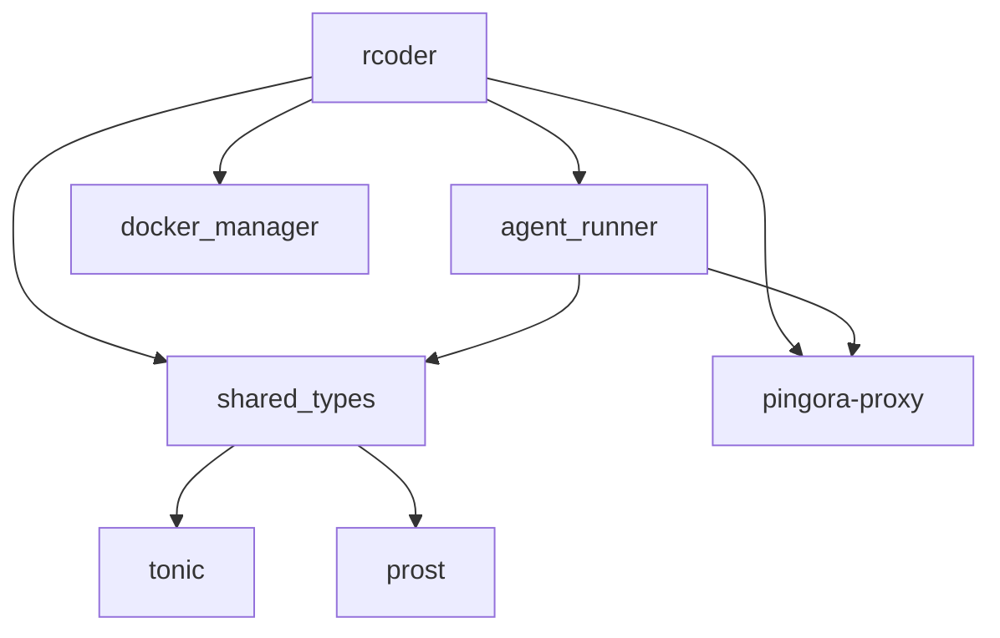

# 技术栈与依赖

<cite>
**本文档引用的文件**   
- [Cargo.toml](file://Cargo.toml)
- [crates/rcoder/Cargo.toml](file://crates/rcoder/Cargo.toml)
- [crates/agent_runner/Cargo.toml](file://crates/agent_runner/Cargo.toml)
- [crates/pingora-proxy/Cargo.toml](file://crates/pingora-proxy/Cargo.toml)
- [crates/shared_types/Cargo.toml](file://crates/shared_types/Cargo.toml)
- [crates/rcoder/src/main.rs](file://crates/rcoder/src/main.rs)
- [crates/agent_runner/src/main.rs](file://crates/agent_runner/src/main.rs)
- [crates/pingora-proxy/src/lib.rs](file://crates/pingora-proxy/src/lib.rs)
- [crates/rcoder/src/config.rs](file://crates/rcoder/src/config.rs)
- [crates/pingora-proxy/src/config.rs](file://crates/pingora-proxy/src/config.rs)
- [crates/shared_types/src/lib.rs](file://crates/shared_types/src/lib.rs)
- [crates/rcoder/src/router.rs](file://crates/rcoder/src/router.rs)
- [crates/agent_runner/src/router.rs](file://crates/agent_runner/src/router.rs)
- [crates/rcoder/src/handler/chat_handler.rs](file://crates/rcoder/src/handler/chat_handler.rs)
- [crates/rcoder/src/middleware/tracing_middleware.rs](file://crates/rcoder/src/middleware/tracing_middleware.rs)
</cite>

## 目录
1. [技术栈概览](#技术栈概览)
2. [核心依赖选型](#核心依赖选型)
3. [Rust语言特性](#rust语言特性)
4. [Axum框架集成](#axum框架集成)
5. [Tokio异步运行时](#tokio异步运行时)
6. [Pingora反向代理](#pingora反向代理)
7. [依赖管理策略](#依赖管理策略)
8. [配置与初始化](#配置与初始化)
9. [代码架构与模块化](#代码架构与模块化)
10. [实际使用示例](#实际使用示例)

## 技术栈概览

RCoder项目是一个基于Rust语言的AI代理框架，采用了现代化的异步技术栈。项目主要由多个Crate组成，包括核心服务、代理运行器、共享类型、Docker管理器和Pingora代理等组件。技术栈以Rust为核心，结合Axum作为Web框架，Tokio作为异步运行时，Pingora作为高性能反向代理，形成了一个高效、可扩展的系统架构。

项目采用工作区（workspace）模式管理多个Crate，通过`Cargo.toml`文件中的`[workspace]`配置来统一管理依赖和版本。这种架构设计使得各个组件可以独立开发和测试，同时又能共享公共依赖和配置。

**技术栈核心组件**
- **Rust**: 系统编程语言，提供内存安全和高性能
- **Axum**: Web框架，用于构建HTTP服务
- **Tokio**: 异步运行时，处理并发和I/O操作
- **Pingora**: 高性能反向代理，基于Cloudflare的技术
- **Tonic**: gRPC框架，用于服务间通信

**Section sources**
- [Cargo.toml](file://Cargo.toml#L1-L205)
- [crates/rcoder/Cargo.toml](file://crates/rcoder/Cargo.toml#L1-L91)

## 核心依赖选型

### Rust语言版本
项目采用Rust 2024 edition，这是最新的Rust语言版本，包含了最新的语言特性和性能优化。在`Cargo.toml`文件中通过`edition = "2024"`进行指定，确保所有组件都使用统一的语言版本。

```toml
[workspace.package]
version = "0.1.0"
edition = "2024"
authors = ["Your Name <your.email@example.com>"]
license = "MIT OR Apache-2.0"
description = "Rust-based AI agent framework"
publish = false
```

### Axum Web框架
Axum是Tokio团队开发的现代Web框架，以其高性能和类型安全著称。项目在`Cargo.toml`中配置了Axum的多个功能特性：

```toml
axum = { version = "0.8", features = [
    "http2",
    "query",
    "tracing",
    "ws",
    "multipart",
    "macros",
] }
```

这些特性包括HTTP/2支持、查询参数解析、分布式追踪、WebSocket、多部分表单数据和宏支持，为构建复杂的Web服务提供了全面的功能。

### Tokio异步运行时
Tokio是Rust生态系统中最流行的异步运行时，项目使用1.48版本并启用了全功能集：

```toml
tokio = { version = "1.48", features = ["full"] }
```

`full`特性包含了网络、文件系统、定时器等所有功能模块，为项目提供了完整的异步编程能力。

### Pingora反向代理
Pingora是Cloudflare开发的高性能代理服务器，项目使用0.6版本并启用了负载均衡功能：

```toml
pingora = { version = "0.6", features = ["lb"] }
```

Pingora作为反向代理层，负责请求路由、负载均衡和健康检查，为前端应用提供统一的访问入口。

**Section sources**
- [Cargo.toml](file://Cargo.toml#L27-L205)
- [crates/pingora-proxy/Cargo.toml](file://crates/pingora-proxy/Cargo.toml#L1-L30)

## Rust语言特性

RCoder项目充分利用了Rust语言的现代特性，确保代码的安全性、性能和可维护性。

### 异步编程
项目广泛使用Rust的异步编程模型，通过`async`/`await`语法简化异步代码的编写。在主函数中使用`#[tokio::main]`宏来启动Tokio运行时：

```rust
#[tokio::main]
async fn main() -> anyhow::Result<()> {
    // 异步代码
}
```

这种模式使得异步代码看起来像同步代码一样直观，同时保持了异步执行的性能优势。

### 错误处理
项目采用`anyhow`和`thiserror`库进行错误处理，提供了丰富的错误信息和上下文：

```toml
anyhow = "1.0"
thiserror = "2.0"
```

`anyhow`用于应用程序代码中的错误传播，而`thiserror`用于定义自定义错误类型，两者结合提供了灵活且强大的错误处理机制。

### 序列化与反序列化
使用`serde`库进行数据的序列化和反序列化，支持JSON、YAML等多种格式：

```toml
serde = { version = "1.0", features = ["derive"] }
serde_json = "1.0"
serde_yaml = "0.9"
```

`derive`特性允许通过宏自动生成序列化代码，大大减少了样板代码的编写。

### 日志与追踪
项目集成了完整的日志和分布式追踪系统：

```toml
tracing = "0.1"
tracing-subscriber = { version = "0.3", features = ["env-filter"] }
opentelemetry = "0.30"
opentelemetry_sdk = { version = "0.30", features = ["rt-tokio"] }
tracing-opentelemetry = "0.31"
```

这套系统提供了结构化日志、环境过滤、OpenTelemetry集成和分布式追踪功能，便于系统监控和问题排查。

**Section sources**
- [Cargo.toml](file://Cargo.toml#L72-L104)
- [crates/rcoder/src/main.rs](file://crates/rcoder/src/main.rs#L31-L451)

## Axum框架集成

Axum作为项目的Web框架，负责处理HTTP请求和路由。项目在多个Crate中集成了Axum，包括`rcoder`和`agent_runner`。

### 路由配置
项目使用Axum的路由系统来定义API端点。在`router.rs`文件中创建路由：

```rust
pub fn create_router(state: Arc<AppState>) -> Router {
    let api_routes = Router::new()
        .route("/health", get(handler::health_check))
        .route("/chat", post(handler::handle_chat))
        .route("/agent/progress/{session_id}", get(handler::agent_session_notification))
        .route("/agent/session/cancel", post(handler::agent_session_cancel))
        .route("/agent/stop", post(handler::agent_stop))
        .route("/agent/status/{project_id}", get(handler::agent_status))
        .with_state(state.clone());

    Router::new().merge(api_routes)
}
```

这种模块化的路由设计使得API端点易于管理和扩展。

### 中间件
项目实现了自定义的追踪中间件，用于请求的监控和日志记录：

```rust
pub struct TracingMiddleware;

impl TracingMiddleware {
    pub fn new() -> Self {
        Self
    }
}
```

中间件在请求处理过程中插入，可以记录请求的trace_id、处理时间和性能指标。

### 状态管理
使用`Arc<AppState>`来共享应用状态，确保多线程环境下的数据安全：

```rust
#[derive(Clone)]
pub struct AppState {
    pub config: AppConfig,
    pub sessions: DashMap<String, Arc<ProjectAndContainerInfo>>,
    pub project_and_agent_map: DashMap<String, Arc<ProjectAndContainerInfo>>,
    pub pingora_service: Option<Arc<pingora_proxy::PingoraProxyService>>,
}
```

`DashMap`提供了高性能的并发哈希映射，适合高并发场景下的状态管理。

**Section sources**
- [crates/rcoder/src/router.rs](file://crates/rcoder/src/router.rs#L1-L217)
- [crates/rcoder/src/middleware/tracing_middleware.rs](file://crates/rcoder/src/middleware/tracing_middleware.rs#L1-L178)

## Tokio异步运行时

Tokio作为项目的异步运行时，提供了高效的并发处理能力。

### 多线程运行时
项目使用Tokio的多线程运行时来充分利用多核CPU：

```rust
#[tokio::main]
async fn main() -> anyhow::Result<()> {
    // 使用多线程运行时
}
```

这种配置适合CPU密集型和I/O密集型混合的工作负载。

### 任务调度
项目使用Tokio的任务调度功能来管理后台任务：

```rust
let _cleanup_handle = start_cleanup_task(cleanup_config.clone(), state.clone());
```

通过`tokio::spawn`创建异步任务，可以在后台执行清理、监控等周期性操作。

### 通道通信
使用Tokio的通道进行任务间的通信：

```rust
let (local_task_sender, local_task_receiver) = tokio::sync::mpsc::unbounded_channel();
```

无界通道（unbounded_channel）适合高吞吐量的消息传递场景。

### 信号处理
项目实现了优雅的信号处理机制，支持Ctrl+C和SIGTERM信号：

```rust
fn setup_signal_handlers() -> tokio::sync::broadcast::Sender<()> {
    // 信号处理逻辑
}
```

这确保了服务可以安全地关闭，完成正在进行的操作。

**Section sources**
- [crates/agent_runner/src/main.rs](file://crates/agent_runner/src/main.rs#L29-L232)
- [Cargo.toml](file://Cargo.toml#L53-L57)

## Pingora反向代理

Pingora作为高性能反向代理，为项目提供了请求路由和负载均衡功能。

### 代理配置
在`pingora-proxy` Crate中定义了代理配置：

```rust
#[derive(Debug, Clone, StructOpt)]
pub struct ProxyConfig {
    pub listen_port: u16,
    pub default_backend_port: u16,
    pub backend_host: String,
    pub port_param: String,
    pub config_file: Option<String>,
    pub verbose: bool,
}
```

这些配置允许灵活地调整代理行为，如监听端口、后端主机和端口参数名称。

### 服务启动
代理服务的启动流程如下：

```rust
let mut server_manager = PingoraServerManager::new(pingora_config);
let pingora_service = server_manager.service();
let handle = tokio::spawn(async move {
    if let Err(e) = server_manager.start().await {
        error!("Pingora 代理服务器启动失败: {}", e);
    }
});
```

通过异步任务启动代理服务器，确保不会阻塞主服务的启动。

### 健康检查
项目实现了健康检查功能，确保后端服务的可用性：

```rust
if config.proxy_config.as_ref().unwrap().health_check.enabled {
    let hc = &config.proxy_config.as_ref().unwrap().health_check;
    pingora_service
        .start_health_check_loop(hc.interval_seconds, (hc.timeout_seconds * 1000) as u64);
}
```

定期检查后端服务的健康状态，自动剔除不可用的实例。

**Section sources**
- [crates/pingora-proxy/src/lib.rs](file://crates/pingora-proxy/src/lib.rs#L1-L250)
- [crates/pingora-proxy/src/config.rs](file://crates/pingora-proxy/src/config.rs#L1-L95)

## 依赖管理策略

项目采用工作区（workspace）模式进行依赖管理，确保依赖的一致性和可维护性。

### 工作区配置
在根目录的`Cargo.toml`中定义工作区：

```toml
[workspace]
members = ["crates/*"]
exclude = ["tmp/*", "crates/ai-agents"]
resolver = "2"

[workspace.dependencies]
# 共享依赖
tokio = { version = "1.48", features = ["full"] }
axum = { version = "0.8", features = [...] }
pingora = { version = "0.6", features = ["lb"] }
```

这种配置使得所有Crate可以共享相同的依赖版本，避免版本冲突。

### 可选依赖
项目使用可选依赖来支持不同的功能特性：

```toml
[features]
default = []
codex = ["shared_types/codex", "dep:codex-acp-agent"]
```

通过特性（features）机制，用户可以根据需要启用或禁用特定功能。

### 内部依赖
Crate之间通过路径依赖进行引用：

```toml
[dependencies]
shared_types = { path = "../shared_types" }
acp-adapter = { path = "../acp_adapter" }
codex-acp-agent = { path = "../codex-acp-agent", optional = true }
```

这种本地路径依赖使得开发和测试更加方便。

### 版本锁定
使用`Cargo.lock`文件锁定依赖版本，确保构建的可重现性：

```toml
[[package]]
name = "tokio"
version = "1.48.0"
source = "registry+https://github.com/rust-lang/crates.io-index"
checksum = "ff360e02eab121e0bc37a2d3b4d4dc622e6eda3a8e5253d5435ecf5bd4c68408"
```

这保证了在不同环境中构建的结果一致。

**Section sources**
- [Cargo.toml](file://Cargo.toml#L1-L205)
- [Cargo.lock](file://Cargo.lock#L6979-L6993)

## 配置与初始化

项目提供了灵活的配置系统，支持命令行参数、配置文件和环境变量。

### 配置结构
定义了层次化的配置结构：

```rust
#[derive(Debug, Clone, Serialize, Deserialize)]
pub struct AppConfig {
    pub default_agent: AgentType,
    pub projects_dir: PathBuf,
    pub port: u16,
    pub proxy_config: Option<ProxyConfig>,
    pub docker_config: Option<DockerConfig>,
}

#[derive(Debug, Clone, Serialize, Deserialize)]
pub struct ProxyConfig {
    pub listen_port: u16,
    pub default_backend_port: u16,
    pub backend_host: String,
    pub port_param: String,
    pub health_check: HealthCheckConfig,
}
```

这种嵌套结构使得配置更加组织化和可读。

### 配置加载
实现多层级的配置加载优先级：

```rust
pub fn load_config_with_args(cli_args: CliArgs) -> anyhow::Result<AppConfig> {
    let mut config = if std::path::Path::new(CONFIG_FILE).exists() {
        match load_config_from_file() {
            Ok(file_config) => file_config,
            Err(e) => {
                warn!("加载配置文件失败，使用默认配置: {}", e);
                AppConfig::default()
            }
        }
    } else {
        info!("配置文件不存在，创建默认配置文件");
        let default_config = AppConfig::default();
        create_default_config_file(&default_config)?;
        default_config
    };

    // 命令行参数覆盖配置文件
    if let Some(port) = cli_args.port {
        config.port = port;
    }

    // 环境变量覆盖所有配置
    if let Ok(port) = std::env::var("RCODER_PORT") {
        if let Ok(port) = port.parse::<u16>() {
            config.port = port;
        }
    }

    Ok(config)
}
```

配置优先级为：环境变量 > 命令行参数 > 配置文件 > 默认值。

### 默认配置
提供合理的默认配置值：

```rust
impl Default for AppConfig {
    fn default() -> Self {
        Self {
            default_agent: AgentType::Claude,
            projects_dir: PathBuf::from("./project_workspace"),
            port: 8087,
            proxy_config: Some(ProxyConfig::default()),
            docker_config: Some(DockerConfig::default()),
        }
    }
}
```

这使得项目可以开箱即用，无需复杂配置。

**Section sources**
- [crates/rcoder/src/config.rs](file://crates/rcoder/src/config.rs#L1-L403)
- [crates/rcoder/src/main.rs](file://crates/rcoder/src/main.rs#L38-L451)

## 代码架构与模块化

项目采用模块化的架构设计，将功能分解为独立的Crate。

### 核心Crate
项目包含多个核心Crate：

- **rcoder**: 主服务，负责API网关和容器管理
- **agent_runner**: 代理运行器，处理AI代理的执行
- **shared_types**: 共享类型，定义跨Crate的数据结构
- **pingora-proxy**: 反向代理，提供高性能的请求路由
- **docker_manager**: Docker管理器，负责容器的生命周期管理

### 模块组织
每个Crate内部采用清晰的模块组织：

```rust
mod config;
mod handler;
mod model;
mod proxy_agent;
mod middleware;
mod router;
mod service;
mod utils;
```

这种组织方式使得代码结构清晰，易于维护。

### 依赖关系
Crate之间的依赖关系如下：



**Diagram sources**
- [Cargo.toml](file://Cargo.toml#L1-L205)
- [crates/rcoder/Cargo.toml](file://crates/rcoder/Cargo.toml#L1-L91)

### 接口设计
项目定义了清晰的接口和抽象：

```rust
pub trait AgentLifecycle {
    fn graceful_stop(&self) -> Pin<Box<dyn Future<Output = Result<()>> + Send + '_>>;
    fn cancel(&self);
    fn is_stopped(&self) -> bool;
    fn cancellation_token(&self) -> &CancellationToken;
    fn agent_type(&self) -> AgentType;
}
```

这种接口设计使得系统具有良好的扩展性和可测试性。

**Section sources**
- [crates/shared_types/src/lib.rs](file://crates/shared_types/src/lib.rs#L1-L71)
- [crates/rcoder/src/main.rs](file://crates/rcoder/src/main.rs#L1-L451)

## 实际使用示例

### 启动服务
启动RCoder服务的基本命令：

```bash
cargo run --bin rcoder -- -p 8087 --projects-dir ./workspace --enable-proxy --proxy-port 8088
```

这将启动主服务，监听8087端口，并启用反向代理服务在8088端口。

### API调用
发送聊天请求的示例：

```bash
curl -X POST http://localhost:8087/chat \
  -H "Content-Type: application/json" \
  -d '{
    "prompt": "帮我写一个Rust程序",
    "project_id": "my_project",
    "model_provider": {
      "provider": "openai",
      "model": "gpt-4",
      "api_key": "sk-..."
    }
  }'
```

### 代理使用
通过Pingora代理访问后端服务：

```bash
# 访问端口3000的服务
curl "http://localhost:8088/proxy/3000/api/users"

# 使用查询参数指定端口
curl "http://localhost:8088?port=3000"
```

### 配置文件
创建自定义配置文件`config.yml`：

```yaml
default_agent: claude
projects_dir: "./custom_workspace"
port: 9000
proxy_config:
  listen_port: 9001
  default_backend_port: 9002
  backend_host: "127.0.0.1"
  port_param: "port"
  health_check:
    enabled: true
    interval_seconds: 5
    timeout_seconds: 1
    healthy_threshold: 2
    unhealthy_threshold: 3
```

**Section sources**
- [crates/rcoder/src/main.rs](file://crates/rcoder/src/main.rs#L31-L451)
- [crates/rcoder/src/handler/chat_handler.rs](file://crates/rcoder/src/handler/chat_handler.rs#L1-L431)