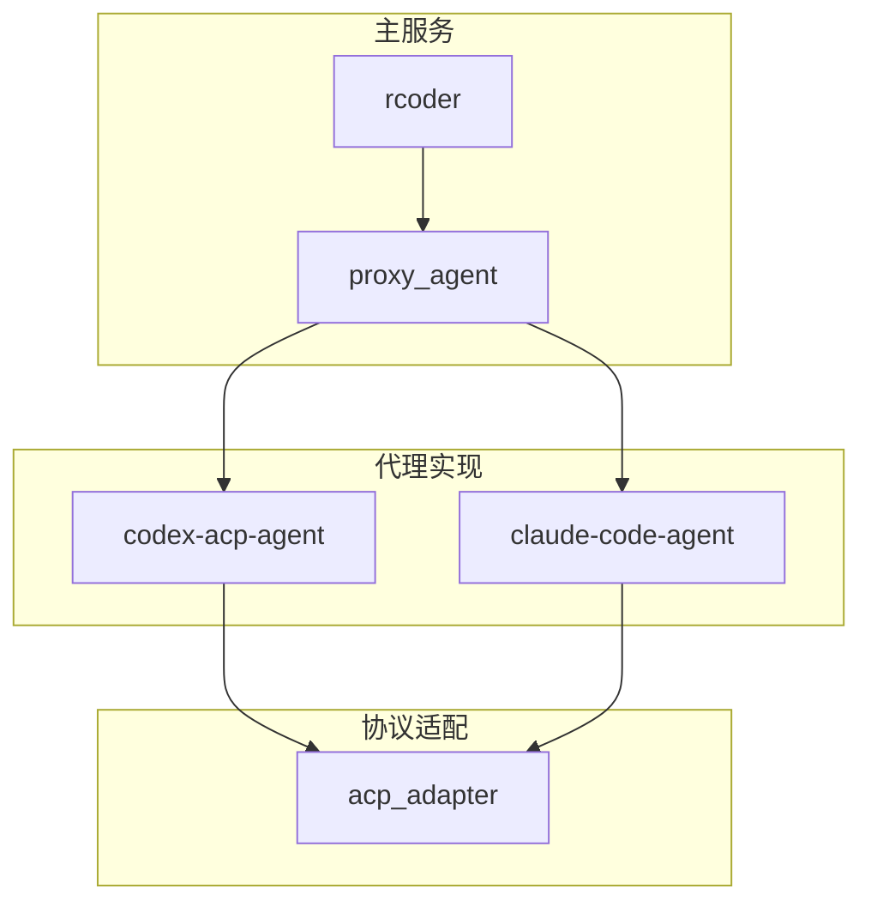
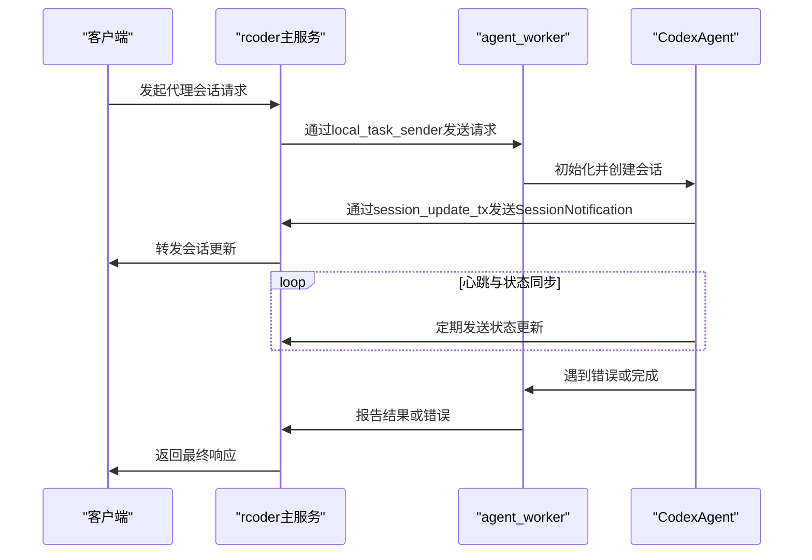
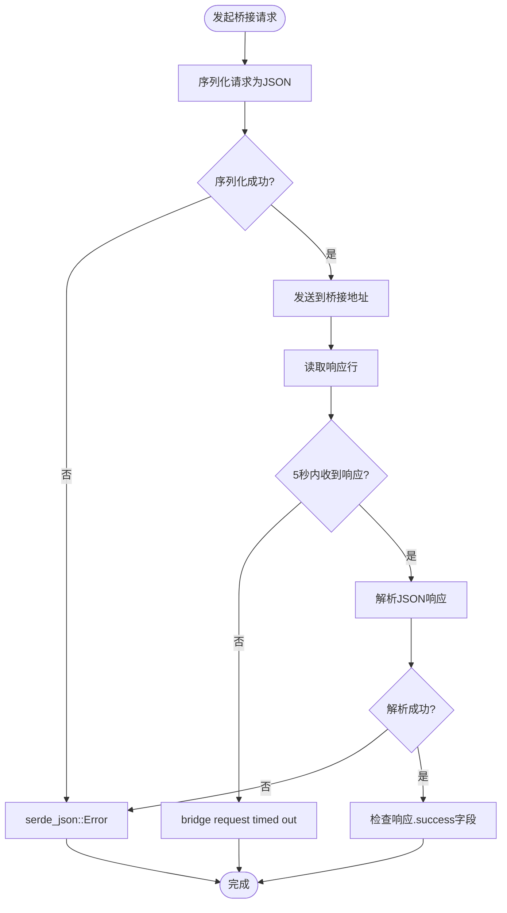
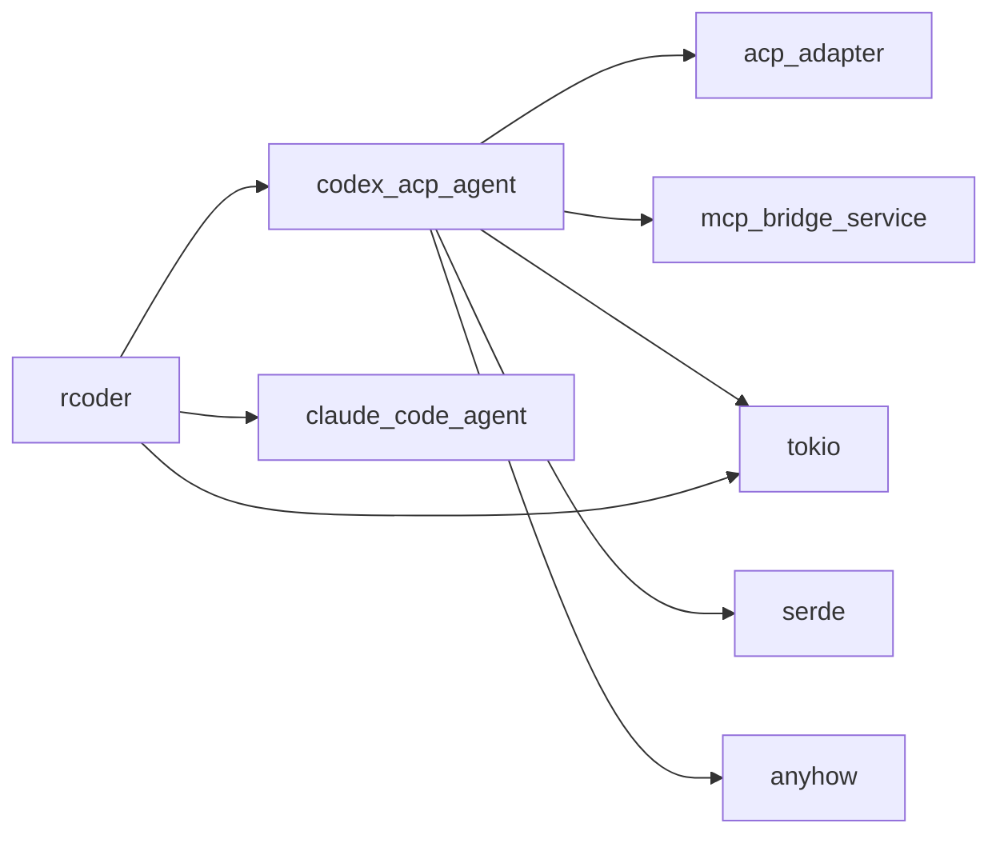

# AI代理集成错误

<cite>
**本文档引用文件**  
- [agent.rs](file://crates/codex-acp-agent/src/agent.rs)
- [mcp_server.rs](file://crates/codex-acp-agent/src/fs/mcp_server.rs)
- [agent_model.rs](file://crates/rcoder/src/model/agent_model.rs)
- [agent_session_notify.rs](file://crates/rcoder/src/model/agent_session_notify.rs)
- [app_error.rs](file://crates/rcoder/src/model/app_error.rs)
- [codex_agent.rs](file://crates/rcoder/src/proxy_agent/codex_agent.rs)
- [main.rs](file://crates/rcoder/src/main.rs)
</cite>

## 目录
1. [引言](#引言)
2. [项目结构](#项目结构)
3. [核心组件](#核心组件)
4. [架构概览](#架构概览)
5. [详细组件分析](#详细组件分析)
6. [依赖关系分析](#依赖关系分析)
7. [性能考虑](#性能考虑)
8. [故障排查指南](#故障排查指南)
9. [结论](#结论)

## 引言
本文档旨在系统性地分析Codex和Claude Code AI代理在与ACP协议集成过程中可能出现的各类错误。重点涵盖初始化失败、指令执行异常、状态同步不一致、代理进程崩溃及消息序列化通信中断等问题。通过深入解析`acp_adapter`、`codex-acp-agent`和`claude-code-agent`等核心模块，提供全面的错误识别、日志采集、环境验证和恢复策略，以提升AI代理系统的稳定性和可维护性。

## 项目结构
项目采用Rust的多crate工作区结构，核心功能模块化分离。`rcoder`作为主服务，通过`proxy_agent`模块集成`codex-acp-agent`和`claude-code-agent`。`codex-acp-agent`负责与MCP（Model Control Protocol）桥接，实现文件系统操作。`acp_adapter`提供与ACP协议交互的抽象层。这种设计实现了关注点分离，但也引入了跨进程通信和状态同步的复杂性。

**图示来源**
- [project_structure](file://#L1-L50)

## 核心组件
核心组件包括`CodexAgent`结构体，它管理会话状态、与MCP桥接通信，并处理来自ACP协议的会话更新。`agent_worker`在独立的单线程Tokio运行时中执行，以处理非`Send`的本地任务。`SessionState`跟踪代理的推理过程，而`FsBridge`则负责与外部文件系统代理进行异步I/O操作。

**本节来源**
- [agent.rs](file://crates/codex-acp-agent/src/agent.rs#L89-L99)
- [main.rs](file://crates/rcoder/src/main.rs#L45-L76)

## 架构概览
系统采用基于消息传递的异步架构。主服务`rcoder`通过无界通道（`mpsc::unbounded_channel`）与运行在独立线程中的`agent_worker`通信。`agent_worker`负责初始化代理、创建会话并处理`SessionNotification`。代理通过`session_update_tx`将状态更新发送回主服务，主服务再将其转发给客户端。这种设计隔离了代理的执行环境，但也要求精确的错误处理和超时管理。

**图示来源**
- [main.rs](file://crates/rcoder/src/main.rs#L45-L76)
- [codex_agent.rs](file://crates/rcoder/src/proxy_agent/codex_agent.rs#L121-L157)

## 详细组件分析

### ACP协议握手失败分析
握手失败通常发生在`client_conn.initialize()`调用期间。`InitializeRequest`包含协议版本和客户端能力。如果代理实现不兼容当前ACP协议版本，或`client_capabilities`配置错误，初始化将失败。此外，`agent_worker`的启动失败（如线程创建或Tokio运行时构建失败）也会导致握手无法开始。

**本节来源**
- [codex_agent.rs](file://crates/rcoder/src/proxy_agent/codex_agent.rs#L157)
- [main.rs](file://crates/rcoder/src/main.rs#L45-L76)

### 命令响应超时与通信中断
命令响应超时主要发生在与MCP桥接的通信中。`perform_bridge_request`函数设置了5秒的超时。如果桥接服务无响应或网络延迟过高，`timeout(Duration::from_secs(5), reader.next_line())`将返回错误。消息序列化错误（serde）是通信中断的常见原因，例如在`write_message`中`serde_json::to_string(&value)`失败，或在读取响应时`serde_json::from_str(&line)`解析失败，这会直接中断通信流。

**图示来源**
- [mcp_server.rs](file://crates/codex-acp-agent/src/fs/mcp_server.rs#L698-L734)
- [mcp_server.rs](file://crates/codex-acp-agent/src/fs/mcp_server.rs#L736-L765)

### 会话状态不一致问题
会话状态由`CodexAgent`中的`Rc<RefCell<HashMap<String, SessionState>>>`管理。`with_session_state_mut`方法提供对特定会话状态的可变引用。状态不一致可能源于并发访问或状态更新丢失。例如，`send_thought_chunk`通过`session_update_tx`发送更新，如果接收方通道已关闭，更新将丢失，导致客户端与代理内部状态不同步。

**本节来源**
- [agent.rs](file://crates/codex-acp-agent/src/agent.rs#L273-L310)
- [agent.rs](file://crates/codex-acp-agent/src/agent.rs#L312-L348)

## 依赖关系分析
组件间依赖关系清晰。`rcoder`直接依赖`codex-acp-agent`和`claude-code-agent`。`codex-acp-agent`依赖`acp_adapter`进行协议交互，并依赖外部的MCP桥接服务进行文件操作。`agent_worker`的执行依赖于Tokio运行时和`local_task_receiver`通道的正常工作。任何底层依赖（如Tokio、serde、anyhow）的版本不兼容都可能导致运行时错误。

**图示来源**
- [Cargo.toml](file://Cargo.toml#L1-L50)
- [main.rs](file://crates/rcoder/src/main.rs#L45-L76)

## 性能考虑
性能瓶颈主要在于跨进程/网络通信。与MCP桥接的每次操作都有5秒超时，频繁的I/O操作可能成为性能瓶颈。`agent_worker`运行在单线程运行时中，虽然避免了`Send`约束，但也限制了并行处理能力。大量会话同时运行可能导致`agent_worker`线程过载。建议监控`cleanup_task`的执行频率和`idle_timeout`，以优化资源回收。

## 故障排查指南
当遇到代理集成错误时，请按以下步骤排查：

1.  **检查代理日志**：查找`agent worker panicked`等关键错误标识。`main.rs`中的`error!`和`warn!`宏是重要的日志来源。
2.  **验证可执行文件**：确保`codex-acp-agent`和`claude-code-agent`的可执行文件存在于`PATH`中，并具有正确的执行权限。
3.  **检查依赖版本**：核对`Cargo.toml`中`serde`, `tokio`, `anyhow`等库的版本是否与`rcoder`主服务兼容。
4.  **分析错误类型**：
    *   若错误包含`serde_json::Error`，检查`app_error.rs`中的定义，问题出在JSON序列化/反序列化。
    *   若错误包含`bridge request timed out`，检查MCP桥接服务是否正常运行且网络可达。
    *   若错误包含`failed to run agent worker`，检查线程和Tokio运行时的启动环境。
5.  **模拟测试**：使用`test_proxy.sh`等脚本模拟请求，观察代理行为。
6.  **重启策略**：对于偶发性错误，可尝试重启`rcoder`服务。对于频繁崩溃，需根据日志定位根本原因。

**本节来源**
- [main.rs](file://crates/rcoder/src/main.rs#L45-L76)
- [app_error.rs](file://crates/rcoder/src/model/app_error.rs#L0-L24)
- [mcp_server.rs](file://crates/codex-acp-agent/src/fs/mcp_server.rs#L698-L734)

## 结论
AI代理集成涉及复杂的异步通信和状态管理。通过理解`acp_adapter`的协议交互、`agent_worker`的执行模型以及`serde`在消息传递中的核心作用，可以有效诊断和解决初始化失败、超时和状态不一致等问题。建立完善的日志采集和环境验证流程是保障系统稳定运行的关键。