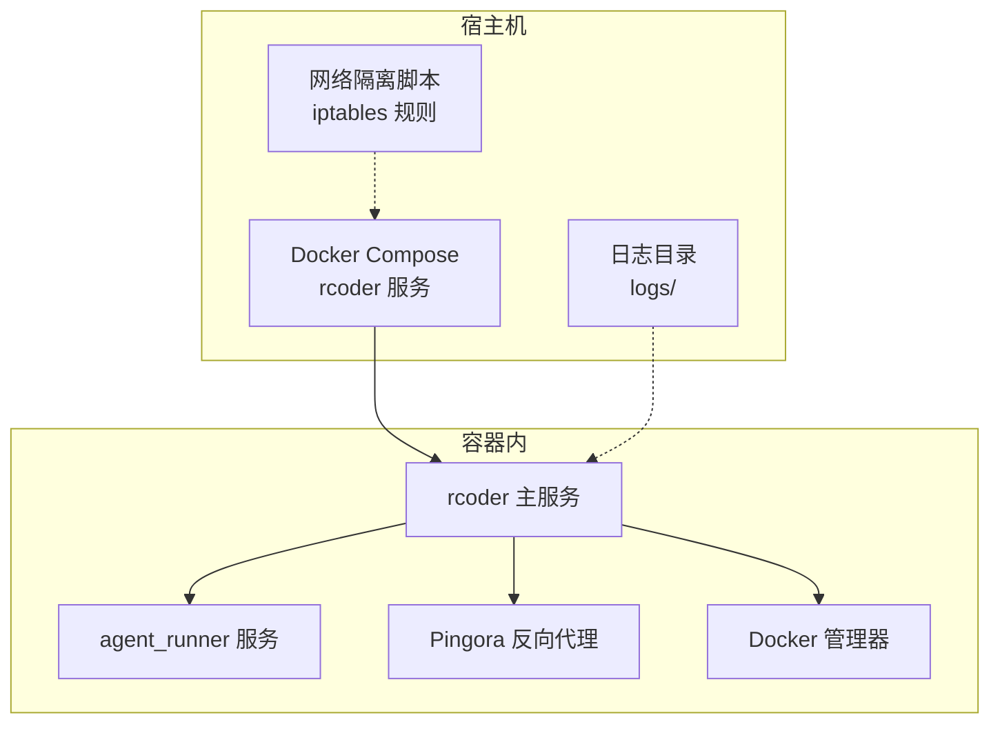
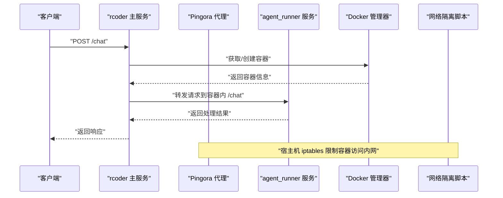
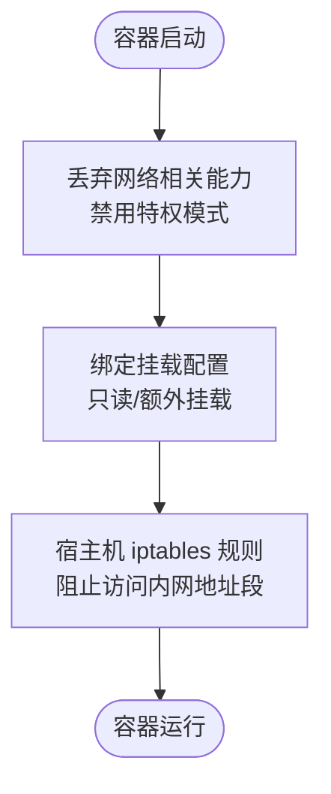
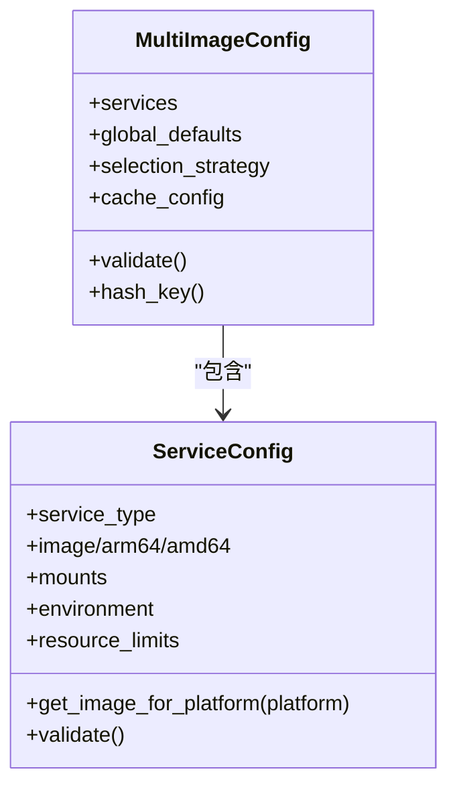
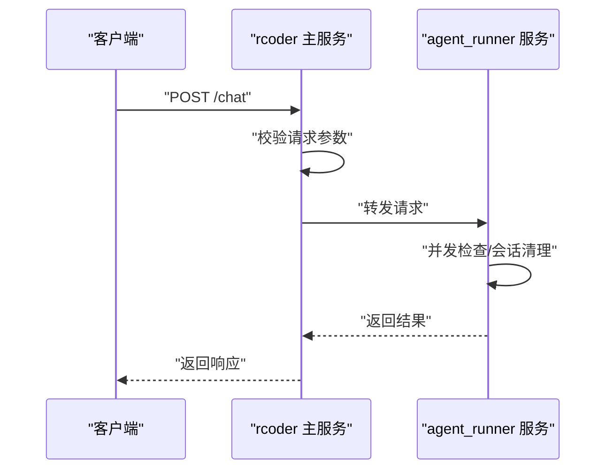
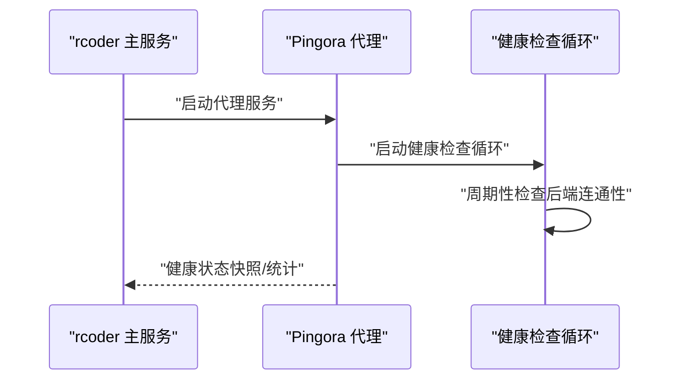
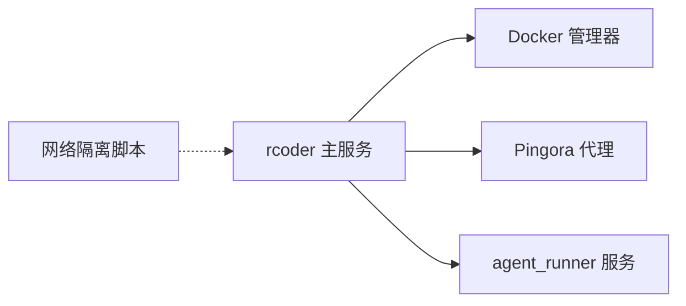

# 安全考虑

<cite>
**本文引用的文件**
- [docker/Dockerfile](file://docker/Dockerfile)
- [scripts/setup-network-isolation.sh](file://scripts/setup-network-isolation.sh)
- [docker/docker-compose.yml](file://docker/docker-compose.yml)
- [config.yml](file://config.yml)
- [crates/rcoder/src/main.rs](file://crates/rcoder/src/main.rs)
- [crates/agent_runner/src/main.rs](file://crates/agent_runner/src/main.rs)
- [crates/rcoder/src/config.rs](file://crates/rcoder/src/config.rs)
- [crates/agent_runner/src/config.rs](file://crates/agent_runner/src/config.rs)
- [crates/rcoder/src/router.rs](file://crates/rcoder/src/router.rs)
- [crates/agent_runner/src/router.rs](file://crates/agent_runner/src/router.rs)
- [crates/rcoder/src/handler/chat_handler.rs](file://crates/rcoder/src/handler/chat_handler.rs)
- [crates/agent_runner/src/handler/chat_handler.rs](file://crates/agent_runner/src/handler/chat_handler.rs)
- [crates/rcoder/src/middleware/tracing_middleware.rs](file://crates/rcoder/src/middleware/tracing_middleware.rs)
- [crates/agent_runner/src/middleware/tracing_middleware.rs](file://crates/agent_runner/src/middleware/tracing_middleware.rs)
- [crates/docker_manager/src/manager.rs](file://crates/docker_manager/src/manager.rs)
- [crates/shared_types/src/multi_image_config.rs](file://crates/shared_types/src/multi_image_config.rs)
- [crates/shared_types/src/service_config.rs](file://crates/shared_types/src/service_config.rs)
- [crates/pingora-proxy/src/service.rs](file://crates/pingora-proxy/src/service.rs)
- [crates/agent_runner/src/utils/system_prompt.rs](file://crates/agent_runner/src/utils/system_prompt.rs)
</cite>

## 目录
1. [简介](#简介)
2. [项目结构与安全边界](#项目结构与安全边界)
3. [核心安全组件](#核心安全组件)
4. [架构总览](#架构总览)
5. [详细组件安全分析](#详细组件安全分析)
6. [依赖关系与耦合分析](#依赖关系与耦合分析)
7. [性能与安全权衡](#性能与安全权衡)
8. [故障排查与安全审计](#故障排查与安全审计)
9. [结论](#结论)

## 简介
本章节系统阐述 RCoder 在部署与运行中的安全实践，围绕容器隔离、挂载权限控制、镜像来源验证、API 访问控制、输入验证与防滥用、敏感信息管理、网络隔离脚本、日志与审计、漏洞扫描与最小权限原则等方面展开。文档旨在帮助运维与开发人员在保障功能完备的同时，提升系统的安全性与可审计性。

## 项目结构与安全边界
- 容器运行时：通过 Docker Compose 启动主服务与代理服务，主服务暴露端口并可选启用反向代理；Agent Runner 作为容器内服务参与聊天处理。
- 网络隔离：提供宿主机侧网络隔离脚本，基于 iptables 限制容器对内网地址段的访问。
- 配置管理：支持命令行参数、环境变量与配置文件的多级覆盖；敏感信息建议通过环境变量注入，避免明文写入配置文件。
- 日志与可观测性：内置 OpenTelemetry 与结构化日志，支持按天滚动与 trace_id 传播，便于审计与定位问题。

图表来源
- [docker/docker-compose.yml](file://docker/docker-compose.yml#L1-L37)
- [crates/rcoder/src/main.rs](file://crates/rcoder/src/main.rs#L210-L272)
- [crates/agent_runner/src/main.rs](file://crates/agent_runner/src/main.rs#L120-L178)
- [crates/pingora-proxy/src/service.rs](file://crates/pingora-proxy/src/service.rs#L556-L596)

章节来源
- [docker/docker-compose.yml](file://docker/docker-compose.yml#L1-L37)
- [crates/rcoder/src/main.rs](file://crates/rcoder/src/main.rs#L210-L272)
- [crates/agent_runner/src/main.rs](file://crates/agent_runner/src/main.rs#L120-L178)

## 核心安全组件
- 容器隔离与能力控制：容器启动时丢弃网络相关能力，禁用特权模式，降低逃逸风险。
- 网络隔离脚本：在宿主机 iptables 上为 rcoder- 前缀网络添加规则，阻止访问常见内网地址段。
- 配置与环境变量：支持环境变量覆盖端口、工作目录、网络模式、自动清理、容器 TTL 等，敏感信息建议通过环境变量注入。
- 日志与追踪：结构化 JSON 日志按天滚动，trace_id 传播，便于审计与关联分析。
- 反向代理与健康检查：Pingora 代理提供后端健康检查与统计接口，便于监控与故障定位。

章节来源
- [crates/docker_manager/src/manager.rs](file://crates/docker_manager/src/manager.rs#L147-L165)
- [scripts/setup-network-isolation.sh](file://scripts/setup-network-isolation.sh#L1-L112)
- [crates/rcoder/src/config.rs](file://crates/rcoder/src/config.rs#L212-L239)
- [crates/agent_runner/src/config.rs](file://crates/agent_runner/src/config.rs#L134-L171)
- [crates/rcoder/src/main.rs](file://crates/rcoder/src/main.rs#L274-L321)
- [crates/agent_runner/src/main.rs](file://crates/agent_runner/src/main.rs#L181-L232)
- [crates/pingora-proxy/src/service.rs](file://crates/pingora-proxy/src/service.rs#L556-L596)

## 架构总览
下图展示 RCoder 主服务、Agent Runner、Pingora 代理与 Docker 管理器之间的交互，以及网络隔离脚本对宿主机网络的影响。

图表来源
- [crates/rcoder/src/handler/chat_handler.rs](file://crates/rcoder/src/handler/chat_handler.rs#L323-L431)
- [crates/agent_runner/src/handler/chat_handler.rs](file://crates/agent_runner/src/handler/chat_handler.rs#L174-L321)
- [crates/docker_manager/src/manager.rs](file://crates/docker_manager/src/manager.rs#L105-L165)
- [scripts/setup-network-isolation.sh](file://scripts/setup-network-isolation.sh#L70-L95)

章节来源
- [crates/rcoder/src/router.rs](file://crates/rcoder/src/router.rs#L52-L84)
- [crates/agent_runner/src/router.rs](file://crates/agent_runner/src/router.rs#L40-L70)

## 详细组件安全分析

### 容器隔离与挂载权限控制
- 能力与特权控制
  - 容器启动时丢弃网络原始与管理能力，禁用特权模式，降低容器逃逸与网络嗅探风险。
- 挂载策略
  - 默认挂载类型为 bind，部分服务挂载路径允许只读或额外绑定，需谨慎评估挂载路径与权限。
- 网络隔离脚本
  - 通过查找 rcoder- 前缀网络，为每个网络子网添加 DROP 规则，阻止访问常见内网地址段；规则在系统重启后会丢失，需持久化或开机重载。

图表来源
- [crates/docker_manager/src/manager.rs](file://crates/docker_manager/src/manager.rs#L147-L165)
- [scripts/setup-network-isolation.sh](file://scripts/setup-network-isolation.sh#L70-L95)

章节来源
- [crates/docker_manager/src/manager.rs](file://crates/docker_manager/src/manager.rs#L105-L165)
- [scripts/setup-network-isolation.sh](file://scripts/setup-network-isolation.sh#L1-L112)

### 镜像来源验证与多镜像配置
- 多镜像配置
  - 支持按服务类型选择镜像，包含全局默认与架构特定镜像，策略为仅使用服务特定配置。
- 缓存与选择
  - 提供镜像缓存配置，支持 TTL 与最大条目数；镜像选择策略为 ServiceOnly。
- 建议
  - 通过 registry 前缀与服务特定镜像保证来源可控；结合镜像签名与拉取策略，进一步强化来源可信度。

图表来源
- [crates/shared_types/src/multi_image_config.rs](file://crates/shared_types/src/multi_image_config.rs#L43-L110)
- [crates/shared_types/src/multi_image_config.rs](file://crates/shared_types/src/multi_image_config.rs#L361-L406)
- [crates/shared_types/src/service_config.rs](file://crates/shared_types/src/service_config.rs#L153-L188)

章节来源
- [crates/shared_types/src/multi_image_config.rs](file://crates/shared_types/src/multi_image_config.rs#L43-L110)
- [crates/shared_types/src/multi_image_config.rs](file://crates/shared_types/src/multi_image_config.rs#L361-L406)
- [crates/shared_types/src/service_config.rs](file://crates/shared_types/src/service_config.rs#L153-L188)

### API 端点访问控制、输入验证与防滥用
- 访问控制
  - 当前未实现显式的鉴权/授权中间件；建议在反向代理层或网关处增加认证与授权策略。
- 输入验证
  - 主服务与 Agent Runner 均对请求进行基本校验（如 prompt 非空），并在业务层进行并发控制与会话清理。
- 防滥用
  - 通过并发请求限制与会话缓存清理，避免同一项目下的并发冲突；建议引入速率限制中间件或上游限流策略。

图表来源
- [crates/rcoder/src/handler/chat_handler.rs](file://crates/rcoder/src/handler/chat_handler.rs#L108-L170)
- [crates/agent_runner/src/handler/chat_handler.rs](file://crates/agent_runner/src/handler/chat_handler.rs#L174-L238)

章节来源
- [crates/rcoder/src/handler/chat_handler.rs](file://crates/rcoder/src/handler/chat_handler.rs#L108-L170)
- [crates/agent_runner/src/handler/chat_handler.rs](file://crates/agent_runner/src/handler/chat_handler.rs#L174-L238)

### 配置文件与敏感信息管理
- 配置优先级
  - 命令行参数 > 环境变量 > 配置文件 > 默认配置；Docker 配置支持环境变量覆盖。
- 敏感信息建议
  - 将密钥、令牌等敏感信息通过环境变量注入，避免写入 config.yml；必要时使用密钥管理服务或容器编排平台的机密存储。
- 配置文件生成
  - 首次启动会生成默认配置文件，建议在部署时以只读方式挂载或通过环境变量覆盖。

章节来源
- [crates/rcoder/src/config.rs](file://crates/rcoder/src/config.rs#L253-L332)
- [crates/agent_runner/src/config.rs](file://crates/agent_runner/src/config.rs#L110-L191)
- [config.yml](file://config.yml#L1-L161)

### 网络隔离脚本实施与影响
- 规则生效范围
  - 为 rcoder- 前缀网络添加 DROP 规则，阻止访问常见内网地址段；规则在系统重启后会丢失，需持久化。
- 实施建议
  - 将脚本加入系统启动项或 systemd 服务；定期检查规则有效性；结合防火墙策略与网络命名空间进一步加固。

章节来源
- [scripts/setup-network-isolation.sh](file://scripts/setup-network-isolation.sh#L1-L112)

### 日志与追踪、健康检查与可观测性
- 日志
  - 结构化 JSON 日志按天滚动，支持 trace_id 传播，便于审计与跨服务关联。
- 追踪
  - 中间件生成并传播 trace_id，便于端到端链路追踪。
- 健康检查
  - Pingora 代理提供健康检查循环与统计接口，便于监控后端健康状态。

图表来源
- [crates/rcoder/src/main.rs](file://crates/rcoder/src/main.rs#L168-L209)
- [crates/agent_runner/src/main.rs](file://crates/agent_runner/src/main.rs#L80-L121)
- [crates/pingora-proxy/src/service.rs](file://crates/pingora-proxy/src/service.rs#L556-L596)

章节来源
- [crates/rcoder/src/main.rs](file://crates/rcoder/src/main.rs#L274-L321)
- [crates/agent_runner/src/main.rs](file://crates/agent_runner/src/main.rs#L181-L232)
- [crates/pingora-proxy/src/service.rs](file://crates/pingora-proxy/src/service.rs#L556-L596)

### 最小权限原则与系统提示词约束
- 最小权限
  - 容器禁用特权模式并丢弃网络相关能力，减少潜在攻击面。
- 系统提示词约束
  - Agent Runner 的系统提示词包含多项安全禁令，禁止内网探测、反向 Shell、框架转换等行为，有助于降低风险。

章节来源
- [crates/docker_manager/src/manager.rs](file://crates/docker_manager/src/manager.rs#L147-L165)
- [crates/agent_runner/src/utils/system_prompt.rs](file://crates/agent_runner/src/utils/system_prompt.rs#L96-L115)

## 依赖关系与耦合分析
- 组件耦合
  - rcoder 主服务依赖 Docker 管理器进行容器生命周期管理；与 Pingora 代理耦合用于后端发现与健康检查；与 Agent Runner 通过容器内通信协作。
- 外部依赖
  - Docker API、iptables、Pingora 代理、OpenTelemetry/Tracing。
- 潜在风险
  - Docker socket 挂载与权限配置不当可能导致容器逃逸；网络隔离规则缺失可能使容器访问内网。

图表来源
- [crates/rcoder/src/main.rs](file://crates/rcoder/src/main.rs#L111-L158)
- [crates/agent_runner/src/main.rs](file://crates/agent_runner/src/main.rs#L120-L178)
- [scripts/setup-network-isolation.sh](file://scripts/setup-network-isolation.sh#L52-L95)

章节来源
- [crates/rcoder/src/main.rs](file://crates/rcoder/src/main.rs#L111-L158)
- [crates/agent_runner/src/main.rs](file://crates/agent_runner/src/main.rs#L120-L178)

## 性能与安全权衡
- 性能
  - 容器能力限制与网络隔离会带来一定开销，但显著降低逃逸与横向移动风险。
- 安全
  - 建议在生产环境启用严格的镜像来源验证、最小权限与网络隔离；结合速率限制与上游防护，平衡吞吐与安全。

[本节为通用指导，无需引用具体文件]

## 故障排查与安全审计
- 日志审计
  - 检查 logs 目录下的 JSON 日志，结合 trace_id 进行关联分析；关注健康检查失败与代理统计异常。
- 网络隔离验证
  - 使用脚本列出当前规则，确认 rcoder- 网络的 DROP 规则已生效；必要时重新加载规则。
- 配置核验
  - 确认环境变量覆盖生效，敏感信息未出现在配置文件中；检查 Docker 配置与挂载路径。
- 漏洞扫描
  - 建议对镜像进行静态扫描，识别高危漏洞；对运行时容器进行定期扫描与基线核查。

章节来源
- [crates/rcoder/src/main.rs](file://crates/rcoder/src/main.rs#L274-L321)
- [scripts/setup-network-isolation.sh](file://scripts/setup-network-isolation.sh#L97-L112)
- [crates/rcoder/src/config.rs](file://crates/rcoder/src/config.rs#L253-L332)

## 结论
RCoder 在容器隔离、网络隔离、日志与追踪方面具备良好基础。建议在生产环境中补充鉴权/授权、速率限制、镜像来源验证与漏洞扫描机制，严格使用环境变量管理敏感信息，并完善网络隔离规则的持久化与监控，以实现更全面的安全保障与可审计性。