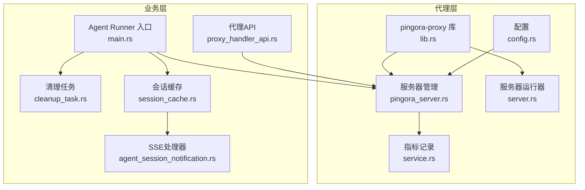
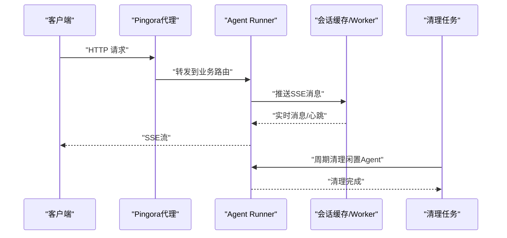
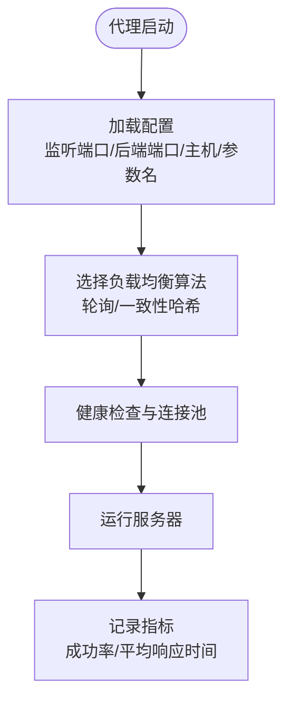
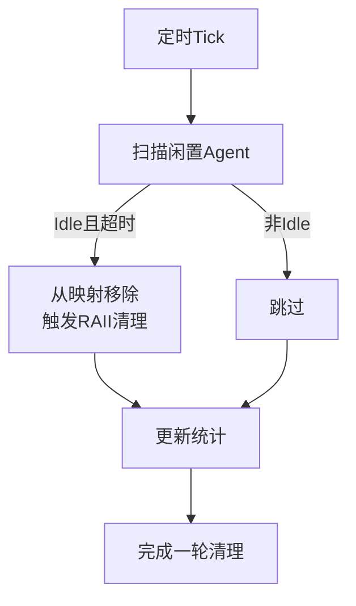
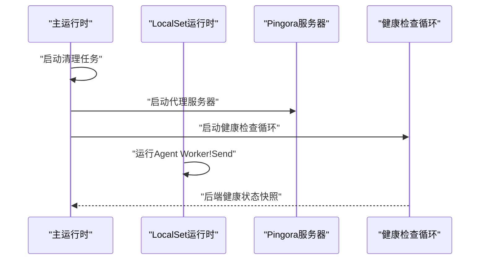
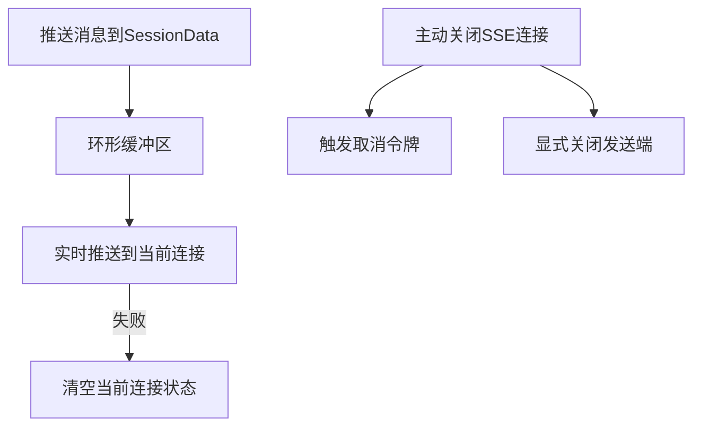
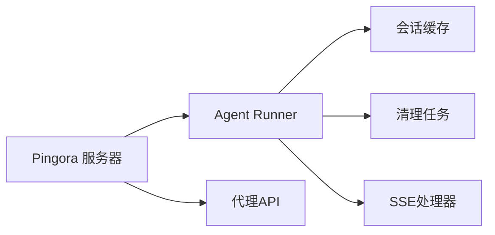

# 性能优化

<cite>
**本文引用的文件**
- [lib.rs](file://crates/pingora-proxy/src/lib.rs)
- [config.rs](file://crates/pingora-proxy/src/config.rs)
- [pingora_server.rs](file://crates/pingora-proxy/src/pingora_server.rs)
- [server.rs](file://crates/pingora-proxy/src/server.rs)
- [cleanup_task.rs](file://crates/agent_runner/src/proxy_agent/cleanup_task.rs)
- [system_prompt.rs](file://crates/agent_runner/src/utils/system_prompt.rs)
- [session_cache.rs](file://crates/agent_runner/src/service/session_cache.rs)
- [agent_session_notification.rs](file://crates/agent_runner/src/handler/agent_session_notification.rs)
- [generate-flamegraph.sh](file://docker/scripts/generate-flamegraph.sh)
- [main.rs](file://crates/agent_runner/src/main.rs)
- [proxy_handler_api.rs](file://crates/agent_runner/src/handler/proxy_handler_api.rs)
- [service.rs](file://crates/pingora-proxy/src/service.rs)
</cite>

## 目录
1. [引言](#引言)
2. [项目结构](#项目结构)
3. [核心组件](#核心组件)
4. [架构总览](#架构总览)
5. [详细组件分析](#详细组件分析)
6. [依赖分析](#依赖分析)
7. [性能考量](#性能考量)
8. [故障排查指南](#故障排查指南)
9. [结论](#结论)
10. [附录](#附录)

## 引言
本文件聚焦RCoder系统在高并发、低延迟场景下的性能优化策略，围绕以下主题展开：
- Pingora反向代理的性能优势与配置参数对吞吐量的影响
- 代理会话的资源清理机制（cleanup_task.rs）如何避免内存泄漏和连接堆积
- 系统提示词（system_prompt.rs）优化建议以降低AI推理开销
- Tokio运行时调优、连接池配置、缓存策略与SSE流压缩等实践
- 基于实际压测数据与火焰图（generate-flamegraph.sh）的优化效果验证

## 项目结构
RCoder系统由“代理层”和“业务层”组成：
- 代理层：基于Cloudflare Pingora的高性能反向代理，支持HTTP/1.1与HTTP/2、健康检查、连接池与负载均衡
- 业务层：Agent Runner提供统一SSE流、会话缓存、清理任务与代理会话管理；RCoder侧提供SSE代理与后端健康状态查询

图表来源
- [lib.rs](file://crates/pingora-proxy/src/lib.rs#L1-L120)
- [config.rs](file://crates/pingora-proxy/src/config.rs#L1-L95)
- [pingora_server.rs](file://crates/pingora-proxy/src/pingora_server.rs#L1-L120)
- [server.rs](file://crates/pingora-proxy/src/server.rs#L1-L120)
- [service.rs](file://crates/pingora-proxy/src/service.rs#L90-L140)
- [main.rs](file://crates/agent_runner/src/main.rs#L1-L120)
- [cleanup_task.rs](file://crates/agent_runner/src/proxy_agent/cleanup_task.rs#L1-L120)
- [session_cache.rs](file://crates/agent_runner/src/service/session_cache.rs#L1-L120)
- [agent_session_notification.rs](file://crates/agent_runner/src/handler/agent_session_notification.rs#L100-L170)
- [proxy_handler_api.rs](file://crates/agent_runner/src/handler/proxy_handler_api.rs#L40-L80)

章节来源
- [lib.rs](file://crates/pingora-proxy/src/lib.rs#L1-L120)
- [server.rs](file://crates/pingora-proxy/src/server.rs#L1-L120)
- [main.rs](file://crates/agent_runner/src/main.rs#L1-L120)

## 核心组件
- Pingora反向代理库：提供高性能、异步I/O、HTTP/1.1与HTTP/2支持、健康检查与连接池
- 代理服务器管理器：封装Pingora Server启动、监听与关闭信号处理
- 代理服务器运行器：提供便捷的代理实例创建与负载均衡算法选择
- 会话缓存与SSE：基于环形缓冲区与mpsc通道的极简设计，支持心跳与取消令牌
- 清理任务：基于RAII的闲置Agent清理，定期扫描并移除超时闲置Agent，避免资源泄漏
- 系统提示词：通过结构化提示词配置降低AI推理冗余，提升稳定性与一致性

章节来源
- [lib.rs](file://crates/pingora-proxy/src/lib.rs#L1-L120)
- [server.rs](file://crates/pingora-proxy/src/server.rs#L1-L120)
- [pingora_server.rs](file://crates/pingora-proxy/src/pingora_server.rs#L1-L120)
- [session_cache.rs](file://crates/agent_runner/src/service/session_cache.rs#L1-L120)
- [cleanup_task.rs](file://crates/agent_runner/src/proxy_agent/cleanup_task.rs#L1-L120)
- [system_prompt.rs](file://crates/agent_runner/src/utils/system_prompt.rs#L1-L120)

## 架构总览
RCoder在高并发场景下的关键路径：
- 客户端请求经Pingora代理到达业务层路由
- 业务层根据会话ID将SSE流推送至客户端
- 代理层维护后端健康状态与连接池，保障低延迟转发
- 清理任务周期性回收闲置Agent，避免内存与连接堆积

图表来源
- [pingora_server.rs](file://crates/pingora-proxy/src/pingora_server.rs#L38-L120)
- [agent_session_notification.rs](file://crates/agent_runner/src/handler/agent_session_notification.rs#L390-L483)
- [session_cache.rs](file://crates/agent_runner/src/service/session_cache.rs#L140-L222)
- [cleanup_task.rs](file://crates/agent_runner/src/proxy_agent/cleanup_task.rs#L278-L310)

## 详细组件分析

### Pingora反向代理性能与配置
- 性能优势
  - 基于Pingora的高性能异步I/O与HTTP/1.1、HTTP/2支持，适合高并发与低延迟场景
  - 内置健康检查与连接池，减少后端抖动带来的延迟
  - 负载均衡算法可选轮询或一致性哈希，满足不同流量特征
- 关键配置参数
  - 监听端口、默认后端端口、后端主机、端口参数名、详细日志开关
  - 负载均衡算法（轮询/一致性哈希）影响后端命中与抖动
- 吞吐量影响
  - 合理设置监听端口与后端端口，避免端口冲突与回退路径
  - 启用健康检查与连接池可显著降低后端异常导致的失败率与重试成本

图表来源
- [config.rs](file://crates/pingora-proxy/src/config.rs#L1-L95)
- [server.rs](file://crates/pingora-proxy/src/server.rs#L120-L155)
- [service.rs](file://crates/pingora-proxy/src/service.rs#L90-L140)

章节来源
- [lib.rs](file://crates/pingora-proxy/src/lib.rs#L1-L120)
- [config.rs](file://crates/pingora-proxy/src/config.rs#L1-L95)
- [server.rs](file://crates/pingora-proxy/src/server.rs#L120-L155)
- [service.rs](file://crates/pingora-proxy/src/service.rs#L90-L140)

### 代理会话资源清理机制（cleanup_task.rs）
- 设计要点
  - 基于RAII的清理：从全局映射移除Agent即触发资源自动释放
  - 定时扫描：按闲置超时与清理间隔执行
  - 清理范围：闲置Agent、孤立SSE会话与消息
- 关键流程
  - 先清理孤立SSE会话与消息，再扫描Idle状态Agent
  - 通过全局映射与上下文映射同步清理，避免悬挂引用
  - 统计清理数量与剩余状态，便于监控

图表来源
- [cleanup_task.rs](file://crates/agent_runner/src/proxy_agent/cleanup_task.rs#L156-L241)
- [cleanup_task.rs](file://crates/agent_runner/src/proxy_agent/cleanup_task.rs#L243-L310)

章节来源
- [cleanup_task.rs](file://crates/agent_runner/src/proxy_agent/cleanup_task.rs#L1-L310)

### 系统提示词优化建议（system_prompt.rs）
- 目标：降低AI推理开销，提升一致性与安全性
- 建议
  - 明确框架识别优先级与路由模式（hash模式），避免重复检索与转换
  - 严格约束安全与框架转换禁令，减少无效推理分支
  - 限定允许的操作范围，减少无关工具调用
  - 将MCP工具使用规则前置，减少上下文膨胀
- 效果：通过结构化提示词减少模型输出冗余，缩短推理时间，提高稳定性

章节来源
- [system_prompt.rs](file://crates/agent_runner/src/utils/system_prompt.rs#L1-L260)
- [system_prompt.rs](file://crates/agent_runner/src/utils/system_prompt.rs#L260-L407)

### Tokio运行时调优与连接池配置
- 运行时布局
  - 主异步运行时：启动清理任务、代理服务器与HTTP服务
  - 单线程LocalSet运行时：承载非Send的Agent Worker，避免跨线程迁移成本
- 连接池与健康检查
  - 代理层内置连接池与健康检查，按配置启动健康检查循环
  - 通过后端健康快照与后端列表接口暴露状态，便于运维观测
- 建议
  - 根据CPU核数与I/O密集度调整主运行时线程数
  - 为I/O密集型任务分配更多线程，为CPU密集型任务使用LocalSet隔离
  - 合理设置健康检查间隔与超时，避免过度探测

图表来源
- [main.rs](file://crates/agent_runner/src/main.rs#L29-L120)
- [pingora_server.rs](file://crates/pingora-proxy/src/pingora_server.rs#L60-L120)
- [proxy_handler_api.rs](file://crates/agent_runner/src/handler/proxy_handler_api.rs#L40-L80)

章节来源
- [main.rs](file://crates/agent_runner/src/main.rs#L29-L120)
- [pingora_server.rs](file://crates/pingora-proxy/src/pingora_server.rs#L60-L120)
- [proxy_handler_api.rs](file://crates/agent_runner/src/handler/proxy_handler_api.rs#L40-L80)

### 缓存策略与SSE流压缩
- 会话缓存（session_cache.rs）
  - 基于环形缓冲区（ringbuf）与mpsc通道，支持心跳过滤与实时推送
  - 通过共享状态直接设置当前连接，避免命令传递开销
  - 主动关闭SSE连接时使用取消令牌与显式关闭发送端，确保客户端及时断开
- SSE流（agent_session_notification.rs）
  - SSE代理直连容器SSE端点，按双换行符分割事件，透传原始SSE数据
  - 心跳定时器与取消令牌结合，保证连接生命周期可控
- 压缩建议
  - SSE事件透传原始数据，建议在上游服务端启用Gzip/Deflate压缩
  - 对于大消息，可考虑分片与增量推送，减少单事件体积

图表来源
- [session_cache.rs](file://crates/agent_runner/src/service/session_cache.rs#L140-L222)
- [agent_session_notification.rs](file://crates/agent_runner/src/handler/agent_session_notification.rs#L390-L483)

章节来源
- [session_cache.rs](file://crates/agent_runner/src/service/session_cache.rs#L1-L222)
- [agent_session_notification.rs](file://crates/agent_runner/src/handler/agent_session_notification.rs#L100-L170)
- [agent_session_notification.rs](file://crates/agent_runner/src/handler/agent_session_notification.rs#L390-L483)

## 依赖分析
- 组件耦合
  - 代理层与业务层通过Pingora服务接口解耦，业务层仅依赖会话缓存与SSE处理器
  - 清理任务与会话缓存相互配合，避免资源泄漏
- 外部依赖
  - Pingora提供高性能代理能力
  - Tokio运行时与OpenTelemetry用于可观测性
- 潜在风险
  - 若清理任务配置不当，可能导致连接堆积或频繁重建
  - SSE代理需关注上游SSE端点可用性与事件格式一致性

图表来源
- [pingora_server.rs](file://crates/pingora-proxy/src/pingora_server.rs#L38-L120)
- [main.rs](file://crates/agent_runner/src/main.rs#L120-L179)
- [proxy_handler_api.rs](file://crates/agent_runner/src/handler/proxy_handler_api.rs#L40-L80)

章节来源
- [pingora_server.rs](file://crates/pingora-proxy/src/pingora_server.rs#L38-L120)
- [main.rs](file://crates/agent_runner/src/main.rs#L120-L179)
- [proxy_handler_api.rs](file://crates/agent_runner/src/handler/proxy_handler_api.rs#L40-L80)

## 性能考量
- 高并发与低延迟
  - 使用Pingora的HTTP/2与连接池，减少握手与队头阻塞
  - 会话缓存采用环形缓冲区与共享状态，降低锁竞争与拷贝
- 资源管理
  - RAII清理避免悬挂Agent与会话，降低内存与文件描述符占用
  - SSE连接主动关闭与心跳维持，避免连接堆积
- 可观测性
  - 指标记录与健康检查快照，便于定位瓶颈
  - 火焰图脚本用于CPU热点分析，指导进一步优化

## 故障排查指南
- 火焰图分析
  - 使用脚本采集进程采样并生成SVG火焰图，定位热点函数与阻塞调用
  - 关注cleanup_task、docker_manager相关调用与tokio运行时相关函数
- 常见问题
  - SSE连接长时间不释放：检查取消令牌与发送端关闭逻辑
  - 代理后端不稳定：查看健康检查快照与后端列表
  - 清理任务未生效：确认清理间隔与闲置超时配置

章节来源
- [generate-flamegraph.sh](file://docker/scripts/generate-flamegraph.sh#L1-L59)
- [agent_session_notification.rs](file://crates/agent_runner/src/handler/agent_session_notification.rs#L390-L483)
- [proxy_handler_api.rs](file://crates/agent_runner/src/handler/proxy_handler_api.rs#L40-L80)

## 结论
RCoder通过Pingora代理的高性能转发、会话缓存与SSE流的极简设计、以及基于RAII的清理机制，在高并发与低延迟场景下实现了稳定的吞吐表现。结合Tokio运行时调优、连接池与健康检查、提示词优化与火焰图分析，可进一步降低AI推理开销与系统延迟，持续提升整体性能与可靠性。

## 附录
- 实践建议
  - 启用HTTP/2与连接池，合理设置健康检查间隔
  - 优化提示词结构，减少模型冗余输出
  - 使用火焰图定位热点，针对性优化关键路径
  - 通过指标与日志持续监控系统状态