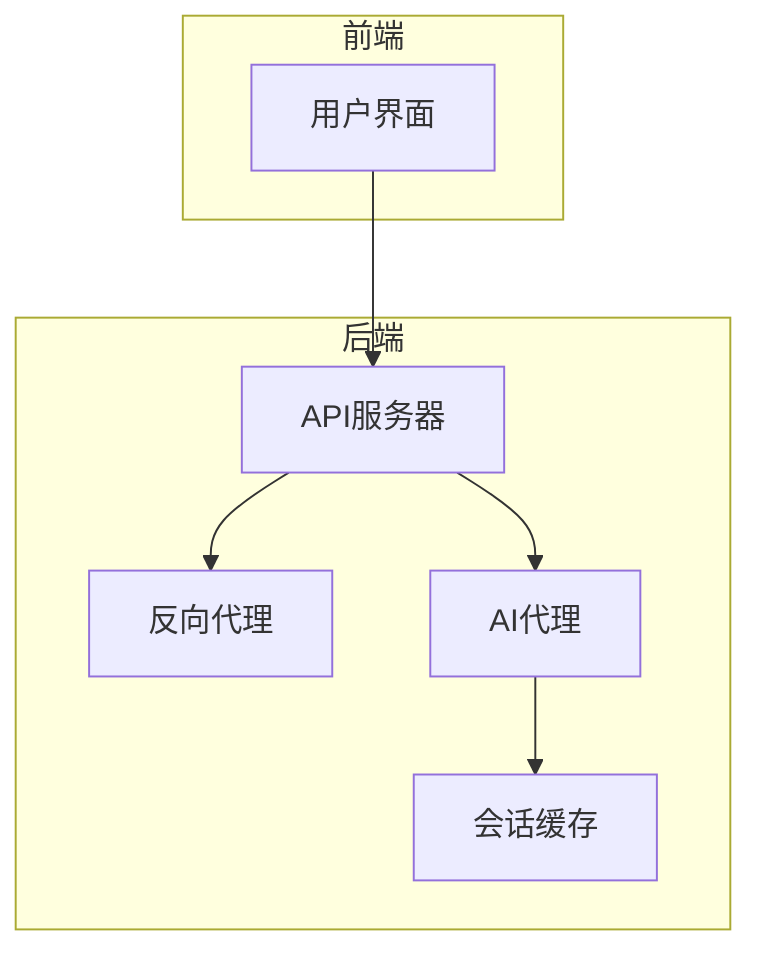
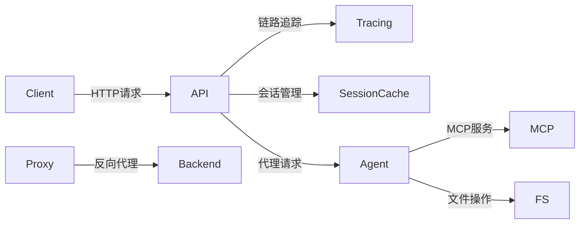
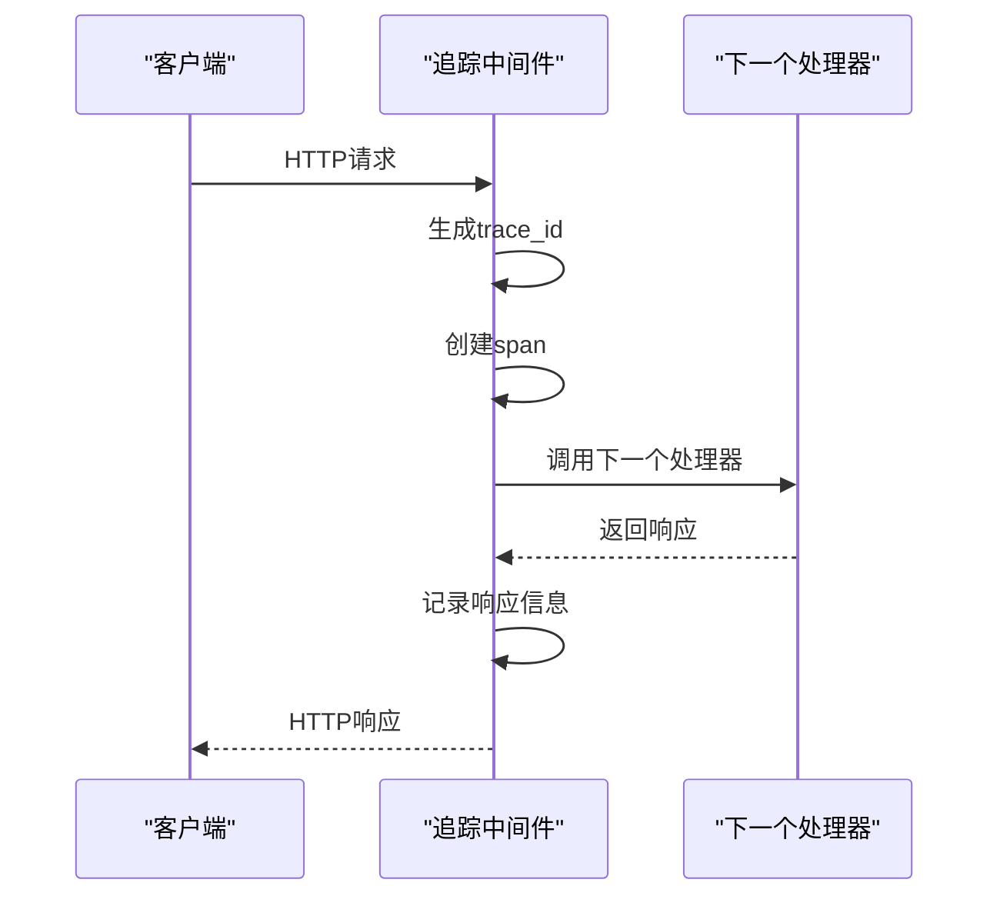
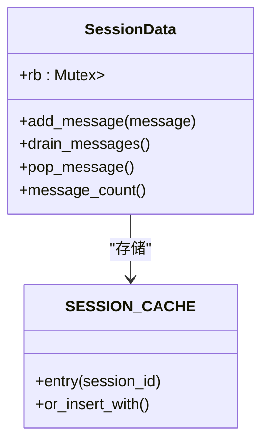
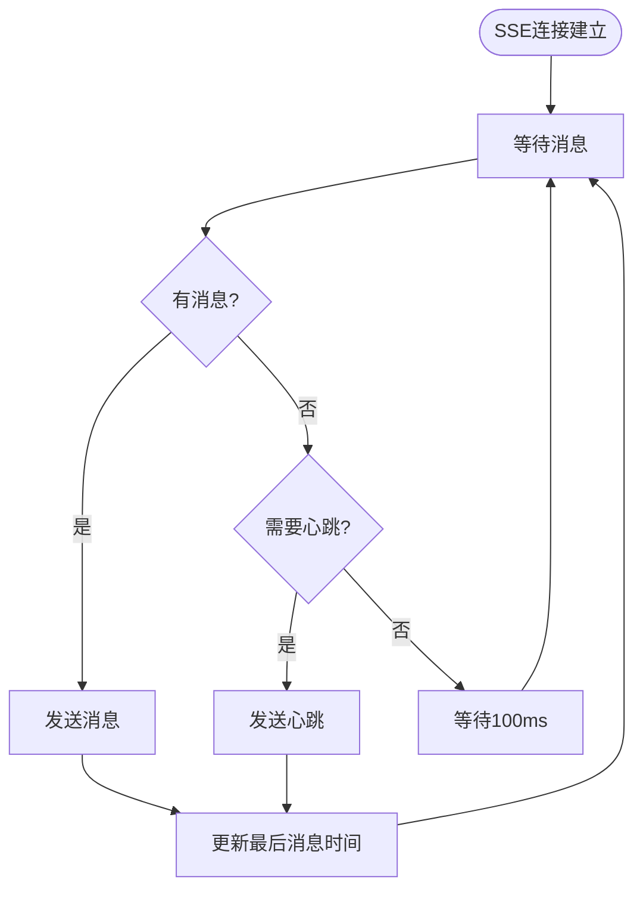
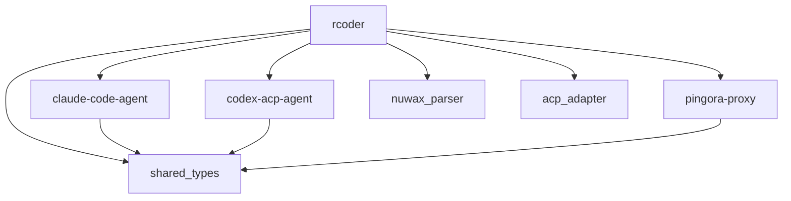

# 性能瓶颈分析

<cite>
**本文档引用的文件**
- [tracing_middleware.rs](file://crates/rcoder/src/middleware/tracing_middleware.rs)
- [session_cache.rs](file://crates/rcoder/src/service/session_cache.rs)
- [agent_session_notification.rs](file://crates/rcoder/src/handler/agent_session_notification.rs)
- [main.rs](file://crates/rcoder/src/main.rs)
- [system_prompt.rs](file://crates/rcoder/src/utils/system_prompt.rs)
- [service.rs](file://crates/pingora-proxy/src/service.rs)
</cite>

## 目录
1. [引言](#引言)
2. [项目结构](#项目结构)
3. [核心组件](#核心组件)
4. [架构概述](#架构概述)
5. [详细组件分析](#详细组件分析)
6. [依赖分析](#依赖分析)
7. [性能考量](#性能考量)
8. [故障排除指南](#故障排除指南)
9. [结论](#结论)
10. [附录](#附录)（如有必要）

## 引言
本文档旨在提供全面的性能瓶颈分析指南，帮助用户识别和解决延迟高、吞吐量低、内存占用过大等问题。通过深入分析代码库中的关键组件，我们将探讨如何利用链路追踪数据定位耗时最长的处理阶段，评估会话缓存可能引发的内存泄漏风险，并分析大规模SSE连接对Tokio运行时的压力。此外，我们还将提供性能基准测试方法和优化建议，以提升系统的整体性能。

## 项目结构
本项目采用模块化设计，主要分为以下几个核心模块：
- **crates/rcoder**: 主要业务逻辑和API服务
- **crates/pingora-proxy**: 反向代理服务
- **crates/claude-code-agent**: Claude代码代理
- **crates/codex-acp-agent**: Codex ACP代理
- **crates/nuwax_parser**: 项目解析器
- **crates/acp_adapter**: ACP适配器
- **crates/shared_types**: 共享类型定义

每个模块都有其特定的职责，通过清晰的接口进行通信，确保了系统的可维护性和扩展性。



**图源**
- [main.rs](file://crates/rcoder/src/main.rs#L28)
- [service.rs](file://crates/pingora-proxy/src/service.rs#L161)

## 核心组件
### 链路追踪中间件
`tracing_middleware.rs` 实现了HTTP请求的链路追踪功能，为每个请求生成唯一的trace_id，并记录请求和响应信息。该中间件使用OpenTelemetry进行分布式追踪，有助于定位性能瓶颈。

### 会话缓存服务
`session_cache.rs` 提供了全局的会话缓存功能，使用`DashMap`和`ringbuf`实现高效的并发访问和消息循环。该组件负责存储和管理SSE连接中的会话消息。

### SSE通知处理器
`agent_session_notification.rs` 处理SSE连接，实时推送AI代理的执行进度和状态更新。该组件通过心跳机制保持连接活跃，并支持多种消息类型的推送。

**节源**
- [tracing_middleware.rs](file://crates/rcoder/src/middleware/tracing_middleware.rs#L1)
- [session_cache.rs](file://crates/rcoder/src/service/session_cache.rs#L1)
- [agent_session_notification.rs](file://crates/rcoder/src/handler/agent_session_notification.rs#L1)

## 架构概述
系统采用微服务架构，各组件通过清晰的接口进行通信。主服务`rcoder`负责处理API请求和会话管理，而`pingora-proxy`提供反向代理功能，`claude-code-agent`和`codex-acp-agent`则负责具体的AI代理任务。



**图源**
- [main.rs](file://crates/rcoder/src/main.rs#L28)
- [service.rs](file://crates/pingora-proxy/src/service.rs#L161)

## 详细组件分析
### 链路追踪中间件分析
`tracing_middleware.rs` 中的`tracing_middleware_handler`函数是核心处理逻辑。它为每个HTTP请求创建一个span，记录请求开始和结束的时间，以及相关的元数据。



**图源**
- [tracing_middleware.rs](file://crates/rcoder/src/middleware/tracing_middleware.rs#L60)

### 会话缓存分析
`session_cache.rs` 中的`SessionData`结构体使用`HeapRb`实现循环缓冲区，确保内存使用效率。`push_session_update`函数负责将消息推送到指定会话的缓存中。



**图源**
- [session_cache.rs](file://crates/rcoder/src/service/session_cache.rs#L15)

### SSE通知处理分析
`agent_session_notification.rs` 中的`agent_session_notification`函数创建了一个SSE流，定期检查会话缓存中是否有新消息，并发送心跳以保持连接。



**图源**
- [agent_session_notification.rs](file://crates/rcoder/src/handler/agent_session_notification.rs#L355)

## 依赖分析
系统依赖关系如下：



**图源**
- [Cargo.toml](file://Cargo.toml#L1)
- [main.rs](file://crates/rcoder/src/main.rs#L28)

## 性能考量
### 链路追踪性能
链路追踪中间件对性能的影响主要体现在：
1. 每个请求都需要生成和处理trace_id
2. 日志记录增加了I/O开销
3. OpenTelemetry上下文的传播

建议在生产环境中调整日志级别，减少不必要的日志输出。

### 会话缓存性能
会话缓存的性能关键点：
1. `DashMap`提供了高效的并发访问
2. `ringbuf`实现了无锁的循环缓冲
3. 消息推送和拉取操作的时间复杂度均为O(1)

潜在的内存泄漏风险：
- 未及时清理的会话可能导致内存占用持续增长
- 大量SSE连接会增加内存开销

### Tokio运行时性能
`main.rs`中创建了两个Tokio运行时：
1. 主运行时：处理HTTP请求和代理服务
2. 单线程运行时：处理agent_worker任务

建议的调优参数：
- worker线程数：根据CPU核心数设置
- LocalSet配置：确保非Send任务正确执行

### 基准测试方法
建议使用`wrk`或`ab`工具进行压力测试：
```bash
wrk -t12 -c400 -d30s http://localhost:8080/health
```

结合系统监控（CPU、内存、网络IO）进行综合评估。

### 优化建议
1. 调整批处理大小以平衡延迟和吞吐量
2. 优化system_prompt生成逻辑，减少不必要的计算
3. 启用HTTP压缩以减少网络传输开销
4. 定期清理闲置会话，防止内存泄漏

**节源**
- [main.rs](file://crates/rcoder/src/main.rs#L28)
- [system_prompt.rs](file://crates/rcoder/src/utils/system_prompt.rs#L139)

## 故障排除指南
### 高延迟问题
1. 使用链路追踪数据定位耗时最长的处理阶段
2. 检查代理响应时间
3. 分析序列化和反序列化开销
4. 监控缓存操作性能

### 内存占用过大
1. 检查会话缓存中的消息数量
2. 监控SSE连接数
3. 分析内存泄漏迹象
4. 调整缓存大小限制

### 吞吐量低
1. 检查Tokio运行时的线程使用情况
2. 分析CPU和I/O瓶颈
3. 优化批处理策略
4. 调整网络配置

**节源**
- [tracing_middleware.rs](file://crates/rcoder/src/middleware/tracing_middleware.rs#L60)
- [session_cache.rs](file://crates/rcoder/src/service/session_cache.rs#L15)

## 结论
通过本文档的分析，我们可以全面了解系统的性能特征和潜在瓶颈。建议在实际部署中：
1. 启用链路追踪以监控系统性能
2. 定期检查会话缓存状态
3. 使用压力测试工具评估系统极限
4. 根据监控数据持续优化系统配置

这些措施将有助于确保系统在高负载下仍能保持稳定和高效。

## 附录
### 配置示例
```yaml
# config.yml
port: 8080
projects_dir: "./projects"
proxy_config:
  listen_port: 8081
  default_backend_port: 3000
  backend_host: "127.0.0.1"
  port_param: "port"
  health_check:
    enabled: true
    interval_seconds: 30
    timeout_seconds: 5
```

### 监控指标
| 指标 | 描述 | 采集方式 |
|------|------|----------|
| http_request_duration_ms | HTTP请求处理时间 | 链路追踪 |
| session_cache_size | 会话缓存大小 | 内存监控 |
| sse_connection_count | SSE连接数 | 连接统计 |
| cpu_usage | CPU使用率 | 系统监控 |
| memory_usage | 内存使用率 | 系统监控 |