# 故障排除

<cite>
**本文档引用的文件**   
- [main.rs](file://crates/rcoder/src/main.rs)
- [config.rs](file://crates/rcoder/src/config.rs)
- [health_handler.rs](file://crates/rcoder/src/handler/health_handler.rs)
- [tracing_middleware.rs](file://crates/rcoder/src/middleware/tracing_middleware.rs)
- [manager.rs](file://crates/docker_manager/src/manager.rs)
- [container_stop.rs](file://crates/docker_manager/src/container_stop.rs)
- [types.rs](file://crates/docker_manager/src/types.rs)
- [cleanup_task.rs](file://crates/rcoder/src/proxy_agent/cleanup_task.rs)
- [app_error.rs](file://crates/shared_types/src/model/app_error.rs)
</cite>

## 目录
1. [常见问题及解决方案](#常见问题及解决方案)
2. [日志分析](#日志分析)
3. [性能优化](#性能优化)
4. [安全考虑](#安全考虑)
5. [配置选项与参数](#配置选项与参数)
6. [组件关系](#组件关系)

## 常见问题及解决方案

### Docker连接问题
当服务无法连接到Docker守护进程时，系统会提供详细的错误信息和解决建议。主要问题包括：

- **Docker socket路径错误**：检查环境变量`DOCKER_SOCKET_PATH`是否正确设置
- **权限不足**：确保容器有权限访问Docker API
- **Docker服务未运行**：验证Docker是否正在运行

**解决方案**：
1. 检查`docker-compose.yml`中的配置，确保正确挂载Docker socket
2. 验证Docker socket文件是否存在
3. 检查用户是否在docker组中
4. 测试Docker API连通性

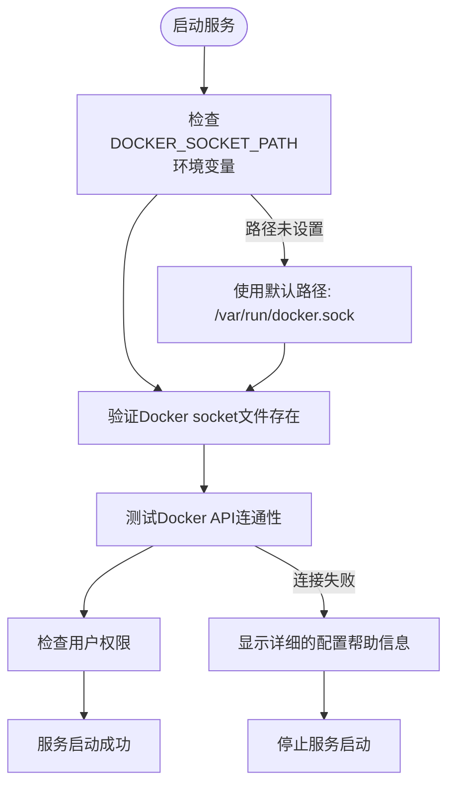

**Section sources**
- [main.rs](file://crates/rcoder/src/main.rs#L48-L81)
- [main.rs](file://crates/rcoder/src/main.rs#L322-L351)

### 容器清理失败
在服务启动和关闭时，系统会尝试清理遗留的容器。可能会遇到以下问题：

- **409冲突错误**：容器已在删除过程中，这是正常情况
- **容器不存在**：容器已被其他进程清理
- **权限不足**：无法访问或删除容器

系统采用智能清理策略，忽略409冲突错误和容器不存在的情况，只记录真正的清理失败。

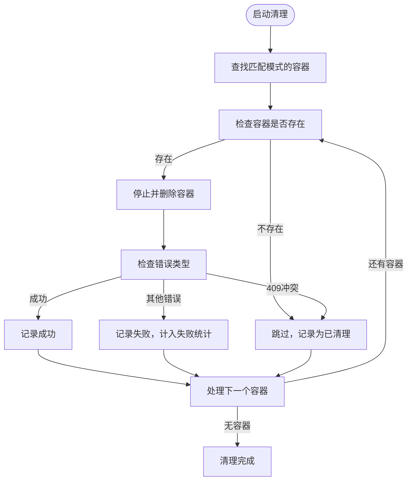

**Section sources**
- [container_stop.rs](file://crates/docker_manager/src/container_stop.rs#L82-L182)
- [main.rs](file://crates/rcoder/src/main.rs#L131-L157)

### 服务启动失败
服务启动时可能遇到多种问题，系统提供了详细的错误处理和恢复机制。

**常见问题**：
- 配置文件加载失败
- Docker管理器初始化失败
- 端口绑定失败
- 依赖服务未就绪

**解决方案**：
1. 检查配置文件是否存在且格式正确
2. 验证Docker服务是否正常运行
3. 确认端口未被其他进程占用
4. 检查依赖服务的状态

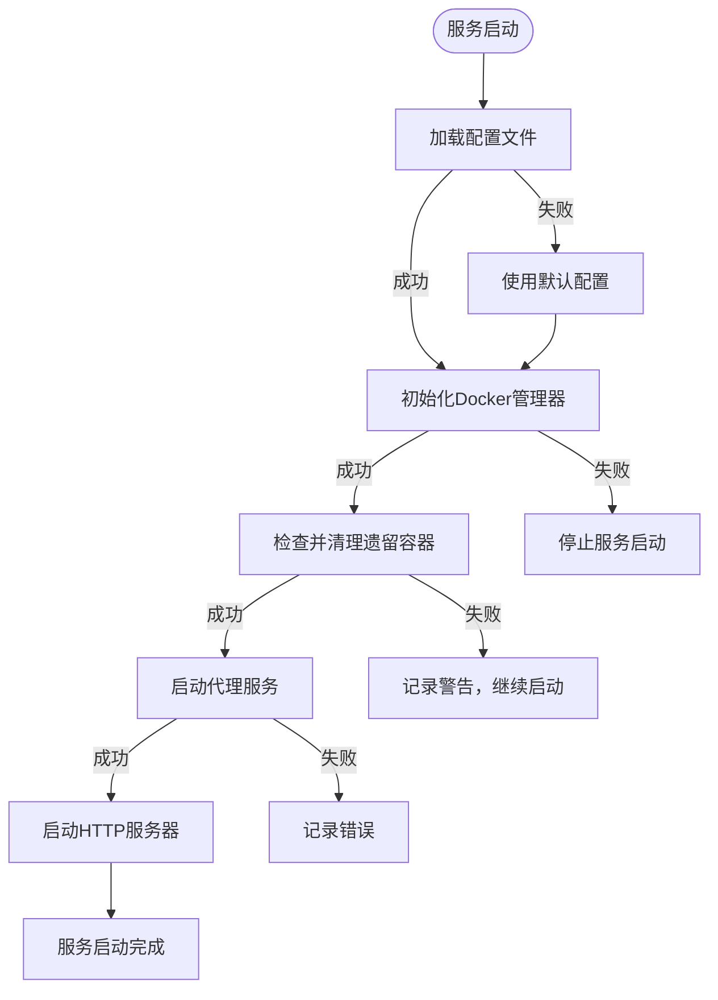

**Section sources**
- [main.rs](file://crates/rcoder/src/main.rs#L31-L271)
- [config.rs](file://crates/rcoder/src/config.rs#L253-L332)

## 日志分析

### 日志配置
系统使用`tracing`库进行日志记录，支持多种输出格式和级别。

**日志配置特点**：
- 按天滚动保存日志文件
- 保留最近5天的日志
- 同时输出到控制台和文件
- 文件日志采用JSON格式，便于后续分析
- 控制台日志采用简洁格式

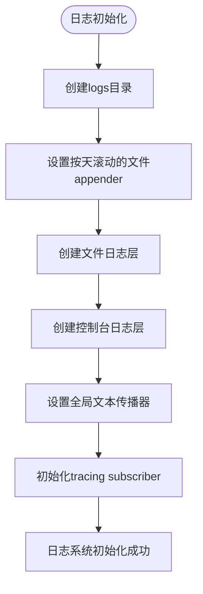

**Section sources**
- [main.rs](file://crates/rcoder/src/main.rs#L274-L318)
- [main.rs](file://crates/agent_runner/src/main.rs#L182-L229)

### 日志级别
系统支持多种日志级别，便于不同场景下的调试和监控。

**日志级别**：
- `error`：记录错误信息，需要立即关注
- `warn`：记录警告信息，可能影响系统稳定性
- `info`：记录重要事件和状态变化
- `debug`：记录调试信息，用于问题排查
- `trace`：记录详细跟踪信息，用于深度分析

**日志级别配置**：
- 通过环境变量`RUST_LOG`设置
- 支持按模块设置不同级别
- 默认级别为`info`

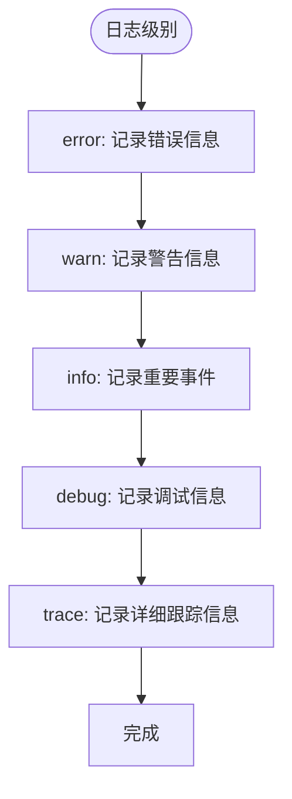

**Section sources**
- [main.rs](file://crates/rcoder/src/main.rs#L308-L314)
- [main.rs](file://crates/agent_runner/src/main.rs#L217-L225)

### 日志内容
日志记录了系统运行过程中的关键信息，便于问题排查和性能分析。

**日志内容包括**：
- 服务启动和关闭信息
- 配置加载和应用信息
- 容器创建和销毁信息
- 请求处理信息
- 错误和异常信息

**日志字段**：
- `timestamp`：时间戳
- `level`：日志级别
- `target`：日志来源
- `message`：日志消息
- `trace_id`：请求跟踪ID
- `method`：HTTP方法
- `uri`：请求URI

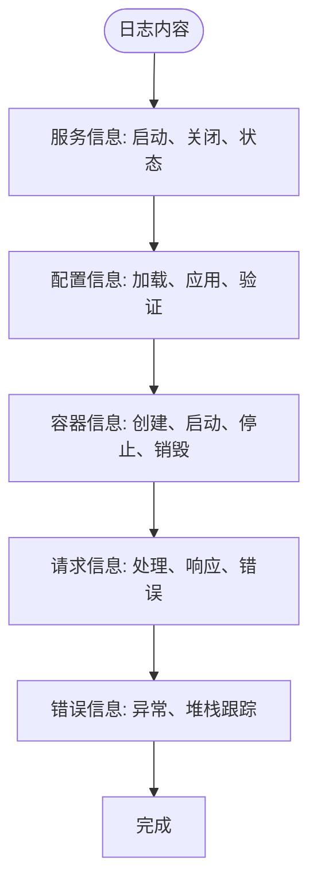

**Section sources**
- [main.rs](file://crates/rcoder/src/main.rs#L36-L271)
- [tracing_middleware.rs](file://crates/rcoder/src/middleware/tracing_middleware.rs#L75-L128)

## 性能优化

### 容器清理优化
系统实现了高效的容器清理机制，避免资源泄漏和性能下降。

**清理策略**：
- 定时清理闲置容器
- 启动时清理遗留容器
- 关闭时清理所有容器
- 并发清理多个容器

**优化措施**：
- 使用`force remove`避免竞态条件
- 过滤409冲突错误
- 并发处理多个容器
- 添加超时机制

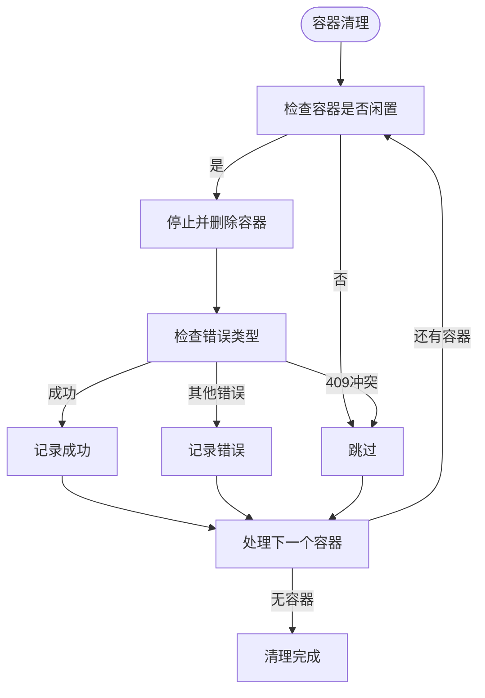

**Section sources**
- [cleanup_task.rs](file://crates/rcoder/src/proxy_agent/cleanup_task.rs#L248-L429)
- [container_stop.rs](file://crates/docker_manager/src/container_stop.rs#L82-L182)

### 请求处理优化
系统使用`axum`框架处理HTTP请求，具有高性能和低延迟的特点。

**优化措施**：
- 使用异步处理
- 连接复用
- 批量处理
- 缓存机制

**性能指标**：
- 请求处理时间
- 并发连接数
- 内存使用
- CPU使用

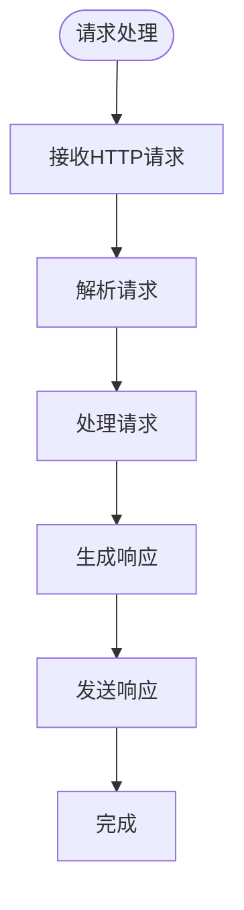

**Section sources**
- [main.rs](file://crates/rcoder/src/main.rs#L222-L264)
- [main.rs](file://crates/agent_runner/src/main.rs#L132-L171)

### 资源管理优化
系统实现了高效的资源管理机制，避免资源泄漏和性能下降。

**资源管理**：
- 内存管理
- CPU管理
- 网络管理
- 存储管理

**优化措施**：
- 资源限制
- 资源回收
- 资源监控
- 资源优化

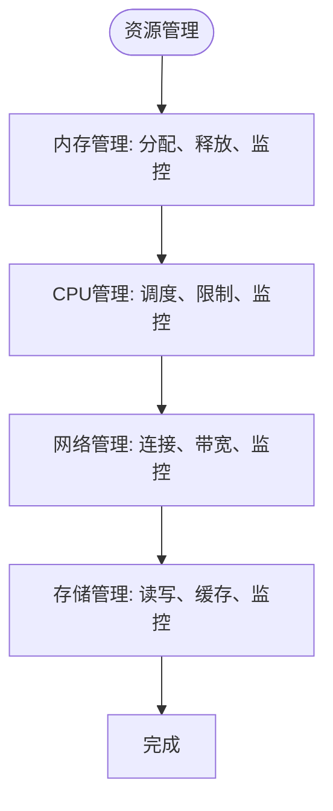

**Section sources**
- [manager.rs](file://crates/docker_manager/src/manager.rs#L147-L175)
- [types.rs](file://crates/docker_manager/src/types.rs#L51-L60)

## 安全考虑

### 容器安全
系统在容器创建和运行时实施了多种安全措施。

**安全措施**：
- 禁用`NET_RAW`和`NET_ADMIN`能力
- 禁用特权模式
- 使用非root用户运行
- 限制资源使用
- 网络隔离

**安全配置**：
- `cap_drop`：移除危险能力
- `privileged`：禁用特权模式
- `user`：指定运行用户
- `memory`：限制内存使用
- `nano_cpus`：限制CPU使用

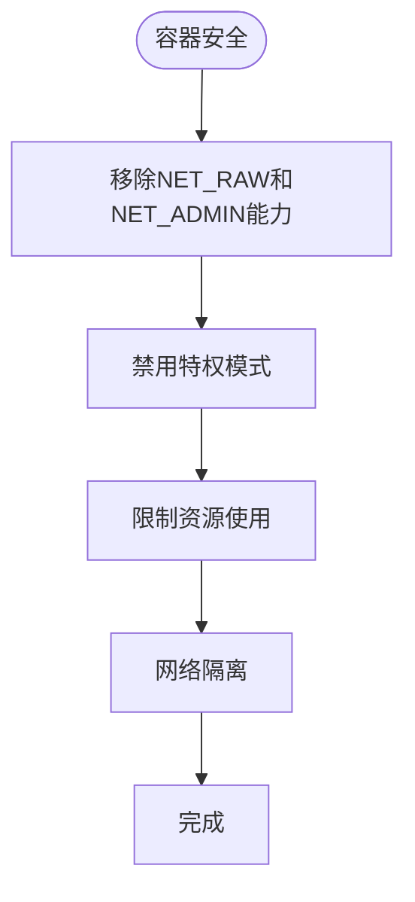

**Section sources**
- [manager.rs](file://crates/docker_manager/src/manager.rs#L153-L165)
- [types.rs](file://crates/docker_manager/src/types.rs#L51-L60)

### 网络安全
系统在网络安全方面实施了多种措施，防止未授权访问和攻击。

**安全措施**：
- 使用安全的网络配置
- 限制端口暴露
- 使用防火墙规则
- 监控网络流量
- 防止DDoS攻击

**网络配置**：
- `network_mode`：设置网络模式
- `port_bindings`：限制端口映射
- `host_config`：配置主机安全
- `networking_config`：配置网络安全

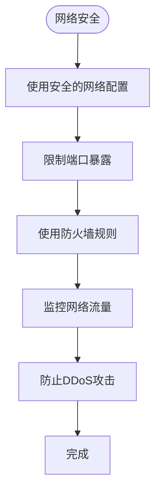

**Section sources**
- [manager.rs](file://crates/docker_manager/src/manager.rs#L178-L206)
- [types.rs](file://crates/docker_manager/src/types.rs#L24-L26)

### 数据安全
系统在数据安全方面实施了多种措施，保护用户数据和系统数据。

**安全措施**：
- 数据加密
- 访问控制
- 数据备份
- 数据审计
- 数据隔离

**数据保护**：
- `encryption`：数据加密
- `authentication`：身份验证
- `authorization`：授权
- `backup`：数据备份
- `audit`：数据审计

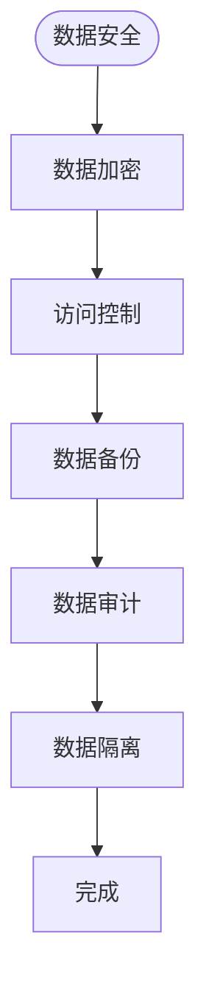

**Section sources**
- [config.rs](file://crates/rcoder/src/config.rs#L43-L44)
- [types.rs](file://crates/docker_manager/src/types.rs#L15-L16)

## 配置选项与参数

### 主要配置选项
系统提供了多种配置选项，便于用户根据需求进行定制。

**配置文件**：`config.yml`

**主要配置项**：
- `default_agent`：默认使用的AI代理类型
- `projects_dir`：项目工作目录
- `port`：主服务端口
- `proxy_config`：反向代理配置
- `docker_config`：Docker配置

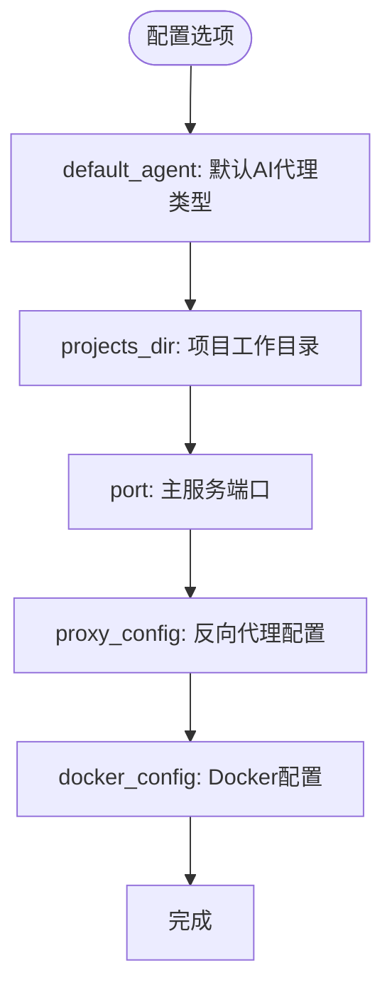

**Section sources**
- [config.rs](file://crates/rcoder/src/config.rs#L38-L50)
- [config.rs](file://crates/agent_runner/src/config.rs#L39-L49)

### 反向代理配置
反向代理配置允许用户自定义代理服务的行为。

**配置项**：
- `listen_port`：代理服务监听端口
- `default_backend_port`：默认后端服务端口
- `backend_host`：后端服务主机地址
- `port_param`：端口参数名称
- `health_check`：健康检查配置

**健康检查配置**：
- `enabled`：是否启用健康检查
- `interval_seconds`：检查间隔（秒）
- `timeout_seconds`：超时时间（秒）
- `healthy_threshold`：健康阈值
- `unhealthy_threshold`：不健康阈值

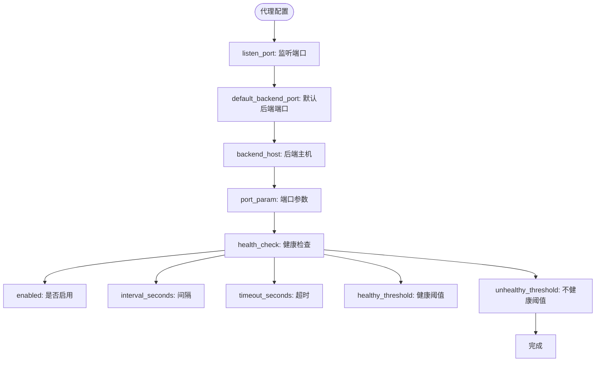

**Section sources**
- [config.rs](file://crates/rcoder/src/config.rs#L68-L80)
- [config.rs](file://crates/agent_runner/src/config.rs#L61-L73)

### Docker配置
Docker配置允许用户自定义容器的行为。

**配置项**：
- `multi_image_config`：多镜像配置
- `network_mode`：网络模式
- `work_dir`：工作目录
- `auto_cleanup`：自动清理
- `container_ttl_seconds`：容器存活时间（秒）

**多镜像配置**：
- `services`：服务配置
- `global_defaults`：全局默认配置
- `selection_strategy`：选择策略
- `cache_config`：缓存配置

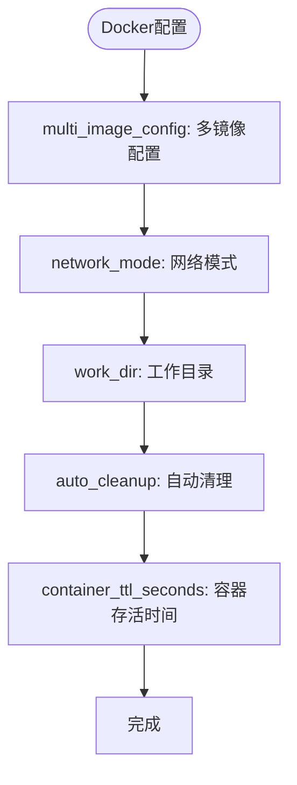

**Section sources**
- [config.rs](file://crates/rcoder/src/config.rs#L82-L96)
- [types.rs](file://crates/docker_manager/src/types.rs#L176-L195)

## 组件关系

### 核心组件关系
系统由多个核心组件组成，它们之间有明确的关系和依赖。

**主要组件**：
- `rcoder`：主服务
- `agent_runner`：代理运行器
- `docker_manager`：Docker管理器
- `pingora-proxy`：反向代理
- `shared_types`：共享类型

**组件关系**：
- `rcoder`依赖`docker_manager`和`pingora-proxy`
- `agent_runner`依赖`docker_manager`
- `rcoder`和`agent_runner`共享`shared_types`
- `pingora-proxy`提供反向代理功能

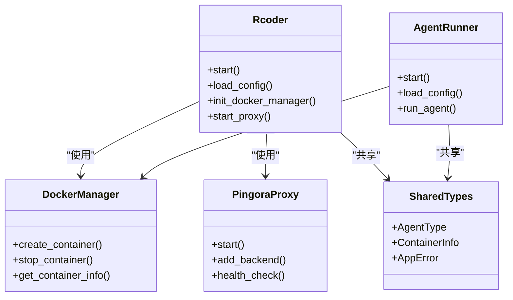

**Section sources**
- [main.rs](file://crates/rcoder/src/main.rs#L1-L271)
- [main.rs](file://crates/agent_runner/src/main.rs#L1-L179)

### 服务启动流程
服务启动时，各个组件按照特定顺序初始化和启动。

**启动流程**：
1. 初始化遥测系统
2. 解析命令行参数
3. 加载配置文件
4. 创建项目工作目录
5. 初始化Docker管理器
6. 启动代理服务
7. 启动HTTP服务器

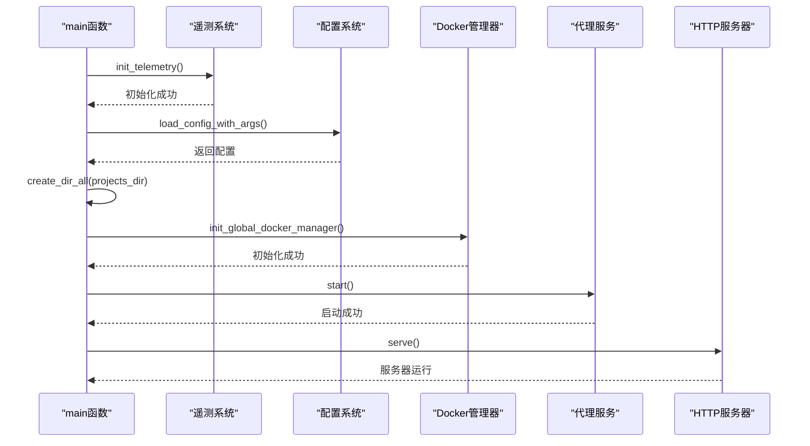

**Section sources**
- [main.rs](file://crates/rcoder/src/main.rs#L31-L271)
- [main.rs](file://crates/agent_runner/src/main.rs#L30-L179)

### 请求处理流程
HTTP请求的处理流程涉及多个组件的协作。

**处理流程**：
1. 接收HTTP请求
2. 通过追踪中间件处理
3. 路由到相应处理器
4. 处理请求
5. 生成响应
6. 返回响应

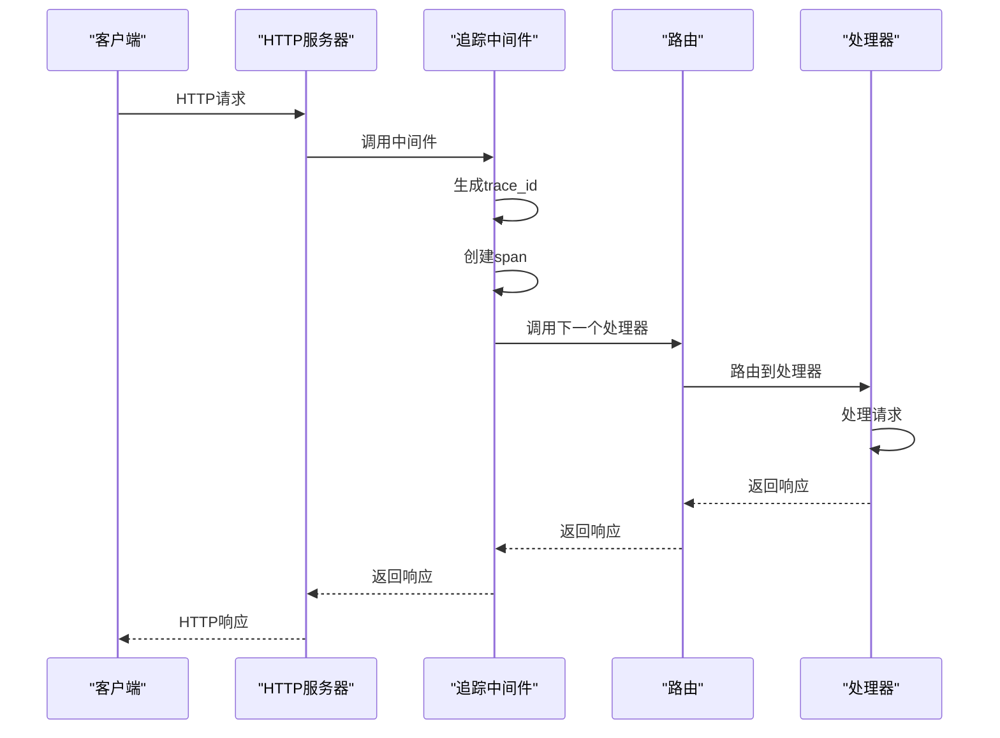

**Section sources**
- [tracing_middleware.rs](file://crates/rcoder/src/middleware/tracing_middleware.rs#L72-L128)
- [main.rs](file://crates/rcoder/src/main.rs#L220-L221)