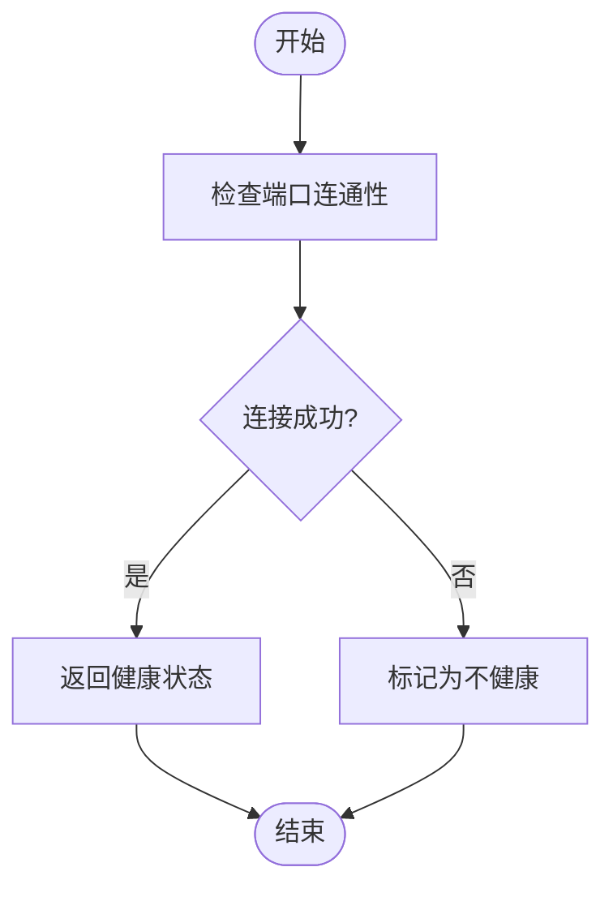
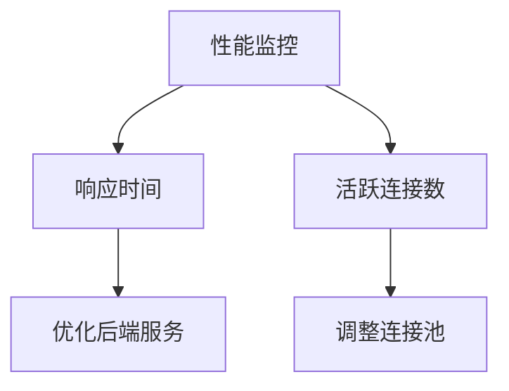

# 故障排除

<cite>
**本文档中引用的文件**  
- [app_error.rs](file://crates/rcoder/src/model/app_error.rs)
- [config.yml](file://config.yml)
- [pingora_server.rs](file://crates/pingora-proxy/src/pingora_server.rs)
- [server.rs](file://crates/pingora-proxy/src/server.rs)
- [service.rs](file://crates/pingora-proxy/src/service.rs)
- [config.rs](file://crates/pingora-proxy/src/config.rs)
- [test_proxy.sh](file://test_proxy.sh)
- [test_proxy_api.sh](file://test_proxy_api.sh)
</cite>

## 目录
1. [简介](#简介)
2. [错误类型分类](#错误类型分类)
3. [配置错误排查](#配置错误排查)
4. [代理连接失败处理](#代理连接失败处理)
5. [请求处理异常分析](#请求处理异常分析)
6. [日志分析指南](#日志分析指南)
7. [测试脚本使用方法](#测试脚本使用方法)
8. [网络连接状态检查](#网络连接状态检查)
9. [常见错误码与应对措施](#常见错误码与应对措施)
10. [性能问题诊断与优化](#性能问题诊断与优化)
11. [反向代理网络问题排查](#反向代理网络问题排查)
12. [检查清单与修复命令](#检查清单与修复命令)

## 简介
本手册旨在为用户提供系统化的故障排除指导，帮助快速诊断和解决在使用 RCoder 项目过程中可能遇到的各类问题。文档基于 `app_error.rs` 中定义的错误枚举，结合配置文件、代理服务实现及测试脚本，全面覆盖配置错误、代理连接失败、请求处理异常等常见场景。通过详细的诊断步骤、错误码说明和性能优化建议，确保用户能够高效定位并解决问题。

## 错误类型分类
根据 `app_error.rs` 文件中的 `AppError` 枚举定义，系统主要错误类型包括：
- **SerdeJsonError**：JSON 序列化/反序列化错误
- **AnyhowError**：通用错误包装
- **SendLocalSetAgentRequestError**：本地代理请求发送失败

这些错误类型反映了系统在数据处理、异步通信和外部依赖调用中的潜在故障点。

**Section sources**
- [app_error.rs](file://crates/rcoder/src/model/app_error.rs#L1-L25)

## 配置错误排查
配置错误通常源于 `config.yml` 文件中的参数设置不当或缺失。常见问题包括：
- `listen_port` 设置为无效端口（如 0 或已被占用的端口）
- `backend_host` 指向不可达的主机地址
- `port_param` 名称与实际请求不匹配

建议使用 `pre_start_check` 方法进行预启动验证，确保配置合法性。

**Section sources**
- [config.yml](file://config.yml#L1-L30)
- [server.rs](file://crates/pingora-proxy/src/server.rs#L200-L215)

## 代理连接失败处理
代理连接失败可能由以下原因导致：
- 后端服务未启动或监听指定端口
- 网络防火墙阻止连接
- 健康检查未通过

可通过 `update_health_once` 方法手动触发健康检查，确认后端服务状态。

**Section sources**
- [service.rs](file://crates/pingora-proxy/src/service.rs#L600-L620)
- [pingora_server.rs](file://crates/pingora-proxy/src/pingora_server.rs#L100-L120)

## 请求处理异常分析
请求处理异常多与路径解析、端口提取逻辑有关。例如：
- 请求路径 `/proxy/{port}/{path}` 格式不正确
- 查询参数 `port` 值无法解析为有效端口号

`extract_target_port` 方法负责从请求中提取目标端口，是排查此类问题的关键。

**Section sources**
- [service.rs](file://crates/pingora-proxy/src/service.rs#L400-L450)
- [server.rs](file://crates/pingora-proxy/src/server.rs#L300-L320)

## 日志分析指南
日志输出是诊断问题的重要依据。重点关注以下信息：
- 启动日志中的监听地址和端口
- 健康检查结果
- 请求处理过程中的路径重写记录

使用 `tracing` 框架提供的 `info!` 和 `debug!` 宏输出关键流程信息。

**Section sources**
- [pingora_server.rs](file://crates/pingora-proxy/src/pingora_server.rs#L30-L50)
- [service.rs](file://crates/pingora-proxy/src/service.rs#L200-L220)

## 测试脚本使用方法
项目提供多个测试脚本用于验证功能：
- `test_proxy.sh`：测试代理功能的基本连通性
- `test_proxy_api.sh`：测试新路径参数代理接口

运行脚本前需确保后端服务已启动，并检查输出结果中的状态码。

**Section sources**
- [test_proxy.sh](file://test_proxy.sh#L1-L90)
- [test_proxy_api.sh](file://test_proxy_api.sh#L1-L51)

## 网络连接状态检查
使用 `TcpStream::connect` 尝试连接目标端口，判断网络可达性。结合 `timeout` 设置超时时间，避免长时间阻塞。



**Diagram sources**
- [service.rs](file://crates/pingora-proxy/src/service.rs#L600-L620)

## 常见错误码与应对措施
| 错误码 | 含义 | 应对措施 |
|-------|------|---------|
| 0001 | 通用错误 | 查看详细错误信息，检查日志 |
| 400 | 请求格式错误 | 验证请求路径和参数 |
| 502 | 后端服务不可达 | 检查后端服务状态和网络连接 |

**Section sources**
- [app_error.rs](file://crates/rcoder/src/model/app_error.rs#L1-L25)

## 性能问题诊断与优化
### 处理延迟高
- 检查 `avg_response_time_ms` 指标
- 分析慢查询或高负载后端服务

### 内存占用大
- 监控 `active_connections` 指标
- 优化连接池配置



**Diagram sources**
- [service.rs](file://crates/pingora-proxy/src/service.rs#L100-L150)

## 反向代理网络问题排查
### 连接超时
- 检查 `timeout_seconds` 配置
- 使用 `ping` 和 `telnet` 验证网络延迟

### 路由失败
- 确认 `port_param` 参数名正确
- 验证路径 `/proxy/{port}/{path}` 格式

**Section sources**
- [config.yml](file://config.yml#L15-L20)
- [service.rs](file://crates/pingora-proxy/src/service.rs#L400-L450)

## 检查清单与修复命令
### 启动前检查清单
- [ ] 配置文件路径正确
- [ ] 监听端口未被占用
- [ ] 后端服务已启动

### 常用修复命令
```bash
# 重启代理服务
kill $(lsof -t -i:8080) && ./target/release/rcoder --enable-proxy

# 查看端口占用
lsof -i :8080

# 测试连接
curl http://localhost:8080/proxy/3000/
```

**Section sources**
- [test_proxy.sh](file://test_proxy.sh#L50-L70)
- [server.rs](file://crates/pingora-proxy/src/server.rs#L100-L120)