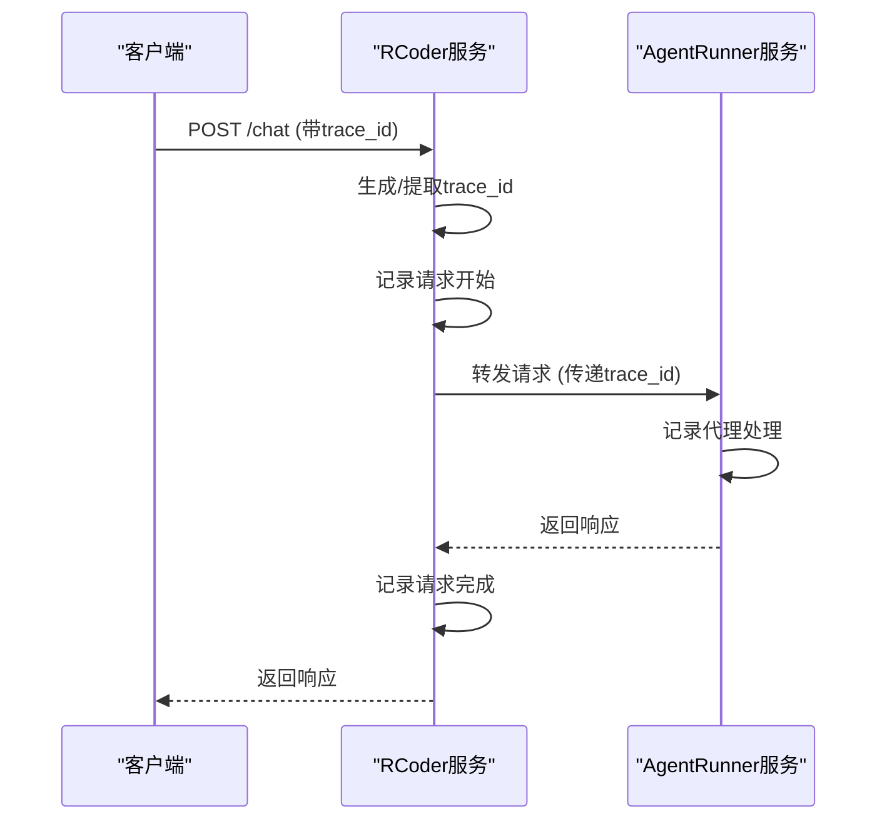
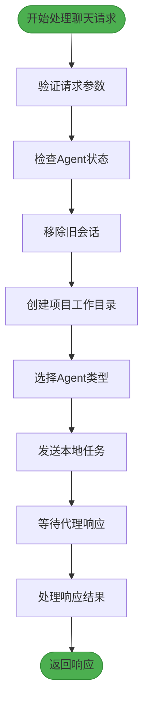
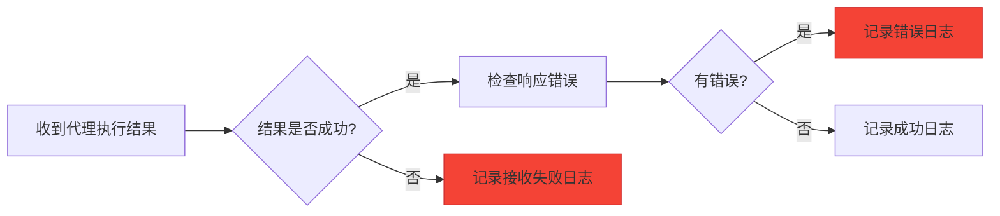
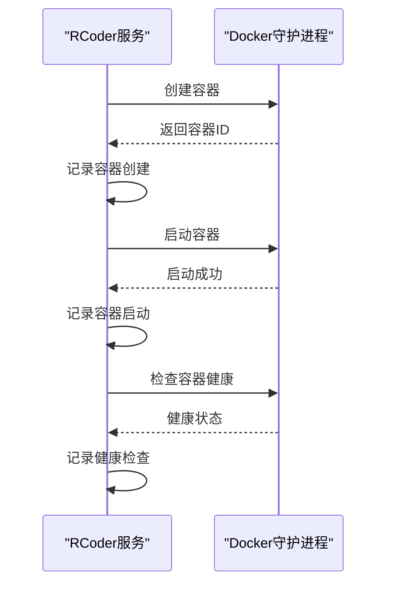
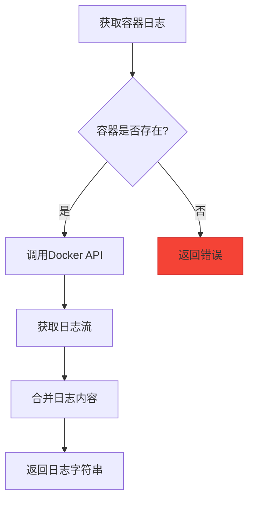
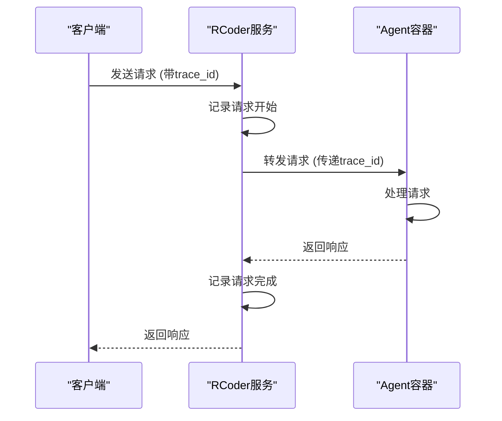
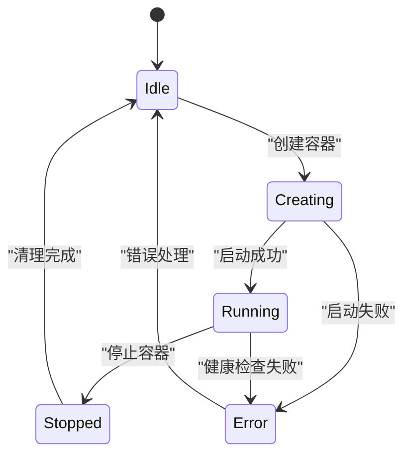

# 日志分析

<cite>
**本文档引用的文件**   
- [chat_handler.rs](file://crates/agent_runner/src/handler/chat_handler.rs)
- [agent_service.rs](file://crates/agent_runner/src/proxy_agent/agent_service.rs)
- [tracing_middleware.rs](file://crates/agent_runner/src/middleware/tracing_middleware.rs)
- [chat_handler.rs](file://crates/rcoder/src/handler/chat_handler.rs)
- [tracing_middleware.rs](file://crates/rcoder/src/middleware/tracing_middleware.rs)
- [main.rs](file://crates/agent_runner/src/main.rs)
- [main.rs](file://crates/rcoder/src/main.rs)
- [manager.rs](file://crates/docker_manager/src/manager.rs)
- [container_manager.rs](file://crates/rcoder/src/service/container_manager.rs)
</cite>

## 目录
1. [日志结构与关键日志点](#日志结构与关键日志点)
2. [Tracing与OpenTelemetry集成](#tracing与opentelemetry集成)
3. [关键操作日志记录模式](#关键操作日志记录模式)
4. [性能瓶颈与错误识别](#性能瓶颈与错误识别)
5. [日志级别配置与过滤](#日志级别配置与过滤)
6. [Docker容器日志集成](#docker容器日志集成)
7. [端到端问题定位](#端到端问题定位)

## 日志结构与关键日志点

RCoder系统采用结构化日志记录，结合`tracing`和`OpenTelemetry`实现分布式追踪。日志系统在`main.rs`中初始化，配置了文件和控制台双输出。文件日志采用JSON格式，便于后续分析和监控系统集成。

日志文件按天滚动保存，保留最近5天的日志文件，文件名前缀分别为`agent-runner`和`rcoder`，分别对应不同的服务组件。日志目录自动创建于项目根目录下的`logs`文件夹中。

关键日志点包括：
- HTTP请求的开始和结束
- 容器创建、启动和停止
- 代理服务的状态转换
- 会话管理操作
- 错误和异常处理

**Section sources**
- [main.rs](file://crates/agent_runner/src/main.rs#L182-L231)
- [main.rs](file://crates/rcoder/src/main.rs#L275-L320)

## Tracing与OpenTelemetry集成

系统通过`tracing_middleware.rs`实现了HTTP请求追踪中间件，为每个请求生成唯一的`trace_id`，并创建相应的span用于日志跟踪。中间件自动从请求头中提取`trace_id`，支持`x-trace-id`、`x-request-id`、`traceparent`等常见追踪头。



**Diagram sources**
- [tracing_middleware.rs](file://crates/agent_runner/src/middleware/tracing_middleware.rs#L1-L179)
- [tracing_middleware.rs](file://crates/rcoder/src/middleware/tracing_middleware.rs#L1-L179)

**Section sources**
- [tracing_middleware.rs](file://crates/agent_runner/src/middleware/tracing_middleware.rs#L1-L179)
- [tracing_middleware.rs](file://crates/rcoder/src/middleware/tracing_middleware.rs#L1-L179)

## 关键操作日志记录模式

### HTTP入口日志记录

在`chat_handler.rs`中，HTTP请求的处理过程有详细的日志记录。当处理聊天请求时，系统会记录请求的开始、项目ID的生成、会话状态的检查等关键信息。



**Diagram sources**
- [chat_handler.rs](file://crates/agent_runner/src/handler/chat_handler.rs#L176-L320)

**Section sources**
- [chat_handler.rs](file://crates/agent_runner/src/handler/chat_handler.rs#L176-L320)

### 代理服务日志记录

在`agent_service.rs`中，代理服务的启动和管理有明确的日志记录。系统通过`AcpAgentService` trait定义了统一的接口，不同类型的代理（如Claude、Codex）实现该接口。

```mermaid
classDiagram
class AcpAgentService {
<<trait>>
+start_agent_service(chat_prompt, model_provider) Result~AcpConnectionInfo~
+agent_type_name() &'static str
}
class AgentType {
+Claude
+Codex
}
AcpAgentService <|-- AgentType : "实现"
AgentType --> "ClaudeCodeAgent" : "调用"
AgentType --> "CodexAgent" : "调用"
```

**Diagram sources**
- [agent_service.rs](file://crates/agent_runner/src/proxy_agent/agent_service.rs#L7-L62)

**Section sources**
- [agent_service.rs](file://crates/agent_runner/src/proxy_agent/agent_service.rs#L7-L62)

## 性能瓶颈与错误识别

### 性能瓶颈识别

通过分析日志中的时间戳和处理时长，可以识别系统性能瓶颈。关键的性能指标包括：

- HTTP请求处理时间
- 容器创建和启动时间
- 代理服务响应时间
- 网络通信延迟

日志中的emoji标记有助于快速识别不同类型的日志：
- 🚀 表示开始处理
- ✅ 表示成功完成
- ❌ 表示错误或失败
- ⚠️ 表示警告或需要注意的情况

### 错误堆栈分析

系统在关键错误点记录详细的错误信息，包括错误代码、消息和堆栈跟踪。例如，在`chat_handler.rs`中，当代理处理失败时，系统会记录错误详情：



**Diagram sources**
- [chat_handler.rs](file://crates/agent_runner/src/handler/chat_handler.rs#L289-L318)

**Section sources**
- [chat_handler.rs](file://crates/agent_runner/src/handler/chat_handler.rs#L289-L318)

## 日志级别配置与过滤

### 日志级别配置

系统通过`tracing_subscriber::EnvFilter`配置日志级别，支持环境变量配置。默认配置如下：

- `rcoder=debug`：RCoder组件的调试级别
- `tower_http=debug`：HTTP中间件的调试级别
- `axum_tracing_opentelemetry=info`：OpenTelemetry追踪的普通级别

### 日志过滤技巧

可以通过环境变量`RUST_LOG`来动态调整日志级别，例如：

```bash
# 只显示错误日志
export RUST_LOG=error

# 显示RCoder组件的调试日志
export RUST_LOG=rcoder=debug

# 显示所有组件的详细日志
export RUST_LOG=debug
```

**Section sources**
- [main.rs](file://crates/agent_runner/src/main.rs#L219-L221)
- [main.rs](file://crates/rcoder/src/main.rs#L310-L311)

## Docker容器日志集成

### 容器管理日志

`docker_manager`模块提供了完整的容器管理功能，包括创建、启动、停止和清理容器。每个操作都有相应的日志记录：



**Diagram sources**
- [manager.rs](file://crates/docker_manager/src/manager.rs#L81-L352)

**Section sources**
- [manager.rs](file://crates/docker_manager/src/manager.rs#L81-L352)

### 容器日志获取

系统提供了获取容器日志的功能，可以通过`get_container_logs`方法获取指定容器的日志：



**Diagram sources**
- [manager.rs](file://crates/docker_manager/src/manager.rs#L588-L623)

**Section sources**
- [manager.rs](file://crates/docker_manager/src/manager.rs#L588-L623)

## 端到端问题定位

### 请求生命周期追踪

通过`trace_id`可以追踪请求从HTTP入口到代理执行的完整生命周期。系统在`chat_handler.rs`中实现了请求转发，保持了`trace_id`的传递：



**Diagram sources**
- [chat_handler.rs](file://crates/rcoder/src/handler/chat_handler.rs#L110-L320)

**Section sources**
- [chat_handler.rs](file://crates/rcoder/src/handler/chat_handler.rs#L110-L320)

### 状态转换异常检测

系统通过日志记录关键状态的转换，可以检测异常状态。例如，在容器管理中，系统会检查容器的健康状态：



**Diagram sources**
- [manager.rs](file://crates/docker_manager/src/manager.rs#L758-L800)

**Section sources**
- [manager.rs](file://crates/docker_manager/src/manager.rs#L758-L800)