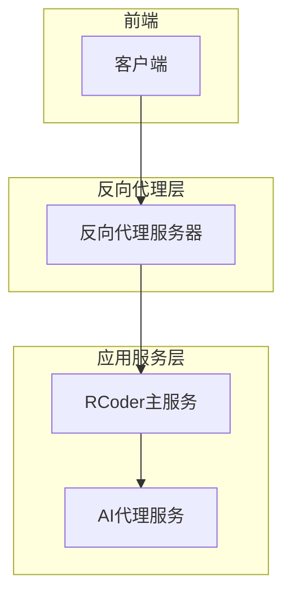
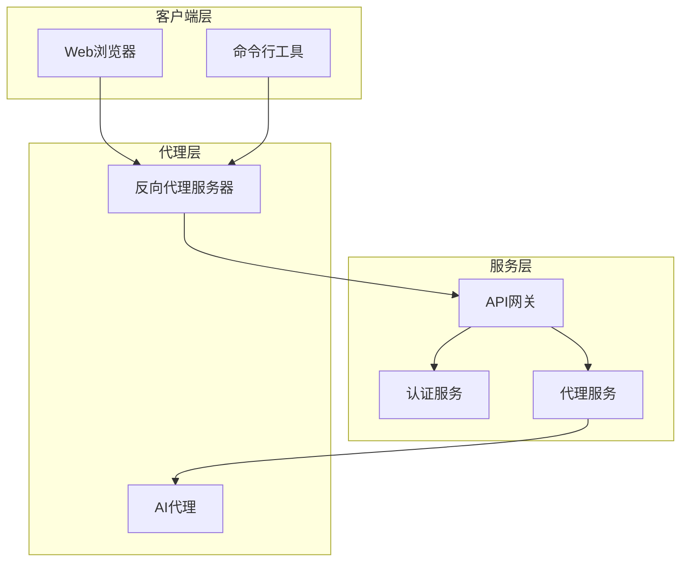
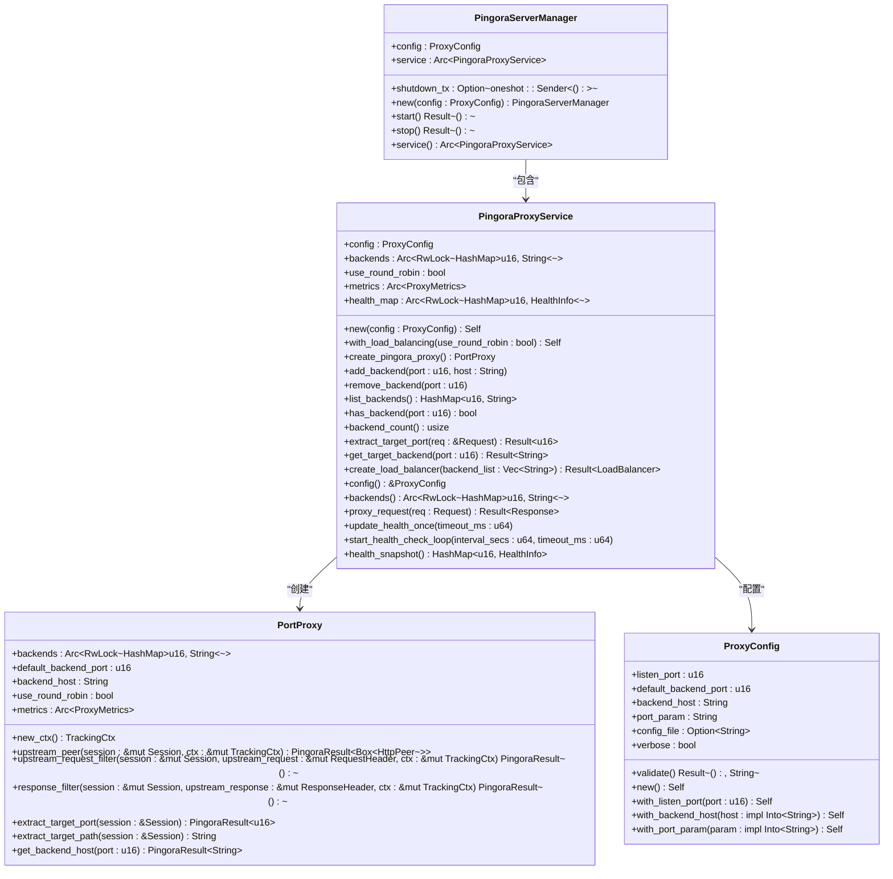
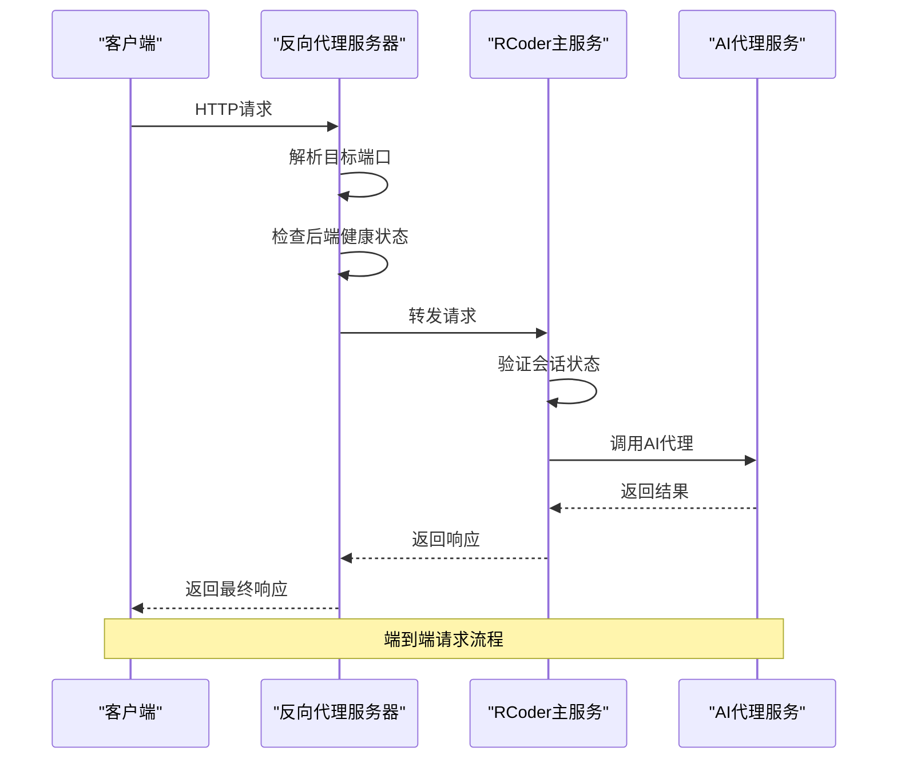
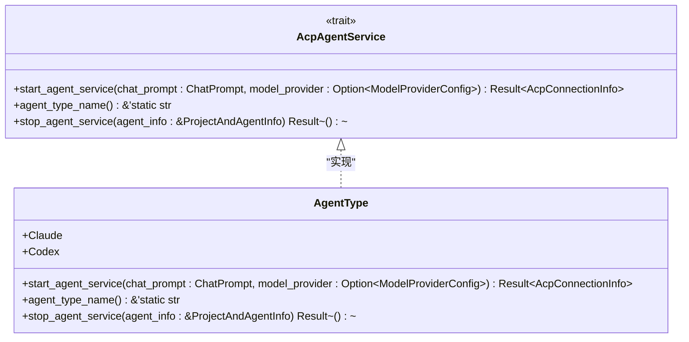
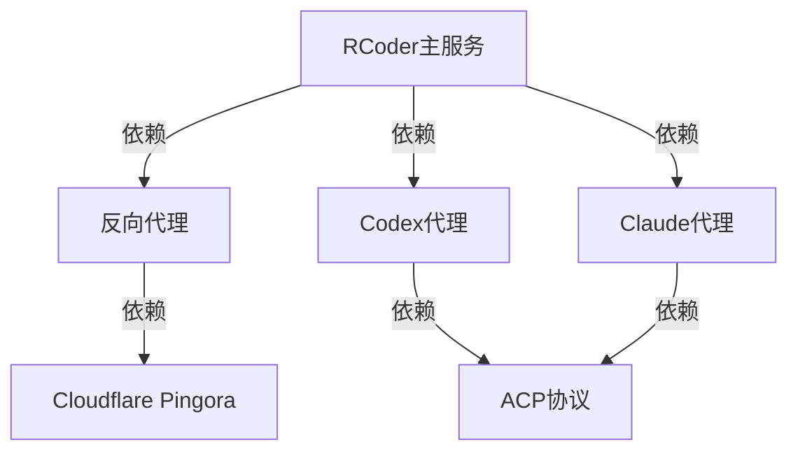

# 网络连接问题

<cite>
**本文档引用的文件**
- [pingora_server.rs](file://crates/pingora-proxy/src/pingora_server.rs)
- [agent_service.rs](file://crates/rcoder/src/proxy_agent/agent_service.rs)
- [test_proxy.sh](file://test_proxy.sh)
- [test_proxy_api.sh](file://test_proxy_api.sh)
- [service.rs](file://crates/pingora-proxy/src/service.rs)
- [config.rs](file://crates/pingora-proxy/src/config.rs)
- [proxy_handler_api.rs](file://crates/rcoder/src/handler/proxy_handler_api.rs)
- [main.rs](file://crates/rcoder/src/main.rs)
</cite>

## 目录
1. [简介](#简介)
2. [项目结构](#项目结构)
3. [核心组件](#核心组件)
4. [架构概述](#架构概述)
5. [详细组件分析](#详细组件分析)
6. [依赖分析](#依赖分析)
7. [性能考虑](#性能考虑)
8. [故障排除指南](#故障排除指南)
9. [结论](#结论)

## 简介
本文档旨在提供一个系统性的网络连接问题排查手册，重点分析反向代理层和AI代理通信层的连接问题。基于`pingora_server.rs`和`agent_service.rs`中的连接逻辑，深入探讨连接超时、路由失败、健康检查异常等问题的根本原因。指导用户使用`test_proxy.sh`和`test_proxy_api.sh`脚本验证端到端连通性。解释SSE流中断、HTTP 502/504错误的可能来源，包括后端服务不可达、防火墙限制、DNS解析失败等。提供网络诊断命令示例（如curl、telnet、tcpdump），并说明如何结合日志中的请求ID进行链路追踪。包含Pingora代理配置与实际网络拓扑不匹配的常见陷阱及修复方案。

## 项目结构
项目采用模块化设计，主要分为以下几个核心模块：
- `crates/pingora-proxy`: 基于Cloudflare Pingora库的高性能反向代理实现
- `crates/rcoder`: 主应用服务，包含AI代理管理和API路由
- `crates/codex-acp-agent`: Codex AI代理实现
- `crates/claude-code-agent`: Claude AI代理实现
- `test_proxy.sh` 和 `test_proxy_api.sh`: 代理功能测试脚本



**图示来源**
- [pingora_server.rs](file://crates/pingora-proxy/src/pingora_server.rs#L1-L182)
- [main.rs](file://crates/rcoder/src/main.rs#L1-L221)

## 核心组件
核心组件包括反向代理服务器、AI代理服务和网络诊断工具。反向代理服务器基于Pingora库实现，支持HTTP/1.1和HTTP/2协议。AI代理服务通过`AcpAgentService` trait定义统一接口，支持Claude和Codex两种代理类型。网络诊断工具包括`test_proxy.sh`和`test_proxy_api.sh`脚本，用于验证代理功能。

**组件来源**
- [pingora_server.rs](file://crates/pingora-proxy/src/pingora_server.rs#L1-L182)
- [agent_service.rs](file://crates/rcoder/src/proxy_agent/agent_service.rs#L1-L72)

## 架构概述
系统采用分层架构，从客户端到AI代理的请求经过多个处理层。首先，客户端请求到达Pingora反向代理服务器，服务器根据配置将请求路由到RCoder主服务。RCoder主服务处理业务逻辑，并根据需要调用相应的AI代理服务。整个架构支持动态后端发现和负载均衡。



**图示来源**
- [pingora_server.rs](file://crates/pingora-proxy/src/pingora_server.rs#L1-L182)
- [main.rs](file://crates/rcoder/src/main.rs#L1-L221)

## 详细组件分析
### 反向代理组件分析
反向代理组件基于Pingora库实现，提供高性能的HTTP代理功能。支持通过查询参数或路径方式指定目标端口，实现灵活的路由策略。

#### 对象导向组件


**图示来源**
- [pingora_server.rs](file://crates/pingora-proxy/src/pingora_server.rs#L1-L182)
- [service.rs](file://crates/pingora-proxy/src/service.rs#L1-L723)
- [config.rs](file://crates/pingora-proxy/src/config.rs#L1-L95)

#### API/服务组件


**图示来源**
- [pingora_server.rs](file://crates/pingora-proxy/src/pingora_server.rs#L1-L182)
- [main.rs](file://crates/rcoder/src/main.rs#L1-L221)

### AI代理通信组件分析
AI代理通信组件通过`AcpAgentService` trait定义统一接口，支持不同类型的AI代理。

#### 对象导向组件


**图示来源**
- [agent_service.rs](file://crates/rcoder/src/proxy_agent/agent_service.rs#L1-L72)

## 依赖分析
系统依赖关系清晰，各组件之间通过明确的接口进行通信。反向代理层依赖于Pingora库，应用服务层依赖于反向代理层提供的服务。



**图示来源**
- [Cargo.toml](file://Cargo.toml)
- [main.rs](file://crates/rcoder/src/main.rs#L1-L221)

## 性能考虑
系统在设计时充分考虑了性能因素。反向代理层采用异步I/O模型，能够高效处理大量并发连接。AI代理服务通过本地任务通道进行通信，避免了跨线程开销。健康检查采用定时轮询机制，平衡了实时性和系统负载。

## 故障排除指南
### 常见问题及解决方案
1. **连接超时**
   - 检查目标端口是否开放
   - 验证防火墙规则
   - 检查网络延迟

2. **路由失败**
   - 确认URL格式正确
   - 检查代理配置
   - 验证后端服务状态

3. **健康检查异常**
   - 检查后端服务是否正常运行
   - 验证健康检查配置
   - 查看健康检查日志

4. **SSE流中断**
   - 检查连接超时设置
   - 验证网络稳定性
   - 查看代理日志

5. **HTTP 502/504错误**
   - 确认后端服务可达
   - 检查代理配置
   - 验证网络路由

### 网络诊断命令
```bash
# 测试连接
curl -v http://localhost:8080/proxy/3000/

# 测试端口连通性
telnet localhost 3000

# 抓包分析
tcpdump -i any port 8080

# DNS解析测试
nslookup example.com
```

**组件来源**
- [test_proxy.sh](file://test_proxy.sh#L1-L90)
- [test_proxy_api.sh](file://test_proxy_api.sh#L1-L51)

## 结论
本文档提供了全面的网络连接问题排查指南，涵盖了从反向代理层到AI代理通信层的各个方面。通过理解系统架构和组件关系，结合提供的诊断工具和命令，可以有效解决常见的网络连接问题。建议在实际操作中结合日志信息进行链路追踪，以快速定位和解决问题。