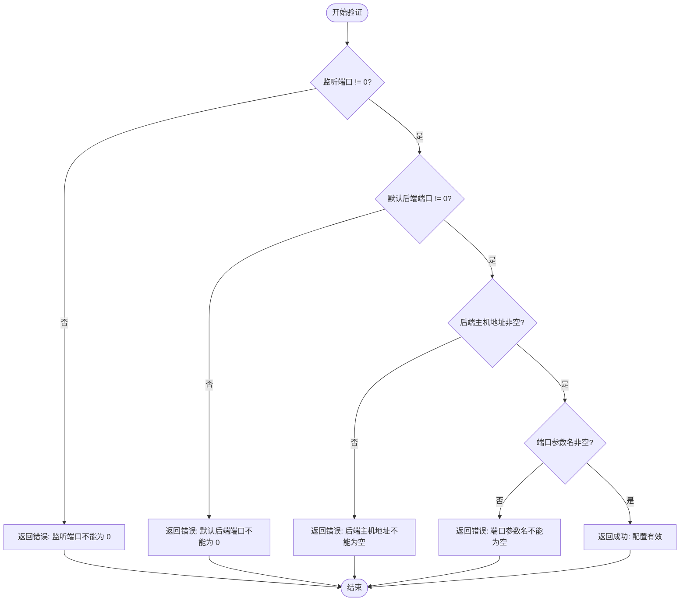

# 配置问题排查

<cite>
**本文档中引用的文件**   
- [config.yml](file://config.yml)
- [config.rs](file://crates/rcoder/src/config.rs)
- [pingora-proxy/src/config.rs](file://crates/pingora-proxy/src/config.rs)
- [main.rs](file://crates/rcoder/src/main.rs)
- [server.rs](file://crates/pingora-proxy/src/server.rs)
</cite>

## 目录
1. [简介](#简介)
2. [配置优先级系统](#配置优先级系统)
3. [配置文件结构](#配置文件结构)
4. [常见配置错误](#常见配置错误)
5. [配置验证机制](#配置验证机制)
6. [典型问题诊断](#典型问题诊断)
7. [调试建议](#调试建议)
8. [配置热重载支持](#配置热重载支持)

## 简介
本文档旨在为 `rcoder` 项目提供详细的配置问题排查指南。文档重点分析了基于 `config.rs` 的多层配置优先级系统，涵盖了命令行参数、环境变量、配置文件和默认值四个层级的配置管理机制。通过本指南，用户可以深入了解配置系统的运作原理，识别和解决常见的配置错误，并掌握有效的调试方法。

**Section sources**
- [config.rs](file://crates/rcoder/src/config.rs#L106-L188)
- [main.rs](file://crates/rcoder/src/main.rs#L45-L76)

## 配置优先级系统
`rcoder` 项目采用多层配置优先级系统，确保配置的灵活性和可覆盖性。配置优先级从高到低依次为：命令行参数 > 环境变量 > 配置文件 > 默认配置。


**Diagram sources**
- [config.rs](file://crates/rcoder/src/config.rs#L106-L188)

**Section sources**
- [config.rs](file://crates/rcoder/src/config.rs#L106-L188)

## 配置文件结构
`config.yml` 文件定义了 `rcoder` 项目的主要配置项。以下是配置文件的结构说明：

```yaml
# rcoder 配置文件
# 该文件在首次启动时自动生成

# 默认使用的 AI 代理类型 (Codex/Claude/Proxy)
default_agent: Codex

# 项目工作目录
projects_dir: ./project_workspace

# 主服务端口
port: 3000

# Pingora 反向代理配置
proxy_config:
  # 代理服务监听端口 (用于接收外部请求)
  listen_port: 8080
  # 默认后端服务端口 (当请求未指定端口时使用)
  default_backend_port: 3000
  # 后端服务主机地址
  backend_host: "127.0.0.1"
  # URL 中端口参数的名称 (用于从路径中提取端口号)
  port_param: "port"
  # 健康检查配置
  health_check:
    enabled: true
    interval_seconds: 5
    timeout_seconds: 1
    healthy_threshold: 2
    unhealthy_threshold: 3
```

**Diagram sources**
- [config.yml](file://config.yml)

**Section sources**
- [config.yml](file://config.yml)

## 常见配置错误
在配置 `rcoder` 项目时，可能会遇到以下几种常见错误：

### 字段类型不匹配
配置文件中的字段必须与预期的数据类型匹配。例如，端口配置必须是有效的无符号16位整数（u16），而不能是字符串或其他类型。

### 必填项缺失
某些配置项是必需的，如 `listen_port` 和 `default_backend_port`。如果这些字段缺失或设置为0，将导致配置验证失败。

### 路径配置错误
`projects_dir` 字段指定了项目工作目录的路径。如果指定的路径不存在或没有适当的读写权限，将导致服务启动失败。

**Section sources**
- [config.rs](file://crates/rcoder/src/config.rs#L106-L188)
- [pingora-proxy/src/config.rs](file://crates/pingora-proxy/src/config.rs#L49-L94)

## 配置验证机制
`rcoder` 项目内置了配置验证机制，确保配置的有效性。`ProxyConfig` 结构体提供了 `validate` 方法，用于检查配置的完整性。



**Diagram sources**
- [pingora-proxy/src/config.rs](file://crates/pingora-proxy/src/config.rs#L49-L94)

**Section sources**
- [pingora-proxy/src/config.rs](file://crates/pingora-proxy/src/config.rs#L49-L94)

## 典型问题诊断
当遇到配置相关的问题时，可以按照以下步骤进行诊断：

### 服务启动失败
如果服务无法启动，首先检查配置文件中的端口设置是否有效。确保 `listen_port` 和 `default_backend_port` 都不为0，并且没有与其他服务冲突。

### 代理初始化异常
代理初始化异常通常与后端主机地址或端口参数名配置错误有关。检查 `backend_host` 是否正确指向目标服务，并确认 `port_param` 与请求中的参数名匹配。

**Section sources**
- [server.rs](file://crates/pingora-proxy/src/server.rs#L29-L371)
- [config.rs](file://crates/rcoder/src/config.rs#L106-L188)

## 调试建议
为了更有效地调试配置问题，可以采取以下措施：

### 启用详细日志输出
通过设置环境变量或命令行参数，可以启用详细日志输出，查看实际生效的配置值。这有助于确认配置是否按预期被覆盖。

### 使用命令行参数覆盖配置文件
在测试环境中，可以使用命令行参数直接覆盖配置文件中的设置，快速验证不同配置的效果。

**Section sources**
- [main.rs](file://crates/rcoder/src/main.rs#L180-L215)
- [config.rs](file://crates/rcoder/src/config.rs#L106-L188)

## 配置热重载支持
目前 `rcoder` 项目不支持配置热重载。任何配置更改都需要重启服务才能生效。建议在生产环境中谨慎修改配置，并在更改前备份原始配置文件。

**Section sources**
- [config.rs](file://crates/rcoder/src/config.rs#L106-L188)