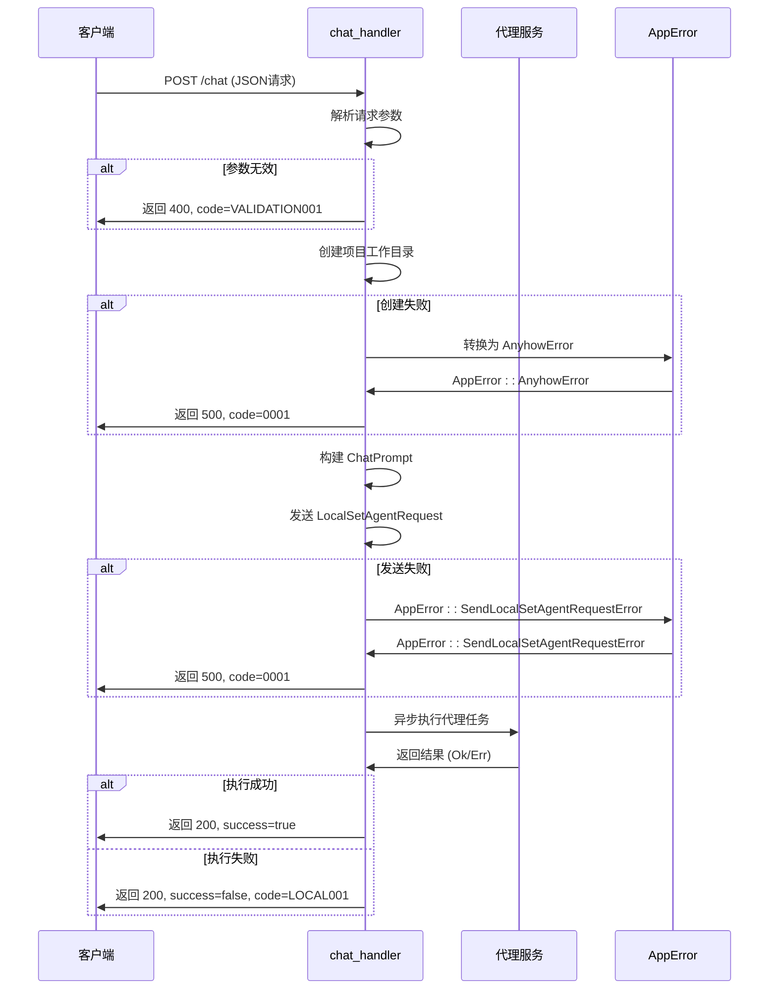

# 错误码参考

<cite>
**本文档引用的文件**  
- [app_error.rs](file://crates/rcoder/src/model/app_error.rs)
- [http_result.rs](file://crates/rcoder/src/model/http_result.rs)
- [chat_handler.rs](file://crates/rcoder/src/handler/chat_handler.rs)
</cite>

## 目录
1. [简介](#简介)
2. [错误响应结构](#错误响应结构)
3. [错误码分类索引](#错误码分类索引)
4. [核心错误枚举详解](#核心错误枚举详解)
5. [上下文差异处理](#上下文差异处理)
6. [自定义错误扩展](#自定义错误扩展)
7. [快速检索指南](#快速检索指南)

## 简介
本文档系统化整理了 `app_error.rs` 中定义的应用级错误枚举 `AppError`，并结合 `chat_handler.rs` 中的实际处理逻辑，为开发者提供完整的错误码参考。文档涵盖错误码的中文解释、触发场景、HTTP状态码映射、解决措施及响应示例，帮助快速定位和处理API调用中的异常情况。

**Section sources**
- [app_error.rs](file://crates/rcoder/src/model/app_error.rs#L6-L24)

## 错误响应结构
所有API错误响应均遵循统一的JSON结构，由 `HttpResult<T>` 封装，确保客户端能够一致地解析错误信息。

```mermaid
flowchart TD
Response["{<br/> \"success\": false,<br/> \"code\": \"错误码\",<br/> \"message\": \"错误描述\",<br/> \"data\": null,<br/> \"tid\": \"trace_id (可选)\"<br/>}"] --> Success["success: 布尔值<br/>- true: 成功<br/>- false: 失败"]
Response --> Code["code: 字符串<br/>- 错误码标识"]
Response --> Message["message: 字符串<br/>- 可读的错误描述"]
Response --> Data["data: 泛型<br/>- 成功时返回数据<br/>- 失败时为 null"]
Response --> Tid["tid: 字符串 (可选)<br/>- OpenTelemetry trace_id<br/>- 用于问题追踪"]
```

**Diagram sources**
- [http_result.rs](file://crates/rcoder/src/model/http_result.rs#L25-L44)

## 错误码分类索引
为便于快速定位，错误码按类型分为以下几类：

| 分类 | 前缀 | 说明 |
|------|------|------|
| 内部服务类 | 0001, 5000 | 框架、序列化、内部通道等底层错误 |
| 本地任务类 | LOCAL | 本地任务调度与通信错误 |
| 配置类 | CONFIG | 配置加载与解析错误 |
| 网络类 | NETWORK | 网络连接与通信错误 |
| 代理类 | AGENT | AI代理连接与执行错误 |

**Section sources**
- [app_error.rs](file://crates/rcoder/src/model/app_error.rs#L6-L24)
- [http_result.rs](file://crates/rcoder/src/model/http_result.rs#L45-L55)

## 核心错误枚举详解
详细解析 `AppError` 枚举中定义的每个错误变体。

### SerdeJsonError
JSON序列化/反序列化失败。

- **错误码**: `0001` (通过 `HttpResult::error` 映射)
- **HTTP状态码**: `500 Internal Server Error`
- **可能触发场景**:
  - 请求体JSON格式不合法
  - 响应数据无法序列化为JSON
  - 配置文件解析失败
- **推荐解决措施**:
  - 检查请求JSON格式是否正确
  - 确保所有可序列化字段类型兼容
  - 使用JSON验证工具预检数据

**Section sources**
- [app_error.rs](file://crates/rcoder/src/model/app_error.rs#L10-L11)

### AnyhowError
通用错误包装，捕获 `anyhow::Error` 类型的任意错误。

- **错误码**: `0001` (通过 `HttpResult::error` 映射)
- **HTTP状态码**: `500 Internal Server Error`
- **可能触发场景**:
  - 文件系统操作失败（如创建目录）
  - 异步操作被取消或超时
  - 任意业务逻辑中使用 `anyhow!` 生成的错误
- **推荐解决措施**:
  - 检查错误消息中的具体原因
  - 验证文件系统权限和路径
  - 检查网络连接和外部服务状态

**Section sources**
- [app_error.rs](file://crates/rcoder/src/model/app_error.rs#L13-L14)

### SendLocalSetAgentRequestError
向本地任务通道发送请求失败。

- **错误码**: `0001` (通过 `HttpResult::error` 映射)
- **HTTP状态码**: `500 Internal Server Error`
- **可能触发场景**:
  - 本地任务处理队列已满或已关闭
  - 服务正在关闭过程中
  - 系统资源耗尽导致通道中断
- **推荐解决措施**:
  - 检查服务运行状态
  - 重启服务以恢复通道
  - 优化任务处理速度，避免积压

**Section sources**
- [app_error.rs](file://crates/rcoder/src/model/app_error.rs#L16-L19)

## 上下文差异处理
同一错误码在不同处理上下文中可能有不同的表现和处理方式。

### 在 chat_handler.rs 中的错误处理
`handle_chat` 函数展示了如何将底层错误转化为用户友好的API响应。



**Diagram sources**
- [chat_handler.rs](file://crates/rcoder/src/handler/chat_handler.rs#L159-L231)

**Section sources**
- [chat_handler.rs](file://crates/rcoder/src/handler/chat_handler.rs#L159-L231)

## 自定义错误扩展
系统设计允许用户扩展自定义业务错误码。

### 扩展点说明
1. **在 `app_error.rs` 中添加新枚举变体**:
   ```rust
   #[error("业务特定错误: {reason}")]
   BusinessError { reason: String },
   ```
2. **为新错误实现 `IntoResponse`**:
   根据错误类型映射到不同的 `HttpResult` 和HTTP状态码。
3. **在业务逻辑中使用**:
   使用 `return Err(AppError::BusinessError { reason: "..." });` 抛出错误。

### 推荐实践
- 为自定义错误定义唯一的错误码前缀（如 `BUSI`）
- 提供清晰、可操作的错误消息
- 记录错误码到文档，便于团队协作

**Section sources**
- [app_error.rs](file://crates/rcoder/src/model/app_error.rs#L6-L24)

## 快速检索指南
提供常见错误码的快速查找表。

| 错误码 | 含义 | 常见原因 | 解决方案 |
|--------|------|----------|----------|
| `0001` | 内部服务错误 | 序列化失败、通道发送失败 | 检查服务日志，重启服务 |
| `LOCAL001` | 本地任务错误 | 代理执行失败 | 检查代理状态，重试请求 |
| `5000` | 内部服务器错误 | 通用内部错误 | 查看详细错误消息，联系管理员 |
| `VALIDATION001` | 参数验证错误 | JSON格式错误 | 检查请求体格式 |

**Section sources**
- [http_result.rs](file://crates/rcoder/src/model/http_result.rs#L57-L59)
- [chat_handler.rs](file://crates/rcoder/src/handler/chat_handler.rs#L220-L225)