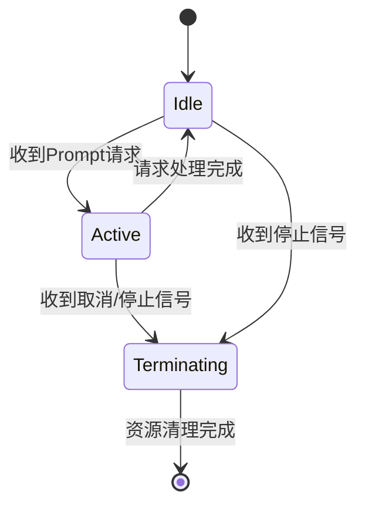
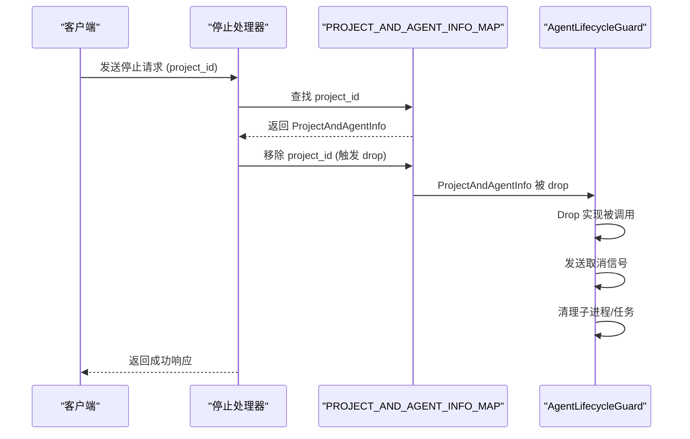
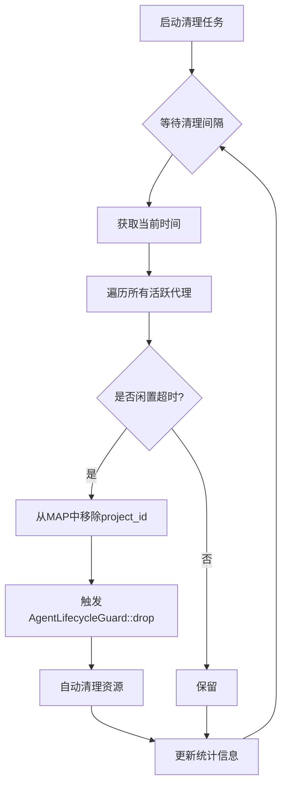
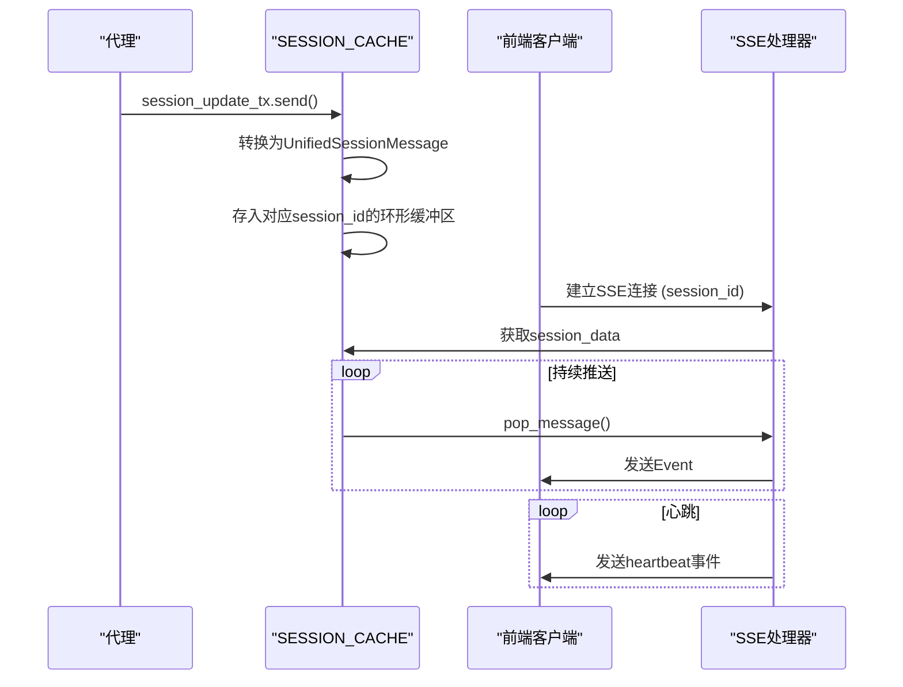

# 会话模型

<cite>
**本文档引用的文件**
- [agent_model.rs](file://crates/rcoder/src/model/agent_model.rs)
- [session_cache.rs](file://crates/rcoder/src/service/session_cache.rs)
- [agent_session_notify.rs](file://crates/rcoder/src/model/agent_session_notify.rs)
- [agent_stop_handle.rs](file://crates/rcoder/src/proxy_agent/agent_stop_handle.rs)
- [cleanup_task.rs](file://crates/rcoder/src/proxy_agent/cleanup_task.rs)
</cite>

## 目录
1. [简介](#简介)
2. [核心结构定义](#核心结构定义)
3. [会话状态机](#会话状态机)
4. [会话生命周期管理](#会话生命周期管理)
5. [并发存储与访问控制](#并发存储与访问控制)
6. [超时与自动清理机制](#超时与自动清理机制)
7. [实际使用场景](#实际使用场景)
8. [消息通知机制](#消息通知机制)

## 简介
本文档详细描述了 `rcoder` 项目中基于 `agent_model.rs` 定义的会话模型。该模型围绕 `AgentSession` 和 `AgentState` 等核心结构构建，实现了对代理会话的全生命周期管理。系统采用基于 RAII（资源获取即初始化）的设计原则，通过 `AgentLifecycleGuard` 自动管理资源清理，并利用 `DashMap` 实现高效的并发访问。会话状态通过 `AgentStatus` 枚举进行跟踪，并结合 `SESSION_CACHE` 全局缓存实现与前端的实时消息推送。

## 核心结构定义

### AgentType 枚举
`AgentType` 枚举定义了系统支持的代理类型，目前包括 `Codex` 和 `Claude` 两种。

**字段说明**:
- **Codex**: 表示 OpenAI Codex 代理。
- **Claude**: 表示 Claude Code 代理。

该枚举提供了 `from_model_provider` 方法，可根据模型提供商的配置自动选择合适的代理类型：
- 当协议为 `Anthropic` 时，选择 `Claude`。
- 当协议为 `OpenAI` 或未知时，选择 `Codex`。

**Section sources**
- [agent_model.rs](file://crates/rcoder/src/model/agent_model.rs#L10-L60)

### AgentStatus 枚举
`AgentStatus` 枚举定义了代理服务的运行状态。

**字段说明**:
- **Active**: 活跃状态，表示代理正在处理请求。
- **Idle**: 空闲状态，表示代理正在等待新的请求。
- **Terminating**: 正在终止状态，表示代理已收到停止信号，正在清理资源。

**Section sources**
- [agent_model.rs](file://crates/rcoder/src/model/agent_model.rs#L148-L157)

### ProjectAndAgentInfo 结构体
`ProjectAndAgentInfo` 是系统的核心数据结构，它将一个项目与一个代理服务实例关联起来，并存储了会话的所有关键信息。

**字段说明**:
- **project_id**: 项目的唯一标识符。
- **session_id**: 代理服务启动时创建的会话ID，用于标识本次会话。
- **prompt_tx**: 一个无界发送通道（`mpsc::UnboundedSender`），用于向代理发送 `PromptRequest` 请求。
- **cancel_tx**: 一个无界发送通道，用于向代理发送取消通知。
- **model_provider**: 可选的模型提供商配置，包含API密钥、基础URL等信息。
- **request_id**: 当前活跃的用户请求ID，用于将前端请求与后端处理关联。
- **status**: 当前代理服务的状态（`AgentStatus`）。
- **last_activity**: 最后一次活动的时间戳，用于超时检测。
- **created_at**: 会话创建的时间戳。
- **lifecycle_guard**: `AgentLifecycleGuard` 的实例，是实现自动资源清理的关键。

**Section sources**
- [agent_model.rs](file://crates/rcoder/src/model/agent_model.rs#L249-L284)

### AgentStatusResponse 结构体
`AgentStatusResponse` 用于向客户端返回代理的状态信息。

**字段说明**:
- **project_id**: 项目ID。
- **is_alive**: 布尔值，指示代理服务是否存活。
- **session_id**: 会话ID，仅当 `is_alive` 为 `true` 时存在。
- **status**: 代理服务状态，仅当 `is_alive` 为 `true` 时存在。
- **last_activity**: 最后活动时间，仅当 `is_alive` 为 `true` 时存在。
- **created_at**: 创建时间，仅当 `is_alive` 为 `true` 时存在。
- **model_provider**: 模型提供商的安全信息，仅当 `is_alive` 为 `true` 时存在。

**Section sources**
- [agent_model.rs](file://crates/rcoder/src/model/agent_model.rs#L286-L313)

## 会话状态机
系统通过 `AgentStatus` 枚举实现了一个简单的状态机来管理代理的生命周期。状态转换逻辑如下：

**Diagram sources**
- [agent_model.rs](file://crates/rcoder/src/model/agent_model.rs#L148-L157)

**状态转换说明**:
1. **初始化**: 代理服务启动后，初始状态为 `Idle`。
2. **运行**: 当收到用户的 `Prompt` 请求时，状态从 `Idle` 转换为 `Active`。
3. **完成**: 当代理完成请求处理后，状态从 `Active` 回到 `Idle`。
4. **取消**: 无论当前是 `Active` 还是 `Idle` 状态，一旦收到取消或停止信号，状态都会转换为 `Terminating`。
5. **销毁**: 当 `AgentLifecycleGuard` 被 `drop` 时，所有资源被清理，会话结束。

## 会话生命周期管理

### AgentLifecycleGuard
`AgentLifecycleGuard` 是实现会话生命周期管理的核心组件，它遵循 RAII 原则，确保在对象被销毁时自动清理所有相关资源。

**关键特性**:
- **自动清理**: 当 `AgentLifecycleGuard` 的最后一个引用被 `drop` 时，其 `Drop` 实现会自动触发资源清理。
- **类型安全**: 内部使用 `enum AgentResources` 区分 `Claude` 和 `Codex` 两种代理的不同资源。
- **优雅停止**: 提供 `graceful_stop()` 方法，可以发送取消信号并等待任务自然退出。
- **强制清理**: 提供 `force_cleanup()` 方法，用于强制终止子进程或取消异步任务。

**资源清理逻辑**:
- 对于 **Claude** 代理: 终止子进程并停止 `stderr` 读取任务。
- 对于 **Codex** 代理: 取消所有 `IO` 任务和通道处理任务。

**Diagram sources**
- [agent_stop_handle.rs](file://crates/rcoder/src/proxy_agent/agent_stop_handle.rs#L17-L263)
- [agent_model.rs](file://crates/rcoder/src/model/agent_model.rs#L249-L284)

**Section sources**
- [agent_stop_handle.rs](file://crates/rcoder/src/proxy_agent/agent_stop_handle.rs#L17-L263)

## 并发存储与访问控制
系统使用 `DashMap` 来实现会话的并发存储和访问，确保在高并发场景下的性能和安全性。

### 全局存储结构
- **PROJECT_AND_AGENT_INFO_MAP**: 一个全局的 `LazyLock<DashMap<String, ProjectAndAgentInfo>>`，以 `project_id` 为键存储 `ProjectAndAgentInfo`。这是管理所有活跃代理的主要数据结构。

### 并发访问策略
- **无锁读取**: `DashMap` 内部采用分片锁机制，允许多个线程同时读取不同的键，极大地提高了读取性能。
- **细粒度写入**: 写入操作（如插入、删除）只锁定相关的分片，避免了全局锁的竞争。
- **线程安全**: 所有操作都是线程安全的，无需外部同步。

**Section sources**
- [acp_agent.rs](file://crates/rcoder/src/proxy_agent/acp_agent.rs#L124-L126)

## 超时与自动清理机制
系统通过一个后台任务定期扫描并清理闲置超时的代理，以释放系统资源。

### CleanupConfig 配置
- **idle_timeout**: 闲置超时时间，默认为30分钟。如果代理在该时间内没有活动，则被视为闲置。
- **cleanup_interval**: 清理检查间隔，默认为5分钟。

### 清理流程
1. **定时扫描**: `AgentCleaner` 任务以 `cleanup_interval` 为周期运行。
2. **识别闲置**: 遍历 `PROJECT_AND_AGENT_INFO_MAP`，计算每个代理的 `last_activity` 与当前时间的差值。
3. **执行清理**: 对于超时的代理，直接从 `PROJECT_AND_AGENT_INFO_MAP` 中移除其 `project_id`。
4. **自动回收**: 移除操作会触发 `ProjectAndAgentInfo` 的 `Drop`，进而触发 `AgentLifecycleGuard` 的 `Drop`，完成资源清理。

**Diagram sources**
- [cleanup_task.rs](file://crates/rcoder/src/proxy_agent/cleanup_task.rs#L0-L206)

**Section sources**
- [cleanup_task.rs](file://crates/rcoder/src/proxy_agent/cleanup_task.rs#L0-L206)

## 实际使用场景

### 通过会话ID查询状态
客户端可以通过 `project_id` 查询代理的当前状态。系统会检查 `PROJECT_AND_AGENT_INFO_MAP` 中是否存在对应的 `project_id`，如果存在则返回 `AgentStatusResponse`，其中 `is_alive` 为 `true`，并填充所有相关信息；如果不存在，则返回 `is_alive` 为 `false`。

### 安全地中止长时间运行的代理任务
1. **发送停止请求**: 客户端调用 `/stop` API，传入 `project_id`。
2. **查找会话**: 服务器在 `PROJECT_AND_AGENT_INFO_MAP` 中查找对应的 `ProjectAndAgentInfo`。
3. **触发清理**: 服务器从 `PROJECT_AND_AGENT_INFO_MAP` 中移除该 `project_id`。
4. **自动终止**: `AgentLifecycleGuard` 的 `Drop` 实现被调用，向代理发送取消信号并清理所有资源。

此机制是安全的，因为它不直接杀死进程，而是通过标准的取消信号（`CancellationToken`）来请求代理优雅退出。

**Section sources**
- [agent_stop_handler.rs](file://crates/rcoder/src/handler/agent_stop_handler.rs#L94-L128)
- [agent_stop_handle.rs](file://crates/rcoder/src/proxy_agent/agent_stop_handle.rs#L168-L210)

## 消息通知机制
系统使用 `SESSION_CACHE` 全局缓存来存储会话过程中的所有消息，并通过 Server-Sent Events (SSE) 推送给前端。

### SESSION_CACHE 结构
- **SESSION_CACHE**: 一个全局的 `LazyLock<DashMap<String, SessionData>>`，以 `session_id` 为键存储 `SessionData`。
- **SessionData**: 包含一个大小为1000的 `ringbuf::HeapRb` 循环缓冲区，用于存储 `UnifiedSessionMessage`。

### 消息流
1. **消息生成**: 代理在执行过程中产生 `SessionUpdate`。
2. **消息转换**: 通过 `push_session_update` 函数，将 `SessionNotify` 转换为 `UnifiedSessionMessage` 并存入 `SESSION_CACHE`。
3. **SSE 推送**: 前端建立 SSE 连接后，服务器会从 `SESSION_CACHE` 中读取消息并实时推送。

**Diagram sources**
- [session_cache.rs](file://crates/rcoder/src/service/session_cache.rs#L0-L96)
- [agent_session_notification.rs](file://crates/rcoder/src/handler/agent_session_notification.rs#L355-L437)

**Section sources**
- [session_cache.rs](file://crates/rcoder/src/service/session_cache.rs#L0-L96)
- [agent_session_notify.rs](file://crates/rcoder/src/model/agent_session_notify.rs#L0-L377)