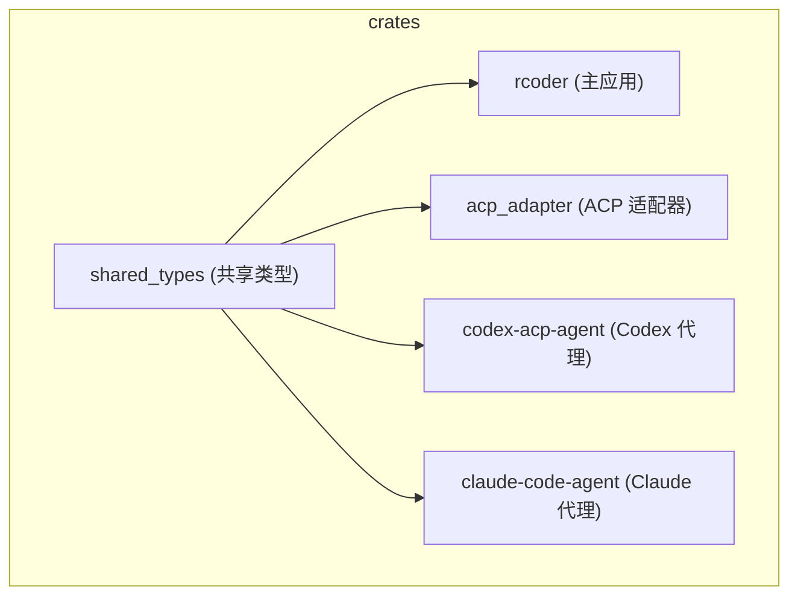
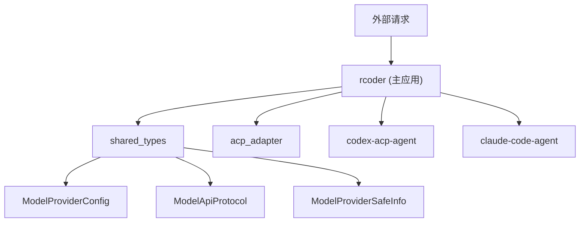
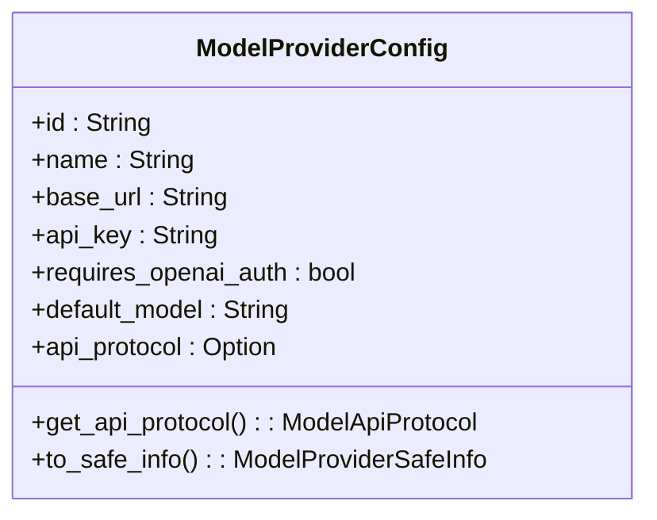
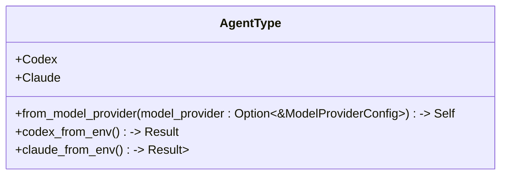
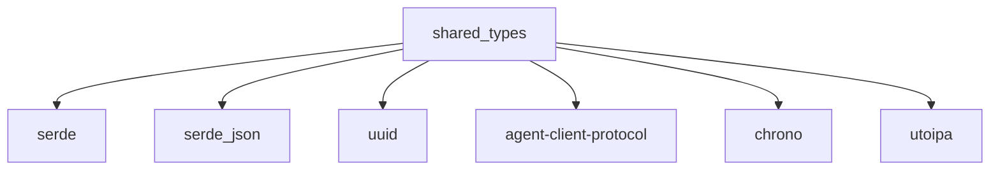

# 共享枚举类型

<cite>
**本文档中引用的文件**   
- [model_provider.rs](file://crates/shared_types/src/model/model_provider.rs)
- [lib.rs](file://crates/shared_types/src/lib.rs)
- [agent_model.rs](file://crates/rcoder/src/model/agent_model.rs)
- [Cargo.toml](file://crates/shared_types/Cargo.toml)
- [Cargo.toml](file://crates/rcoder/Cargo.toml)
</cite>

## 目录
1. [简介](#简介)
2. [项目结构](#项目结构)
3. [核心组件](#核心组件)
4. [架构概述](#架构概述)
5. [详细组件分析](#详细组件分析)
6. [依赖分析](#依赖分析)
7. [性能考虑](#性能考虑)
8. [故障排除指南](#故障排除指南)
9. [结论](#结论)
10. [附录](#附录)（如有必要）

## 简介
本文档详细说明了在 `model_provider.rs` 文件中定义的跨 crate 共享枚举类型，如 `ModelProvider` 和 `AgentType`。这些类型通过 `shared_types` crate 实现了类型一致性，避免了在多个 crate 中重复定义。文档还解释了 Serde 序列化配置如何确保 JSON 交互的兼容性，并提供了在不同 crate 中引用这些共享类型的最佳实践。

## 项目结构
项目采用 Cargo workspace 结构，包含多个 crate，其中 `shared_types` crate 负责定义跨 crate 共享的类型。这些共享类型被其他 crate 如 `rcoder`、`acp_adapter` 等引用，确保了类型的一致性和复用性。

**Diagram sources**
- [model_provider.rs](file://crates/shared_types/src/model/model_provider.rs#L1-L105)
- [lib.rs](file://crates/shared_types/src/lib.rs#L1-L4)

**Section sources**
- [model_provider.rs](file://crates/shared_types/src/model/model_provider.rs#L1-L105)
- [lib.rs](file://crates/shared_types/src/lib.rs#L1-L4)

## 核心组件
`shared_types` crate 中定义的核心组件包括 `ModelApiProtocol` 枚举、`ModelProviderConfig` 结构体和 `ModelProviderSafeInfo` 结构体。这些组件通过 Serde 序列化和反序列化支持 JSON 交互，并通过 `utoipa` 支持 OpenAPI 文档生成。

**Section sources**
- [model_provider.rs](file://crates/shared_types/src/model/model_provider.rs#L1-L105)

## 架构概述
系统架构基于 Rust 的模块化设计，通过 `shared_types` crate 实现类型共享。主应用 `rcoder` 和其他代理模块通过依赖 `shared_types` 来使用共享类型，确保了类型的一致性和代码的可维护性。

**Diagram sources**
- [model_provider.rs](file://crates/shared_types/src/model/model_provider.rs#L1-L105)
- [agent_model.rs](file://crates/rcoder/src/model/agent_model.rs#L1-L315)

## 详细组件分析

### ModelProviderConfig 分析
`ModelProviderConfig` 结构体定义了模型提供商的配置信息，包括 ID、名称、API 基础 URL、密钥、是否需要 OpenAI 兼容认证、默认模型和 API 协议类型。该结构体通过 Serde 序列化和反序列化支持 JSON 交互，并通过 `utoipa` 支持 OpenAPI 文档生成。

#### 结构体定义

**Diagram sources**
- [model_provider.rs](file://crates/shared_types/src/model/model_provider.rs#L41-L75)

### AgentType 枚举分析
`AgentType` 枚举定义了使用的 AI 代理类型，包括 `Codex` 和 `Claude`。该枚举在 `rcoder` crate 的 `agent_model.rs` 文件中定义，并通过 `shared_types` crate 中的 `ModelApiProtocol` 来决定使用哪种代理。

#### 枚举定义

**Diagram sources**
- [agent_model.rs](file://crates/rcoder/src/model/agent_model.rs#L21-L28)

### Serde 序列化配置
Serde 序列化配置确保了 `ModelProviderConfig` 和 `ModelProviderSafeInfo` 结构体在 JSON 交互中的兼容性。通过 `#[serde(rename_all = "lowercase")]` 和 `#[serde(default, skip_serializing_if = "Option::is_none")]` 等属性，确保了字段名称的一致性和可选字段的正确处理。

**Section sources**
- [model_provider.rs](file://crates/shared_types/src/model/model_provider.rs#L1-L105)

## 依赖分析
`shared_types` crate 依赖于 `serde`、`serde_json`、`uuid`、`agent-client-protocol` 和 `chrono` 等外部库，这些依赖通过 workspace 统一管理，确保了版本的一致性。

**Diagram sources**
- [Cargo.toml](file://crates/shared_types/Cargo.toml#L1-L14)

**Section sources**
- [Cargo.toml](file://crates/shared_types/Cargo.toml#L1-L14)

## 性能考虑
共享类型的设计考虑了性能因素，通过 `Clone` 和 `Copy` 特性确保了高效的数据复制。此外，`ModelProviderConfig` 中的 `api_protocol` 字段使用 `Option<String>` 类型，避免了不必要的内存分配。

## 故障排除指南
在使用共享类型时，常见的问题包括版本不一致和序列化错误。确保所有 crate 使用相同版本的 `shared_types`，并在配置文件中正确设置字段名称和类型。

**Section sources**
- [model_provider.rs](file://crates/shared_types/src/model/model_provider.rs#L1-L105)
- [agent_model.rs](file://crates/rcoder/src/model/agent_model.rs#L1-L315)

## 结论
通过 `shared_types` crate，项目实现了跨 crate 的类型共享，提高了代码的可维护性和一致性。Serde 序列化配置确保了 JSON 交互的兼容性，而清晰的依赖管理确保了版本的一致性。

## 附录
无