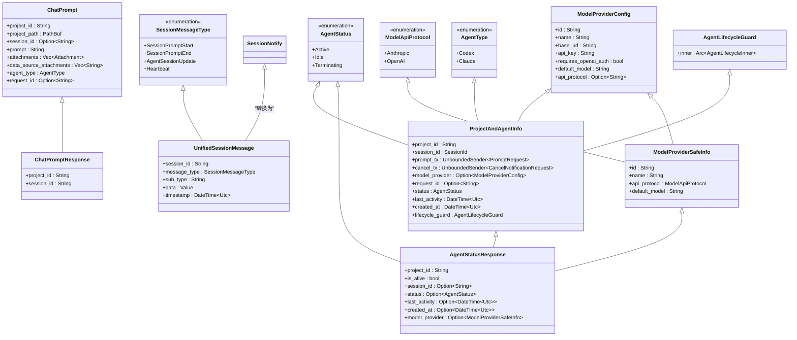

# 数据模型

<cite>
**本文档中引用的文件**  
- [agent_model.rs](file://crates/rcoder/src/model/agent_model.rs)
- [chat_prompt.rs](file://crates/rcoder/src/model/chat_prompt.rs)
- [agent_session_notify.rs](file://crates/rcoder/src/model/agent_session_notify.rs)
- [session_cache.rs](file://crates/rcoder/src/service/session_cache.rs)
- [model_provider.rs](file://crates/shared_types/src/model/model_provider.rs)
- [agent_stop_handle.rs](file://crates/rcoder/src/proxy_agent/agent_stop_handle.rs)
</cite>

## 目录
1. [简介](#简介)
2. [核心数据结构](#核心数据结构)
3. [实体关系与UML类图](#实体关系与uml类图)
4. [共享类型与枚举定义](#共享类型与枚举定义)
5. [数据验证与序列化配置](#数据验证与序列化配置)
6. [会话状态存储与生命周期管理](#会话状态存储与生命周期管理)
7. [使用示例](#使用示例)

## 简介
`rcoder`系统通过一组结构化的数据模型来管理AI代理的会话、提示、状态通知和生命周期。本文档详细描述了核心数据结构的设计、字段含义、类型定义以及它们之间的关系。重点分析`agent_model`、`chat_prompt`和`agent_session_notify`三个模块中的关键实体，并说明`shared_types`中定义的共享枚举如何在不同组件间保持一致性。同时，文档解释了数据的序列化规则、内存存储机制和生命周期管理策略，为开发者提供清晰的使用指导。

## 核心数据结构

### 会话模型 (agent_model)
`agent_model` 模块定义了与AI代理会话管理相关的核心结构。

#### AgentType 枚举
表示所使用的AI代理类型，目前支持两种：
- `Codex`: OpenAI Codex 代理
- `Claude`: Claude Code 代理

该枚举实现了 `Default` trait，当未指定时默认使用 `Claude`。它还提供了 `from_model_provider` 方法，根据模型提供商的协议（`Anthropic` 或 `OpenAI`）自动选择合适的代理类型。

#### AgentStatus 枚举
表示代理服务的运行状态：
- `Active`: 活跃状态，正在处理请求
- `Idle`: 空闲状态，等待新请求
- `Terminating`: 正在终止

#### ProjectAndAgentInfo 结构体
这是会话管理的核心数据结构，代表一个项目与其对应的代理服务实例。

**字段定义**:
- `project_id`: 项目唯一标识符。
- `session_id`: 代理服务的会话ID。
- `prompt_tx`: 用于向代理发送提示（Prompt）的无界通道（`mpsc::UnboundedSender<PromptRequest>`）。
- `cancel_tx`: 用于发送取消通知的无界通道（`mpsc::UnboundedSender<CancelNotificationRequest>`）。
- `model_provider`: 可选的模型提供商配置，用于动态指定AI模型。
- `request_id`: 当前活跃用户请求的ID，用于追踪。
- `status`: 当前代理服务的状态（`AgentStatus`）。
- `last_activity`: 最后一次活动的时间戳（UTC）。
- `created_at`: 会话创建的时间戳（UTC）。
- `lifecycle_guard`: 代理生命周期守卫（`AgentLifecycleGuard`），确保资源在对象被丢弃时自动清理。

#### AgentStatusResponse 结构体
用于向客户端返回代理状态查询结果。

**字段定义**:
- `project_id`: 项目ID。
- `is_alive`: 代理是否存活。
- `session_id`: 会话ID（仅当代理存活时存在）。
- `status`: 代理服务状态（仅当代理存活时存在）。
- `last_activity`: 最后活动时间（仅当代理存活时存在）。
- `created_at`: 创建时间（仅当代理存活时存在）。
- `model_provider`: 模型提供商的安全信息（不包含敏感密钥，仅当代理存活时存在）。

**Section sources**
- [agent_model.rs](file://crates/rcoder/src/model/agent_model.rs#L238-L313)

### 聊天提示模型 (chat_prompt)
`chat_prompt` 模块定义了客户端向代理发送请求的数据结构。

#### ChatPrompt 结构体
使用 `derive_builder` 宏构建，包含所有发送给代理的必要信息。

**字段定义**:
- `project_id`: 项目ID，用于定位项目工作区。
- `project_path`: 项目在服务器上的文件系统路径。
- `session_id`: 可选的会话ID。如果未提供，代理将自动创建新会话。
- `prompt`: 用户输入的提示内容。
- `attachments`: 可选的附件列表，用于传递文件。
- `data_source_attachments`: 数据源附件列表，以JSON字符串数组形式传递外部数据信息。
- `agent_type`: 指定使用的代理类型（`AgentType`），默认为 `Claude`。
- `request_id`: 可选的请求ID，用于标识和追踪单个请求。

#### ChatPromptResponse 结构体
代理对 `ChatPrompt` 的响应，返回会话ID。

**字段定义**:
- `project_id`: 项目ID。
- `session_id`: 代理生成或使用的会话ID。

**Section sources**
- [chat_prompt.rs](file://crates/rcoder/src/model/chat_prompt.rs#L0-L39)

### 代理状态通知模型 (agent_session_notify)
`agent_session_notify` 模块定义了从代理到前端的实时状态通知机制，主要通过SSE（Server-Sent Events）实现。

#### SessionMessageType 枚举
定义了通知消息的主类型，使用 `camelCase` 命名：
- `SessionPromptStart`: 用户发送提示开始。
- `SessionPromptEnd`: 代理执行结束。
- `AgentSessionUpdate`: 代理执行过程中的更新。
- `Heartbeat`: SSE连接的心跳消息。

#### UnifiedSessionMessage 结构体
所有通知消息的统一格式，确保前端可以一致地处理。

**字段定义**:
- `session_id`: 会话ID。
- `message_type`: 消息主类型（`SessionMessageType`）。
- `sub_type`: 消息子类型，提供更详细的分类（如 `end_turn`, `agent_message_chunk`）。
- `data`: 具体的消息内容，为 `serde_json::Value` 类型，可容纳任意JSON数据。
- `timestamp`: 消息生成的时间戳（UTC）。

#### SessionNotify 枚举
表示需要发送给前端的原始通知类型，包含：
- `AgentSessionUpdate`: 代理更新。
- `SessionPromptStart`: 提示开始。
- `SessionPromptEnd`: 提示结束。

该枚举实现了 `to_unified_message` 方法，负责将自身转换为 `UnifiedSessionMessage` 格式，并自动填充时间戳和 `sub_type`。

**Section sources**
- [agent_session_notify.rs](file://crates/rcoder/src/model/agent_session_notify.rs#L0-L377)

## 实体关系与UML类图



**Diagram sources**
- [agent_model.rs](file://crates/rcoder/src/model/agent_model.rs#L238-L313)
- [chat_prompt.rs](file://crates/rcoder/src/model/chat_prompt.rs#L0-L39)
- [agent_session_notify.rs](file://crates/rcoder/src/model/agent_session_notify.rs#L0-L377)
- [model_provider.rs](file://crates/shared_types/src/model/model_provider.rs#L0-L104)
- [agent_stop_handle.rs](file://crates/rcoder/src/proxy_agent/agent_stop_handle.rs#L17-L22)

## 共享类型与枚举定义

`shared_types` crate 提供了跨多个组件共享的数据类型，确保了系统的一致性。

### ModelApiProtocol 枚举
定义了模型接口的协议类型，是 `shared_types` 中的核心枚举。

**字段定义**:
- `Anthropic`: 表示使用Anthropic Claude API协议。
- `OpenAI`: 表示使用OpenAI兼容的API协议。

该枚举实现了 `Default`、`FromStr` 和 `ToString` trait，允许从字符串解析和转换回字符串。`FromStr` 实现中，未知协议默认为 `Anthropic`。

### ModelProviderConfig 结构体
定义了模型提供商的完整配置信息。

**字段定义**:
- `id`: 模型提供商的唯一标识符。
- `name`: 提供商名称（如 "openai", "anthropic"）。
- `base_url`: API的基础URL。
- `api_key`: 认证密钥（敏感信息）。
- `requires_openai_auth`: 是否需要OpenAI兼容的认证方式。
- `default_model`: 默认使用的模型名称。
- `api_protocol`: 可选的协议类型（`anthropic` 或 `openai`），如果未指定则默认为 `OpenAI`。

该结构体通过 `get_api_protocol()` 方法解析 `api_protocol` 字段，返回 `ModelApiProtocol` 枚举。

### ModelProviderSafeInfo 结构体
`ModelProviderConfig` 的安全版本，用于向客户端暴露信息，不包含敏感字段（如 `api_key`）。

**字段定义**:
- `id`: 模型ID。
- `name`: 提供商名称。
- `api_protocol`: 模型接口协议类型（`ModelApiProtocol` 枚举）。
- `default_model`: 默认模型名称。

`ModelProviderConfig` 提供了 `to_safe_info()` 方法，用于安全地转换为 `ModelProviderSafeInfo`。

**Section sources**
- [model_provider.rs](file://crates/shared_types/src/model/model_provider.rs#L0-L104)

## 数据验证与序列化配置

系统广泛使用 `serde` 和 `utoipa` 库来处理数据的序列化/反序列化（Serde）和API文档生成。

### Serde 配置
- **`skip_serializing_if`**: 多个结构体字段使用了 `#[serde(skip_serializing_if = "Option::is_none")]`，确保当 `Option` 类型为 `None` 时，该字段不会出现在最终的JSON输出中，使响应更简洁。
- **`rename_all = "camelCase"`**: `UnifiedSessionMessage` 和 `SessionMessageType` 使用此属性，确保Rust中的 `snake_case` 字段在JSON中以 `camelCase` 形式呈现，符合前端常见的命名习惯。
- **`default`**: `api_protocol` 字段使用 `#[serde(default)]`，如果反序列化时该字段缺失，则使用 `Option::None`。

### UTOIPA 配置
`utoipa::ToSchema` 宏用于为结构体生成OpenAPI/Swagger文档。
- **`#[schema(example = "...")]`**: 为字段提供示例值，帮助API使用者理解数据格式。
- **`#[schema(...)]`**: 用于添加额外的文档元数据。

### 数据验证
虽然核心模型本身没有复杂的验证逻辑，但其设计通过类型系统和 `Option` 类型实现了基本的验证：
- 使用 `String` 而非 `&str` 确保数据的所有权。
- 使用 `Option<T>` 明确表示字段的可选性。
- 在 `ProjectAndAgentInfo` 的 `Drop` 实现中，通过日志记录其被丢弃，有助于调试资源管理问题。

**Section sources**
- [agent_model.rs](file://crates/rcoder/src/model/agent_model.rs#L238-L313)
- [agent_session_notify.rs](file://crates/rcoder/src/model/agent_session_notify.rs#L0-L377)
- [model_provider.rs](file://crates/shared_types/src/model/model_provider.rs#L0-L104)

## 会话状态存储与生命周期管理

### 内存存储 (Session Cache)
系统使用 `DashMap` 和 `ringbuf` 来实现高效的全局会话消息缓存。

#### SESSION_CACHE 静态变量
- **类型**: `LazyLock<DashMap<String, SessionData>>`
- **作用**: 全局唯一的会话缓存，使用 `LazyLock` 确保在首次访问时才初始化，使用 `DashMap` 提供高性能的并发读写。

#### SessionData 结构体
- **rb**: 一个固定大小的 `HeapRb<UnifiedSessionMessage>`（环形缓冲区），最大容量为1000条消息。使用 `Mutex` 保护，确保线程安全。
- **add_message**: 将新消息推入缓冲区，如果缓冲区已满，则自动覆盖最旧的消息。
- **drain_messages**: 获取并清空所有当前消息，通常用于SSE连接的初始推送。
- **pop_message**: 移除并返回一条消息，用于SSE的逐条推送。
- **message_count**: 返回当前缓冲区中的消息数量。

#### push_session_update 函数
一个便捷函数，用于将 `SessionNotify` 消息推送到指定会话的缓存中。
1. 调用 `to_unified_message()` 将通知转换为统一格式。
2. 使用 `SESSION_CACHE.entry(session_id).or_insert_with(...)` 获取或创建 `SessionData`。
3. 调用 `add_message()` 将消息添加到环形缓冲区。
4. 记录调试日志。

### 生命周期管理 (AgentLifecycleGuard)
`AgentLifecycleGuard` 是基于RAII（Resource Acquisition Is Initialization）原则设计的关键组件，确保代理资源在任何情况下都能被正确清理。

#### 核心机制
- **RAII**: 当 `AgentLifecycleGuard` 对象被 `drop`（即离开作用域或被销毁）时，其 `Drop` 实现会被自动调用，触发资源清理。
- **Arc**: 内部使用 `Arc`（原子引用计数）包装 `AgentLifecycleInner`，允许多个所有者共享同一个守卫，只有当最后一个引用被释放时，清理逻辑才会执行。

#### 清理逻辑
- **`graceful_stop`**: 异步方法，发送取消信号，等待任务自然退出，然后强制清理。
- **`force_cleanup`**: 根据代理类型（`Claude` 或 `Codex`）执行不同的清理操作：
  - `Claude`: 终止子进程并中止 `stderr` 读取任务。
  - `Codex`: 中止所有相关的 `JoinHandle` 任务。
- **`Drop` 实现**: 作为最后的保障，如果 `graceful_stop` 未被调用，`Drop` 会执行类似的清理操作。

**Section sources**
- [session_cache.rs](file://crates/rcoder/src/service/session_cache.rs#L0-L96)
- [agent_stop_handle.rs](file://crates/rcoder/src/proxy_agent/agent_stop_handle.rs#L17-L263)

## 使用示例

### 构造请求对象
```rust
use rcoder::model::{ChatPrompt, ChatPromptBuilder, AgentType};

let chat_prompt = ChatPromptBuilder::default()
    .project_id("my_project_123".to_string())
    .project_path("/path/to/project".into())
    .prompt("请帮我重构这个函数，使其更高效。".to_string())
    .agent_type(AgentType::Claude)
    .request_id(Some("req_abc123".to_string()))
    .build()
    .expect("Failed to build ChatPrompt");
```

### 解析响应数据
```rust
// 假设从API接收到一个AgentStatusResponse
let response: AgentStatusResponse = /* 从HTTP响应反序列化 */;
if response.is_alive {
    println!("代理正在运行，会话ID: {}", response.session_id.unwrap());
    println!("当前状态: {:?}", response.status.unwrap());
} else {
    println!("代理未运行。");
}
```

### 处理SSE通知
```rust
// 前端JavaScript示例
const eventSource = new EventSource('/api/sse?session_id=abc123');

eventSource.onmessage = function(event) {
    const message = JSON.parse(event.data);
    console.log(`收到消息: ${message.sub_type}`);
    
    switch(message.message_type) {
        case 'SessionPromptStart':
            console.log('提示已发送，开始处理...');
            break;
        case 'AgentSessionUpdate':
            if (message.sub_type === 'agent_message_chunk') {
                // 将消息块追加到聊天界面
                appendToChat(message.data.text);
            }
            break;
        case 'SessionPromptEnd':
            console.log(`处理结束，原因: ${message.data.description}`);
            eventSource.close();
            break;
    }
};
```

**Section sources**
- [chat_prompt.rs](file://crates/rcoder/src/model/chat_prompt.rs#L0-L39)
- [agent_session_notify.rs](file://crates/rcoder/src/model/agent_session_notify.rs#L0-L377)