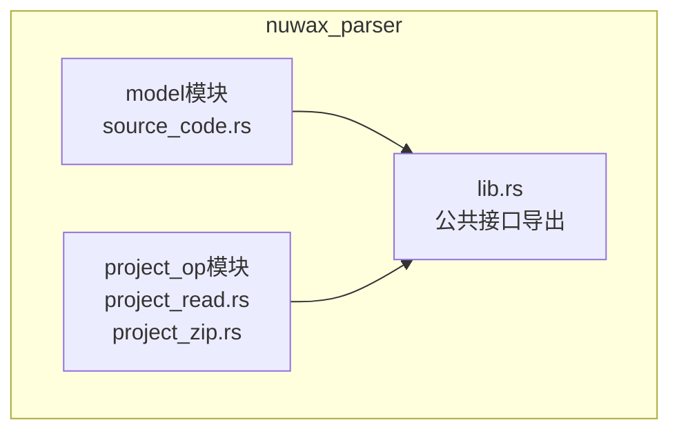
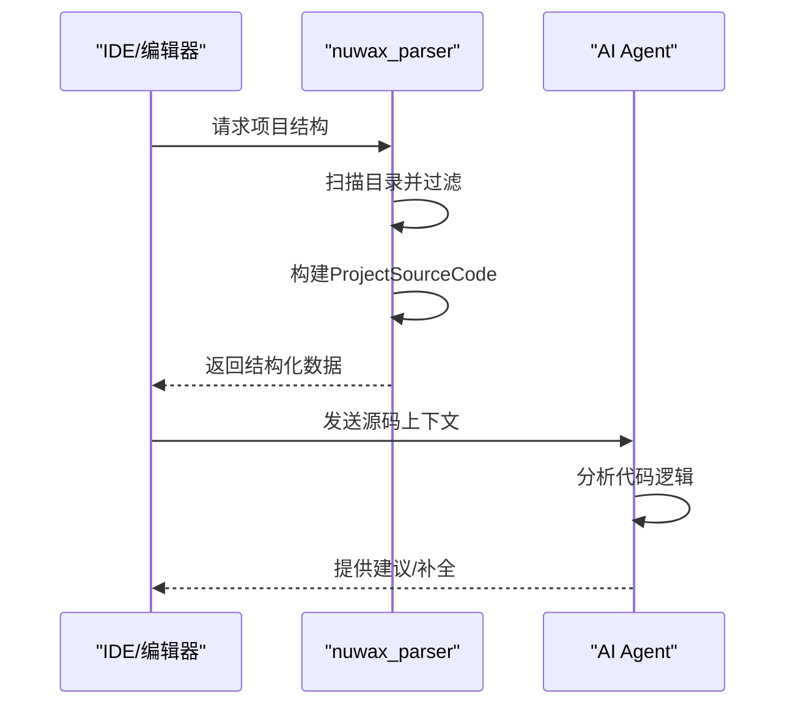

# 源码解析模型

<cite>
**本文档引用文件**  
- [source_code.rs](file://crates/nuwax_parser/src/model/source_code.rs)
- [project_read.rs](file://crates/nuwax_parser/src/project_op/project_read.rs)
- [mod.rs](file://crates/nuwax_parser/src/model/mod.rs)
- [lib.rs](file://crates/nuwax_parser/src/lib.rs)
</cite>

## 目录
1. [简介](#简介)
2. [项目结构](#项目结构)
3. [核心数据模型](#核心数据模型)
4. [源码解析机制](#源码解析机制)
5. [文件遍历与过滤策略](#文件遍历与过滤策略)
6. [二进制文件识别逻辑](#二进制文件识别逻辑)
7. [性能优化与配置选项](#性能优化与配置选项)
8. [依赖分析与应用场景](#依赖分析与应用场景)
9. [结论](#结论)

## 简介
本文档深入解析 `nuwax_parser` 组件中定义的源码解析数据模型，重点分析 `source_code.rs` 中的 AST 节点、代码片段和语法树结构。阐述解析器如何将原始代码转换为结构化表示，包括类、函数、变量等元素的提取机制。同时说明位置信息（Position）和范围（Range）的设计理念，并展示如何利用这些模型进行代码理解、依赖分析和重构建议。

## 项目结构
`nuwax_parser` 是一个高性能的 Rust 文件解析与同步工具包，专为 Nuwax 平台设计，支持前后端系统间的无缝文件同步。其主要功能包括多格式支持、哈希验证、URL 文件下载、隐藏目录过滤以及 WASM 兼容性。



**图示来源**  
- [lib.rs](file://crates/nuwax_parser/src/lib.rs#L1-L20)
- [mod.rs](file://crates/nuwax_parser/src/model/mod.rs#L1-L6)
- [project_read.rs](file://crates/nuwax_parser/src/project_op/project_read.rs#L1-L20)

## 核心数据模型
`source_code.rs` 定义了两个核心结构体：`ProjectSourceCode` 和 `FileInfo`，用于表示项目源码的结构化数据。

### ProjectSourceCode 结构
该结构体代表整个项目的源代码集合，包含一个 `FileInfo` 类型的文件列表。

```rust
#[derive(Debug, Clone, Serialize, Deserialize, Builder, ToSchema)]
pub struct ProjectSourceCode {
    pub files: Vec<FileInfo>,
}
```

它提供了以下构建方法：
- `new()`: 创建空项目实例
- `add_file(file)`: 添加单个文件
- `with_files(files)`: 批量设置文件列表

### FileInfo 结构
`FileInfo` 表示单个文件的元数据和内容信息。

```rust
#[derive(Debug, Clone, Serialize, Deserialize, Builder, ToSchema)]
pub struct FileInfo {
    pub name: String,
    pub binary: bool,
    #[serde(rename = "sizeExceeded")]
    pub size_exceeded: bool,
    pub contents: Option<String>,
}
```

字段说明：
- **name**: 文件相对路径（相对于项目根目录）
- **binary**: 是否为二进制文件
- **size_exceeded**: 是否超出最大文件大小限制
- **contents**: 文本内容（仅当非二进制且未超限时加载）

该结构体提供链式调用方法（如 `with_contents`, `binary`, `size_exceeded`）以支持流式构建。

**本节来源**  
- [source_code.rs](file://crates/nuwax_parser/src/model/source_code.rs#L11-L72)
- [mod.rs](file://crates/nuwax_parser/src/model/mod.rs#L5)

## 源码解析机制
解析器通过 `ProjectReader` 组件将磁盘上的原始代码转换为结构化的 `ProjectSourceCode` 对象。

### 解析流程
1. 接收项目路径作为输入
2. 验证路径有效性（存在且为目录）
3. 使用 `walkdir` 遍历目录树
4. 对每个文件执行过滤与处理逻辑
5. 构建 `FileInfo` 实例并收集到 `ProjectSourceCode`

### 内容提取策略
- **文本文件**: 自动读取内容并存入 `contents` 字段
- **二进制文件**: 不读取内容，`contents` 为 `None`
- **超大文件**: 若超过配置大小限制，`contents` 也为 `None`

此机制确保内存使用可控，避免加载大型资源文件或日志文件。

**本节来源**  
- [project_read.rs](file://crates/nuwax_parser/src/project_op/project_read.rs#L127-L141)
- [source_code.rs](file://crates/nuwax_parser/src/model/source_code.rs#L57-L69)

## 文件遍历与过滤策略
`ProjectReader` 实现了多层次的文件过滤机制，确保只解析有意义的源码文件。

### 过滤层级
| 过滤类型 | 示例 | 说明 |
|--------|------|------|
| 文件名排除 | `CLAUDE.md`, `node_modules` | 精确匹配文件或目录名 |
| 目录名排除 | `.git`, `target` | 排除构建产物和版本控制目录 |
| 正则模式排除 | `.*\.lock$`, `.*\.log$` | 通配符匹配特定扩展名 |
| 隐藏文件/目录 | `.env`, `.idea` | 默认排除以 `.` 开头的条目 |

### 配置灵活性
通过 `ProjectReadConfig` 支持完全可定制的过滤规则：
- `exclude_files`: 明确排除的文件列表
- `exclude_dirs`: 明确排除的目录列表
- `exclude_file_patterns`: 文件名正则排除模式
- `exclude_dir_patterns`: 目录名正则排除模式
- `include_hidden_dirs/files`: 是否包含隐藏项

**本节来源**  
- [project_read.rs](file://crates/nuwax_parser/src/project_op/project_read.rs#L20-L100)
- [project_read.rs](file://crates/nuwax_parser/src/project_op/project_read.rs#L150-L180)

## 二进制文件识别逻辑
系统采用双重检测机制判断文件是否为二进制格式。

### 主要检测方法
1. **文件格式库检测** (`file-format`)
   - 基于文件内容识别 MIME 类型
   - 支持 Python、Rust、JSON 等文本格式识别
   - 对无法识别的格式触发备用逻辑

2. **内容回退检测** (`content_inspector`)
   - 检查前 1KB 数据中是否存在空字节（`\x00`）
   - 使用 `inspect()` 函数判断 `ContentType::BINARY`

### 支持的文本格式
- 基本文本：`.txt`, `.md`
- 编程语言：`.rs`, `.py`, `.js`, `.ts`, `.json`
- 标记语言：`.html`, `.xml`, `.yaml`

该机制确保 `.gitignore`、`.env` 等配置文件即使有特殊扩展名也能被正确识别为文本。

**本节来源**  
- [project_read.rs](file://crates/nuwax_parser/src/project_op/project_read.rs#L250-L350)

## 性能优化与配置选项
为提升解析效率和资源利用率，系统实现了多项优化策略。

### 惰性解析
- 仅当文件满足以下条件时才加载内容：
  - 非二进制文件
  - 文件大小未超过 `max_file_size` 限制（默认无限制）
- 大型文件（如日志、打包文件）自动跳过内容读取

### 缓存与预编译
- 正则表达式模式在初始化时预编译
- `compiled_file_patterns` 和 `compiled_dir_patterns` 缓存编译结果
- 避免每次遍历时重复编译正则

### 内存控制
- 使用流式遍历（`WalkDir::into_iter()`），避免一次性加载所有条目
- `Vec<FileInfo>` 动态增长，按需分配内存
- `Option<String>` 确保二进制文件不占用内容内存

**本节来源**  
- [project_read.rs](file://crates/nuwax_parser/src/project_op/project_read.rs#L110-L120)
- [project_read.rs](file://crates/nuwax_parser/src/project_op/project_read.rs#L200-L220)

## 依赖分析与应用场景
基于 `ProjectSourceCode` 模型可实现多种高级功能。

### 代码理解
- 构建项目文件拓扑图
- 分析文件依赖关系（导入/引用）
- 提取符号定义位置（结合 `acp_adapter` 的 `ResourceUri`）

### 重构建议
- 扫描废弃 API 调用
- 检测重复代码片段
- 建议模块拆分（基于文件数量与大小）

### 工具集成


**图示来源**  
- [project_read.rs](file://crates/nuwax_parser/src/project_op/project_read.rs#L127-L141)
- [source_code.rs](file://crates/nuwax_parser/src/model/source_code.rs#L11-L22)

## 结论
`nuwax_parser` 的源码解析模型通过 `ProjectSourceCode` 和 `FileInfo` 提供了高效、灵活的代码结构化能力。其设计兼顾性能与实用性，支持大规模项目的快速解析。结合精确的文件过滤、智能的二进制识别和可配置的内存控制，该模型为代码分析、AI 辅助编程等场景奠定了坚实基础。未来可扩展支持 AST 级别解析，进一步提升语义理解能力。