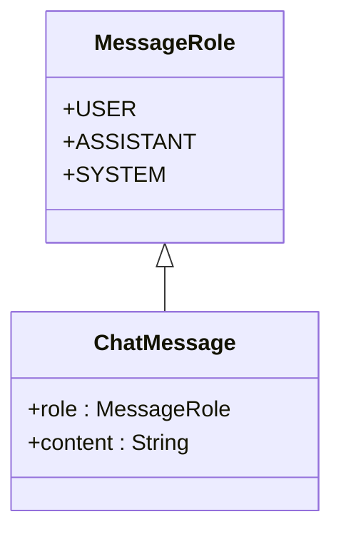
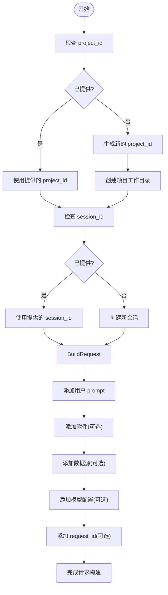
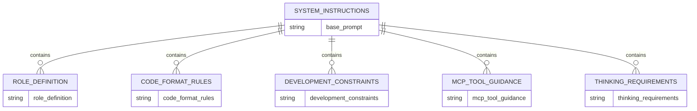
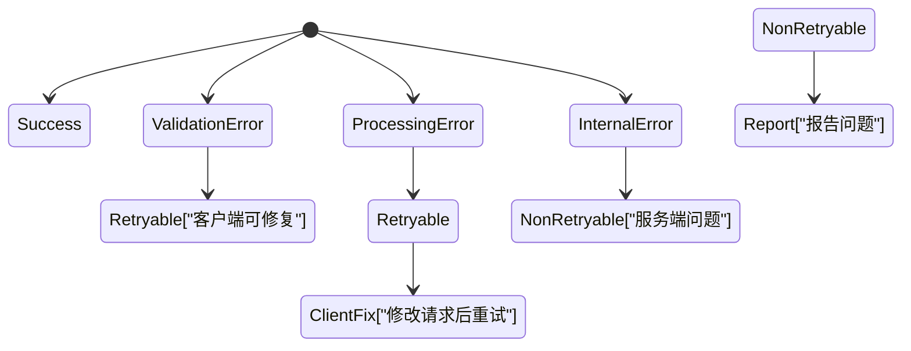

# 聊天提示模型

<cite>
**本文档引用的文件**
- [chat_prompt.rs](file://crates/rcoder/src/model/chat_prompt.rs)
- [chat_handler.rs](file://crates/rcoder/src/handler/chat_handler.rs)
- [system_prompt.rs](file://crates/rcoder/src/utils/system_prompt.rs)
- [agent_model.rs](file://crates/rcoder/src/model/agent_model.rs)
- [mod.rs](file://crates/rcoder/src/model/mod.rs)
</cite>

## 目录
1. [简介](#简介)
2. [核心数据结构](#核心数据结构)
3. [消息角色与序列化](#消息角色与序列化)
4. [上下文窗口管理与截断策略](#上下文窗口管理与截断策略)
5. [请求体构建与多轮对话拼接](#请求体构建与多轮对话拼接)
6. [提示词工程最佳实践](#提示词工程最佳实践)
7. [字段验证规则](#字段验证规则)
8. [错误处理模式](#错误处理模式)

## 简介
本项目中的聊天提示模型旨在为前端开发提供智能化支持，集成MCP（模型上下文协议）工具链，专注于React生态系统开发。系统通过结构化提示词、严格的开发约束和工具调用机制，确保AI生成代码符合现代前端最佳实践。该模型支持多媒体输入、项目上下文管理和外部数据源集成，适用于复杂前端工程的自动化开发场景。

## 核心数据结构

### ChatRequest 结构
`ChatRequest` 是用户向系统发送请求的核心结构，包含用户输入、项目上下文、附件和模型配置等信息。

**字段说明：**
- `prompt`: 用户输入的自然语言指令
- `project_id`: 可选项目标识符，用于关联开发上下文
- `session_id`: 可选会话标识符，用于维持对话状态
- `attachments`: 多媒体附件列表，支持文件上传
- `data_source_attachments`: 外部数据源描述，以JSON字符串数组形式传递
- `model_provider`: 模型提供商配置，支持自定义API接入
- `request_id`: 请求追踪标识符，用于调试和日志分析

### ChatPrompt 结构
`ChatPrompt` 是内部处理用的提示结构，由 `ChatRequest` 转换而来，包含更完整的执行上下文。

**字段说明：**
- `project_id`: 项目唯一标识
- `project_path`: 项目工作目录路径
- `session_id`: 会话ID，用于状态管理
- `prompt`: 用户提示内容
- `attachments`: 附件列表
- `data_source_attachments`: 数据源附件列表
- `agent_type`: 代理类型（Codex或Claude）
- `request_id`: 请求追踪ID

### PromptTemplate 相关组件
系统通过 `SystemPromptConfig` 和 `PromptBuilder` 构建完整的提示模板，包含以下核心部分：
- 基础系统提示词
- 角色定义
- 代码格式规则
- 开发行为约束
- MCP工具使用指导
- 思考过程要求

**Section sources**
- [chat_handler.rs](file://crates/rcoder/src/handler/chat_handler.rs#L14-L50)
- [chat_prompt.rs](file://crates/rcoder/src/model/chat_prompt.rs#L1-L39)
- [system_prompt.rs](file://crates/rcoder/src/utils/system_prompt.rs#L1-L319)

## 消息角色与序列化

### 消息角色枚举
系统定义了三种主要消息角色，通过不同的语义标签进行区分：



**角色说明：**
- **用户（User）**: 表示用户的输入请求
- **助手（Assistant）**: 表示AI生成的响应内容
- **系统（System）**: 表示系统级指令和约束条件

### 序列化方式
所有结构均实现 `Serialize` 和 `Deserialize` 特性，支持JSON格式的序列化与反序列化。使用 `serde` 属性进行精细化控制：

- `skip_serializing_if = "Vec::is_empty"`: 空集合不序列化
- `default`: 缺省值处理
- `schema`: OpenAPI文档生成注解

系统通过 `utoipa::ToSchema` 实现API文档自动生成，确保接口定义与实现保持一致。

**Diagram sources**
- [chat_handler.rs](file://crates/rcoder/src/handler/chat_handler.rs#L14-L50)

**Section sources**
- [chat_handler.rs](file://crates/rcoder/src/handler/chat_handler.rs#L14-L50)
- [system_prompt.rs](file://crates/rcoder/src/utils/system_prompt.rs#L1-L319)

## 上下文窗口管理与截断策略

### 上下文管理机制
系统通过会话ID（session_id）和项目ID（project_id）双重维度管理上下文状态：

- **新会话创建**: 当未提供session_id时，系统自动创建新会话
- **会话恢复**: 提供有效session_id时，恢复之前的对话状态
- **项目隔离**: 不同project_id之间的上下文完全隔离

### 消息截断策略
虽然当前代码未显式实现截断逻辑，但系统通过以下方式隐式管理上下文长度：

1. **附件分离**: 多媒体内容通过attachments字段独立传输，不占用主提示词空间
2. **数据源外置**: 外部数据源信息通过data_source_attachments单独传递
3. **分步处理**: 复杂任务通过多轮交互分步完成，避免单次请求过长

建议客户端在发送长文本时主动进行内容摘要或分块处理，确保提示词的可读性和有效性。

**Section sources**
- [chat_prompt.rs](file://crates/rcoder/src/model/chat_prompt.rs#L1-L39)
- [chat_handler.rs](file://crates/rcoder/src/handler/chat_handler.rs#L14-L50)

## 请求体构建与多轮对话拼接

### 请求体构建方法
构建符合API要求的请求体需遵循以下步骤：



**Diagram sources**
- [chat_handler.rs](file://crates/rcoder/src/handler/chat_handler.rs#L14-L50)

### 多轮对话上下文拼接
系统通过会话ID自动维护多轮对话上下文，无需客户端手动拼接历史消息。服务端在处理请求时会：

1. 根据session_id查找已有会话状态
2. 将当前prompt与历史上下文关联
3. 保持对话连贯性
4. 返回更新后的会话状态

客户端只需在后续请求中携带相同的session_id即可维持对话连续性。

**Section sources**
- [chat_handler.rs](file://crates/rcoder/src/handler/chat_handler.rs#L14-L50)
- [chat_prompt.rs](file://crates/rcoder/src/model/chat_prompt.rs#L1-L39)

## 提示词工程最佳实践

### 系统提示词结构
系统提示词采用分层结构，确保AI行为符合预期：



**Diagram sources**
- [system_prompt.rs](file://crates/rcoder/src/utils/system_prompt.rs#L1-L319)

### 最佳实践指南
1. **明确技术栈**: 主动推荐React/Next.js + TypeScript + Tailwind CSS
2. **强制工具使用**: 空项目必须使用frontend-template.create-frontend()初始化
3. **禁止危险操作**: 严禁执行npm/yarn/pnpm等包管理命令
4. **结构化输出**: 要求完整可运行的代码片段，包含必要导入
5. **数据源利用**: 合理使用提供的外部数据源信息

### 实际API调用示例
```json
{
  "prompt": "创建一个React组件显示用户信息",
  "project_id": "my_project",
  "attachments": [],
  "data_source_attachments": [
    "{\"type\": \"api\", \"url\": \"https://api.example.com/users\", \"method\": \"GET\"}"
  ],
  "model_provider": {
    "id": "openai_gpt4",
    "name": "openai",
    "base_url": "https://api.openai.com/v1",
    "api_key": "sk-...",
    "requires_openai_auth": true,
    "default_model": "gpt-4",
    "api_protocol": "openai"
  }
}
```

**Section sources**
- [system_prompt.rs](file://crates/rcoder/src/utils/system_prompt.rs#L1-L319)
- [chat_handler.rs](file://crates/rcoder/src/handler/chat_handler.rs#L14-L50)

## 字段验证规则

### 内容长度限制
系统对关键字段实施以下验证规则：

| 字段 | 最小长度 | 最大长度 | 验证规则 |
|------|--------|--------|--------|
| prompt | 1字符 | 无显式限制 | 必填，不能为空 |
| project_id | 1字符 | 无显式限制 | 自动生成时为UUID格式 |
| request_id | 1字符 | 无显式限制 | 自动生成时为UUID格式 |
| api_key | 1字符 | 无显式限制 | 敏感信息，不记录日志 |

### 验证机制
系统通过以下方式实施验证：
- 使用 `Option` 类型处理可选字段
- 在构建器模式中进行输入验证
- 通过 `serde` 属性控制序列化行为
- 在处理器中进行业务逻辑验证

**Section sources**
- [chat_handler.rs](file://crates/rcoder/src/handler/chat_handler.rs#L14-L50)
- [chat_prompt.rs](file://crates/rcoder/src/model/chat_prompt.rs#L1-L39)

## 错误处理模式

### 错误分类
系统定义了多层次的错误处理机制：



**Diagram sources**
- [chat_handler.rs](file://crates/rcoder/src/handler/chat_handler.rs#L14-L50)

### 错误响应结构
错误响应遵循统一格式，包含错误代码和描述信息：

- `LOCAL001`: 本地任务发送失败
- 验证错误: 请求参数不符合要求
- 内部错误: 服务器处理异常

系统通过 `AppError` 类型封装所有错误情况，确保错误信息的一致性和可追溯性。

**Section sources**
- [chat_handler.rs](file://crates/rcoder/src/handler/chat_handler.rs#L14-L50)
- [agent_model.rs](file://crates/rcoder/src/model/agent_model.rs#L1-L314)
- [mod.rs](file://crates/rcoder/src/model/mod.rs#L1-L18)