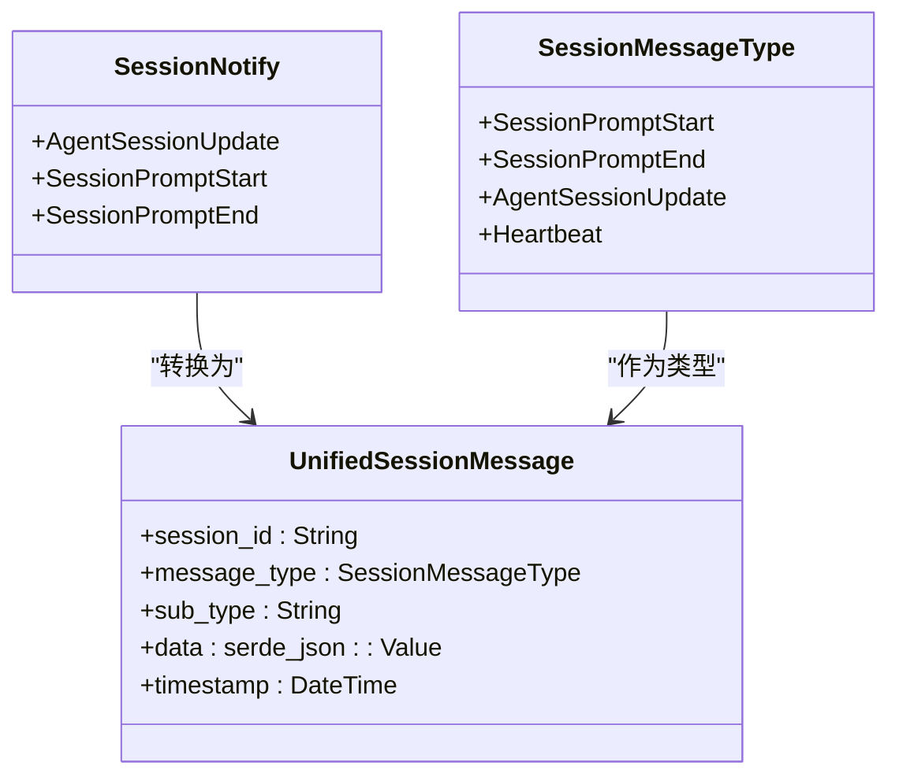
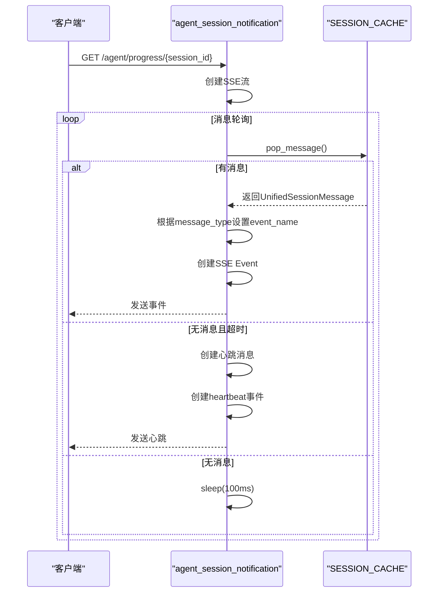
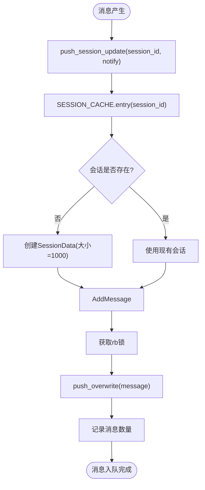

# 通知模型

<cite>
**本文档引用的文件**
- [agent_session_notify.rs](file://crates/rcoder/src/model/agent_session_notify.rs)
- [agent_session_notification.rs](file://crates/rcoder/src/handler/agent_session_notification.rs)
- [session_cache.rs](file://crates/rcoder/src/service/session_cache.rs)
</cite>

## 目录
1. [简介](#简介)
2. [SSE事件结构](#sse事件结构)
3. [实时通信机制](#实时通信机制)
4. [客户端监听与解析](#客户端监听与解析)
5. [事件序列号与重连机制](#事件序列号与重连机制)
6. [性能考虑](#性能考虑)
7. [总结](#总结)

## 简介
本技术文档详细描述了代理会话通知模型的实现，重点介绍基于Server-Sent Events (SSE)的实时通信架构。系统通过`agent_session_notify.rs`定义的SSE事件结构，实现了从服务端到前端的实时状态更新推送，包括进度更新、代码生成、文件操作等各类事件。文档深入解析了`NotificationEvent`枚举的各类事件及其负载数据格式，阐述了在Tokio运行时中的异步处理流程，并提供了完整的性能优化策略。

**Section sources**
- [agent_session_notify.rs](file://crates/rcoder/src/model/agent_session_notify.rs#L1-L378)

## SSE事件结构
系统定义了统一的会话消息结构`UnifiedSessionMessage`，包含会话ID、消息主类型、子类型、数据内容和时间戳。消息主类型枚举`SessionMessageType`包含四种核心类型：`SessionPromptStart`（用户发送prompt开始）、`SessionPromptEnd`（Agent执行结束）、`AgentSessionUpdate`（Agent执行过程中的更新）和`Heartbeat`（SSE连接心跳消息）。

`SessionNotify`枚举封装了需要发送给前端的所有通知类型，包括`AgentSessionUpdate`、`SessionPromptStart`和`SessionPromptEnd`。通过`to_unified_message`方法，这些通知被转换为统一的SSE JSON消息格式。`AgentSessionUpdate`进一步细分为多种子类型，如`user_message_chunk`、`agent_message_chunk`、`tool_call`等，分别对应不同的执行过程更新。

**Diagram sources**
- [agent_session_notify.rs](file://crates/rcoder/src/model/agent_session_notify.rs#L10-L378)

**Section sources**
- [agent_session_notify.rs](file://crates/rcoder/src/model/agent_session_notify.rs#L10-L378)

## 实时通信机制
SSE实时通信由`agent_session_notification`处理函数实现，该函数位于`agent_session_notification.rs`中。当客户端建立SSE连接时，系统会创建一个异步流，持续监听指定会话的消息更新。连接建立后，系统会以30秒为间隔发送心跳消息，确保连接的活跃性。

消息推送流程基于`SESSION_CACHE`全局缓存，该缓存使用`DashMap`按会话ID分组存储`UnifiedSessionMessage`。当有新消息到达时，系统会从缓存中取出消息，根据消息类型动态设置SSE事件名称（如`prompt_start`、`prompt_end`、`agent_message_chunk`等），然后通过`Event::default()`创建SSE事件并发送给客户端。若缓存中无消息，系统会休眠100毫秒后再次检查，实现高效的轮询机制。

**Diagram sources**
- [agent_session_notification.rs](file://crates/rcoder/src/handler/agent_session_notification.rs#L355-L438)
- [session_cache.rs](file://crates/rcoder/src/service/session_cache.rs#L1-L97)

**Section sources**
- [agent_session_notification.rs](file://crates/rcoder/src/handler/agent_session_notification.rs#L355-L438)
- [session_cache.rs](file://crates/rcoder/src/service/session_cache.rs#L1-L97)

## 客户端监听与解析
客户端通过建立SSE连接来监听实时更新。连接建立后，客户端会收到不同事件类型的SSE消息，包括`prompt_start`、`prompt_end`、`agent_message_chunk`等。每个SSE事件包含事件类型和JSON格式的数据，客户端需要根据事件类型和`UnifiedSessionMessage`中的`message_type`及`sub_type`来解析和处理不同的消息场景。

例如，当收到`agent_message_chunk`事件时，客户端应解析`data`字段中的`content`，将其作为Agent的响应消息显示在UI上。对于`tool_call`事件，客户端需要解析工具调用的详细信息，并可能需要更新UI以显示正在进行的文件操作。客户端应实现消息队列机制，避免大量消息涌入时阻塞UI线程。

**Section sources**
- [agent_session_notification.rs](file://crates/rcoder/src/handler/agent_session_notification.rs#L355-L438)

## 事件序列号与重连机制
系统通过`SESSION_CACHE`的`pop_message`机制确保消息的有序传递。每个会话的消息被存储在循环缓冲区中，保证了消息的顺序性和不丢失。当客户端因网络问题断开连接后，重新建立SSE连接时，可以从`SESSION_CACHE`中获取最新的消息，实现断点续传。

虽然当前实现未显式使用`event_id`，但通过会话ID和消息时间戳的组合，可以实现类似的消息追踪功能。建议客户端在连接断开时记录最后收到的消息时间戳，重连后通过查询该时间戳之后的消息来确保不丢失任何更新。`SESSION_CACHE`的`drain_messages`方法可用于一次性获取所有待处理消息。

**Section sources**
- [session_cache.rs](file://crates/rcoder/src/service/session_cache.rs#L35-L82)

## 性能考虑
系统在性能方面采用了多项优化策略。首先，`SESSION_CACHE`使用`ringbuf`实现的循环缓冲区，固定大小为1000条消息，当缓冲区满时会自动覆盖最老的消息，避免内存无限增长。其次，消息推送采用异步非阻塞模式，在Tokio运行时中高效处理大量并发连接。

背压处理通过`pop_message`的非阻塞特性实现，当没有消息时，系统会短暂休眠100毫秒，避免CPU空转。心跳机制不仅用于保持连接活跃，还能让客户端检测到服务端的可用性。对于高频率的消息场景，建议在`push_session_update`函数中添加批量处理逻辑，减少频繁的锁竞争。

**Diagram sources**
- [session_cache.rs](file://crates/rcoder/src/service/session_cache.rs#L1-L97)

**Section sources**
- [session_cache.rs](file://crates/rcoder/src/service/session_cache.rs#L1-L97)

## 总结
代理会话通知模型通过SSE协议实现了高效、可靠的实时通信。`agent_session_notify.rs`中定义的`UnifiedSessionMessage`结构提供了统一的消息格式，支持多种类型的执行状态更新。基于Tokio的异步处理机制和`SESSION_CACHE`的循环缓冲区设计，确保了系统的高性能和稳定性。客户端可以通过标准的SSE API轻松集成，实现丰富的实时交互体验。未来可进一步优化事件序列号和断点续传功能，提升系统的健壮性。