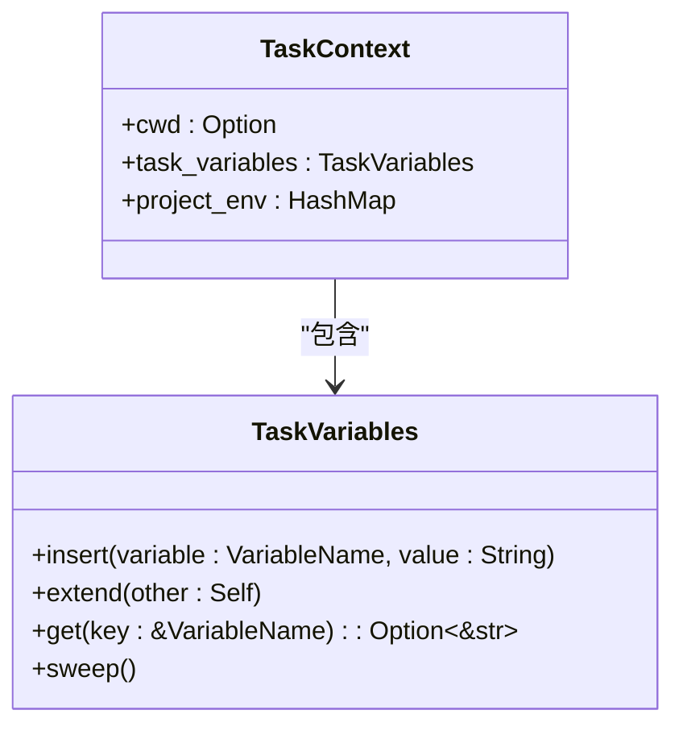
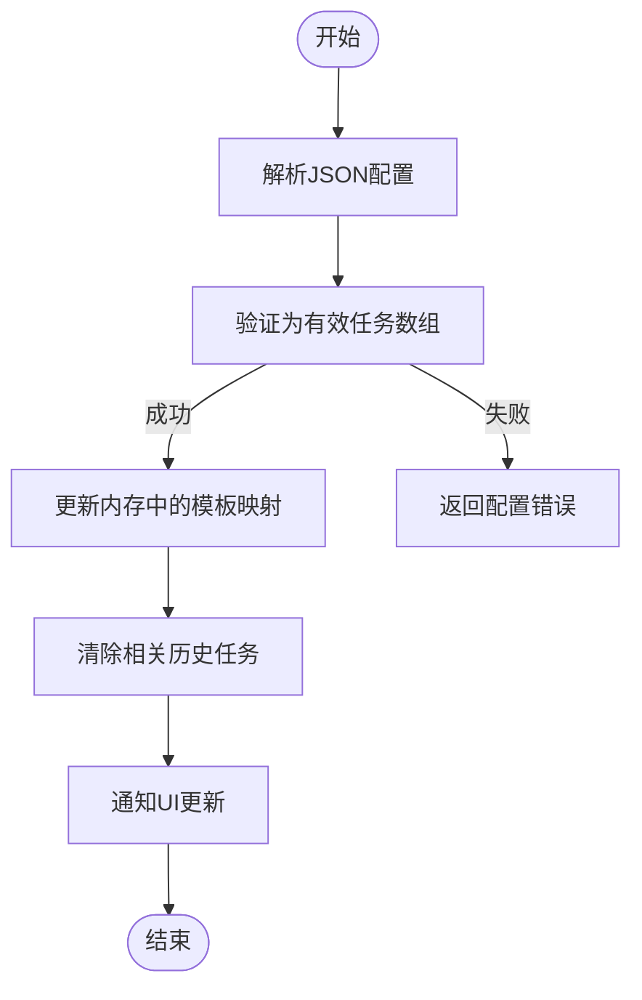

# 任务存储模型

<cite>
**本文档中引用的文件**  
- [task_store.rs](file://crates/project/src/task_store.rs)
- [task_inventory.rs](file://crates/project/src/task_inventory.rs)
- [lib.rs](file://crates/shared_types/src/lib.rs)
- [task.rs](file://tmp/zed/crates/task/src/task.rs)
</cite>

## 目录
1. [引言](#引言)
2. [任务存储核心模型](#任务存储核心模型)
3. [StoreState中的任务元数据组织](#storestate中的任务元数据组织)
4. [任务模板注册与发现机制](#任务模板注册与发现机制)
5. [任务的增删改查操作流程](#任务的增删改查操作流程)
6. [任务状态机设计](#任务状态机设计)
7. [任务持久化与内存管理策略](#任务持久化与内存管理策略)

## 引言
本文档深入解析任务存储模型的设计与实现，涵盖任务存储的两种状态、任务元数据结构、模板注册机制、操作流程、状态机及持久化策略。通过分析核心组件，帮助开发者理解系统中任务的生命周期管理与上下文组织方式。

## 任务存储核心模型

任务存储模型通过 `TaskStore` 枚举实现两种运行状态：`Functional` 和 `Noop`，分别对应功能完整与无操作模式。该设计支持本地与远程环境下的任务管理，同时确保在无需任务功能时的轻量级运行。

```mermaid
classDiagram
class TaskStore {
+Functional(StoreState)
+Noop
}
class StoreState {
+mode : StoreMode
+task_inventory : Entity<Inventory>
+buffer_store : WeakEntity<BufferStore>
+worktree_store : Entity<WorktreeStore>
+toolchain_store : Arc<dyn LanguageToolchainStore>
}
class StoreMode {
+Local { downstream_client, environment }
+Remote { upstream_client, project_id }
}
TaskStore --> StoreState : "包含"
StoreState --> StoreMode : "包含"
```

**图示来源**  
- [task_store.rs](file://crates/project/src/task_store.rs#L24-L28)
- [task_store.rs](file://crates/project/src/task_store.rs#L30-L36)

**本节来源**  
- [task_store.rs](file://crates/project/src/task_store.rs#L24-L36)

## StoreState中的任务元数据组织

`StoreState` 结构体封装了任务执行所需的全部上下文信息，包括工作区状态、缓冲区管理、工具链配置等。其字段定义如下：

- **mode**: 存储模式，区分本地与远程任务处理逻辑
- **task_inventory**: 任务模板注册中心，管理所有可用任务
- **buffer_store**: 缓冲区弱引用，用于获取当前编辑内容
- **worktree_store**: 工作树实体，提供文件系统上下文
- **toolchain_store**: 语言工具链接口，支持语言特定任务解析

任务上下文（`TaskContext`）进一步封装执行环境，包含：
- **cwd**: 任务执行目录
- **task_variables**: 动态变量集合，如文件路径、函数名等
- **project_env**: 项目环境变量，继承自系统环境



**图示来源**  
- [task.rs](file://tmp/zed/crates/task/src/task.rs#L252)
- [task_store.rs](file://crates/project/src/task_store.rs#L30-L36)

**本节来源**  
- [task_store.rs](file://crates/project/src/task_store.rs#L30-L36)
- [task.rs](file://tmp/zed/crates/task/src/task.rs#L252)

## 任务模板注册与发现机制

`task_inventory` 模块负责任务模板的注册与发现，支持多层级来源管理，包括全局配置、工作区配置、语言扩展及LSP服务。其核心结构为 `Inventory`，维护以下数据：

- **templates_from_settings**: 存储来自配置文件的任务模板
- **scenarios_from_settings**: 存储调试场景定义
- **last_scheduled_tasks**: 最近执行任务的历史记录（LRU缓存）
- **last_scheduled_scenarios**: 最近调试场景记录

模板来源通过 `TaskSourceKind` 枚举区分：
- **UserInput**: 用户临时输入的命令
- **Worktree**: 工作区目录下的 `.zed/task.json`
- **AbsPath**: 全局配置文件（如 `~/.config/zed/tasks.json`）
- **Language**: 语言扩展提供的任务
- **Lsp**: LSP服务器提供的任务

```mermaid
classDiagram
class Inventory {
+last_scheduled_tasks : VecDeque<(TaskSourceKind, ResolvedTask)>
+last_scheduled_scenarios : VecDeque<(DebugScenario, DebugScenarioContext)>
+templates_from_settings : InventoryFor<TaskTemplate>
+scenarios_from_settings : InventoryFor<DebugScenario>
}
class InventoryFor<T> {
+global : HashMap<PathBuf, Vec<T>>
+worktree : HashMap<WorktreeId, HashMap<Arc<Path>, Vec<T>>>
}
class TaskSourceKind {
+UserInput
+Worktree
+AbsPath
+Language
+Lsp
}
Inventory --> InventoryFor : "包含"
Inventory --> TaskSourceKind : "引用"
```

**图示来源**  
- [task_inventory.rs](file://crates/project/src/task_inventory.rs#L45-L75)
- [task_inventory.rs](file://crates/project/src/task_inventory.rs#L130-L155)

**本节来源**  
- [task_inventory.rs](file://crates/project/src/task_inventory.rs#L45-L170)

## 任务的增删改查操作流程

任务的生命周期管理通过 `Inventory` 提供的接口实现，主要操作包括：

### 创建与查询
- **list_tasks**: 根据文件、语言和工作区列出所有可用任务模板
- **task_template_by_label**: 通过标签查找特定任务模板
- **used_and_current_resolved_tasks**: 结合历史记录与当前上下文，返回已使用和新解析的任务

### 更新
- **update_file_based_tasks**: 从JSON字符串更新文件级任务配置
- **update_user_tasks**: 外部调用入口，触发配置更新并重新加载任务

### 删除
- **delete_previously_used**: 从历史记录中移除指定任务ID
- **update_file_based_tasks** 传入空数组可清除特定路径下的任务

操作流程遵循以下原则：
1. 配置变更时，先解析JSON为 `TaskTemplate` 对象
2. 按来源（全局/工作区）更新内存中的哈希表
3. 清理相关历史记录，避免陈旧引用
4. 通过事件机制通知UI刷新任务列表



**图示来源**  
- [task_inventory.rs](file://crates/project/src/task_inventory.rs#L500-L590)

**本节来源**  
- [task_inventory.rs](file://crates/project/src/task_inventory.rs#L500-L590)

## 任务状态机设计

任务状态机通过 `last_scheduled_tasks` 和 `last_scheduled_scenarios` 实现LRU缓存机制，支持以下状态流转：

- **待处理 (Pending)**: 新任务解析后进入待处理队列
- **运行中 (Running)**: 任务被调度执行，状态由外部系统管理
- **完成 (Completed)**: 执行成功，记录至历史队列尾部
- **失败 (Failed)**: 执行失败，仍记录但标记错误状态

状态流转规则：
1. 每次任务调度调用 `task_scheduled()`，将任务加入双端队列尾部
2. 队列最大容量为5000条，超出时从头部移除最旧记录
3. 查询时按最近使用排序，确保高频任务优先展示
4. 删除操作通过 `delete_previously_used()` 按ID移除

该设计确保了任务历史的高效管理与快速检索。

**本节来源**  
- [task_inventory.rs](file://crates/project/src/task_inventory.rs#L200-L230)

## 任务持久化与内存管理策略

任务系统采用混合持久化策略：

### 内存管理
- **弱引用机制**: `buffer_store` 使用 `WeakEntity` 避免循环引用
- **LRU缓存**: 历史任务限制为5000条，防止内存无限增长
- **惰性解析**: 配置文件仅在需要时解析为对象，减少初始化开销

### 持久化策略
- **配置文件监听**: 监听 `tasks.json` 和 `debug.json` 变更，动态重载
- **多层级存储**: 支持全局、工作区、语言级配置的合并与覆盖
- **原子更新**: 配置更新时先解析再替换，保证内存状态一致性

### 资源释放
- **Noop模式**: 在无需任务功能时返回空实现，节省资源
- **引用计数**: 使用 `Arc` 和 `Entity` 管理共享资源生命周期
- **异步清理**: 历史记录清理在后台线程执行，避免阻塞主线程

该策略平衡了性能、内存占用与功能完整性。

**本节来源**  
- [task_store.rs](file://crates/project/src/task_store.rs#L24-L28)
- [task_inventory.rs](file://crates/project/src/task_inventory.rs#L200-L230)