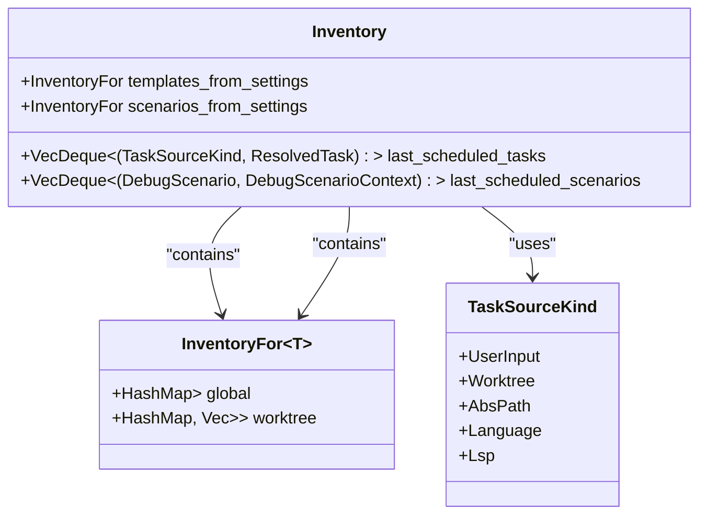
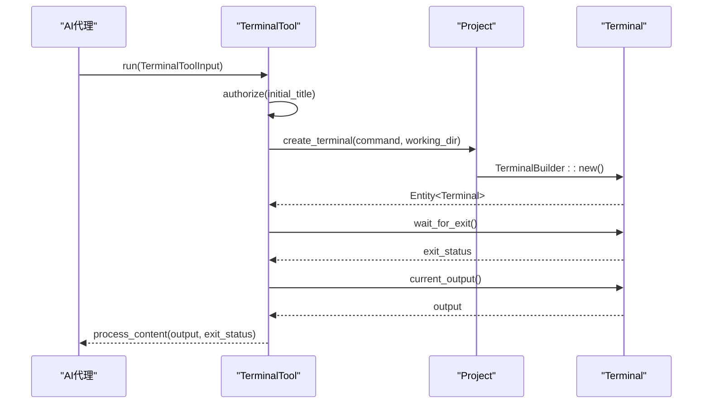
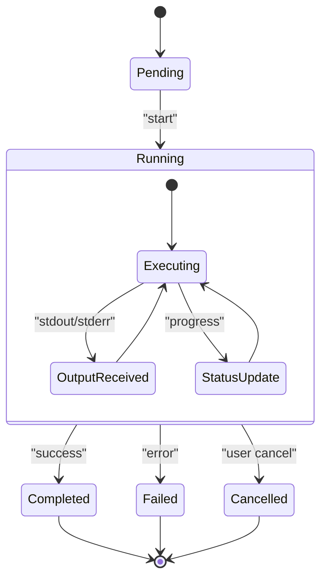
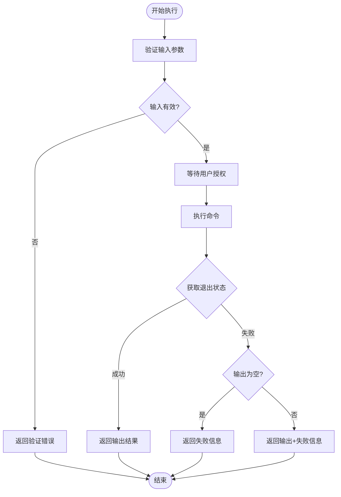

# 任务系统数据模型

<cite>
**本文档引用的文件**  
- [task_store.rs](file://crates/project/src/task_store.rs)
- [task_inventory.rs](file://crates/project/src/task_inventory.rs)
- [terminals.rs](file://crates/project/src/terminals.rs)
- [terminal_tool.rs](file://crates/agent2/src/tools/terminal_tool.rs)
</cite>

## 目录
1. [简介](#简介)
2. [任务存储结构](#任务存储结构)
3. [任务库存管理](#任务库存管理)
4. [终端执行环境](#终端执行环境)
5. [AI代理任务触发机制](#ai代理任务触发机制)
6. [任务状态流转](#任务状态流转)
7. [任务队列与并发控制](#任务队列与并发控制)
8. [错误重试策略](#错误重试策略)
9. [结论](#结论)

## 简介
本文档全面解析任务系统的核心数据模型，重点阐述任务实体的结构设计、调度机制以及执行环境的实现方式。系统通过`task_store`管理任务生命周期，`task_inventory`维护任务模板元数据，`terminals`组件提供终端执行环境，并结合`terminal_tool`实现AI代理对任务的调用与执行。

## 任务存储结构
`task_store`模块负责管理任务的持久化存储与状态维护。其核心结构为`TaskStore`枚举，包含`Functional`和`Noop`两种模式，分别对应功能完整与空操作状态。

`StoreState`结构体封装了任务存储的核心状态，包括：
- `task_inventory`：指向任务库存实体的引用
- `buffer_store`：弱引用的缓冲区存储
- `worktree_store`：工作树存储实体
- `toolchain_store`：语言工具链存储

任务存储支持本地与远程两种模式，通过`StoreMode`枚举区分。本地模式包含下游客户端连接与项目环境信息，远程模式则维护上游客户端连接与项目ID。

**Section sources**
- [task_store.rs](file://crates/project/src/task_store.rs#L232-L237)
- [task_store.rs](file://crates/project/src/task_store.rs#L1963-L1965)

## 任务库存管理
`task_inventory`模块负责维护可用任务模板及其元数据。`Inventory`结构体作为核心容器，管理以下关键数据：



**Diagram sources**
- [task_inventory.rs](file://crates/project/src/task_inventory.rs#L39-L45)
- [task_inventory.rs](file://crates/project/src/task_inventory.rs#L75-L79)

### 任务源类型
任务库存支持多种任务源：
- **用户输入**：临时命令行任务
- **工作树**：项目目录下的`.zed/task.json`文件
- **全局路径**：用户配置目录下的`tasks.json`文件
- **语言特定**：语言扩展提供的任务
- **LSP服务器**：语言服务器协议提供的任务

`Inventory`通过`list_tasks`方法聚合所有相关任务源，按工作树、语言、全局的优先级顺序返回任务模板列表。`used_and_current_resolved_tasks`方法结合任务上下文解析模板，实现最近使用任务的LRU排序。

**Section sources**
- [task_inventory.rs](file://crates/project/src/task_inventory.rs#L39-L45)
- [task_inventory.rs](file://crates/project/src/task_inventory.rs#L75-L79)

## 终端执行环境
`terminals`组件为任务提供终端执行环境，负责输入输出流管理和进程生命周期控制。`Terminals`结构体维护本地终端句柄的弱引用列表：

```mermaid
classDiagram
class Terminals {
+Vec<WeakEntity<terminal : : Terminal>> local_handles
}
class Project {
+create_terminal_task(SpawnInTerminal) Task<Result<Entity<Terminal>>>
+create_terminal_shell(cwd) Task<Result<Entity<Terminal>>>
+clone_terminal(terminal) Result<Entity<Terminal>>
+exec_in_shell(command) Result<std : : process : : Command>
}
class TerminalBuilder {
+new() Result<TerminalBuilder>
+subscribe() Entity<Terminal>
}
Project --> Terminals : "owns"
Project --> TerminalBuilder : "creates"
Terminals --> terminal : : Terminal : "references"
```

**Diagram sources**
- [terminals.rs](file://crates/project/src/terminals.rs#L22-L24)
- [terminals.rs](file://crates/project/src/terminals.rs#L100-L150)

### 执行流程
`Project::create_terminal_task`方法处理任务执行请求：
1. 确定工作目录（cwd）
2. 获取终端设置
3. 构建环境变量
4. 创建完成通道
5. 检测虚拟环境（venv）
6. 构建shell命令
7. 创建终端构建器并启动任务

终端支持本地与远程执行模式。远程模式通过`remote_client`构建SSH命令，本地模式则直接使用系统shell。系统自动处理Python虚拟环境的激活脚本注入。

**Section sources**
- [terminals.rs](file://crates/project/src/terminals.rs#L22-L24)
- [terminals.rs](file://crates/project/src/terminals.rs#L100-L150)

## AI代理任务触发机制
`terminal_tool`模块实现AI代理通过工具调用触发任务执行的机制。`TerminalTool`结构体封装项目引用与线程环境：



**Diagram sources**
- [terminal_tool.rs](file://crates/agent2/src/tools/terminal_tool.rs#L36-L39)
- [terminal_tool.rs](file://crates/agent2/src/tools/terminal_tool.rs#L100-L150)

### 输入验证
`TerminalToolInput`结构体定义工具输入参数：
- `command`：要执行的命令行
- `cd`：工作目录，必须是项目根目录之一

`working_dir`函数验证目录有效性：
1. 支持`.`表示单工作区项目
2. 绝对路径必须位于项目工作树内
3. 相对路径必须匹配工作树根名称

系统禁止执行无限期运行的命令（如服务器、文件监视器），确保任务可终止。

**Section sources**
- [terminal_tool.rs](file://crates/agent2/src/tools/terminal_tool.rs#L17-L34)
- [terminal_tool.rs](file://crates/agent2/src/tools/terminal_tool.rs#L36-L39)

## 任务状态流转
任务系统通过`TaskState`结构体管理任务状态，包含以下关键字段：
- `id`：任务唯一标识
- `full_label`：完整标签
- `label`：显示标签
- `command_label`：命令标签
- `status`：当前状态（运行中、已完成等）



**Diagram sources**
- [terminals.rs](file://crates/project/src/terminals.rs#L100-L150)
- [task_store.rs](file://crates/project/src/task_store.rs#L232-L237)

任务状态通过`task_scheduled`方法记录到`last_scheduled_tasks`队列，实现最近使用任务的跟踪。系统维护最多5000个历史任务记录，超出时自动淘汰最旧记录。

**Section sources**
- [task_inventory.rs](file://crates/project/src/task_inventory.rs#L39-L45)
- [terminals.rs](file://crates/project/src/terminals.rs#L100-L150)

## 任务队列与并发控制
任务系统采用异步任务队列机制，通过`Task`类型封装异步操作。`cx.spawn`方法创建后台任务，确保UI线程不被阻塞。

并发控制策略：
- **串行执行**：同一终端内的命令按顺序执行
- **并行隔离**：不同终端任务可并行执行
- **资源限制**：通过`completion_tx`通道限制并发数量
- **生命周期绑定**：任务与项目上下文绑定，项目释放时自动清理

`create_terminal_task`和`create_terminal_shell`方法均返回`Task<Result<Entity<Terminal>>>`，调用者可通过await获取执行结果。

**Section sources**
- [terminals.rs](file://crates/project/src/terminals.rs#L100-L150)
- [task_inventory.rs](file://crates/project/src/task_inventory.rs#L39-L45)

## 错误重试策略
系统实现分层错误处理机制：
1. **输入验证**：`working_dir`函数提前验证目录有效性
2. **执行授权**：`authorize`方法确保用户确认危险操作
3. **输出截断**：`COMMAND_OUTPUT_LIMIT`限制输出大小
4. **状态反馈**：`process_content`函数根据退出状态生成详细反馈

错误处理流程：


**Diagram sources**
- [terminal_tool.rs](file://crates/agent2/src/tools/terminal_tool.rs#L17-L34)
- [terminal_tool.rs](file://crates/agent2/src/tools/terminal_tool.rs#L100-L150)

**Section sources**
- [terminal_tool.rs](file://crates/agent2/src/tools/terminal_tool.rs#L17-L34)
- [terminal_tool.rs](file://crates/agent2/src/tools/terminal_tool.rs#L100-L150)

## 结论
任务系统通过`task_store`、`task_inventory`、`terminals`和`terminal_tool`四个核心组件，构建了完整的任务管理与执行框架。系统支持多源任务模板、终端环境隔离、AI代理调用和完善的错误处理，为开发者提供了高效可靠的任务自动化能力。