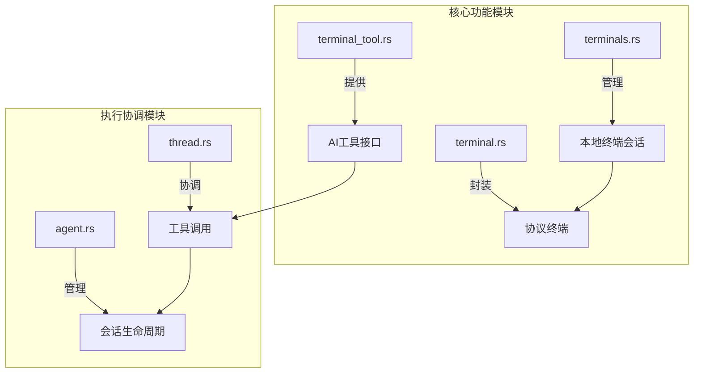
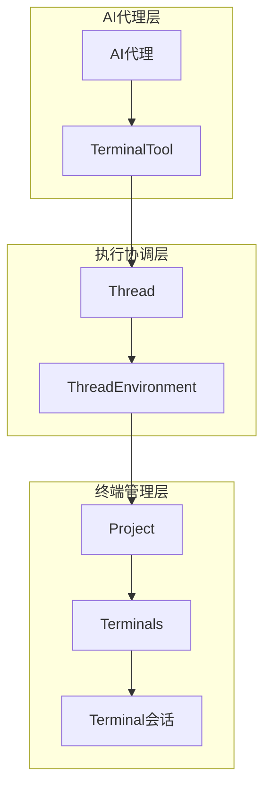
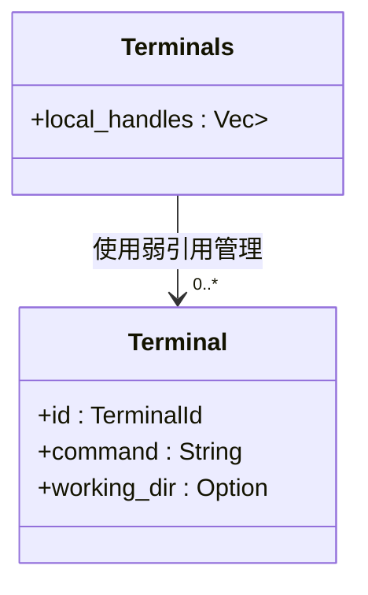
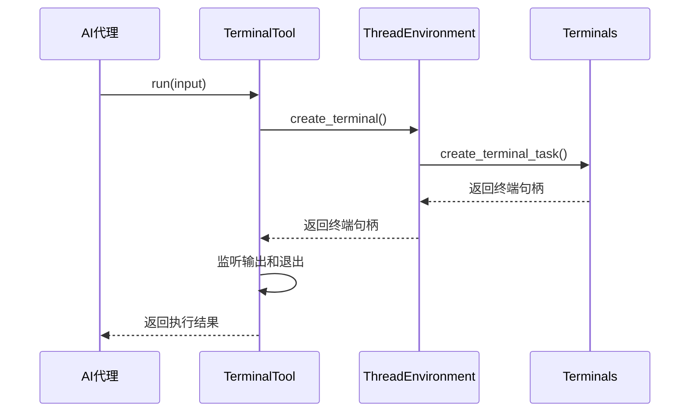
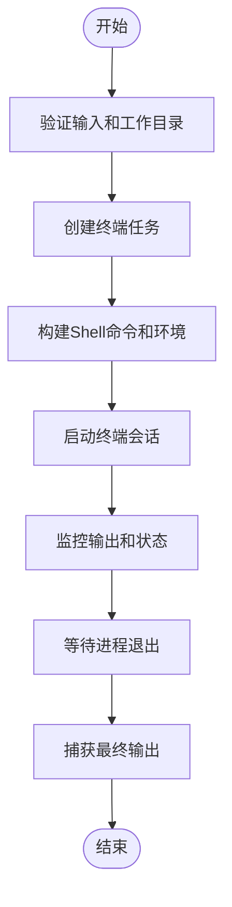
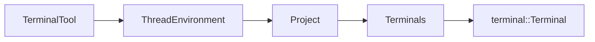

# 终端执行机制

<cite>
**本文档中引用的文件**  
- [terminals.rs](file://crates/project/src/terminals.rs)
- [terminal_tool.rs](file://crates/agent2/src/tools/terminal_tool.rs)
- [terminal.rs](file://crates/acp_thread/src/terminal.rs)
- [thread.rs](file://crates/agent2/src/thread.rs)
- [agent.rs](file://crates/agent2/src/agent.rs)
</cite>

## 目录
1. [简介](#简介)
2. [项目结构](#项目结构)
3. [核心组件](#核心组件)
4. [架构概述](#架构概述)
5. [详细组件分析](#详细组件分析)
6. [依赖分析](#依赖分析)
7. [性能考虑](#性能考虑)
8. [故障排除指南](#故障排除指南)
9. [结论](#结论)

## 简介
本文档全面阐述了终端执行机制的设计与实现，重点分析了Terminals结构体如何管理本地终端会话的生命周期。文档详细解释了weak_entity引用在避免内存泄漏中的关键作用，描述了终端会话从启动到终止的完整流程，并结合terminal_tool的实现，深入分析了AI代理如何通过工具调用接口触发命令执行并接收结果。同时，文档还说明了终端环境变量继承、工作目录设置和信号传递机制，提供了并发执行场景下的资源隔离策略和性能优化建议，并讨论了超时控制与安全沙箱的实现可能性。

## 项目结构
项目采用模块化设计，终端执行相关功能分布在多个crates中。核心的终端会话管理逻辑位于`crates/project/src/terminals.rs`，而AI代理的工具调用接口则在`crates/agent2/src/tools/terminal_tool.rs`中实现。`crates/acp_thread/src/terminal.rs`定义了面向AI协议的终端抽象层，`crates/agent2/src/thread.rs`和`crates/agent2/src/agent.rs`则负责协调整个执行流程。

**图示来源**
- [terminals.rs](file://crates/project/src/terminals.rs)
- [terminal_tool.rs](file://crates/agent2/src/tools/terminal_tool.rs)
- [terminal.rs](file://crates/acp_thread/src/terminal.rs)
- [thread.rs](file://crates/agent2/src/thread.rs)
- [agent.rs](file://crates/agent2/src/agent.rs)

**本节来源**
- [terminals.rs](file://crates/project/src/terminals.rs)
- [project_structure](file://project_structure)

## 核心组件
核心组件包括`Terminals`结构体，它通过`local_handles`字段管理所有本地终端会话的弱引用。`TerminalTool`作为AI代理的工具，负责将用户的命令请求转化为具体的终端执行操作。`AcpThreadEnvironment`和`AcpTerminalHandle`则作为桥梁，连接了AI协议层与底层的终端执行系统。

**本节来源**
- [terminals.rs](file://crates/project/src/terminals.rs#L22-L24)
- [terminal_tool.rs](file://crates/agent2/src/tools/terminal_tool.rs#L36-L39)
- [agent.rs](file://crates/agent2/src/agent.rs#L1133-L1135)

## 架构概述
系统采用分层架构，上层是AI代理的工具调用接口，下层是具体的终端会话管理。当AI代理需要执行命令时，它通过`TerminalTool`发起调用，该调用被`Thread`组件接收并协调。`Thread`通过`ThreadEnvironment`接口创建具体的终端会话，该会话由`Project`中的`Terminals`结构体统一管理。会话的生命周期通过弱引用进行跟踪，确保在会话结束后能及时清理资源。

**图示来源**
- [terminal_tool.rs](file://crates/agent2/src/tools/terminal_tool.rs)
- [thread.rs](file://crates/agent2/src/thread.rs)
- [terminals.rs](file://crates/project/src/terminals.rs)

## 详细组件分析

### Terminals结构体分析
`Terminals`结构体是管理所有本地终端会话的核心。它通过`local_handles`字段存储对每个终端会话的弱引用（WeakEntity）。这种设计模式有效地避免了循环引用导致的内存泄漏。当一个终端会话被创建时，其强引用被返回给调用者，同时一个弱引用被添加到`local_handles`中。通过`cx.observe_release`机制，系统可以监听终端会话的释放事件，一旦会话结束，对应的弱引用就会从`local_handles`中移除。

**图示来源**
- [terminals.rs](file://crates/project/src/terminals.rs#L22-L24)

**本节来源**
- [terminals.rs](file://crates/project/src/terminals.rs#L22-L24)

### TerminalTool工具分析
`TerminalTool`是AI代理用来执行终端命令的核心工具。它实现了`AgentTool` trait，定义了`run`方法来处理命令执行。当AI代理调用此工具时，`run`方法会通过`ThreadEnvironment`创建一个新的终端会话，并监听其输出和退出状态。工具还实现了`initial_title`方法，用于生成工具调用的初始标题，提高用户体验。

**图示来源**
- [terminal_tool.rs](file://crates/agent2/src/tools/terminal_tool.rs)
- [thread.rs](file://crates/agent2/src/thread.rs#L532-L540)
- [terminals.rs](file://crates/project/src/terminals.rs)

**本节来源**
- [terminal_tool.rs](file://crates/agent2/src/tools/terminal_tool.rs#L17-L34)

### 执行流程分析
终端会话的执行流程始于`TerminalTool`的`run`方法。该方法首先验证工作目录，然后通过`ThreadEnvironment`请求创建终端。`ThreadEnvironment`的实现（如`AcpThreadEnvironment`）会调用`Project`的`create_terminal_task`方法。该方法根据配置构建shell命令和环境变量，然后使用`TerminalBuilder`创建并启动新的终端会话。会话的输出和状态通过异步任务进行监控，直到进程结束。

**图示来源**
- [terminal_tool.rs](file://crates/agent2/src/tools/terminal_tool.rs)
- [terminals.rs](file://crates/project/src/terminals.rs)

**本节来源**
- [terminal_tool.rs](file://crates/agent2/src/tools/terminal_tool.rs)
- [terminals.rs](file://crates/project/src/terminals.rs)

## 依赖分析
系统各组件之间存在清晰的依赖关系。`TerminalTool`依赖于`ThreadEnvironment`来创建终端，而`ThreadEnvironment`的具体实现则依赖于`Project`和`Terminals`来管理会话。`Terminals`本身依赖于底层的`terminal::Terminal`库来提供实际的终端功能。这种分层依赖确保了系统的可维护性和可扩展性。

**图示来源**
- [terminal_tool.rs](file://crates/agent2/src/tools/terminal_tool.rs)
- [thread.rs](file://crates/agent2/src/thread.rs)
- [terminals.rs](file://crates/project/src/terminals.rs)

**本节来源**
- [terminal_tool.rs](file://crates/agent2/src/tools/terminal_tool.rs)
- [thread.rs](file://crates/agent2/src/thread.rs)
- [terminals.rs](file://crates/project/src/terminals.rs)

## 性能考虑
在并发执行场景下，每个终端会话都是独立的进程，这天然提供了资源隔离。为了优化性能，系统对命令输出设置了大小限制（`COMMAND_OUTPUT_LIMIT`），防止大输出阻塞内存。此外，通过弱引用管理会话生命周期，避免了内存泄漏，确保了长时间运行的稳定性。对于频繁的短命令执行，可以考虑复用shell会话以减少进程创建开销。

## 故障排除指南
常见的终端执行问题包括工作目录无效、命令权限不足和进程挂起。确保`cd`参数指向项目根目录之一，避免在`command`中包含`cd`指令。对于长时间运行的命令，应设置合理的超时机制。如果遇到内存增长问题，应检查`local_handles`中的弱引用是否被正确清理，确认`cx.observe_release`回调是否正常触发。

**本节来源**
- [terminal_tool.rs](file://crates/agent2/src/tools/terminal_tool.rs#L17-L34)
- [terminals.rs](file://crates/project/src/terminals.rs)

## 结论
本文档详细阐述了终端执行机制的各个方面。通过`WeakEntity`的巧妙运用，系统实现了安全的内存管理。分层的架构设计使得AI代理能够无缝地与本地终端交互。未来可以在此基础上实现更精细的超时控制、资源配额限制和安全沙箱，以支持更复杂和安全的自动化任务。