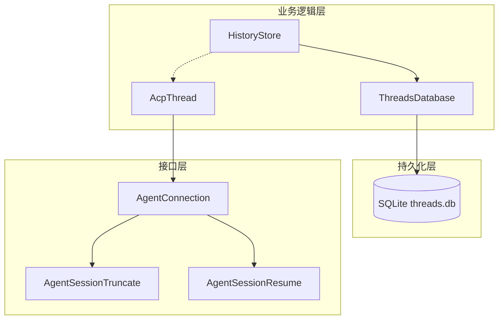
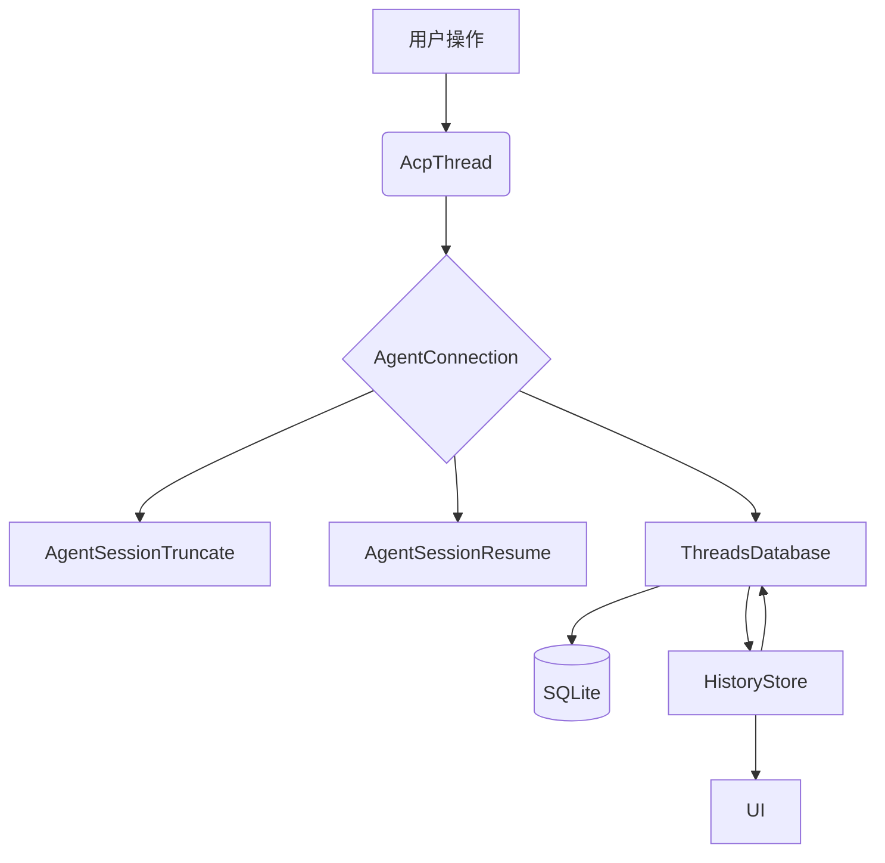
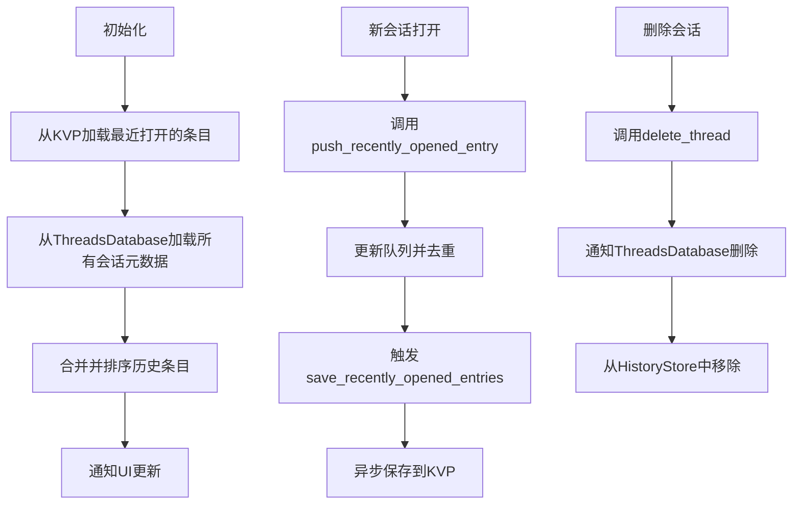
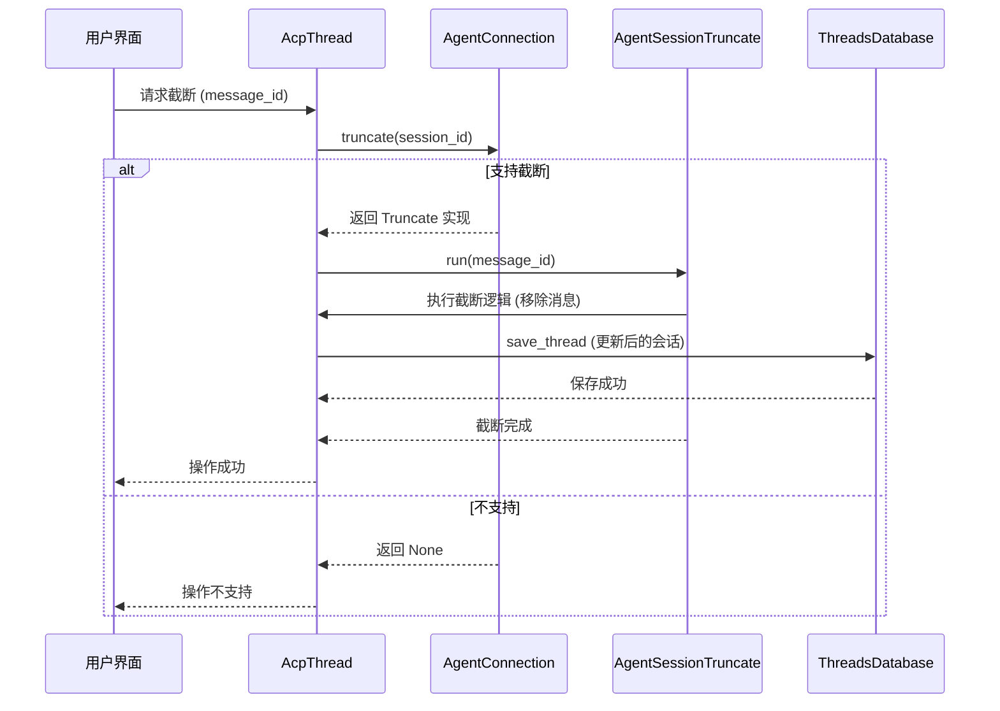
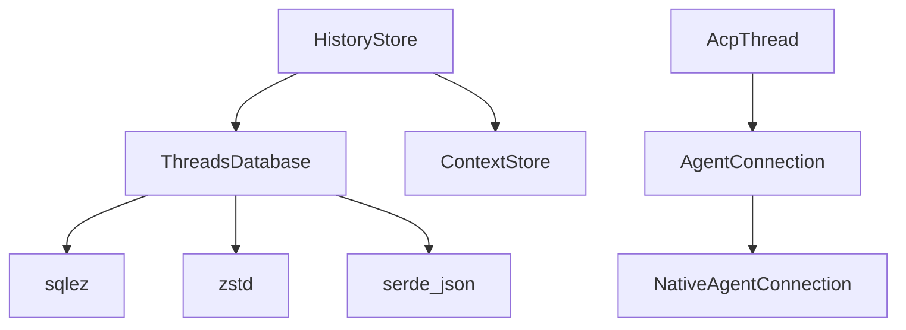

# 交互历史存储

<cite>
**本文档中引用的文件**  
- [history_store.rs](file://crates/agent2/src/history_store.rs)
- [db.rs](file://crates/agent2/src/db.rs)
- [connection.rs](file://crates/acp_thread/src/connection.rs)
</cite>

## 目录
1. [简介](#简介)
2. [项目结构](#项目结构)
3. [核心组件](#核心组件)
4. [架构概述](#架构概述)
5. [详细组件分析](#详细组件分析)
6. [依赖分析](#依赖分析)
7. [性能考虑](#性能考虑)
8. [故障排除指南](#故障排除指南)
9. [结论](#结论)

## 简介
本文档全面解析 `history_store` 模块如何在会话中持久化存储交互消息记录。基于 `db.rs` 中定义的数据库表结构，深入探讨消息ID、发送者角色、内容序列化格式、时间戳索引等字段的设计考量。详细说明 `history_store` 如何与 `AcpThread` 协同工作，实现消息的追加写入、分页查询和截断操作。结合 `connection.rs` 中的 `AgentSessionTruncate` 和 `AgentSessionResume` 接口，描述用户请求截断历史或恢复会话时的数据处理流程。提供典型查询场景的 SQL 示例，讨论大规模历史数据的分表策略与性能优化方案，并说明数据加密与隐私保护措施。

## 项目结构
`history_store` 模块位于 `crates/agent2/src/history_store.rs`，其数据持久化依赖于 `crates/agent2/src/db.rs` 中定义的 `ThreadsDatabase`。`AcpThread` 作为会话核心实体，位于 `crates/acp_thread/src/acp_thread.rs`，通过 `AgentConnection` 接口与外部系统交互，该接口定义在 `crates/acp_thread/src/connection.rs` 中。`history_store` 负责管理历史会话的元数据和最近打开的条目，而完整的会话内容则由 `ThreadsDatabase` 通过 SQLite 存储在本地。



**Diagram sources**
- [history_store.rs](file://crates/agent2/src/history_store.rs)
- [db.rs](file://crates/agent2/src/db.rs)
- [connection.rs](file://crates/acp_thread/src/connection.rs)

**Section sources**
- [history_store.rs](file://crates/agent2/src/history_store.rs)
- [db.rs](file://crates/agent2/src/db.rs)
- [connection.rs](file://crates/acp_thread/src/connection.rs)

## 核心组件
`history_store` 模块的核心是 `HistoryStore` 结构体，它负责管理所有会话的历史记录。它通过 `ThreadsDatabase` 与 SQLite 数据库交互，加载和保存会话元数据（`DbThreadMetadata`），并维护一个最近打开的会话列表。完整的会话内容（`DbThread`）包含消息列表、摘要、模型配置等信息，以压缩的 JSON 格式存储在数据库的 `data` 字段中。`AcpThread` 代表一个活跃的会话，它通过 `AgentConnection` 接口与后端服务通信，并能响应截断和恢复等操作。

**Section sources**
- [history_store.rs](file://crates/agent2/src/history_store.rs#L1-L357)
- [db.rs](file://crates/agent2/src/db.rs#L1-L501)

## 架构概述
系统采用分层架构。最底层是 SQLite 数据库，用于持久化存储。中间层是 `ThreadsDatabase`，它封装了对数据库的增删改查操作，并处理数据的序列化（JSON）与压缩（Zstd）。`HistoryStore` 位于业务逻辑层，它利用 `ThreadsDatabase` 提供的 API 来管理会话的元数据和用户界面状态（如最近打开的会话）。`AcpThread` 代表运行时的会话实例，它产生的消息通过 `AgentConnection` 的 `prompt` 方法发送，并最终由 `ThreadsDatabase` 持久化。当用户请求截断或恢复会话时，`AgentConnection` 会提供相应的 `AgentSessionTruncate` 和 `AgentSessionResume` 实现来处理这些操作。



**Diagram sources**
- [history_store.rs](file://crates/agent2/src/history_store.rs)
- [db.rs](file://crates/agent2/src/db.rs)
- [connection.rs](file://crates/acp_thread/src/connection.rs)

## 详细组件分析

### HistoryStore 分析
`HistoryStore` 是交互历史的管理中心。它不直接存储完整的消息内容，而是存储轻量级的元数据（`DbThreadMetadata`），包括会话ID、标题和最后更新时间。它还维护一个 `recently_opened_entries` 队列，用于记录用户最近访问的会话，以便快速访问。

#### 核心功能


**Diagram sources**
- [history_store.rs](file://crates/agent2/src/history_store.rs#L1-L357)

**Section sources**
- [history_store.rs](file://crates/agent2/src/history_store.rs#L1-L357)

### ThreadsDatabase 分析
`ThreadsDatabase` 是数据持久化的关键组件，它直接与 SQLite 数据库交互。

#### 数据库表结构
```erDiagram
  THREADS ||--o{ MESSAGES : contains
  THREADS {
    string id PK
    string summary
    string updated_at
    string data_type
    blob data
  }
```

- **id**: `TEXT PRIMARY KEY`，对应 `acp::SessionId`，是会话的唯一标识。
- **summary**: `TEXT NOT NULL`，存储会话的标题，对应 `DbThreadMetadata.title`。
- **updated_at**: `TEXT NOT NULL`，存储会话最后更新的时间戳，用于排序。
- **data_type**: `TEXT NOT NULL`，标识 `data` 字段的存储格式，目前支持 `json` 和 `zstd`。
- **data**: `BLOB NOT NULL`，存储完整的 `DbThread` 对象的序列化数据。

#### 序列化与压缩
`DbThread` 对象通过 `serde_json` 序列化为 JSON 字符串，然后使用 `zstd` 压缩算法进行压缩，以减少存储空间占用。`save_thread_sync` 函数负责此过程，`load_thread` 函数则负责解压和反序列化。


**Diagram sources**
- [db.rs](file://crates/agent2/src/db.rs#L1-L501)

**Section sources**
- [db.rs](file://crates/agent2/src/db.rs#L1-L501)

### AcpThread 与 AgentConnection 协同分析
`AcpThread` 与 `history_store` 的交互是通过 `AgentConnection` 接口间接完成的。`AcpThread` 本身不直接操作 `HistoryStore`，而是通过其 `connection` 字段（`Rc<dyn AgentConnection>`）来触发持久化操作。

#### 截断与恢复流程
当用户请求截断会话时，UI 会调用 `AcpThread` 的相关方法，`AcpThread` 会通过 `AgentConnection` 获取 `AgentSessionTruncate` 实现并执行。



恢复会话 (`AgentSessionResume`) 的流程类似，`AgentConnection` 提供一个 `run` 方法，该方法会从数据库加载会话状态并重建上下文，然后返回一个 `PromptResponse` 来继续对话。

**Diagram sources**
- [connection.rs](file://crates/acp_thread/src/connection.rs#L95-L101)
- [acp_thread.rs](file://crates/acp_thread/src/acp_thread.rs#L775-L789)

**Section sources**
- [connection.rs](file://crates/acp_thread/src/connection.rs#L95-L101)
- [acp_thread.rs](file://crates/acp_thread/src/acp_thread.rs#L775-L789)

## 依赖分析
`history_store` 模块高度依赖 `ThreadsDatabase` 来进行数据的持久化。`ThreadsDatabase` 又依赖于 `sqlez` 库来操作 SQLite，以及 `zstd` 库进行数据压缩。`AcpThread` 通过 `AgentConnection` 这个抽象接口与 `history_store` 解耦，这使得系统可以支持不同类型的后端服务。`HistoryStore` 还依赖于 `assistant_context::ContextStore` 来管理非 ACP 类型的文本会话。



**Diagram sources**
- [history_store.rs](file://crates/agent2/src/history_store.rs)
- [db.rs](file://crates/agent2/src/db.rs)
- [connection.rs](file://crates/acp_thread/src/connection.rs)

**Section sources**
- [history_store.rs](file://crates/agent2/src/history_store.rs)
- [db.rs](file://crates/agent2/src/db.rs)
- [connection.rs](file://crates/acp_thread/src/connection.rs)

## 性能考虑
为了优化性能，系统采用了多种策略：
1.  **数据压缩**：使用 Zstd 算法压缩会话数据，显著减少磁盘占用和 I/O 时间。
2.  **元数据分离**：`HistoryStore` 只加载轻量级的元数据，避免在启动时加载所有完整会话内容，加快了应用启动和历史列表的渲染速度。
3.  **异步操作**：所有数据库的读写操作都在后台执行，不会阻塞主线程，保证了 UI 的流畅性。
4.  **连接复用**：`ThreadsDatabase` 使用一个全局的、带锁的连接，避免了频繁打开和关闭数据库连接的开销。
5.  **批量操作**：在 `save_recently_opened_entries` 中使用了防抖（debounce）技术，将短时间内多次的保存请求合并为一次，减少了对持久化存储的写入次数。

## 故障排除指南
- **问题：历史记录无法加载**
  - 检查 `threads.db` 文件是否存在且可读，路径通常在 `~/.config/rcoder/threads/threads.db`。
  - 检查 `RECENTLY_OPENED_THREADS_KEY` 对应的 KVP 条目是否损坏。
  - 查看日志中是否有 `Failed to create threads table` 或 `deserializing persisted agent panel navigation history` 等错误信息。

- **问题：会话截断操作无效**
  - 确认当前 `AgentConnection` 是否实现了 `truncate` 方法并返回了有效的 `AgentSessionTruncate` 实例。
  - 检查 `AcpThread` 的 `entries` 是否正确地根据 `message_id` 被截断。
  - 确认 `ThreadsDatabase.save_thread` 是否成功将更新后的会话写入数据库。

- **问题：应用启动缓慢**
  - 如果用户有大量历史会话，`HistoryStore.reload` 加载所有元数据可能会耗时。可以考虑对 `list_threads` 查询增加分页或限制返回数量。
  - 检查是否有大量未压缩的会话数据，升级到使用 Zstd 压缩可以改善 I/O 性能。

**Section sources**
- [history_store.rs](file://crates/agent2/src/history_store.rs)
- [db.rs](file://crates/agent2/src/db.rs)
- [connection.rs](file://crates/acp_thread/src/connection.rs)

## 结论
`history_store` 模块通过与 `ThreadsDatabase` 和 `AcpThread` 的紧密协作，实现了一个高效、可靠的交互历史存储系统。其设计充分考虑了性能、可维护性和用户体验。通过元数据分离、数据压缩和异步操作，系统能够在处理大量历史数据的同时保持良好的响应速度。基于接口的 `AgentConnection` 设计保证了系统的灵活性和可扩展性。未来可以进一步探索分表策略以应对超大规模数据，并加强数据加密以提升隐私保护能力。