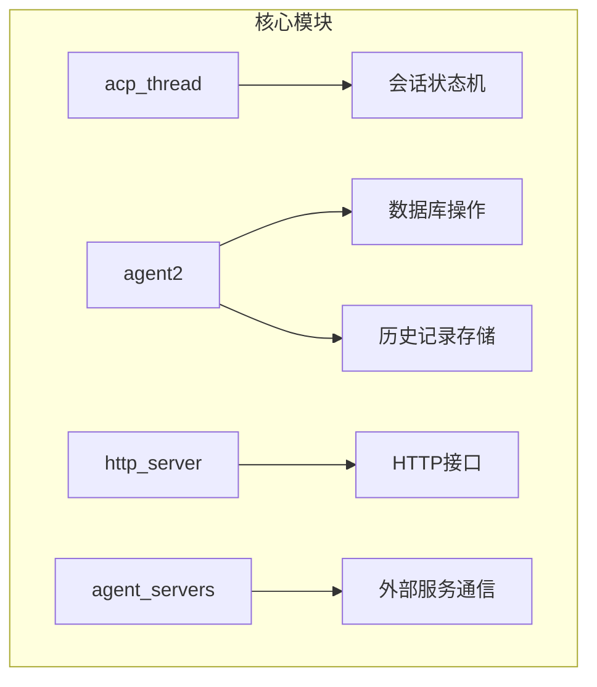
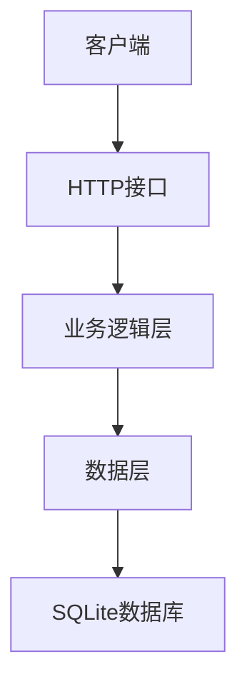
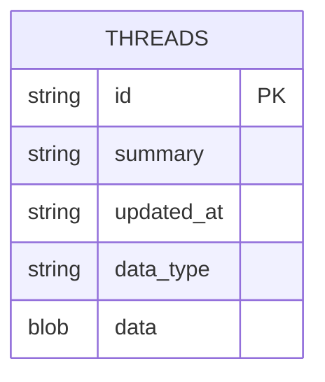
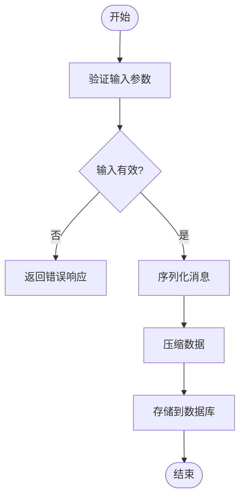
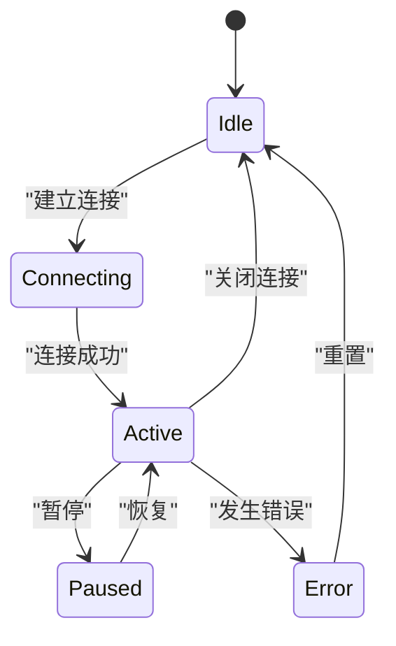
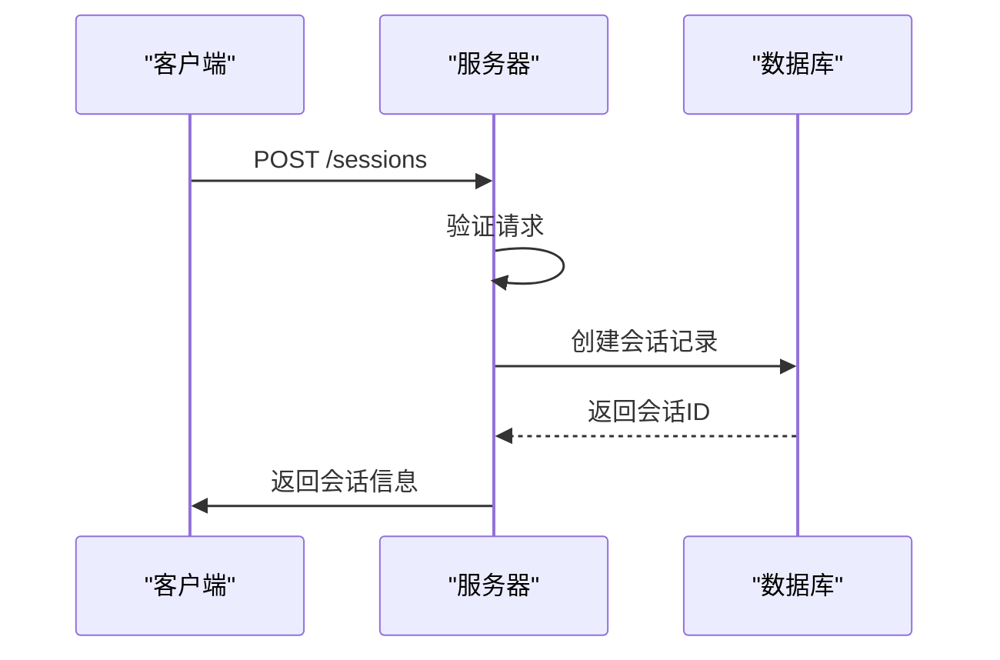
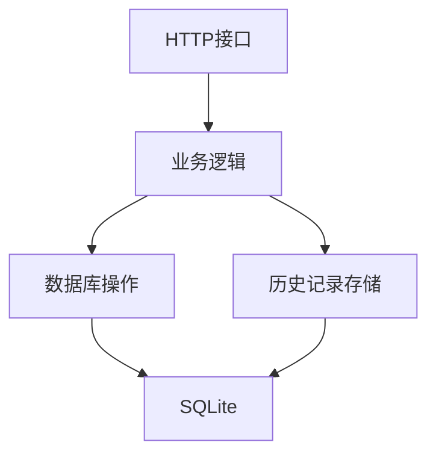

# 会话数据模型

<cite>
**本文档引用的文件**  
- [db.rs](file://crates/agent2/src/db.rs)
- [history_store.rs](file://crates/agent2/src/history_store.rs)
- [acp_thread.rs](file://crates/acp_thread/src/acp_thread.rs)
- [connection.rs](file://crates/acp_thread/src/connection.rs)
- [http_agent.rs](file://crates/http_server/src/http_agent.rs)
- [handlers.rs](file://crates/http_server/src/handlers.rs)
</cite>

## 目录
1. [简介](#简介)
2. [项目结构](#项目结构)
3. [核心组件](#核心组件)
4. [架构概述](#架构概述)
5. [详细组件分析](#详细组件分析)
6. [依赖分析](#依赖分析)
7. [性能考虑](#性能考虑)
8. [故障排除指南](#故障排除指南)
9. [结论](#结论)
10. [附录](#附录)（如有必要）

## 简介
本文档详细阐述了会话数据模型的设计原理与持久化机制。基于数据库表结构，说明会话ID、创建时间、最后活动时间、关联用户等字段的定义与索引策略。分析history_store如何记录会话交互历史，包括消息序列化格式和存储优化方法。解释acp_thread中会话状态机的实现，涵盖连接建立、消息流转、异常恢复等流程。结合http_server的路由逻辑，描述会话在API层面的创建、查询和销毁操作。提供会话状态转换图，并讨论高并发场景下的会话管理性能调优方案。

## 项目结构
本项目采用模块化设计，主要包含以下几个核心模块：
- `acp_thread`：负责会话状态机的实现和管理
- `agent2`：包含数据库操作和历史记录存储
- `http_server`：提供HTTP接口用于会话的创建、查询和销毁
- `agent_servers`：处理与外部服务的通信



**图示来源**
- [db.rs](file://crates/agent2/src/db.rs)
- [history_store.rs](file://crates/agent2/src/history_store.rs)
- [acp_thread.rs](file://crates/acp_thread/src/acp_thread.rs)
- [http_agent.rs](file://crates/http_server/src/http_agent.rs)

**章节来源**
- [db.rs](file://crates/agent2/src/db.rs)
- [history_store.rs](file://crates/agent2/src/history_store.rs)
- [acp_thread.rs](file://crates/acp_thread/src/acp_thread.rs)
- [http_agent.rs](file://crates/http_server/src/http_agent.rs)

## 核心组件
本文档的核心组件包括会话实体、数据库表结构、历史记录存储和HTTP接口。这些组件共同构成了会话数据模型的基础。

**章节来源**
- [db.rs](file://crates/agent2/src/db.rs)
- [history_store.rs](file://crates/agent2/src/history_store.rs)
- [acp_thread.rs](file://crates/acp_thread/src/acp_thread.rs)
- [http_agent.rs](file://crates/http_server/src/http_agent.rs)

## 架构概述
系统架构分为三层：数据层、业务逻辑层和接口层。数据层负责会话数据的持久化；业务逻辑层处理会话的状态转换和消息流转；接口层提供HTTP API供外部调用。



**图示来源**
- [db.rs](file://crates/agent2/src/db.rs)
- [acp_thread.rs](file://crates/acp_thread/src/acp_thread.rs)
- [http_agent.rs](file://crates/http_server/src/http_agent.rs)

## 详细组件分析
### 会话实体分析
会话实体是整个系统的核心，包含了会话ID、创建时间、最后活动时间、关联用户等关键字段。

#### 会话实体类图
```mermaid
classDiagram
class HttpSession {
+id : Uuid
+project_path : PathBuf
+acp_thread : Option<Arc<AcpThread>>
+created_at : chrono : : DateTime<chrono : : Utc>
+context_size : usize
+max_context_size : usize
+message_count : usize
+token_usage : TokenUsage
+model_info : Option<ModelInfo>
+capabilities : Option<acp : : PromptCapabilities>
}
class AcpThread {
+title : SharedString
+entries : Vec<AgentThreadEntry>
+plan : Plan
+project : Entity<Project>
+action_log : Entity<ActionLog>
+shared_buffers : HashMap<Entity<Buffer>, BufferSnapshot>
+send_task : Option<Task<()>>
+connection : Rc<dyn AgentConnection>
+session_id : acp : : SessionId
+token_usage : Option<TokenUsage>
+prompt_capabilities : acp : : PromptCapabilities
+_observe_prompt_capabilities : Task<anyhow : : Result<()>>
+terminals : HashMap<acp : : TerminalId, Entity<Terminal>>
}
HttpSession --> AcpThread : "包含"
```

**图示来源**
- [http_agent.rs](file://crates/http_server/src/http_agent.rs#L21-L33)
- [acp_thread.rs](file://crates/acp_thread/src/acp_thread.rs#L775-L789)

### 数据库表结构分析
数据库表结构设计合理，支持高效的查询和更新操作。

#### 数据库表结构


**图示来源**
- [db.rs](file://crates/agent2/src/db.rs)

### 历史记录存储分析
历史记录存储模块负责记录会话的交互历史，支持消息的序列化和反序列化。

#### 消息序列化流程


**图示来源**
- [db.rs](file://crates/agent2/src/db.rs)
- [history_store.rs](file://crates/agent2/src/history_store.rs)

### 会话状态机分析
会话状态机实现了连接建立、消息流转、异常恢复等关键流程。

#### 会话状态转换图


**图示来源**
- [acp_thread.rs](file://crates/acp_thread/src/acp_thread.rs#L791-L807)
- [connection.rs](file://crates/acp_thread/src/connection.rs#L21-L87)

### HTTP接口分析
HTTP接口提供了会话的创建、查询和销毁操作。

#### 会话创建流程


**图示来源**
- [handlers.rs](file://crates/http_server/src/handlers.rs)
- [http_agent.rs](file://crates/http_server/src/http_agent.rs)

**章节来源**
- [db.rs](file://crates/agent2/src/db.rs)
- [history_store.rs](file://crates/agent2/src/history_store.rs)
- [acp_thread.rs](file://crates/acp_thread/src/acp_thread.rs)
- [connection.rs](file://crates/acp_thread/src/connection.rs)
- [http_agent.rs](file://crates/http_server/src/http_agent.rs)
- [handlers.rs](file://crates/http_server/src/handlers.rs)

## 依赖分析
系统各组件之间的依赖关系清晰，确保了模块间的松耦合。



**图示来源**
- [db.rs](file://crates/agent2/src/db.rs)
- [history_store.rs](file://crates/agent2/src/history_store.rs)
- [acp_thread.rs](file://crates/acp_thread/src/acp_thread.rs)
- [http_agent.rs](file://crates/http_server/src/http_agent.rs)

**章节来源**
- [db.rs](file://crates/agent2/src/db.rs)
- [history_store.rs](file://crates/agent2/src/history_store.rs)
- [acp_thread.rs](file://crates/acp_thread/src/acp_thread.rs)
- [http_agent.rs](file://crates/http_server/src/http_agent.rs)

## 性能考虑
在高并发场景下，会话管理的性能至关重要。建议采取以下措施进行优化：
- 使用连接池减少数据库连接开销
- 对频繁查询的字段建立索引
- 采用缓存机制减少数据库访问频率
- 异步处理耗时操作，提高响应速度

## 故障排除指南
常见问题及解决方案：
- **会话创建失败**：检查数据库连接是否正常，确认表结构是否正确
- **消息丢失**：检查序列化和反序列化逻辑，确保数据完整性
- **性能下降**：监控数据库查询性能，优化慢查询

**章节来源**
- [db.rs](file://crates/agent2/src/db.rs)
- [history_store.rs](file://crates/agent2/src/history_store.rs)
- [acp_thread.rs](file://crates/acp_thread/src/acp_thread.rs)
- [http_agent.rs](file://crates/http_server/src/http_agent.rs)

## 结论
本文档详细介绍了会话数据模型的设计与实现，涵盖了从数据持久化到API接口的各个方面。通过合理的架构设计和性能优化，能够有效支持高并发场景下的会话管理需求。

## 附录
无