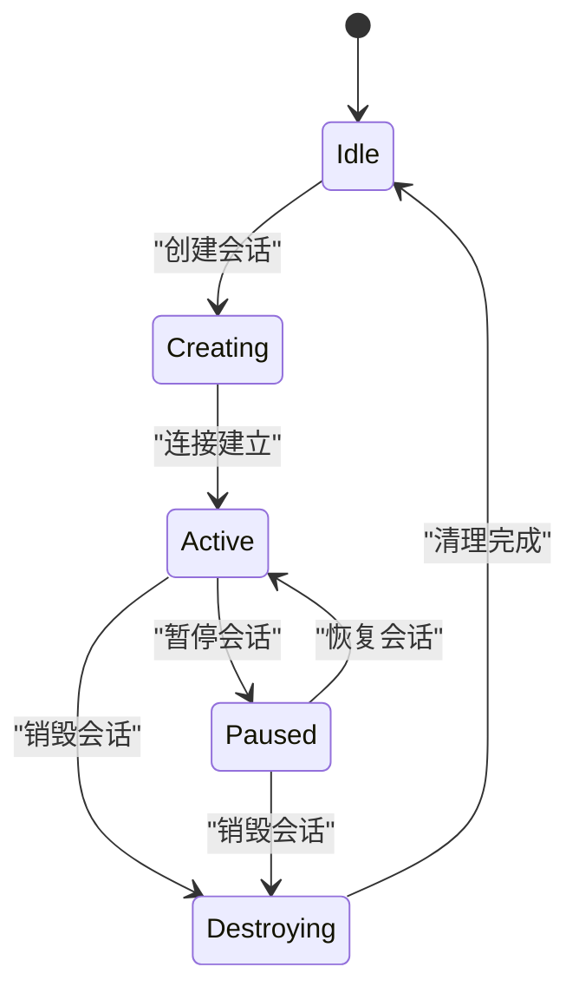
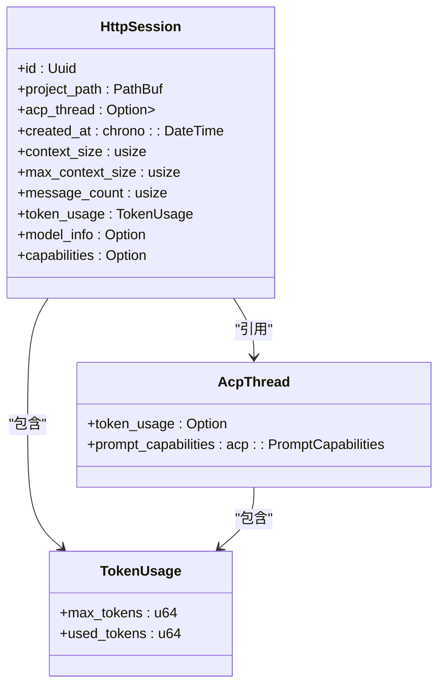
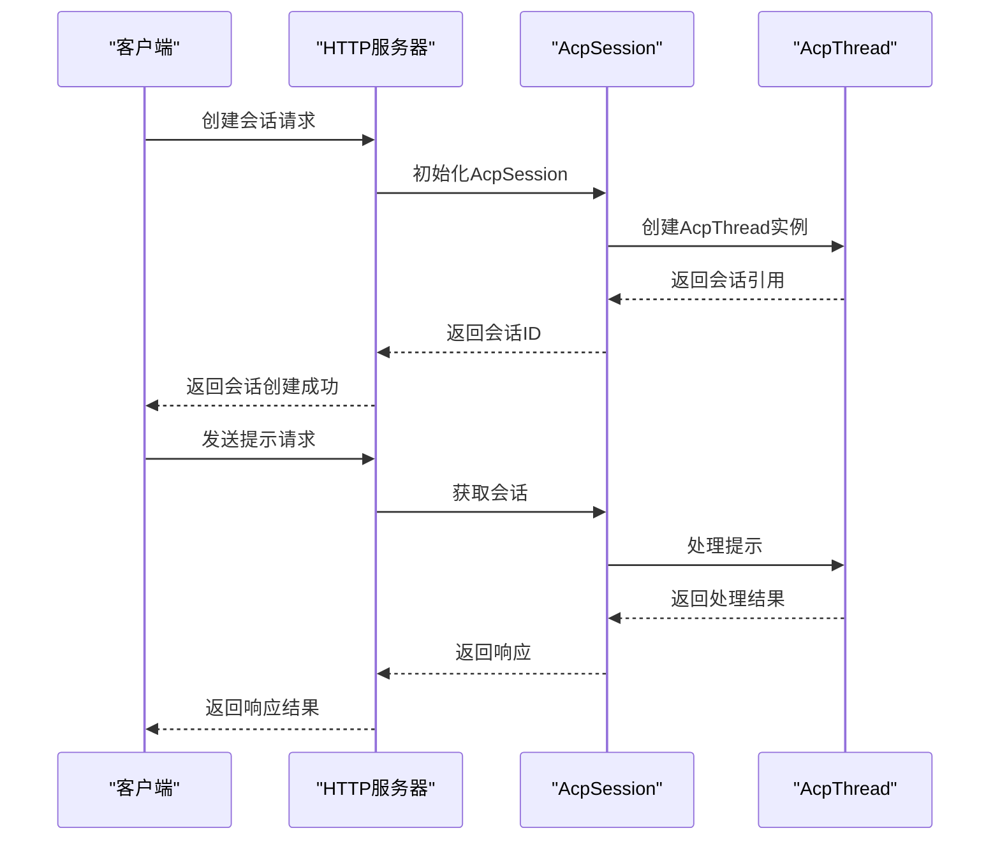
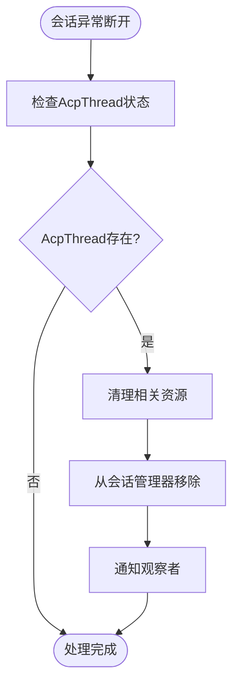

# 会话状态管理

<cite>
**本文档引用的文件**
- [acp_thread.rs](file://crates/acp_thread/src/acp_thread.rs)
- [agent_servers.rs](file://crates/agent_servers/src/agent_servers.rs)
- [acp.rs](file://crates/agent_servers/src/acp.rs)
- [http_agent.rs](file://crates/http_server/src/http_agent.rs)
</cite>

## 目录
1. [引言](#引言)
2. [核心组件](#核心组件)
3. [生命周期管理机制](#生命周期管理机制)
4. [会话连接维护](#会话连接维护)
5. [多模式会话控制](#多模式会话控制)
6. [会话元数据传递](#会话元数据传递)
7. [状态转换流程](#状态转换流程)
8. [异常恢复与资源清理](#异常恢复与资源清理)
9. [结论](#结论)

## 引言
本文档详细阐述了系统中会话状态管理的核心机制，重点分析AcpThread与AcpSession之间的生命周期管理。基于acp_thread.rs中的状态机实现，说明会话的创建、激活、暂停和销毁等状态转换逻辑。同时，结合agent_servers中AcpSession结构体如何通过WeakEntity引用维护会话连接，并解释session_modes在多模式会话控制中的作用。最后，结合http_server中HttpSession的字段定义，描述会话元数据在请求处理链中的传递与更新方式。

## 核心组件

[深入分析核心组件及其相互关系]

**Section sources**
- [acp_thread.rs](file://crates/acp_thread/src/acp_thread.rs#L775-L789)
- [acp.rs](file://crates/agent_servers/src/acp.rs#L43-L47)
- [http_agent.rs](file://crates/http_server/src/http_agent.rs#L21-L33)

## 生命周期管理机制

分析AcpThread与AcpSession之间的生命周期管理机制，包括会话的创建、激活、暂停和销毁等状态转换逻辑。



**Diagram sources**
- [acp_thread.rs](file://crates/acp_thread/src/acp_thread.rs#L775-L789)
- [acp.rs](file://crates/agent_servers/src/acp.rs#L43-L47)

**Section sources**
- [acp_thread.rs](file://crates/acp_thread/src/acp_thread.rs#L775-L807)

## 会话连接维护

分析agent_servers中AcpSession结构体如何通过WeakEntity引用维护会话连接。

```mermaid
classDiagram
class AcpSession {
-thread : WeakEntity<AcpThread>
-suppress_abort_err : bool
-session_modes : Option<Rc<RefCell<acp : : SessionModeState>>>
}
class AcpThread {
+title : SharedString
+entries : Vec<AgentThreadEntry>
+plan : Plan
+project : Entity<Project>
+action_log : Entity<ActionLog>
+shared_buffers : HashMap<Entity<Buffer>, BufferSnapshot>
+send_task : Option<Task<()>>
+connection : Rc<dyn AgentConnection>
+session_id : acp : : SessionId
+token_usage : Option<TokenUsage>
+prompt_capabilities : acp : : PromptCapabilities>
+_observe_prompt_capabilities : Task<anyhow : : Result<()>>
+terminals : HashMap<acp : : TerminalId, Entity<Terminal>>
}
AcpSession --> AcpThread : "弱引用"
```

**Diagram sources**
- [acp.rs](file://crates/agent_servers/src/acp.rs#L43-L47)
- [acp_thread.rs](file://crates/acp_thread/src/acp_thread.rs#L775-L789)

**Section sources**
- [acp.rs](file://crates/agent_servers/src/acp.rs#L43-L47)
- [agent.rs](file://crates/agent2/src/agent.rs#L1133-L1135)

## 多模式会话控制

解释session_modes在多模式会话控制中的作用。

```mermaid
classDiagram
class AcpSession {
-session_modes : Option<Rc<RefCell<acp : : SessionModeState>>>
}
class AcpSessionModes {
-session_id : acp : : SessionId
-connection : Rc<acp : : ClientSideConnection>
-state : Rc<RefCell<acp : : SessionModeState>>
}
AcpSession --> AcpSessionModes : "包含"
AcpSessionModes --> acp : : SessionModeState : "引用"
```

**Diagram sources**
- [acp.rs](file://crates/agent_servers/src/acp.rs#L43-L47)
- [acp.rs](file://crates/agent_servers/src/acp.rs#L457-L461)

**Section sources**
- [acp.rs](file://crates/agent_servers/src/acp.rs#L43-L47)
- [acp.rs](file://crates/agent_servers/src/acp.rs#L457-L461)

## 会话元数据传递

结合http_server中HttpSession的字段定义，描述会话元数据（如创建时间、上下文大小、token使用量）在请求处理链中的传递与更新方式。



**Diagram sources**
- [http_agent.rs](file://crates/http_server/src/http_agent.rs#L21-L33)
- [acp_thread.rs](file://crates/acp_thread/src/acp_thread.rs#L775-L789)

**Section sources**
- [http_agent.rs](file://crates/http_server/src/http_agent.rs#L21-L33)
- [acp_thread.rs](file://crates/acp_thread/src/acp_thread.rs#L775-L789)

## 状态转换流程

提供状态转换图示例，展示从客户端请求到内部状态变更的完整流程。



**Diagram sources**
- [http_agent.rs](file://crates/http_server/src/http_agent.rs#L21-L33)
- [acp.rs](file://crates/agent_servers/src/acp.rs#L43-L47)
- [acp_thread.rs](file://crates/acp_thread/src/acp_thread.rs#L775-L789)

## 异常恢复与资源清理

讨论异常断开时的恢复策略和资源清理机制。



**Diagram sources**
- [acp_thread.rs](file://crates/acp_thread/src/acp_thread.rs#L791-L807)
- [acp.rs](file://crates/agent_servers/src/acp.rs#L43-L47)

**Section sources**
- [acp_thread.rs](file://crates/acp_thread/src/acp_thread.rs#L791-L807)

## 结论
本文档全面分析了会话状态管理的各个关键方面，包括AcpThread与AcpSession之间的生命周期管理机制、会话连接维护、多模式会话控制以及会话元数据的传递与更新。通过详细的类图、状态图和序列图，清晰地展示了系统中会话管理的架构和流程。这些机制共同确保了会话状态的一致性和可靠性，为系统的稳定运行提供了基础保障。