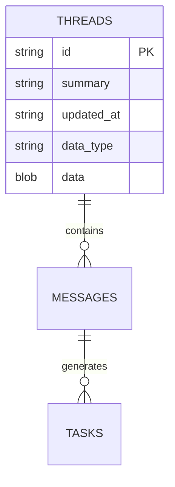

# 数据模型与持久化

<cite>
**本文档中引用的文件**  
- [project.rs](file://crates/project/src/project.rs)
- [git_store.rs](file://crates/project/src/git_store.rs)
- [task_store.rs](file://crates/project/src/task_store.rs)
- [db.rs](file://crates/agent2/src/db.rs)
- [environment.rs](file://crates/project/src/environment.rs)
- [task_inventory.rs](file://crates/project/src/task_inventory.rs)
</cite>

## 目录
1. [引言](#引言)
2. [核心实体与数据模型](#核心实体与数据模型)
3. [数据库操作与SQLx使用](#数据库操作与sqlx使用)
4. [Git版本控制与git_store交互](#git版本控制与git_store交互)
5. [任务调度机制与task_store](#任务调度机制与task_store)
6. [数据库模式ER图](#数据库模式er图)
7. [典型查询场景与性能特征](#典型查询场景与性能特征)
8. [结论](#结论)

## 引言
本项目围绕代码编辑与协作环境构建，其数据模型设计聚焦于项目（Project）、会话（Session）、文件（File）、任务（Task）等核心实体。系统通过`Project`结构统一管理多工作区（Worktree），并集成语言服务器（LSP）、调试器（DAP）、任务系统与Git版本控制。持久化策略结合了内存状态与本地数据库，确保用户状态（如会话、任务）的可靠存储。`git_store`模块深度集成Git仓库，实现差异计算、冲突检测与版本操作。`task_store`则负责任务上下文的动态生成与调度。本文档旨在全面解析这些核心组件的数据结构、生命周期及其实现机制。

## 核心实体与数据模型

### Project（项目）
`Project`是系统的核心协调者，它并非简单的文件集合，而是一个语义感知的实体，负责管理任务、LSP查询、协作状态，并同步多个工作区的状态。它通过`ProjectEntryId`和`ProjectPath`将工作区条目映射到自身的逻辑中。

- **字段定义**:
  - `active_entry`: 当前激活的条目ID。
  - `git_store`: 管理Git仓库状态的实体。
  - `task_store`: 负责任务调度与上下文的实体。
  - `lsp_store`: 管理语言服务器的实体。
  - `worktree_store`: 管理工作区的实体。
  - `buffer_store`: 管理文本缓冲区的实体。
  - `client_state`: 表示项目的连接状态（本地、共享或远程）。
- **生命周期**: `Project`的生命周期与应用会话绑定。它在项目打开时创建，通过`shared`和`unshared`方法管理协作状态，并在项目关闭时销毁。
- **持久化策略**: `Project`本身的状态主要驻留在内存中。其持久化依赖于`git_store`（用于版本控制元数据）和`task_store`（用于任务配置）等子系统。

**Section sources**
- [project.rs](file://crates/project/src/project.rs#L172-L214)

### Session（会话）
会话主要指与AI代理（Agent）的交互线程。其数据模型由`agent2`模块的`db.rs`定义，通过SQLite数据库进行持久化。

- **字段定义**:
  - `id`: 会话的唯一标识符（`acp::SessionId`）。
  - `title`: 会话的摘要或标题。
  - `updated_at`: 会话最后更新的时间戳。
  - `messages`: 会话中包含的用户和代理消息列表。
  - `detailed_summary`: 详细的会话摘要。
  - `model`: 使用的语言模型。
- **生命周期**: 会话在用户启动与AI的交互时创建。每次消息交换后，会话状态会被序列化并保存到数据库。会话可以被加载、删除或列出。
- **持久化策略**: 使用SQLite数据库（`threads.db`）进行持久化。数据以Zstd压缩的JSON格式存储，以节省空间并提高I/O效率。

**Section sources**
- [db.rs](file://crates/agent2/src/db.rs)

### File（文件）与Git状态
文件状态由`git_store`模块管理，它与Git仓库深度集成，提供实时的版本控制信息。

- **字段定义**:
  - `Repository`: 代表一个Git仓库，包含其工作目录路径、分支、HEAD提交等信息。
  - `StatusEntry`: 代表一个文件的状态条目，包含`repo_path`（仓库内路径）和`status`（文件状态，如已修改、已暂存、冲突等）。
  - `BufferGitState`: 将Git状态与内存中的文本缓冲区关联，包含`unstaged_diff`（未暂存差异）和`uncommitted_diff`（未提交差异）等字段。
- **生命周期**: 文件的Git状态随着用户的编辑、暂存、提交等操作而动态变化。`git_store`通过后台任务持续扫描工作区，更新状态树。
- **持久化策略**: Git状态的持久化由底层的Git仓库（`.git`目录）负责。`git_store`模块在内存中维护一个状态快照（`SumTree<StatusEntry>`），并在需要时与磁盘同步。

**Section sources**
- [git_store.rs](file://crates/project/src/git_store.rs)

### Task（任务）
任务是系统中的可执行单元，可以是用户定义的脚本、LSP提供的代码操作，或语言特定的任务。

- **字段定义**:
  - `TaskContext`: 任务执行所需的上下文，包含`cwd`（工作目录）、`project_env`（项目环境变量）和`task_variables`（任务变量）。
  - `TaskSourceKind`: 任务的来源，如`Worktree`（来自工作区配置）、`Lsp`（来自语言服务器）等。
  - `TaskSettingsLocation`: 任务配置的位置，可以是全局或特定工作区。
- **生命周期**: 任务在用户请求执行时动态生成其上下文。任务的定义（如`task.json`中的脚本）是静态的，但其执行环境是动态构建的。
- **持久化策略**: 任务的定义（如`task.json`文件）以JSON格式存储在项目或用户配置目录中。任务的执行状态是瞬时的，不进行持久化。

**Section sources**
- [task_store.rs](file://crates/project/src/task_store.rs)
- [task_inventory.rs](file://crates/project/src/task_inventory.rs)

## 数据库操作与SQLx使用
系统使用`sqlez`库（一个轻量级的SQLite绑定）进行数据库操作，而非直接使用`SQLx`。其设计模式与`SQLx`类似，强调类型安全和异步操作。

- **表结构设计**: 核心表为`threads`，用于存储AI会话。
  - `id` (TEXT PRIMARY KEY): 会话ID。
  - `summary` (TEXT NOT NULL): 会话标题。
  - `updated_at` (TEXT NOT NULL): 更新时间。
  - `data_type` (TEXT NOT NULL): 数据类型（`json`或`zstd`）。
  - `data` (BLOB NOT NULL): 序列化并可选压缩的会话数据。
- **迁移脚本管理**: 项目未使用显式的迁移脚本。数据库表的创建通过内联SQL在`ThreadsDatabase::new`方法中完成。版本控制通过`DbThread::VERSION`常量和`upgrade_from_agent_1`方法实现，用于处理数据格式的向后兼容。
- **查询优化技巧**:
  - **连接池与异步执行**: 使用`BackgroundExecutor`和`Shared<Task<...>>`模式，确保数据库操作不会阻塞UI线程。
  - **预编译语句**: `sqlez`库内部使用预编译语句，提高查询效率。
  - **数据压缩**: 对JSON数据使用Zstd压缩，显著减少存储空间和I/O时间。
  - **批量操作**: `INSERT OR REPLACE`语句用于原子性地保存或更新会话。

**Section sources**
- [db.rs](file://crates/agent2/src/db.rs)

## Git版本控制与git_store交互
`git_store`模块是系统与Git仓库交互的核心，它提供了丰富的版本控制功能。

- **交互机制**:
  - **状态监控**: `git_store`订阅`WorktreeStore`的事件，当文件系统发生变化时，触发对相关仓库的状态扫描。
  - **差异计算**: 提供`open_unstaged_diff`和`open_uncommitted_diff`方法，为指定的缓冲区创建差异视图。差异计算是惰性的，仅在用户打开差异面板时执行。
  - **远程操作**: 通过`AnyProtoClient`处理来自远程客户端的请求（如`handle_push`, `handle_pull`），实现协作环境下的Git操作同步。
  - **冲突处理**: 通过`ConflictSet`管理合并冲突，允许用户在编辑器内直接解决冲突。
- **关键特性**:
  - **高效扫描**: 使用增量扫描策略，只检查自上次扫描以来发生变化的路径。
  - **缓存机制**: 对`BufferDiff`和`ConflictSet`进行缓存，避免重复计算。
  - **异步友好**: 所有Git操作（如提交、推送）都封装为`Task`，确保UI响应性。

**Section sources**
- [git_store.rs](file://crates/project/src/git_store.rs)

## 任务调度机制与task_store
`task_store`负责任务的发现、上下文构建和调度。

- **任务调度机制**:
  1. **任务发现**: `task_inventory`从多个来源（工作区配置、LSP服务器、语言扩展）收集任务定义。
  2. **上下文构建**: 当用户在特定位置请求任务时，`task_store`调用`task_context_for_location`。该方法结合`BasicContextProvider`和`LanguageToolchainStore`，根据当前文件、工作区和语言环境，动态生成`TaskContext`。
  3. **变量注入**: `combine_task_variables`函数将捕获的变量（如选中的文本）、项目环境变量和语言特定变量合并到最终的`TaskVariables`中。
  4. **远程协作**: 在远程项目中，`remote_task_context_for_location`会向远程服务器发起请求，获取必要的上下文信息。
- **核心组件**:
  - `StoreState`: 包含任务库存（`Inventory`）、工具链存储（`toolchain_store`）和环境。
  - `Inventory`: 任务的中央注册表，管理所有已发现的任务。

**Section sources**
- [task_store.rs](file://crates/project/src/task_store.rs)
- [task_inventory.rs](file://crates/project/src/task_inventory.rs)

## 数据库模式ER图

**Diagram sources**
- [db.rs](file://crates/agent2/src/db.rs)

## 典型查询场景与性能特征

### 1. 列出所有会话 (`list_threads`)
- **场景**: 用户打开会话列表面板。
- **查询**: `SELECT id, summary, updated_at FROM threads ORDER BY updated_at DESC`
- **性能特征**: 
  - **复杂度**: O(n log n)，主要开销在排序。
  - **优化**: 结果集通常较小，且`updated_at`上有隐式索引（ORDER BY），性能良好。
  - **瓶颈**: 无显著瓶颈。

### 2. 加载会话详情 (`load_thread`)
- **场景**: 用户点击一个会话以恢复对话。
- **查询**: `SELECT data_type, data FROM threads WHERE id = ? LIMIT 1`
- **性能特征**:
  - **复杂度**: O(1) 查找 + O(m) 解压/解析，其中m是数据大小。
  - **优化**: 主键查找非常快。Zstd解压速度快，但大文件的JSON解析可能成为瓶颈。
  - **瓶颈**: 大型会话的JSON反序列化。

### 3. 保存会话 (`save_thread`)
- **场景**: 用户发送消息后，会话状态需要保存。
- **查询**: `INSERT OR REPLACE INTO threads (id, summary, updated_at, data_type, data) VALUES (?, ?, ?, ?, ?)`
- **性能特征**:
  - **复杂度**: O(1) 查找 + O(k) 压缩 + O(k) 写入，其中k是JSON大小。
  - **优化**: 使用`INSERT OR REPLACE`避免先查后插。Zstd压缩速度快。
  - **瓶颈**: 频繁写入可能导致I/O压力，但异步`Task`模型已缓解此问题。

### 4. 获取文件Git状态 (`project_path_git_status`)
- **场景**: 文件树或编辑器标签页需要显示文件的修改状态图标。
- **查询**: 在内存中的`SumTree<StatusEntry>`上进行路径查找。
- **性能特征**:
  - **复杂度**: O(log n)，得益于`SumTree`的平衡树结构。
  - **优化**: 状态在内存中，查找极快。
  - **瓶颈**: 无，是高效的O(log n)操作。

## 结论
本系统的数据模型设计精巧，将核心实体（Project, Session, File, Task）的职责清晰分离。持久化策略合理，利用SQLite高效存储会话数据，并通过Zstd压缩优化I/O。`git_store`模块实现了与Git仓库的深度、实时集成，为用户提供流畅的版本控制体验。`task_store`的动态上下文构建机制，使得任务能够智能地适应当前的编辑环境。整体架构通过异步任务和内存缓存，确保了高性能和良好的用户体验。