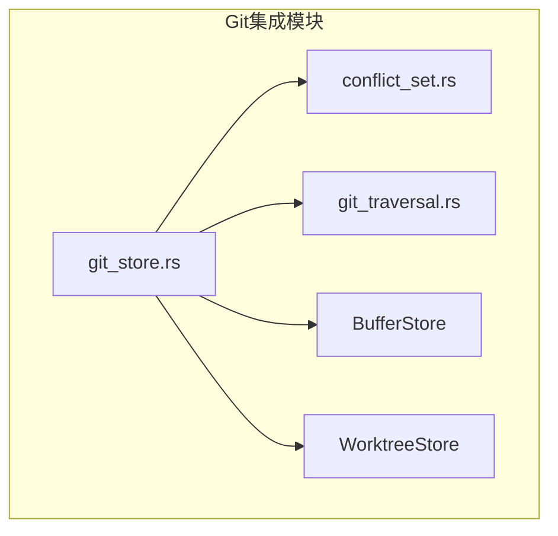
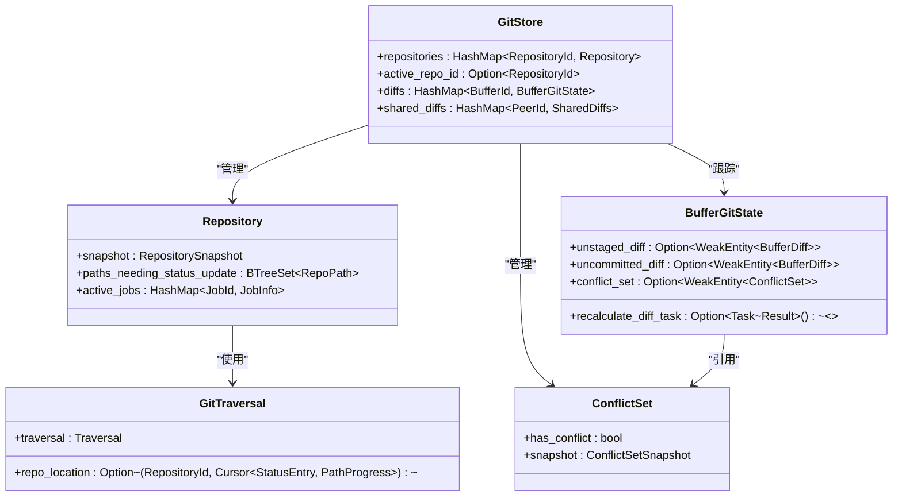
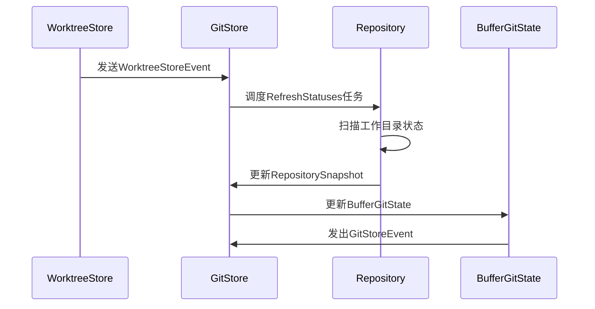
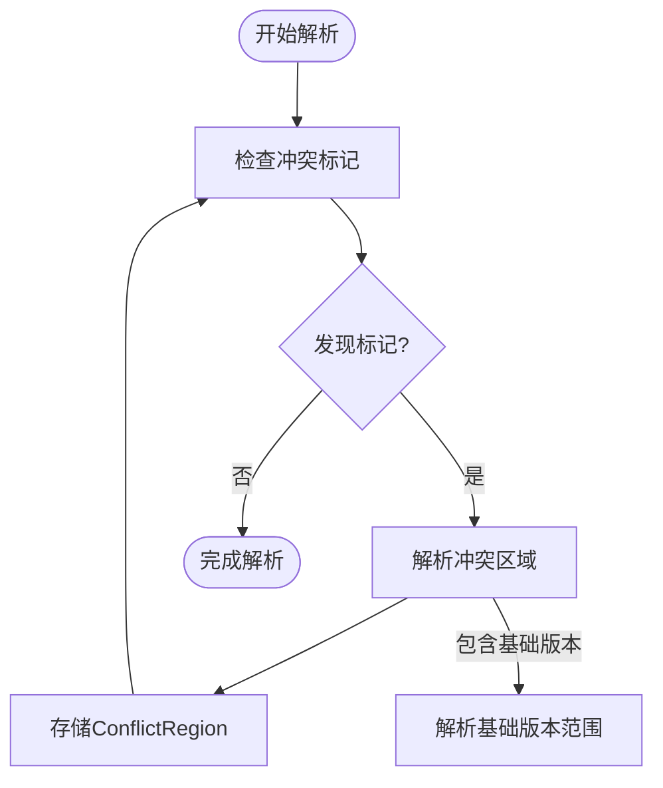
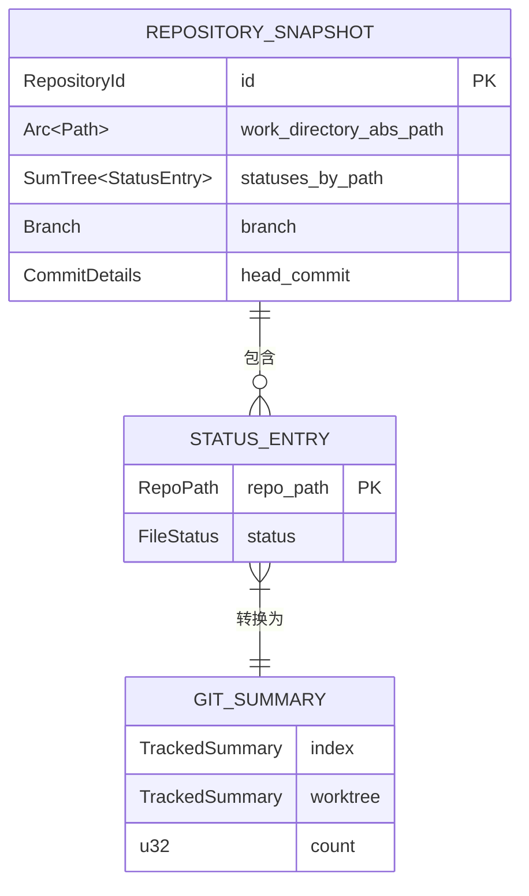
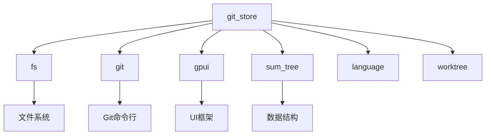

# Git集成机制

<cite>
**本文档中引用的文件**   
- [git_store.rs](file://crates/project/src/git_store.rs)
- [conflict_set.rs](file://crates/project/src/git_store/conflict_set.rs)
- [git_traversal.rs](file://crates/project/src/git_store/git_traversal.rs)
</cite>

## 目录
1. [引言](#引言)
2. [项目结构](#项目结构)
3. [核心组件](#核心组件)
4. [架构概述](#架构概述)
5. [详细组件分析](#详细组件分析)
6. [依赖分析](#依赖分析)
7. [性能考虑](#性能考虑)
8. [故障排除指南](#故障排除指南)
9. [结论](#结论)

## 引言
本文档深入探讨了`git_store`模块如何封装底层Git操作以支持版本控制功能。重点分析了仓库状态监听、分支切换、提交历史查询的实现原理，以及冲突检测与高效提交遍历算法的设计。同时阐述了增量状态同步机制与性能优化策略，包括状态缓存和事件去重，并通过实际代码示例演示关键操作流程。

## 项目结构
`git_store`模块位于`crates/project/src/git_store`目录下，包含三个核心文件：`git_store.rs`作为主模块，`conflict_set.rs`负责冲突检测与表示，`git_traversal.rs`提供高效的提交遍历算法。该模块与`BufferStore`和`WorktreeStore`紧密协作，实现了对Git仓库的全面管理。

**图源**
- [git_store.rs](file://crates/project/src/git_store.rs#L1-L50)
- [conflict_set.rs](file://crates/project/src/git_store/conflict_set.rs#L1-L20)
- [git_traversal.rs](file://crates/project/src/git_store/git_traversal.rs#L1-L20)

**本节来源**
- [git_store.rs](file://crates/project/src/git_store.rs#L1-L100)

## 核心组件
`git_store`模块的核心在于`GitStore`结构体，它管理着多个`Repository`实例，每个实例对应一个Git仓库。通过`BufferGitState`跟踪缓冲区的Git状态，实现了对未暂存和未提交更改的精确监控。`ConflictSet`组件专门处理合并冲突的检测与解析，而`GitTraversal`则提供了高效的目录遍历与状态同步机制。

**本节来源**
- [git_store.rs](file://crates/project/src/git_store.rs#L25-L100)
- [conflict_set.rs](file://crates/project/src/git_store/conflict_set.rs#L15-L80)
- [git_traversal.rs](file://crates/project/src/git_store/git_traversal.rs#L10-L30)

## 架构概述
`GitStore`采用分层架构设计，上层为`GitStore`实体，中层为`Repository`实体，底层为`BufferGitState`和`ConflictSet`等状态管理组件。这种设计实现了关注点分离，使得状态管理、冲突检测和遍历算法可以独立演化。

**图源**
- [git_store.rs](file://crates/project/src/git_store.rs#L150-L200)
- [conflict_set.rs](file://crates/project/src/git_store/conflict_set.rs#L10-L30)
- [git_traversal.rs](file://crates/project/src/git_store/git_traversal.rs#L20-L40)

## 详细组件分析

### Git仓库状态监听
`GitStore`通过订阅`WorktreeStore`和`BufferStore`的事件来实时监听仓库状态变化。当工作树发生变更时，会触发状态扫描任务，更新仓库的文件状态摘要。

**图源**
- [git_store.rs](file://crates/project/src/git_store.rs#L300-L350)
- [git_store.rs](file://crates/project/src/git_store.rs#L500-L550)

**本节来源**
- [git_store.rs](file://crates/project/src/git_store.rs#L250-L600)

### 冲突检测机制
`ConflictSet`组件通过解析缓冲区中的冲突标记来检测合并冲突。它支持标准的`<<<<<<<`、`=======`、`>>>>>>>`标记，以及包含基础版本的`|||||||`标记。

**图源**
- [conflict_set.rs](file://crates/project/src/git_store/conflict_set.rs#L100-L150)
- [conflict_set.rs](file://crates/project/src/git_store/conflict_set.rs#L200-L250)

**本节来源**
- [conflict_set.rs](file://crates/project/src/git_store/conflict_set.rs#L50-L300)

### 提交遍历算法
`GitTraversal`利用`sum_tree::Cursor`实现高效的目录遍历与状态同步。它能够快速定位到特定路径的Git状态，并支持父子节点间的导航。

**图源**
- [git_traversal.rs](file://crates/project/src/git_store/git_traversal.rs#L50-L100)
- [git_store.rs](file://crates/project/src/git_store.rs#L100-L120)

**本节来源**
- [git_traversal.rs](file://crates/project/src/git_store/git_traversal.rs#L30-L150)

## 依赖分析
`git_store`模块依赖于多个外部组件，包括`fs`用于文件系统操作，`git`库用于底层Git命令执行，`gpui`用于UI事件处理，以及`sum_tree`用于高效的数据结构操作。

**图源**
- [git_store.rs](file://crates/project/src/git_store.rs#L10-L30)
- [Cargo.toml](file://crates/project/Cargo.toml#L10-L20)

**本节来源**
- [git_store.rs](file://crates/project/src/git_store.rs#L1-L50)
- [Cargo.toml](file://crates/project/Cargo.toml#L1-L30)

## 性能考虑
`git_store`模块采用了多种性能优化策略，包括状态缓存、事件去重和异步任务调度。通过`loading_diffs`哈希表避免重复计算差异，使用`Shared<Task>`确保同一缓冲区的差异计算任务不会重复执行。

**本节来源**
- [git_store.rs](file://crates/project/src/git_store.rs#L400-L450)

## 故障排除指南
当遇到Git状态不同步问题时，首先检查`WorktreeStore`是否正确发送了文件系统变更事件。对于冲突检测失败的情况，验证`ConflictSet`是否正确订阅了缓冲区变更事件，并确认冲突标记格式是否符合标准。

**本节来源**
- [git_store.rs](file://crates/project/src/git_store.rs#L600-L650)
- [conflict_set.rs](file://crates/project/src/git_store/conflict_set.rs#L300-L350)

## 结论
`git_store`模块通过精心设计的架构和高效的算法，实现了对Git仓库的全面管理。其模块化设计使得各个功能组件可以独立演化，而统一的事件系统确保了状态的一致性。未来可以进一步优化大型仓库的性能表现，增强对分布式工作流的支持。