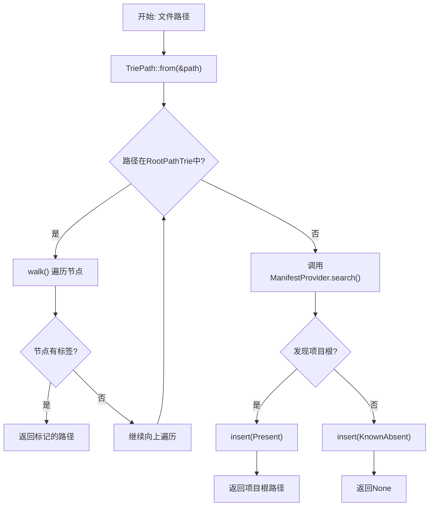
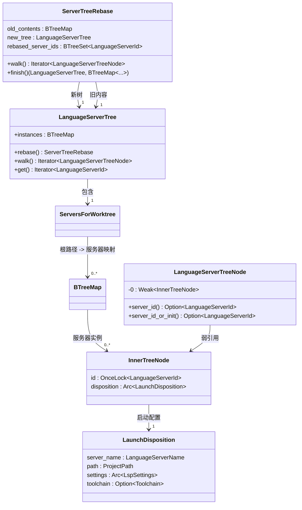
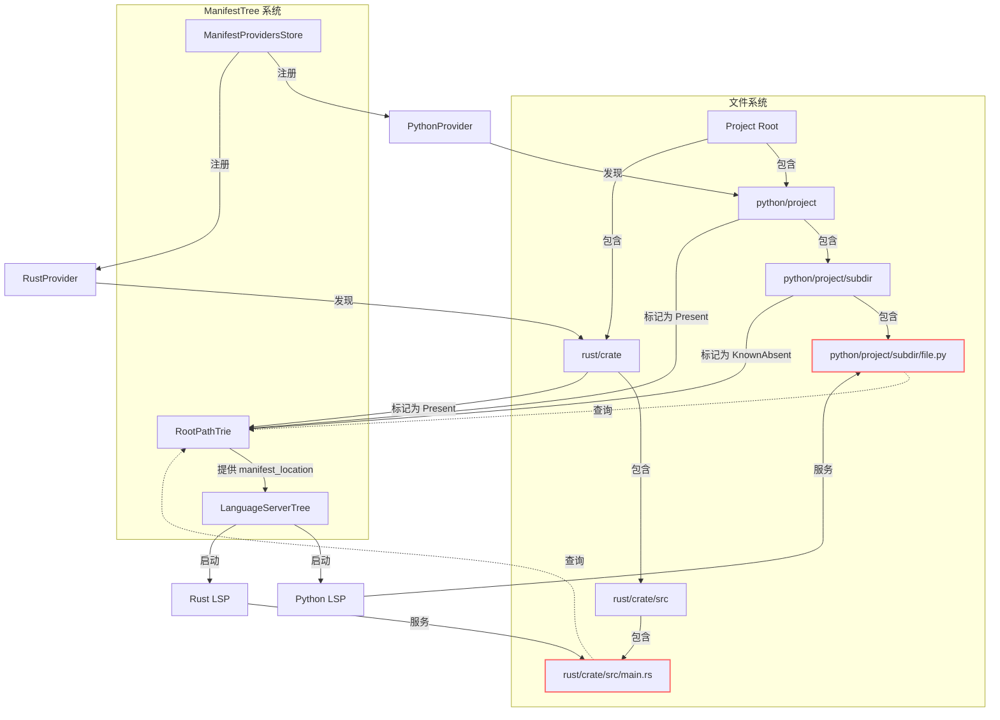

# 依赖与配置管理

<cite>
**本文档引用的文件**
- [manifest_store.rs](file://crates/project/src/manifest_tree/manifest_store.rs)
- [path_trie.rs](file://crates/project/src/manifest_tree/path_trie.rs)
- [server_tree.rs](file://crates/project/src/manifest_tree/server_tree.rs)
- [manifest_tree.rs](file://crates/project/src/manifest_tree.rs)
</cite>

## 目录
1. [简介](#简介)
2. [核心组件概述](#核心组件概述)
3. [清单存储与解析机制](#清单存储与解析机制)
4. [路径前缀匹配算法](#路径前缀匹配算法)
5. [语言服务器映射管理](#语言服务器映射管理)
6. [清单树的增量更新机制](#清单树的增量更新机制)
7. [跨语言依赖解析策略](#跨语言依赖解析策略)
8. [架构图：清单树与项目结构关联](#架构图：清单树与项目结构关联)
9. [依赖查询与构建集成实现](#依赖查询与构建集成实现)
10. [配置热重载与竞态处理](#配置热重载与竞态处理)

## 简介
本文件详细阐述了 `rcoder` 项目中依赖与配置管理系统的核心设计与实现。系统以 `manifest_tree` 模块为核心，通过 `manifest_store.rs`、`path_trie.rs` 和 `server_tree.rs` 三个关键组件，构建了一个高效、可扩展的依赖解析与管理框架。该系统负责解析 `Cargo.toml`、`package.json` 等各类清单文件，维护项目依赖结构，并为语言服务器提供精确的路径映射。文档将深入解析其内部机制，包括清单解析逻辑、路径匹配算法、服务器映射策略以及配置变更的响应机制。

## 核心组件概述
`manifest_tree` 系统由三个核心模块构成，共同协作完成依赖与配置的管理工作：
- **`manifest_store.rs`**：作为清单提供者的注册中心，统一管理所有支持的清单文件类型（如 `Cargo.toml`, `package.json`）及其对应的解析逻辑。
- **`path_trie.rs`**：实现了一个高效的路径前缀匹配树（Trie），用于快速定位给定文件路径所属的最近项目根目录（即清单文件所在位置）。
- **`server_tree.rs`**：基于清单树的分析结果，组织和管理语言服务器（LSP）与项目路径之间的映射关系，决定在何处启动及复用语言服务器。

**Section sources**
- [manifest_tree.rs](file://crates/project/src/manifest_tree.rs#L1-L30)

## 清单存储与解析机制
`ManifestProvidersStore` 是整个系统的核心注册中心，它采用全局单例模式，集中管理所有 `ManifestProvider` 实现。每个 `ManifestProvider` 负责一种特定类型清单文件（如 Rust 的 `Cargo.toml` 或 JavaScript 的 `package.json`）的发现与解析。

当系统需要查找某个路径下的清单文件时，会通过 `ManifestProvidersStore` 获取所有已注册的提供者。对于每一个提供者，系统会调用其 `search` 方法，传入一个包含路径、搜索深度和委托对象的 `ManifestQuery` 查询。委托对象（`ManifestDelegate`）提供了文件系统查询能力，允许提供者检查特定路径下是否存在符合要求的文件。

该设计实现了高度的可扩展性，新的语言或构建系统只需实现 `ManifestProvider` trait 并向 `ManifestProvidersStore` 注册，即可无缝集成到整个依赖管理体系中。

**Section sources**
- [manifest_store.rs](file://crates/project/src/manifest_tree/manifest_store.rs#L1-L52)
- [manifest_tree.rs](file://crates/project/src/manifest_tree.rs#L114-L171)

## 路径前缀匹配算法
`RootPathTrie` 是一个为高效路径搜索而设计的特化数据结构，其核心功能是解决“给定一个文件路径，找到其最近的、已知的项目根目录”这一问题。

### 数据结构
`RootPathTrie` 本质上是一个以路径组件为边的树形结构。每个节点包含：
- `worktree_relative_path`：从工作区根目录到当前节点的完整路径。
- `labels`：一个 `BTreeMap`，键为 `ManifestName`（如 "Cargo.toml"），值为 `LabelPresence` 枚举，标记该路径是否为一个项目根。
- `children`：指向子节点的映射。

### 标签状态优化
`LabelPresence` 枚举包含两种状态：
- `Present`：明确表示该路径是一个项目根目录。
- `KnownAbsent`：明确表示该路径不是一个项目根，并且其祖先节点中也没有被标记为 `Present` 的节点。

这种设计的关键在于优化搜索性能。当从叶节点向上遍历到根节点时，一旦遇到一个 `KnownAbsent` 节点，就可以停止搜索，因为根据定义，该节点的祖先路径中不可能存在 `Present` 节点。这避免了对整个路径进行重复扫描。

### 搜索与插入流程
1.  **搜索 (`walk`)**：从根节点开始，沿着路径的每个组件向下遍历。在遍历过程中，如果遇到带有 `labels` 的节点（即 `Present` 或 `KnownAbsent`），则调用回调函数进行处理。搜索会从叶节点向根节点进行，以找到最近的匹配。
2.  **插入 (`insert`)**：当通过 `ManifestProvider` 发现一个新的项目根时，会将其路径和 `ManifestName` 作为 `Present` 标签插入到 `RootPathTrie` 中。如果确认某个路径下不存在项目根，则会插入 `KnownAbsent` 标签，避免未来重复搜索。

此算法确保了路径查找的高效性，时间复杂度接近 O(n)，其中 n 是路径的深度。

**Diagram sources**
- [path_trie.rs](file://crates/project/src/manifest_tree/path_trie.rs#L0-L259)
- [manifest_tree.rs](file://crates/project/src/manifest_tree.rs#L114-L171)

## 语言服务器映射管理
`LanguageServerTree` 模块负责将 `manifest_tree` 的分析结果转化为具体的语言服务器启动和管理策略。

### 核心职责
1.  **映射建立**：根据 `manifest_location`（即清单文件所在路径）和编程语言名称，查询用户设置，确定需要启动哪些语言服务器（LSP）。
2.  **实例管理**：维护一个 `instances` 映射，记录每个工作区（`WorktreeId`）下，各个项目根路径所关联的语言服务器实例（`InnerTreeNode`）。
3.  **复用与初始化**：提供 `walk` 和 `get` 方法。`walk` 方法用于初始化或获取一个语言服务器节点，`get` 方法则仅返回已初始化的服务器ID。

### 复用机制
`LanguageServerTree` 的核心优势在于其智能的复用机制。当配置变更（如修改了LSP设置）时，系统会创建一个 `ServerTreeRebase` 对象。该对象在构建新树的过程中，会检查旧树中是否存在配置完全相同的语言服务器实例（通过比较 `server_name`、`toolchain` 和 `settings`）。如果存在，则直接复用该实例的ID，避免了不必要的重启，从而提升了性能和用户体验。

**Diagram sources**
- [server_tree.rs](file://crates/project/src/manifest_tree/server_tree.rs#L0-L462)

## 清单树的增量更新机制
`ManifestTree` 系统通过事件驱动的方式实现了清单结构的增量更新，确保了系统的实时性和高效性。

### 初始化与订阅
`ManifestTree` 在创建时会订阅两个关键事件源：
1.  **`WorktreeStore` 事件**：监听工作区的增删。当一个工作区被移除时，`on_worktree_store_event` 回调会清理 `root_points` 中对应的 `WorktreeRoots` 实例。
2.  **全局 `SettingsStore` 事件**：监听全局设置的变更。一旦设置发生变化，系统会遍历所有 `WorktreeRoots`，并重置其内部的 `RootPathTrie`，强制进行一次重新扫描。

### 工作区根目录管理
每个工作区（`Worktree`）都对应一个 `WorktreeRoots` 实例，该实例内部维护一个 `RootPathTrie`。`WorktreeRoots` 还订阅了其对应 `Worktree` 的事件，以响应文件系统的动态变化：
- **文件/目录删除**：当监听到 `UpdatedEntries` 或 `DeletedEntry` 事件时，会立即从 `RootPathTrie` 中移除对应的路径节点，确保依赖树的准确性。

### 按需发现
系统采用“按需发现”（lazy discovery）策略。`root_for_path` 方法在遍历 `RootPathTrie` 时，如果发现路径的某部分尚未探索（`current_presence == KnownAbsent`），它会动态调用相应的 `ManifestProvider` 进行一次深度搜索，将结果（`Present` 或 `KnownAbsent`）更新回 `RootPathTrie`。这种机制避免了在项目打开时进行全量扫描，极大地提升了启动速度。

**Section sources**
- [manifest_tree.rs](file://crates/project/src/manifest_tree.rs#L89-L223)

## 跨语言依赖解析策略
系统通过 `ManifestProvidersStore` 实现了对多语言清单文件的统一管理。每种语言的构建系统（如 Cargo、npm、pip 等）都可以通过实现 `ManifestProvider` trait 来贡献其清单发现逻辑。

当一个文件被打开时，系统会根据文件的路径和类型，确定其所属的编程语言。然后，它会查询该语言所关联的所有 `ManifestProvider`，并依次尝试在文件的祖先路径中查找对应的清单文件。例如，一个 `.rs` 文件会触发对 `Cargo.toml` 的搜索，而一个 `.js` 文件会触发对 `package.json` 的搜索。

这种策略确保了无论项目结构多么复杂（如 monorepo），系统都能为每个文件精确地找到其依赖配置的上下文，从而为语言服务器、构建工具等提供正确的环境信息。

**Section sources**
- [manifest_store.rs](file://crates/project/src/manifest_tree/manifest_store.rs#L1-L52)
- [manifest_tree.rs](file://crates/project/src/manifest_tree.rs#L114-L171)

## 架构图：清单树与项目结构关联
下图展示了 `manifest_tree` 系统各组件如何协同工作，将物理的项目文件结构映射为逻辑的依赖与服务器配置。

**Diagram sources**
- [manifest_store.rs](file://crates/project/src/manifest_tree/manifest_store.rs#L1-L52)
- [path_trie.rs](file://crates/project/src/manifest_tree/path_trie.rs#L0-L259)
- [server_tree.rs](file://crates/project/src/manifest_tree/server_tree.rs#L0-L462)

## 依赖查询与构建集成实现
开发者可以通过 `ManifestTree` 提供的公共API进行依赖项查询。例如，`root_for_path` 方法可以被构建系统调用，以确定某个源文件所属的构建上下文（即其 `Cargo.toml` 或 `package.json` 的位置），从而执行正确的构建命令。

环境变量的注入通常发生在语言服务器启动阶段。`LaunchDisposition` 结构体在创建 `InnerTreeNode` 时，会从 `toolchains` 存储中获取当前路径下激活的工具链（`Toolchain`），该工具链可能包含特定的环境变量配置。这些配置会作为启动参数传递给语言服务器进程。

构建系统集成则依赖于 `ManifestTree` 提供的精确项目根信息。外部构建工具（如 IDE 插件或命令行脚本）可以查询 `ManifestTree` 来定位正确的构建清单文件，确保在多项目工作区中执行构建操作的准确性。

**Section sources**
- [server_tree.rs](file://crates/project/src/manifest_tree/server_tree.rs#L200-L250)
- [manifest_tree.rs](file://crates/project/src/manifest_tree.rs#L90-L112)

## 配置热重载与竞态处理
系统通过 `cx.observe_global::<SettingsStore>` 实现了配置文件的热重载。一旦用户修改了语言服务器设置，`SettingsStore` 会发出变更事件，触发 `ManifestTree` 内部的观察者回调。该回调会重置所有 `WorktreeRoots` 的 `RootPathTrie`，从而在下一次查询时强制重新评估依赖关系。

为了处理潜在的竞态条件，系统采用了以下策略：
1.  **不可变性与原子更新**：`RootPathTrie` 的内部状态通过 `RwLock` 保护，`ManifestProvidersStore` 也使用 `RwLock` 管理其提供者列表。这确保了读写操作的线程安全。
2.  **弱引用**：`LanguageServerTreeNode` 使用 `Weak<InnerTreeNode>` 持有对实际节点的引用。这允许 `ServerTreeRebase` 在旧树被丢弃时安全地检查节点状态，而不会阻止旧树的内存回收。
3.  **ID 原子性**：`InnerTreeNode` 中的 `id` 字段使用 `OnceLock`，保证了语言服务器ID的分配是原子且只发生一次的，避免了重复启动。

这些机制共同确保了在配置动态变化的复杂场景下，系统的稳定性和数据一致性。

**Section sources**
- [manifest_tree.rs](file://crates/project/src/manifest_tree.rs#L50-L55)
- [server_tree.rs](file://crates/project/src/manifest_tree/server_tree.rs#L300-L350)