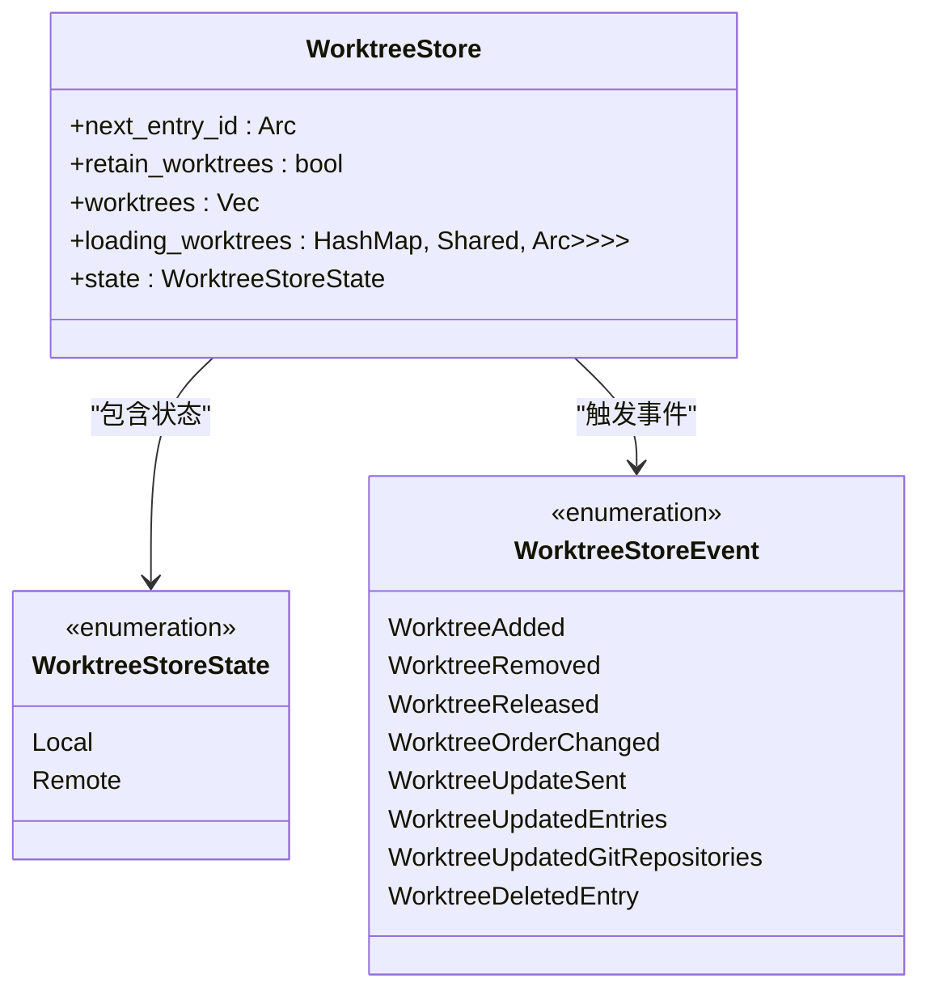
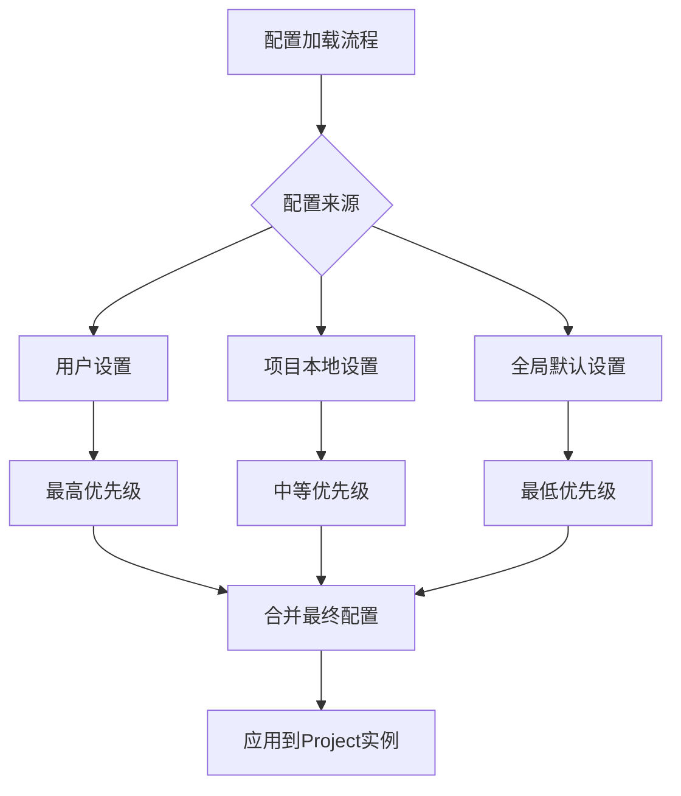

# 核心项目结构

<cite>
**本文档中引用的文件**  
- [project.rs](file://crates/project/src/project.rs)
- [worktree_store.rs](file://crates/project/src/worktree_store.rs)
- [project_settings.rs](file://crates/project/src/project_settings.rs)
- [environment.rs](file://crates/project/src/environment.rs)
- [shared_types/src/lib.rs](file://crates/shared_types/src/lib.rs)
</cite>

## 目录
1. [项目实体设计](#项目实体设计)
2. [工作树管理机制](#工作树管理机制)
3. [项目配置与设置](#项目配置与设置)
4. [项目生命周期与状态转换](#项目生命周期与状态转换)
5. [线程安全与并发处理](#线程安全与并发处理)
6. [系统集成与扩展](#系统集成与扩展)
7. [常见问题与排查](#常见问题与排查)

## 项目实体设计

`Project` 实体是系统中语义感知的核心单元，负责管理一个或多个工作树（Worktree）中的文件资源。该实体承担任务调度、语言服务器（LSP）查询、协作同步等关键职责，并通过 `ProjectEntryId` 和 `ProjectPath` 结构映射工作树条目。

在数据结构层面，`Project` 包含多个核心字段：
- `active_entry`：当前激活的项目条目ID
- `worktree_store`：管理工作树实例的存储容器
- `buffer_store`：管理缓冲区状态
- `lsp_store` 和 `dap_store`：分别处理语言服务器和调试适配器协议
- `git_store`：维护Git仓库状态
- `client_state`：标识项目客户端状态（本地、共享或远程）

此外，`ProjectPath` 结构用于唯一标识项目内的文件路径，由 `worktree_id` 和相对路径组成，确保跨工作树的路径解析一致性。

**Section sources**
- [project.rs](file://crates/project/src/project.rs#L172-L214)
- [shared_types/src/lib.rs](file://crates/shared_types/src/lib.rs#L5-L13)

## 工作树管理机制

`WorktreeStore` 是管理项目工作树实例的核心组件，负责工作树的创建、加载、卸载及生命周期管理。其内部状态通过 `WorktreeStoreState` 枚举区分本地和远程模式：



**Diagram sources**
- [worktree_store.rs](file://crates/project/src/worktree_store.rs#L44-L77)

**Section sources**
- [worktree_store.rs](file://crates/project/src/worktree_store.rs#L55-L65)

## 项目配置与设置

项目级配置通过 `ProjectSettings` 结构进行管理，支持多层级配置覆盖机制。配置优先级从高到低依次为：
1. 用户自定义配置
2. 项目本地配置（.zed/settings.json）
3. 全局默认配置

`ProjectSettings` 包含多个子系统配置：
- `lsp`：语言服务器配置，支持按语言服务器名称覆盖
- `dap`：调试适配器配置
- `context_servers`：AI上下文服务器设置
- `diagnostics`：诊断功能配置
- `git`：Git相关功能配置
- `node`：Node.js二进制路径设置
- `load_direnv`：direnv环境加载策略

配置观察器 `SettingsObserver` 监听本地配置文件变更，并在共享模式下同步到下游客户端。



**Diagram sources**
- [project_settings.rs](file://crates/project/src/project_settings.rs#L39-L78)

**Section sources**
- [project_settings.rs](file://crates/project/src/project_settings.rs#L39-L78)
- [project_settings.rs](file://crates/project/src/project_settings.rs#L400-L450)

## 项目生命周期与状态转换

项目初始化、加载和卸载过程涉及复杂的状态转换机制。`ProjectClientState` 枚举定义了三种客户端状态：

```mermaid
stateDiagram-v2
[*] --> Local
Local --> Shared : "项目共享"
Shared --> Remote : "连接远程项目"
Remote --> Shared : "停止共享"
Shared --> Local : "取消共享"
Local --> [*]
Shared --> [*]
Remote --> [*]
state Local {
[*] --> Local
}
state Shared {
[*] --> Shared
Shared --> Remote : "切换到远程"
}
state Remote {
[*] --> Remote
Remote --> Shared : "断开远程连接"
}
```

**Diagram sources**
- [project.rs](file://crates/project/src/project.rs#L264-L277)

**Section sources**
- [project.rs](file://crates/project/src/project.rs#L264-L277)
- [worktree_store.rs](file://crates/project/src/worktree_store.rs#L81-L100)

## 线程安全与并发处理

项目模块采用多种机制确保线程安全：
- 使用 `Arc<Mutex<T>>` 包装共享状态
- 通过 `Entity` 系统管理对象生命周期
- 利用 `DebouncedDelay` 防抖机制减少频繁状态更新
- 采用 `Shared<Task<T>>` 模式避免重复异步操作

关键同步点包括：
- 工作树加载时的并发控制
- 配置更新时的事件广播
- 远程状态同步时的消息序列化

**Section sources**
- [project.rs](file://crates/project/src/project.rs#L200-L250)
- [worktree_store.rs](file://crates/project/src/worktree_store.rs#L150-L200)

## 系统集成与扩展

项目模块与其他系统深度集成：
- **文件操作**：通过 `Fs` trait 抽象文件系统访问
- **调试器**：通过 `DapStore` 管理调试会话
- **语言服务器**：通过 `LspStore` 处理LSP协议
- **任务系统**：通过 `TaskStore` 管理构建任务

扩展点包括：
- 自定义上下文服务器
- 调试适配器插件
- 语言服务器配置覆盖

**Section sources**
- [project.rs](file://crates/project/src/project.rs#L180-L190)
- [debugger.rs](file://crates/project/src/debugger.rs#L10-L50)

## 常见问题与排查

### 初始化失败场景
1. **路径权限不足**：检查项目根目录读写权限
2. **配置文件损坏**：验证 `.zed/settings.json` JSON格式
3. **依赖服务未启动**：确保LSP服务器可访问
4. **网络连接问题**：远程项目需稳定网络连接

### 排查方法
- 查看 `ProjectEnvironment` 中的环境错误消息
- 检查 `SettingsObserver` 的配置加载日志
- 验证 `WorktreeStore` 的工作树加载状态
- 监控 `ProjectClientState` 的状态转换

**Section sources**
- [environment.rs](file://crates/project/src/environment.rs#L15-L19)
- [project_settings.rs](file://crates/project/src/project_settings.rs#L500-L550)